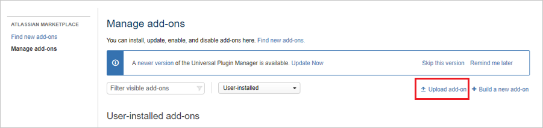
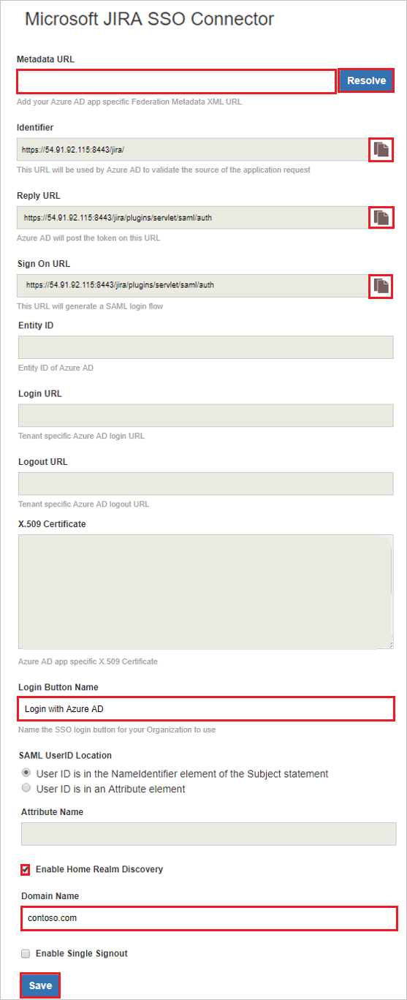
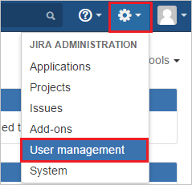
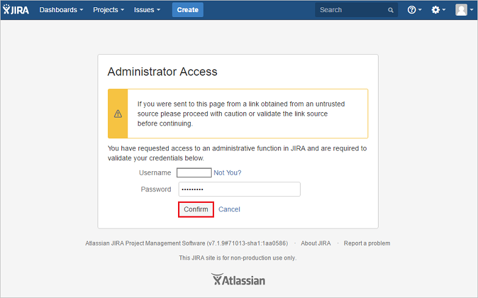

# Tutorial: Microsoft Entra SSO integration with JIRA SAML SSO by Microsoft (V5.2)

In this tutorial, you'll learn how to integrate JIRA SAML SSO by Microsoft (V5.2) with Microsoft Entra ID. When you integrate JIRA SAML SSO by Microsoft (V5.2) with Microsoft Entra ID, you can:

* Control in Microsoft Entra ID who has access to JIRA SAML SSO by Microsoft (V5.2).
* Enable your users to be automatically signed-in to JIRA SAML SSO by Microsoft (V5.2) with their Microsoft Entra accounts.
* Manage your accounts in one central location.

## Description

Use your Microsoft Entra account with Atlassian JIRA server to enable single sign-on. This way all your organization users can use the Microsoft Entra credentials to sign in into the JIRA application. This plugin uses SAML 2.0 for federation.

## Prerequisites

To configure Microsoft Entra integration with JIRA SAML SSO by Microsoft (V5.2), you need the following items:

- A Microsoft Entra subscription.
- JIRA Core and Software 5.2 should installed and configured on Windows 64-bit version.
- JIRA server is HTTPS enabled.
- Note the supported versions for JIRA Plugin are mentioned in below section.
- JIRA server is reachable on internet particularly to Microsoft Entra Login page for authentication and should able to receive the token from Microsoft Entra ID.
- Admin credentials are set up in JIRA.
- WebSudo is disabled in JIRA.
- Test user created in the JIRA server application.

> [!NOTE]
> To test the steps in this tutorial, we do not recommend using a production environment of JIRA. Test the integration first in development or staging environment of the application and then use the production environment.

To test the steps in this tutorial, you should follow these recommendations:

- Do not use your production environment, unless it is necessary.
- A Microsoft Entra subscription. If you don't have a subscription, you can get a [free account](https://azure.microsoft.com/free/).

## Supported versions of JIRA

* JIRA Core and Software: 5.2.
* JIRA also supports 6.0 to 7.12. For more details, click [JIRA SAML SSO by Microsoft](jiramicrosoft-tutorial.md).

> [!NOTE]
> Please note that our JIRA Plugin also works on Ubuntu Version 16.04.

## Scenario description

In this tutorial, you configure and test Microsoft Entra single sign-on in a test environment.

* JIRA SAML SSO by Microsoft (V5.2) supports **SP** initiated SSO.

## Adding JIRA SAML SSO by Microsoft (V5.2) from the gallery

To configure the integration of JIRA SAML SSO by Microsoft (V5.2) into Microsoft Entra ID, you need to add JIRA SAML SSO by Microsoft (V5.2) from the gallery to your list of managed SaaS apps.

1. Sign in to the [Microsoft Entra admin center](https://entra.microsoft.com) as at least a [Cloud Application Administrator](../roles/permissions-reference.md#cloud-application-administrator).
1. Browse to **Identity** > **Applications** > **Enterprise applications** > **New application**.
1. In the **Add from the gallery** section, type **JIRA SAML SSO by Microsoft (V5.2)** in the search box.
1. Select **JIRA SAML SSO by Microsoft (V5.2)** from results panel and then add the app. Wait a few seconds while the app is added to your tenant.

 Alternatively, you can also use the [Enterprise App Configuration Wizard](https://portal.office.com/AdminPortal/home?Q=Docs#/azureadappintegration). In this wizard, you can add an application to your tenant, add users/groups to the app, assign roles, as well as walk through the SSO configuration as well. [Learn more about Microsoft 365 wizards.](/microsoft-365/admin/misc/azure-ad-setup-guides)

## Configure and test Microsoft Entra SSO for JIRA SAML SSO by Microsoft (V5.2)

In this section, you configure and test Microsoft Entra single sign-on with JIRA SAML SSO by Microsoft (V5.2) based on a test user named **Britta Simon**. For single sign-on to work, you must establish a linked relationship between a Microsoft Entra user and the related user in JIRA SAML SSO by Microsoft (V5.2).

To configure and test Microsoft Entra single sign-on with JIRA SAML SSO by Microsoft (V5.2), perform the following steps:

1. **[Configure Microsoft Entra SSO](#configure-azure-ad-sso)** - to enable your users to use this feature.
	1. **[Create a Microsoft Entra test user](#create-an-azure-ad-test-user)** - to test Microsoft Entra single sign-on with Britta Simon.
	1. **[Assign the Microsoft Entra test user](#assign-the-azure-ad-test-user)** - to enable Britta Simon to use Microsoft Entra single sign-on.
2. **[Configure JIRA SAML SSO by Microsoft (V5.2) SSO](#configure-jira-saml-sso-by-microsoft-v52-sso)** - to configure the Single Sign-On settings on application side.
	1. **[Create JIRA SAML SSO by Microsoft (V5.2) test user](#create-jira-saml-sso-by-microsoft-v52-test-user)** - to have a counterpart of Britta Simon in JIRA SAML SSO by Microsoft (V5.2) that is linked to the Microsoft Entra representation of user.
1. **[Test SSO](#test-sso)** - to verify whether the configuration works.

### Configure Microsoft Entra SSO

1. Sign in to the [Microsoft Entra admin center](https://entra.microsoft.com) as at least a [Cloud Application Administrator](../roles/permissions-reference.md#cloud-application-administrator).
1. Browse to **Identity** > **Applications** > **Enterprise applications** > **JIRA SAML SSO by Microsoft (V5.2)** application integration page, find the **Manage** section and select **Single sign-on**.
1. On the **Select a Single sign-on method** page, select **SAML**.
1. On the **Set up Single Sign-On with SAML** page, click the pencil icon for **Basic SAML Configuration** to edit the settings.

   

1. On the **Basic SAML Configuration** section, perform the following steps:

    a. In the **Identifier** box, type a URL using the following pattern:
    `https://<domain:port>/`

    b. In the **Reply URL** text box, type a URL using the following pattern:
    `https://<domain:port>/plugins/servlet/saml/auth`

	c. In the **Sign-on URL** text box, type a URL using the following pattern:
    `https://<domain:port>/plugins/servlet/saml/auth`

	> [!NOTE]
	> These values are not real. Update these values with the actual Identifier, Reply URL and Sign-On URL. Port is optional in case it’s a named URL. These values are received during the configuration of Jira plugin, which is explained later in the tutorial.

1. On the **Set up Single Sign-On with SAML** page, In the **SAML Signing Certificate** section, click copy button to copy **App Federation Metadata Url** and save it on your computer.

	

### Create a Microsoft Entra test user

In this section, you'll create a test user called B.Simon.

1. Sign in to the [Microsoft Entra admin center](https://entra.microsoft.com) as at least a [User Administrator](../roles/permissions-reference.md#user-administrator).
1. Browse to **Identity** > **Users** > **All users**.
1. Select **New user** > **Create new user**, at the top of the screen.
1. In the **User** properties, follow these steps:
   1. In the **Display name** field, enter `B.Simon`.  
   1. In the **User principal name** field, enter the username@companydomain.extension. For example, `B.Simon@contoso.com`.
   1. Select the **Show password** check box, and then write down the value that's displayed in the **Password** box.
   1. Select **Review + create**.
1. Select **Create**.

### Assign the Microsoft Entra test user

In this section, you'll enable B.Simon to use single sign-on by granting access to JIRA SAML SSO by Microsoft (V5.2).

1. Sign in to the [Microsoft Entra admin center](https://entra.microsoft.com) as at least a [Cloud Application Administrator](../roles/permissions-reference.md#cloud-application-administrator).
1. Browse to **Identity** > **Applications** > **Enterprise applications** > **JIRA SAML SSO by Microsoft (V5.2)**.
1. In the app's overview page, select **Users and groups**.
1. Select **Add user/group**, then select **Users and groups** in the **Add Assignment** dialog.
   1. In the **Users and groups** dialog, select **B.Simon** from the Users list, then click the **Select** button at the bottom of the screen.
   1. If you are expecting a role to be assigned to the users, you can select it from the **Select a role** dropdown. If no role has been set up for this app, you see "Default Access" role selected.
   1. In the **Add Assignment** dialog, click the **Assign** button.

## Configure JIRA SAML SSO by Microsoft (V5.2) SSO

1. In a different web browser window, sign in to your JIRA instance as an administrator.

2. Hover on cog and click the **Add-ons**.

	

3. Under Add-ons tab section, click **Manage add-ons**.

	

4. Download the plugin from [Microsoft Download Center](https://www.microsoft.com/download/details.aspx?id=56521). Manually upload the plugin provided by Microsoft using **Upload add-on** menu. The download of plugin is covered under [Microsoft Service Agreement](https://www.microsoft.com/servicesagreement/).

	

5. Once the plugin is installed, it appears in **User Installed** add-ons section. Click **Configure** to configure the new plugin.

	

6. Perform following steps on configuration page:

	

	> [!TIP]
	> Ensure that there is only one certificate mapped against the app so that there is no error in resolving the metadata. If there are multiple certificates, upon resolving the metadata, admin gets an error.

	a. In **Metadata URL** textbox, paste **App Federation Metadata Url** value which you have copied and click the **Resolve** button. It reads the IdP metadata URL and populates all the fields information.

	b. Copy the **Identifier, Reply URL and Sign on URL** values and paste them in **Identifier, Reply URL and Sign on URL** textboxes respectively in **Basic SAML Configuration** section.

	c. In **Login Button Name** type the name of button your organization wants the users to see on login screen.

	d. In **SAML User ID Locations** select either **User ID is in the NameIdentifier element of the Subject statement** or **User ID is in an Attribute element**.  This ID has to be the JIRA user ID. If the user ID is not matched, then system will not allow users to sign in.

	> [!Note]
	> Default SAML User ID location is Name Identifier. You can change this to an attribute option and enter the appropriate attribute name.

	e. If you select **User ID is in an Attribute element** option, then in **Attribute name** textbox type the name of the attribute where User ID is expected. 

	f. If you are using the federated domain (like ADFS etc.) with Microsoft Entra ID, then click on the **Enable Home Realm Discovery** option and configure the **Domain Name**.

	g. In **Domain Name** type the domain name here in case of the ADFS-based login.

	h. Check **Enable Single Sign out** if you wish to sign out from Microsoft Entra ID when a user signs out from JIRA. 

	i. Click **Save** button to save the settings.

	> [!NOTE]
	> For more information about installation and troubleshooting, visit [MS JIRA SSO Connector Admin Guide](./ms-confluence-jira-plugin-adminguide.md) and there is also [FAQ](./ms-confluence-jira-plugin-adminguide.md) for your assistance.

### Create JIRA SAML SSO by Microsoft (V5.2) test user

To enable Microsoft Entra users to sign in to JIRA on-premises server, they must be provisioned into JIRA on-premises server.

**To provision a user account, perform the following steps:**

1. Sign in to your JIRA on-premises server as an administrator.

2. Hover on cog and click the **User management**.

    

3. You are redirected to Administrator Access page to enter **Password** and click **Confirm** button.

	

4. Under **User management** tab section, click **create user**.

	 

5. On the **“Create new user”** dialog page, perform the following steps:

	

	a. In the **Email address** textbox, type the email address of user like Brittasimon@contoso.com.

	b. In the **Full Name** textbox, type full name of the user like Britta Simon.

	c. In the **Username** textbox, type the email of user like Brittasimon@contoso.com.

	d. In the **Password** textbox, type the password of user.

	e. Click **Create user**.

## Test SSO

In this section, you test your Microsoft Entra single sign-on configuration with following options. 

* Click on **Test this application**, this will redirect to JIRA SAML SSO by Microsoft (V5.2) Sign-on URL where you can initiate the login flow. 

* Go to JIRA SAML SSO by Microsoft (V5.2) Sign-on URL directly and initiate the login flow from there.

* You can use Microsoft My Apps. When you click the JIRA SAML SSO by Microsoft (V5.2) tile in the My Apps, this will redirect to JIRA SAML SSO by Microsoft (V5.2) Sign-on URL. For more information about the My Apps, see [Introduction to the My Apps](https://support.microsoft.com/account-billing/sign-in-and-start-apps-from-the-my-apps-portal-2f3b1bae-0e5a-4a86-a33e-876fbd2a4510).

## Next steps

Once you configure JIRA SAML SSO by Microsoft (V5.2) you can enforce Session control, which protects exfiltration and infiltration of your organization’s sensitive data in real time. Session control extends from Conditional Access. [Learn how to enforce session control with Microsoft Defender for Cloud Apps](/cloud-app-security/proxy-deployment-aad).
