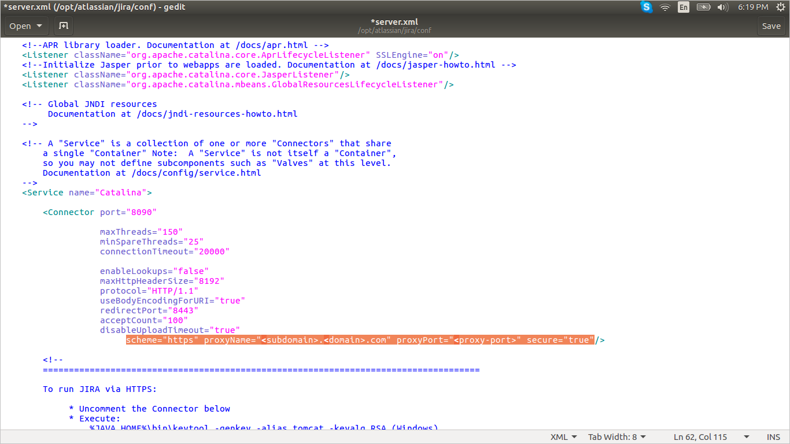
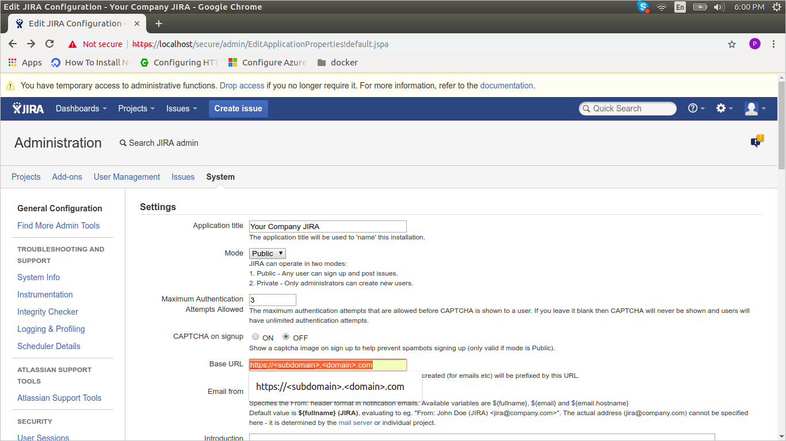
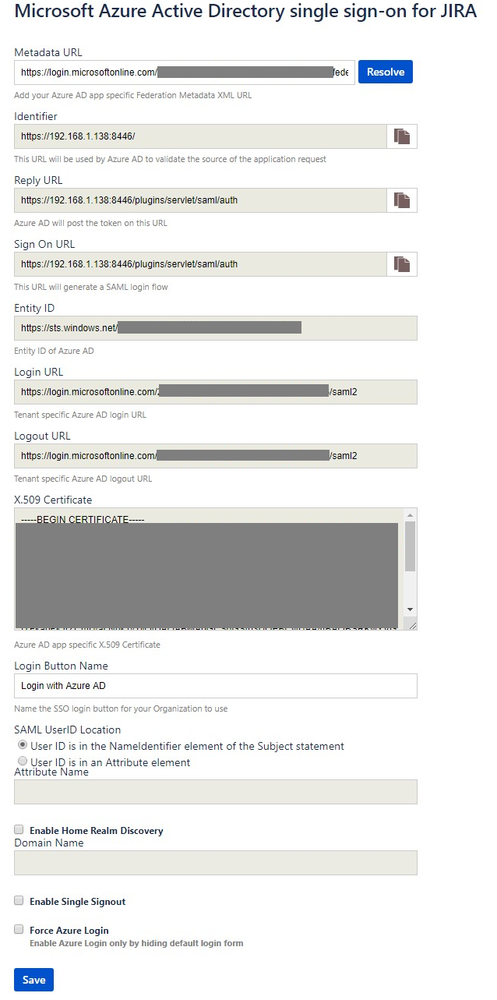
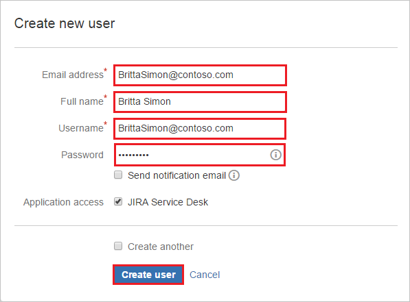

# Tutorial: Azure Active Directory integration with JIRA SAML SSO by Microsoft

In this tutorial, you learn how to integrate JIRA SAML SSO by Microsoft with Azure Active Directory (Azure AD).
Integrating JIRA SAML SSO by Microsoft with Azure AD provides you with the following benefits:

* You can control in Azure AD who has access to JIRA SAML SSO by Microsoft.
* You can enable your users to be automatically signed-in to JIRA SAML SSO by Microsoft (Single Sign-On) with their Azure AD accounts.
* You can manage your accounts in one central location - the Azure portal.

If you want to know more details about SaaS app integration with Azure AD, see [What is application access and single sign-on with Azure Active Directory](https://docs.microsoft.com/azure/active-directory/active-directory-appssoaccess-whatis).
If you don't have an Azure subscription, [create a free account](https://azure.microsoft.com/free/) before you begin.

## Description

Use your Microsoft Azure Active Directory account with Atlassian JIRA server to enable single sign-on. This way all your organization users can use the Azure AD credentials to sign in into the JIRA application. This plugin uses SAML 2.0 for federation.

## Prerequisites

To configure Azure AD integration with JIRA SAML SSO by Microsoft, you need the following items:

- An Azure AD subscription
- JIRA Core and Software 6.4 to 8.0 or JIRA Service Desk 3.0 to 3.5 should installed and configured on Windows 64-bit version
- JIRA server is HTTPS enabled
- Note the supported versions for JIRA Plugin are mentioned in below section.
- JIRA server is reachable on internet particularly to Azure AD Login page for authentication and should able to receive the token from Azure AD
- Admin credentials are set up in JIRA
- WebSudo is disabled in JIRA
- Test user created in the JIRA server application

> [!NOTE]
> To test the steps in this tutorial, we do not recommend using a production environment of JIRA. Test the integration first in development or staging environment of the application and then use the production environment.

To test the steps in this tutorial, you should follow these recommendations:

- Do not use your production environment, unless it is necessary.
- If you don't have an Azure AD trial environment, you can get a one-month trial here: [Trial offer](https://azure.microsoft.com/pricing/free-trial/).

## Supported versions of JIRA

* JIRA Core and Software: 6.4 to 8.0
* JIRA Service Desk 3.0.0 to 3.5.0
* JIRA also supports 5.2. For more details, click [Microsoft Azure Active Directory single sign-on for JIRA 5.2](jira52microsoft-tutorial.md)

> [!NOTE]
> Please note that our JIRA Plugin also works on Ubuntu Version 16.04

## Scenario description

In this tutorial, you configure and test Azure AD single sign-on in a test environment.

* JIRA SAML SSO by Microsoft supports **SP** initiated SSO

## Adding JIRA SAML SSO by Microsoft from the gallery

To configure the integration of JIRA SAML SSO by Microsoft into Azure AD, you need to add JIRA SAML SSO by Microsoft from the gallery to your list of managed SaaS apps.

**To add JIRA SAML SSO by Microsoft from the gallery, perform the following steps:**

1. In the **[Azure portal](https://portal.azure.com)**, on the left navigation panel, click **Azure Active Directory** icon.

	

2. Navigate to **Enterprise Applications** and then select the **All Applications** option.

	

3. To add new application, click **New application** button on the top of dialog.

	

4. In the search box, type **JIRA SAML SSO by Microsoft**, select **JIRA SAML SSO by Microsoft** from result panel then click **Add** button to add the application.

	 

## Configure and test Azure AD single sign-on

In this section, you configure and test Azure AD single sign-on with JIRA SAML SSO by Microsoft based on a test user called **Britta Simon**.
For single sign-on to work, a link relationship between an Azure AD user and the related user in JIRA SAML SSO by Microsoft needs to be established.

To configure and test Azure AD single sign-on with JIRA SAML SSO by Microsoft, you need to complete the following building blocks:

1. **[Configure Azure AD Single Sign-On](#configure-azure-ad-single-sign-on)** - to enable your users to use this feature.
2. **[Configure JIRA SAML SSO by Microsoft Single Sign-On](#configure-jira-saml-sso-by-microsoft-single-sign-on)** - to configure the Single Sign-On settings on application side.
3. **[Create an Azure AD test user](#create-an-azure-ad-test-user)** - to test Azure AD single sign-on with Britta Simon.
4. **[Assign the Azure AD test user](#assign-the-azure-ad-test-user)** - to enable Britta Simon to use Azure AD single sign-on.
5. **[Create JIRA SAML SSO by Microsoft test user](#create-jira-saml-sso-by-microsoft-test-user)** - to have a counterpart of Britta Simon in JIRA SAML SSO by Microsoft that is linked to the Azure AD representation of user.
6. **[Test single sign-on](#test-single-sign-on)** - to verify whether the configuration works.

### Configure Azure AD single sign-on

In this section, you enable Azure AD single sign-on in the Azure portal.

To configure Azure AD single sign-on with JIRA SAML SSO by Microsoft, perform the following steps:

1. In the [Azure portal](https://portal.azure.com/), on the **JIRA SAML SSO by Microsoft** application integration page, select **Single sign-on**.

    

2. On the **Select a Single sign-on method** dialog, select **SAML/WS-Fed** mode to enable single sign-on.

    

3. On the **Set up Single Sign-On with SAML** page, click **Edit** icon to open **Basic SAML Configuration** dialog.

	

4. On the **Basic SAML Configuration** section, perform the following steps:

    

    a. In the **Sign-on URL** text box, type a URL using the following pattern:
    `https://<domain:port>/plugins/servlet/saml/auth`

    b. In the **Identifier** box, type a URL using the following pattern:
    `https://<domain:port>/`

    c. In the **Reply URL** text box, type a URL using the following pattern:
    `https://<domain:port>/plugins/servlet/saml/auth`

	> [!NOTE]
	> These values are not real. Update these values with the actual Identifier, Reply URL, and Sign-On URL. Port is optional in case it’s a named URL. These values are received during the configuration of Jira plugin, which is explained later in the tutorial.

5. On the **Set up Single Sign-On with SAML** page, In the **SAML Signing Certificate** section, click copy button to copy **App Federation Metadata Url** and save it on your computer.

	

### Configure JIRA SAML SSO by Microsoft Single Sign-On

1. In a different web browser window, sign in to your JIRA instance as an administrator.

2. Hover on cog and click the **Add-ons**.

	

3. Download the plugin from [Microsoft Download Center](https://www.microsoft.com/download/details.aspx?id=56506). Manually upload the plugin provided by Microsoft using **Upload add-on** menu. The download of plugin is covered under [Microsoft Service Agreement](https://www.microsoft.com/servicesagreement/).

	

4. For running the JIRA reverse proxy scenario or load balancer scenario perform the following steps:

	> [!NOTE]
	> You should be configuring the server first with the below instructions and then install the plugin.

	a. Add below attribute in **connector** port in **server.xml** file of JIRA server application.

	`scheme="https" proxyName="<subdomain.domain.com>" proxyPort="<proxy_port>" secure="true"`

	

	b. Change **Base URL** in **System Settings** according to proxy/load balancer.

	

5. Once the plugin is installed, it appears in **User Installed** add-ons section of **Manage Add-on** section. Click **Configure** to configure the new plugin.

	

6. Perform following steps on configuration page:

	

	> [!TIP]
	> Ensure that there is only one certificate mapped against the app so that there is no error in resolving the metadata. If there are multiple certificates, upon resolving the metadata, admin gets an error.

	1. In the **Metadata URL** textbox, paste **App Federation Metadata Url** value which you have copied from the Azure portal and click the **Resolve** button. It reads the IdP metadata URL and populates all the fields information.

	1. Copy the **Identifier, Reply URL and Sign on URL** values and paste them in **Identifier, Reply URL and Sign on URL** textboxes respectively in **JIRA SAML SSO by Microsoft Domain and URLs** section on Azure portal.

	1. In **Login Button Name** type the name of button your organization wants the users to see on login screen.

	1. In **SAML User ID Locations** select either **User ID is in the NameIdentifier element of the Subject statement** or **User ID is in an Attribute element**.  This ID has to be the JIRA user ID. If the user ID is not matched, then system will not allow users to sign in.

	   > [!Note]
	   > Default SAML User ID location is Name Identifier. You can change this to an attribute option and enter the appropriate attribute name.

	1. If you select **User ID is in an Attribute element** option, then in **Attribute name** textbox type the name of the attribute where User ID is expected.

	1. If you are using the federated domain (like ADFS etc.) with Azure AD, then click on the **Enable Home Realm Discovery** option and configure the **Domain Name**.

	1. In **Domain Name** type the domain name here in case of the ADFS-based login.

	1. Check **Enable Single Sign out** if you wish to sign out from Azure AD when a user sign out from JIRA.
	
	1. Enable **Force Azure Login** checkbox, if you wish to sign in through Azure AD credentials only.
	
	   > [!Note]
	   > To enable the default login form for admin login on login page when force azure login is enabled, add the query parameter in the browser URL.
	   > `https://<domain:port>/login.action?force_azure_login=false`

	1. Click **Save** button to save the settings.

	   > [!NOTE]
	   > For more information about installation and troubleshooting, visit [MS JIRA SSO Connector Admin Guide](../ms-confluence-jira-plugin-adminguide.md). There is also an [FAQ](../ms-confluence-jira-plugin-faq.md) for your assistance.

### Create an Azure AD test user 

The objective of this section is to create a test user in the Azure portal called Britta Simon.

1. In the Azure portal, in the left pane, select **Azure Active Directory**, select **Users**, and then select **All users**.

    

2. Select **New user** at the top of the screen.

    

3. In the User properties, perform the following steps.

    

    a. In the **Name** field enter **BrittaSimon**.
  
    b. In the **User name** field type `brittasimon\@yourcompanydomain.extension`. For example, BrittaSimon@contoso.com.

    c. Select **Show password** check box, and then write down the value that's displayed in the Password box.

    d. Click **Create**.

### Assign the Azure AD test user

In this section, you enable Britta Simon to use Azure single sign-on by granting access to JIRA SAML SSO by Microsoft.

1. In the Azure portal, select **Enterprise Applications**, select **All applications**, then select **JIRA SAML SSO by Microsoft**.

	

2. In the applications list, select **JIRA SAML SSO by Microsoft**.

	

3. In the menu on the left, select **Users and groups**.

    

4. Click the **Add user** button, then select **Users and groups** in the **Add Assignment** dialog.

    

5. In the **Users and groups** dialog select **Britta Simon** in the Users list, then click the **Select** button at the bottom of the screen.

6. If you are expecting any role value in the SAML assertion then in the **Select Role** dialog select the appropriate role for the user from the list, then click the **Select** button at the bottom of the screen.

7. In the **Add Assignment** dialog click the **Assign** button.

### Create JIRA SAML SSO by Microsoft test user

To enable Azure AD users to sign in to JIRA on-premises server, they must be provisioned into JIRA SAML SSO by Microsoft. For JIRA SAML SSO by Microsoft, provisioning is a manual task.

**To provision a user account, perform the following steps:**

1. Sign in to your JIRA on-premises server as an administrator.

2. Hover on cog and click the **User management**.

    

3. You are redirected to Administrator Access page to enter **Password** and click **Confirm** button.

	

4. Under **User management** tab section, click **create user**.

	 

5. On the **“Create new user”** dialog page, perform the following steps:

	 

	a. In the **Email address** textbox, type the email address of user like Brittasimon@contoso.com.

	b. In the **Full Name** textbox, type full name of the user like Britta Simon.

	c. In the **Username** textbox, type the email of user like Brittasimon@contoso.com.

	d. In the **Password** textbox, type the password of user.

	e. Click **Create user**.

### Test single sign-on 

In this section, you test your Azure AD single sign-on configuration using the Access Panel.

When you click the JIRA SAML SSO by Microsoft tile in the Access Panel, you should be automatically signed in to the JIRA SAML SSO by Microsoft for which you set up SSO. For more information about the Access Panel, see [Introduction to the Access Panel](https://docs.microsoft.com/azure/active-directory/active-directory-saas-access-panel-introduction).

## Additional resources

- [List of Tutorials on How to Integrate SaaS Apps with Azure Active Directory](https://docs.microsoft.com/azure/active-directory/active-directory-saas-tutorial-list)

- [What is application access and single sign-on with Azure Active Directory?](https://docs.microsoft.com/azure/active-directory/active-directory-appssoaccess-whatis)

- [What is Conditional Access in Azure Active Directory?](https://docs.microsoft.com/azure/active-directory/conditional-access/overview)
