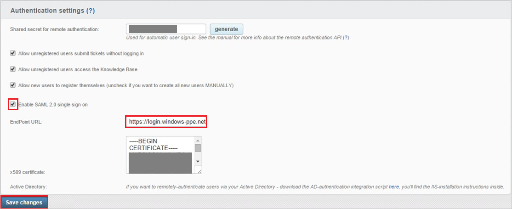
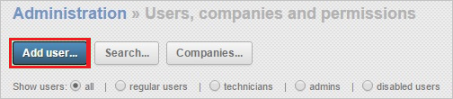
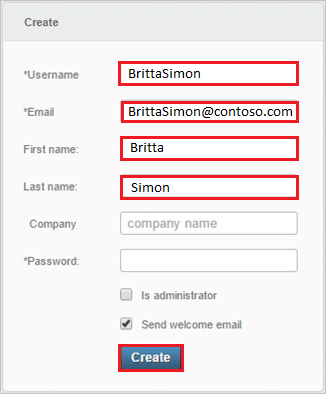

# Tutorial: Azure Active Directory integration with Jitbit Helpdesk

In this tutorial, you learn how to integrate Jitbit Helpdesk with Azure Active Directory (Azure AD).
Integrating Jitbit Helpdesk with Azure AD provides you with the following benefits:

* You can control in Azure AD who has access to Jitbit Helpdesk.
* You can enable your users to be automatically signed-in to Jitbit Helpdesk (Single Sign-On) with their Azure AD accounts.
* You can manage your accounts in one central location - the Azure portal.

If you want to know more details about SaaS app integration with Azure AD, see [What is application access and single sign-on with Azure Active Directory](https://docs.microsoft.com/azure/active-directory/active-directory-appssoaccess-whatis).
If you don't have an Azure subscription, [create a free account](https://azure.microsoft.com/free/) before you begin.

## Prerequisites

To configure Azure AD integration with Jitbit Helpdesk, you need the following items:

* An Azure AD subscription. If you don't have an Azure AD environment, you can get one-month trial [here](https://azure.microsoft.com/pricing/free-trial/)
* Jitbit Helpdesk single sign-on enabled subscription

## Scenario description

In this tutorial, you configure and test Azure AD single sign-on in a test environment.

* Jitbit Helpdesk supports **SP** initiated SSO

## Adding Jitbit Helpdesk from the gallery

To configure the integration of Jitbit Helpdesk into Azure AD, you need to add Jitbit Helpdesk from the gallery to your list of managed SaaS apps.

**To add Jitbit Helpdesk from the gallery, perform the following steps:**

1. In the **[Azure portal](https://portal.azure.com)**, on the left navigation panel, click **Azure Active Directory** icon.

	

2. Navigate to **Enterprise Applications** and then select the **All Applications** option.

	

3. To add new application, click **New application** button on the top of dialog.

	

4. In the search box, type **Jitbit Helpdesk**, select **Jitbit Helpdesk** from result panel then click **Add** button to add the application.

	 

## Configure and test Azure AD single sign-on

In this section, you configure and test Azure AD single sign-on with Jitbit Helpdesk based on a test user called **Britta Simon**.
For single sign-on to work, a link relationship between an Azure AD user and the related user in Jitbit Helpdesk needs to be established.

To configure and test Azure AD single sign-on with Jitbit Helpdesk, you need to complete the following building blocks:

1. **[Configure Azure AD Single Sign-On](#configure-azure-ad-single-sign-on)** - to enable your users to use this feature.
2. **[Configure Jitbit Helpdesk Single Sign-On](#configure-jitbit-helpdesk-single-sign-on)** - to configure the Single Sign-On settings on application side.
3. **[Create an Azure AD test user](#create-an-azure-ad-test-user)** - to test Azure AD single sign-on with Britta Simon.
4. **[Assign the Azure AD test user](#assign-the-azure-ad-test-user)** - to enable Britta Simon to use Azure AD single sign-on.
5. **[Create Jitbit Helpdesk test user](#create-jitbit-helpdesk-test-user)** - to have a counterpart of Britta Simon in Jitbit Helpdesk that is linked to the Azure AD representation of user.
6. **[Test single sign-on](#test-single-sign-on)** - to verify whether the configuration works.

### Configure Azure AD single sign-on

In this section, you enable Azure AD single sign-on in the Azure portal.

To configure Azure AD single sign-on with Jitbit Helpdesk, perform the following steps:

1. In the [Azure portal](https://portal.azure.com/), on the **Jitbit Helpdesk** application integration page, select **Single sign-on**.

    

2. On the **Select a Single sign-on method** dialog, select **SAML/WS-Fed** mode to enable single sign-on.

    

3. On the **Set up Single Sign-On with SAML** page, click **Edit** icon to open **Basic SAML Configuration** dialog.

	

4. On the **Basic SAML Configuration** section, perform the following steps:

    

	a. In the **Sign on URL** text box, type a URL using the following pattern:
	| |
    | ----------------------------------------|
	| `https://<hostname>/helpdesk/User/Login`|
	| `https://<tenant-name>.Jitbit.com`|
	| |
    
	> [!NOTE] 
	> This value is not real. Update this value with the actual Sign-On URL. Contact [Jitbit Helpdesk Client support team](https://www.jitbit.com/support/) to get this value.

    b. In the **Identifier (Entity ID)** text box, type a URL as following:
    `https://www.jitbit.com/web-helpdesk/`

5. On the **Set up Single Sign-On with SAML** page, in the **SAML Signing Certificate** section, click **Download** to download the **Certificate (Base64)** from the given options as per your requirement and save it on your computer.

	

6. In the **Set up Jitbit Helpdesk** section, copy the appropriate URL(s) as per your requirement.

	

	a. Login URL

	b. Azure AD Identifier

	c. Logout URL

### Configure Jitbit Helpdesk Single Sign-On

1. In a different web browser window, sign in to your Jitbit Helpdesk company site as an administrator.

1. In the toolbar on the top, click **Administration**.

    

1. Click **General settings**.

    

1. In the **Authentication settings** configuration section, perform the following steps:

    

	a. Select **Enable SAML 2.0 single sign on**, to sign in using Single Sign-On (SSO), with **OneLogin**.

	b. In the **EndPoint URL** textbox, paste the value of **Login URL** which you have copied from Azure portal.

	c. Open your **base-64** encoded certificate in notepad, copy the content of it into your clipboard, and then paste it to the **X.509 Certificate** textbox

	d. Click **Save changes**.

### Create an Azure AD test user

The objective of this section is to create a test user in the Azure portal called Britta Simon.

1. In the Azure portal, in the left pane, select **Azure Active Directory**, select **Users**, and then select **All users**.

    

2. Select **New user** at the top of the screen.

    

3. In the User properties, perform the following steps.

    

    a. In the **Name** field enter **BrittaSimon**.
  
    b. In the **User name** field type **brittasimon@yourcompanydomain.extension**  
    For example, BrittaSimon@contoso.com

    c. Select **Show password** check box, and then write down the value that's displayed in the Password box.

    d. Click **Create**.

### Assign the Azure AD test user

In this section, you enable Britta Simon to use Azure single sign-on by granting access to Jitbit Helpdesk.

1. In the Azure portal, select **Enterprise Applications**, select **All applications**, then select **Jitbit Helpdesk**.

	

2. In the applications list, select **Jitbit Helpdesk**.

	

3. In the menu on the left, select **Users and groups**.

    

4. Click the **Add user** button, then select **Users and groups** in the **Add Assignment** dialog.

    

5. In the **Users and groups** dialog select **Britta Simon** in the Users list, then click the **Select** button at the bottom of the screen.

6. If you are expecting any role value in the SAML assertion then in the **Select Role** dialog select the appropriate role for the user from the list, then click the **Select** button at the bottom of the screen.

7. In the **Add Assignment** dialog click the **Assign** button.

### Create Jitbit Helpdesk test user

In order to enable Azure AD users to sign in to Jitbit Helpdesk, they must be provisioned into Jitbit Helpdesk. In the case of Jitbit Helpdesk, provisioning is a manual task.

**To provision a user account, perform the following steps:**

1. Sign in to your **Jitbit Helpdesk** tenant.

1. In the menu on the top, click **Administration**.

    

1. Click **Users, companies and permissions**.

    

1. Click **Add user**.

    

1. In the Create section, type the data of the Azure AD account you want to provision as follows:

    

   a. In the **Username** textbox, type the username of the user like **BrittaSimon**.

   b. In the **Email** textbox, type email of the user like **BrittaSimon@contoso.com**.

   c. In the **First Name** textbox, type first name of the user like **Britta**.

   d. In the **Last Name** textbox, type last name of the user like **Simon**.

   e. Click **Create**.

> [!NOTE]
> You can use any other Jitbit Helpdesk user account creation tools or APIs provided by Jitbit Helpdesk to provision Azure AD user accounts.

### Test single sign-on

In this section, you test your Azure AD single sign-on configuration using the Access Panel.

When you click the Jitbit Helpdesk tile in the Access Panel, you should be automatically signed in to the Jitbit Helpdesk for which you set up SSO. For more information about the Access Panel, see [Introduction to the Access Panel](https://docs.microsoft.com/azure/active-directory/active-directory-saas-access-panel-introduction).

## Additional Resources

- [List of Tutorials on How to Integrate SaaS Apps with Azure Active Directory](https://docs.microsoft.com/azure/active-directory/active-directory-saas-tutorial-list)

- [What is application access and single sign-on with Azure Active Directory?](https://docs.microsoft.com/azure/active-directory/active-directory-appssoaccess-whatis)

- [What is Conditional Access in Azure Active Directory?](https://docs.microsoft.com/azure/active-directory/conditional-access/overview)
