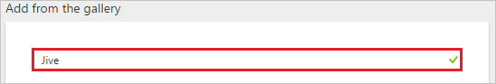
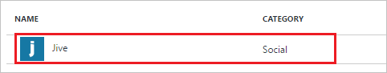
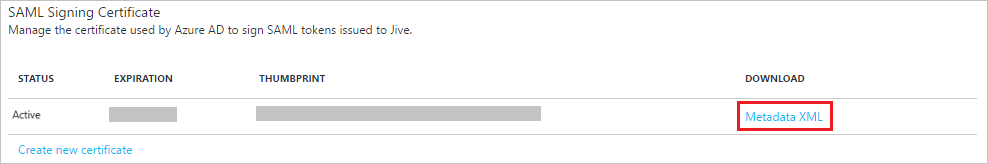
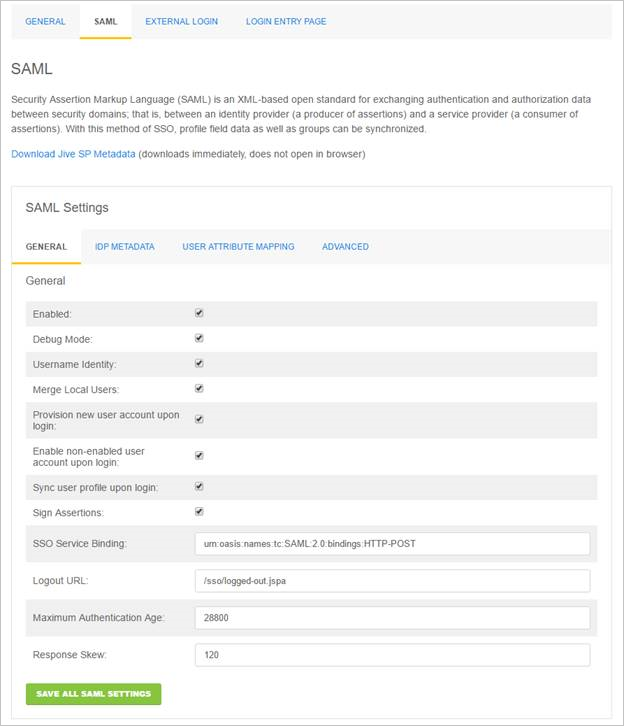
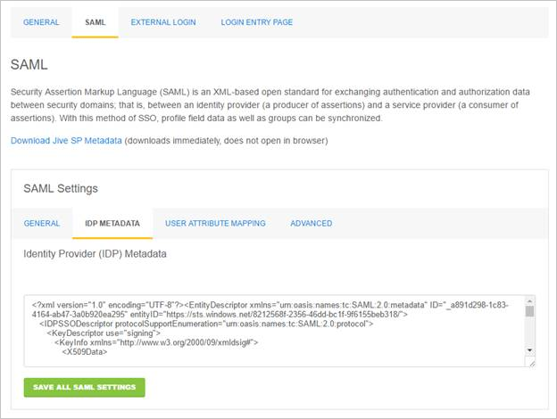
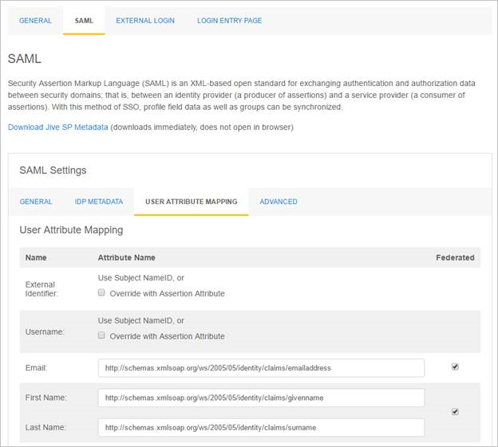

# Tutorial: Azure Active Directory integration with Jive

In this tutorial, you learn how to integrate Jive with Azure Active Directory (Azure AD).

Integrating Jive with Azure AD provides you with the following benefits:

- You can control in Azure AD who has access to Jive
- You can enable your users to automatically get signed-on to Jive (Single Sign-On) with their Azure AD accounts
- You can manage your accounts in one central location - the Azure portal

If you want to know more information about SaaS app integration with Azure AD, see [what is application access and single sign-on with Azure Active Directory](../manage-apps/what-is-single-sign-on.md).

## Prerequisites

To configure Azure AD integration with Jive, you need the following items:

- An Azure AD subscription
- A Jive single-sign on enabled subscription

> [!NOTE]
> To test the steps in this tutorial, we do not recommend using a production environment.

To test the steps in this tutorial, you should follow these recommendations:

- Do not use your production environment, unless it is necessary.
- If you don't have an Azure AD trial environment, you can get a one-month trial [here](https://azure.microsoft.com/pricing/free-trial/).

## Scenario description
In this tutorial, you test Azure AD single sign-on in a test environment.
The scenario outlined in this tutorial consists of two main building blocks:

1. Adding Jive from the gallery
1. Configuring and testing Azure AD single sign-on

## Adding Jive from the gallery
To configure the integration of Jive into Azure AD, you need to add Jive from the gallery to your list of managed SaaS apps.

**To add Jive from the gallery, perform the following steps:**

1. In the **[Azure portal](https://portal.azure.com)**, on the left navigation panel, click **Azure Active Directory** icon. 

	![Active Directory][1]

1. Navigate to **Enterprise applications**. Then go to **All applications**.

	![Applications][2]

1. To add new application, click **New application** button on the top of dialog.

	![Applications][3]

1. In the search box, type **Jive**.

	

1. In the results panel, select **Jive**, and then click **Add** button to add the application.

	

##  Configuring and testing Azure AD single sign-on
In this section, you configure and test Azure AD single sign-on with Jive based on a test user called "Britta Simon."

For single sign-on to work, Azure AD needs to know what the counterpart user in Jive is to a user in Azure AD. In other words, a link relationship between an Azure AD user and the related user in Jive needs to be established.

This link relationship is established by assigning the value of the **user name** in Azure AD as the value of the **Username** in Jive.

To configure and test Azure AD single sign-on with Jive, you need to complete the following building blocks:

1. **[Configuring Azure AD Single Sign-On](#configuring-azure-ad-single-sign-on)** - to enable your users to use this feature.
1. **[Creating an Azure AD test user](#creating-an-azure-ad-test-user)** - to test Azure AD single sign-on with Britta Simon.
1. **[Creating a Jive test user](#creating-a-jive-test-user)** - to have a counterpart of Britta Simon in Jive that is linked to the Azure AD representation of user.
1. **[Assigning the Azure AD test user](#assigning-the-azure-ad-test-user)** - to enable Britta Simon to use Azure AD single sign-on.
1. **[Testing Single Sign-On](#testing-single-sign-on)** - to verify whether the configuration works.

### Configuring Azure AD single sign-on

In this section, you enable Azure AD single sign-on in the Azure portal and configure single sign-on in your Jive application.

**To configure Azure AD single sign-on with Jive, perform the following steps:**

1. In the Azure portal, on the **Jive** application integration page, click **Single sign-on**.

	![Configure Single Sign-On][4]

1. On the **Single sign-on** dialog, select **Mode** as **SAML-based Sign-on** to enable single sign-on.

	

1. On the **Jive Domain and URLs** section, perform the following steps:

	

    a. In the **Sign-on URL** textbox, type a URL using the following pattern: `https://<instance name>.jivecustom.com`

	b. In the **Identifier** textbox, type a URL using the following pattern: `https://<instance name>.jiveon.com`

	> [!NOTE]
	> These values are not the real. Update these values with the actual Sign-on URL and Identifier. Contact [Jive Client support team](https://www.jivesoftware.com/services-support/) to get these values.

1. On the **SAML Signing Certificate** section, click **Metadata XML** and then save the XML file on your computer.

	

1. Click **Save** button.

	

1. To configure single sign-on on **Jive** side, sign-on to your Jive tenant as an administrator.

1. In the menu on the top, Click "**Saml**."

	

	a. Select **Enabled** under the **General** tab.
	b. Click the "**Save all saml settings**" button.

1. Navigate to the "**Idp Metadata**" tab.

    

    a. Copy the content of the downloaded metadata XML file, and then paste it into the **Identity Provider (IDP) Metadata** textbox.

	b. Click the "**Save all saml settings**" button.

1. Go to the "**User Attribute Mapping**" tab.

    

    a. In the **Email** textbox, copy and paste the attribute name of **mail** value.

    b. In the **First Name** textbox, copy and paste the attribute name of **givenname** value.

    c. In the **Last Name** textbox, copy and paste the attribute name of **surname** value.

### Creating an Azure AD test user
The objective of this section is to create a test user in the Azure portal called Britta Simon.

![Create Azure AD User][100]

**To create a test user in Azure AD, perform the following steps:**

1. In the **Azure portal**, on the left navigation pane, click **Azure Active Directory** icon.

	 

1. To display the list of users, go to **Users and groups** and click **All users**.

	

1. To open the **User** dialog, click **Add** on the top of the dialog.

	 

1. On the **User** dialog page, perform the following steps:

	

    a. In the **Name** textbox, type **BrittaSimon**.

    b. In the **User name** textbox, type the **email address** of BrittaSimon.

	c. Select **Show Password** and write down the value of the **Password**.

    d. Click **Create**.

### Creating a Jive test user

The objective of this section is to create a user called Britta Simon in Jive. Jive supports automatic user provisioning, which is by default enabled. You can find more details [here](jive-provisioning-tutorial.md) on how to configure automatic user provisioning.

If you need to create user manually, work with [Jive Client support team](https://www.jivesoftware.com/services-support/) to add the users in the Jive platform.

### Assigning the Azure AD test user

In this section, you enable Britta Simon to use Azure single sign-on by granting access to Jive.

![Assign User][200] 

**To assign Britta Simon to Jive, perform the following steps:**

1. In the Azure portal, open the applications view, and then navigate to the directory view and go to **Enterprise applications** then click **All applications**.

	![Assign User][201] 

1. In the applications list, select **Jive**.

	 

1. In the menu on the left, click **Users and groups**.

	![Assign User][202] 

1. Click **Add** button. Then select **Users and groups** on **Add Assignment** dialog.

	![Assign User][203]

1. On **Users and groups** dialog, select **Britta Simon** in the Users list.

1. Click **Select** button on **Users and groups** dialog.

1. Click **Assign** button on **Add Assignment** dialog.
	
### Testing single sign-on

In this section, you test your Azure AD single sign-on configuration using the Access Panel.

When you click the Jive tile in the Access Panel, you should get automatically signed-on to your Jive application.

## Additional resources

* [List of Tutorials on How to Integrate SaaS Apps with Azure Active Directory](tutorial-list.md)
* [What is application access and single sign-on with Azure Active Directory?](../manage-apps/what-is-single-sign-on.md)
* [Configure User Provisioning](jive-provisioning-tutorial.md)

<!--Image references-->

[1]: ./media/jive-tutorial/tutorial_general_01.png
[2]: ./media/jive-tutorial/tutorial_general_02.png
[3]: ./media/jive-tutorial/tutorial_general_03.png
[4]: ./media/jive-tutorial/tutorial_general_04.png

[100]: ./media/jive-tutorial/tutorial_general_100.png

[200]: ./media/jive-tutorial/tutorial_general_200.png
[201]: ./media/jive-tutorial/tutorial_general_201.png
[202]: ./media/jive-tutorial/tutorial_general_202.png
[203]: ./media/jive-tutorial/tutorial_general_203.png
