# Tutorial: Microsoft Entra integration with Jobscience

In this tutorial, you learn how to integrate Jobscience with Microsoft Entra ID.

Integrating Jobscience with Microsoft Entra ID provides you with the following benefits:

- You can control in Microsoft Entra ID who has access to Jobscience
- You can enable your users to automatically get signed-on to Jobscience (Single Sign-On) with their Microsoft Entra accounts
- You can manage your accounts in one central location - the Azure portal

If you want to know more details about SaaS app integration with Microsoft Entra ID, see [what is application access and single sign-on with Microsoft Entra ID](../manage-apps/what-is-single-sign-on.md).

## Prerequisites

To configure Microsoft Entra integration with Jobscience, you need the following items:

- A Microsoft Entra subscription
- A Jobscience single sign-on enabled subscription

> [!NOTE]
> To test the steps in this tutorial, we do not recommend using a production environment.

To test the steps in this tutorial, you should follow these recommendations:

- Do not use your production environment, unless it is necessary.
- If you don't have a Microsoft Entra trial environment, you can get a one-month trial here: [Trial offer](https://azure.microsoft.com/pricing/free-trial/).

## Scenario description
In this tutorial, you test Microsoft Entra single sign-on in a test environment. 
The scenario outlined in this tutorial consists of two main building blocks:

1. Adding Jobscience from the gallery
1. Configuring and testing Microsoft Entra single sign-on

## Adding Jobscience from the gallery
To configure the integration of Jobscience into Microsoft Entra ID, you need to add Jobscience from the gallery to your list of managed SaaS apps.

**To add Jobscience from the gallery, perform the following steps:**

1. Sign in to the [Microsoft Entra admin center](https://entra.microsoft.com) as at least a [Cloud Application Administrator](../roles/permissions-reference.md#cloud-application-administrator).
1. Browse to **Identity** > **Applications** > **Enterprise applications** > **New application**.
1. In the **Add from the gallery** section, type **Jobscience** in the search box.
1. Select **Jobscience** from results panel and then add the app. Wait a few seconds while the app is added to your tenant.

##  Configuring and testing Microsoft Entra single sign-on
In this section, you configure and test Microsoft Entra single sign-on with Jobscience based on a test user called "Britta Simon."

For single sign-on to work, Microsoft Entra ID needs to know what the counterpart user in Jobscience is to a user in Microsoft Entra ID. In other words, a link relationship between a Microsoft Entra user and the related user in Jobscience needs to be established.

In Jobscience, assign the value of the **user name** in Microsoft Entra ID as the value of the **Username** to establish the link relationship.

To configure and test Microsoft Entra single sign-on with Jobscience, you need to complete the following building blocks:

1. **[Configuring Microsoft Entra Single Sign-On](#configuring-azure-ad-single-sign-on)** - to enable your users to use this feature.
1. **[Creating a Microsoft Entra test user](#creating-an-azure-ad-test-user)** - to test Microsoft Entra single sign-on with Britta Simon.
1. **[Creating a Jobscience test user](#creating-a-jobscience-test-user)** - to have a counterpart of Britta Simon in Jobscience that is linked to the Microsoft Entra representation of user.
1. **[Assigning the Microsoft Entra test user](#assigning-the-azure-ad-test-user)** - to enable Britta Simon to use Microsoft Entra single sign-on.
1. **[Testing Single Sign-On](#testing-single-sign-on)** - to verify whether the configuration works.

### Configuring Microsoft Entra single sign-on

In this section, you enable Microsoft Entra single sign-on in the Azure portal and configure single sign-on in your Jobscience application.

**To configure Microsoft Entra single sign-on with Jobscience, perform the following steps:**

1. Sign in to the [Microsoft Entra admin center](https://entra.microsoft.com) as at least a [Cloud Application Administrator](../roles/permissions-reference.md#cloud-application-administrator).
1. Browse to **Identity** > **Applications** > **Enterprise applications** > **Jobscience** application integration page, click **Single sign-on**.

    ![Screenshot shows Single sign-on selected under Manage.][4]

1. On the **Single sign-on** dialog, select **Mode** as    **SAML-based Sign-on** to enable single sign-on.
 
    

1. On the **Jobscience Domain and URLs** section, perform the following steps:

    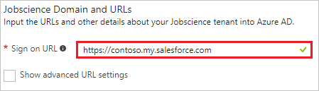

    In the **Sign-on URL** textbox, type a URL using the following pattern:
    `http://<company name>.my.salesforce.com`
    
    > [!NOTE] 
    > This value is not real. Update this value with the actual Sign-On URL. Get this value by [Jobscience Client support team](https://www.bullhorn.com/technical-support/) or from the SSO profile you will create which is explained later in the tutorial. 
 
1. On the **SAML Signing Certificate** section, click **Certificate (Base64)** and then save the certificate file on your computer.

    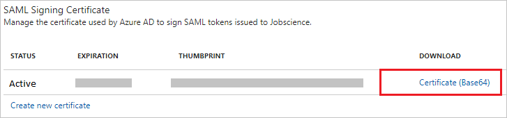 

1. Click **Save** button.

    

1. On the **Jobscience Configuration** section, click **Configure Jobscience** to open **Configure sign-on** window. Copy the **Sign-Out URL, SAML Entity ID, and SAML Single Sign-On Service URL** from the **Quick Reference section.**

    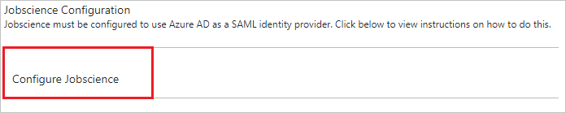 

1. Log in to your Jobscience company site as an administrator.

1. Go to **Setup**.
   
   

1. On the left navigation pane, in the **Administer** section, click **Domain Management** to expand the related section, and then click **My Domain** to open the **My Domain** page. 
   
   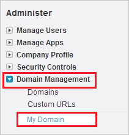

1. To verify that your domain has been set up correctly, make sure that it is in "**Step 4 Deployed to Users**" and review your "**My Domain Settings**".

    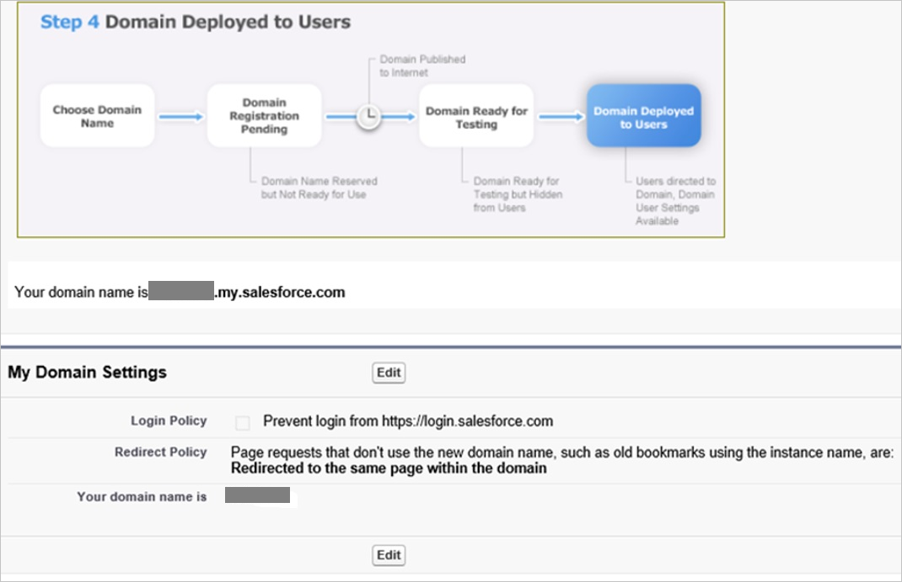

1. On the Jobscience company site, click **Security Controls**, and then click **Single Sign-On Settings**.
    
    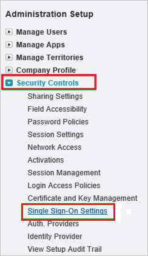

1. In the **Single Sign-On Settings** section, perform the following steps:
    
    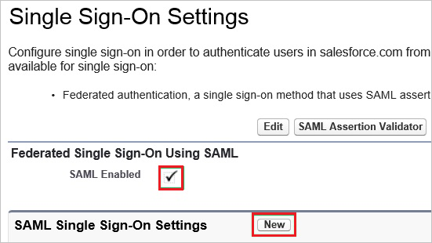
    
    a. Select **SAML Enabled**.

    b. Click **New**.

1. On the **SAML Single Sign-On Setting Edit** dialog, perform the following steps:
    
    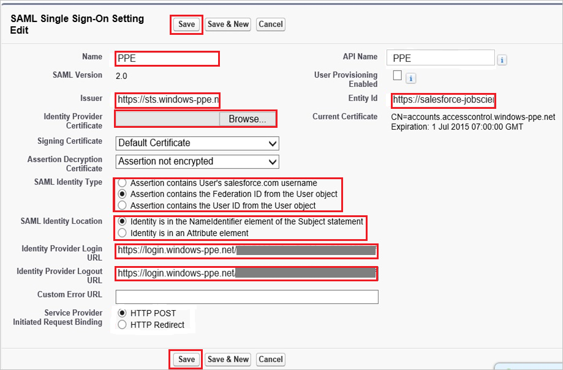
    
    a. In the **Name** textbox, type a name for your configuration.

    b. In **Issuer** textbox, paste the value of **SAML Entity ID**.

    c. In the **Entity Id** textbox, type `https://salesforce-jobscience.com`

    d. Click **Browse** to upload your Microsoft Entra certificate.

    e. As **SAML Identity Type**, select **Assertion contains the Federation ID from the User object**.

    f. As **SAML Identity Location**, select **Identity is in the NameIdentfier element of the Subject statement**.

    g. In **Identity Provider Login URL** textbox, paste the value of **SAML Single Sign-On Service URL**.

    h. In **Identity Provider Logout URL** textbox, paste the value of **Sign-Out URL**.

    i. Click **Save**.

1. On the left navigation pane, in the **Administer** section, click **Domain Management** to expand the related section, and then click **My Domain** to open the **My Domain** page. 
    
    

1. On the **My Domain** page, in the **Login Page Branding** section, click **Edit**.
    
    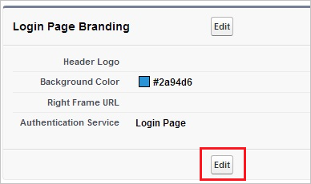

1. On the **Login Page Branding** page, in the **Authentication Service** section, the name of your **SAML SSO Settings** is displayed. Select it, and then click **Save**.
    
    

1. To get the SP initiated Single Sign on Login URL click on the **Single Sign On settings** in the **Security Controls** menu section.

    
    
    Click the SSO profile you have created in the step above. This page shows the Single Sign on URL for your company (for example, `https://companyname.my.salesforce.com?so=companyid`.    

> [!TIP]
> You can now read a concise version of these instructions inside the [Azure portal](https://portal.azure.com), while you are setting up the app!  After adding this app from the **Active Directory > Enterprise Applications** section, simply click the **Single Sign-On** tab and access the embedded documentation through the **Configuration** section at the bottom. You can read more about the embedded documentation feature here: [Microsoft Entra ID embedded documentation](https://go.microsoft.com/fwlink/?linkid=845985)
> 

### Creating a Microsoft Entra test user
The objective of this section is to create a test user called Britta Simon.

![Create Microsoft Entra user][100]

**To create a test user in Microsoft Entra ID, perform the following steps:**

1. In the Microsoft Entra admin center, navigate to **Identity** > **Users** > **All users**.
    
     

1. To open the **User** dialog, click **Add** on the top of the dialog.
 
     

1. On the **User** dialog page, perform the following steps:
 
     

    a. In the **Name** textbox, type **BrittaSimon**.

    b. In the **User name** textbox, type the **email address** of BrittaSimon.

    c. Select **Show Password** and write down the value of the **Password**.

    d. Click **Create**.
 
### Creating a Jobscience test user

In order to enable Microsoft Entra users to log in to Jobscience, they must be provisioned into Jobscience. In the case of Jobscience, provisioning is a manual task.

>[!NOTE]
>You can use any other Jobscience user account creation tools or APIs provided by Jobscience to provision Microsoft Entra user accounts.
>  
        
**To configure user provisioning, perform the following steps:**

1. Log in to your **Jobscience** company site as administrator.

1. Go to Setup.
   
   
1. Go to **Manage Users \> Users**.
   
   
1. Click **New User**.
   
   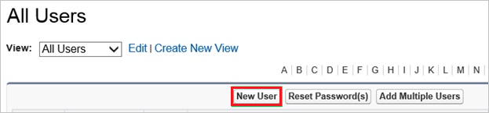
1. On the **Edit User** dialog, perform the following steps:
   
   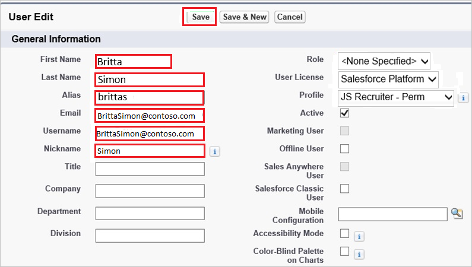
   
   a. In the **First Name** textbox, type a first name of the user like Britta.
   
   b. In the **Last Name** textbox, type a last name of the user like Simon.
   
   c. In the **Alias** textbox, type an alias name of the user like brittas.

   d. In the **Email** textbox, type the email address of user like Brittasimon@contoso.com.

   e. In the **User Name** textbox, type a user name of user like Brittasimon@contoso.com.

   f. In the **Nick Name** textbox, type a nick name of user like Simon.

   g. Click **Save**.

    
> [!NOTE]
> The Microsoft Entra account holder receives an email and follows a link to confirm their account before it becomes active.

### Assigning the Microsoft Entra test user

In this section, you enable Britta Simon to use Azure single sign-on by granting access to Jobscience.

![Screenshot shows an account display name.][200] 

**To assign Britta Simon to Jobscience, perform the following steps:**

1. Sign in to the [Microsoft Entra admin center](https://entra.microsoft.com) as at least a [Cloud Application Administrator](../roles/permissions-reference.md#cloud-application-administrator).
1. Browse to **Identity** > **Applications** > **Enterprise applications** > **Jobscience**.

    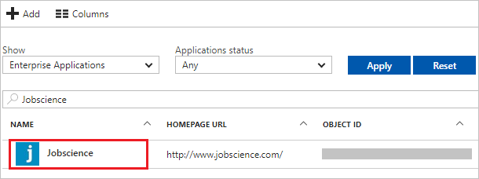 

1. In the menu on the left, click **Users and groups**.

    ![Screenshot shows Users and Groups selected menu.][202] 

1. Click **Add** button. Then select **Users and groups** on **Add Assignment** dialog.

    ![Screenshot shows the Add button, used to add assignments.][203]

1. On **Users and groups** dialog, select **Britta Simon** in the Users list.

1. Click **Select** button on **Users and groups** dialog.

1. Click **Assign** button on **Add Assignment** dialog.
    
### Testing single sign-on

In this section, you test your Microsoft Entra single sign-on configuration using the Access Panel.

When you click the Jobscience tile in the Access Panel, you should get automatically signed-on to your Jobscience application.
For more information about the Access Panel, see [Introduction to the Access Panel](https://support.microsoft.com/account-billing/sign-in-and-start-apps-from-the-my-apps-portal-2f3b1bae-0e5a-4a86-a33e-876fbd2a4510).

## Additional resources

* [List of Tutorials on How to Integrate SaaS Apps with Microsoft Entra ID](tutorial-list.md)
* [What is application access and single sign-on with Microsoft Entra ID?](../manage-apps/what-is-single-sign-on.md)

<!--Image references-->

[1]: ./media/jobscience-tutorial/tutorial_general_01.png
[2]: ./media/jobscience-tutorial/tutorial_general_02.png
[3]: ./media/jobscience-tutorial/tutorial_general_03.png
[4]: ./media/jobscience-tutorial/tutorial_general_04.png

[100]: ./media/jobscience-tutorial/tutorial_general_100.png

[200]: ./media/jobscience-tutorial/tutorial_general_200.png
[201]: ./media/jobscience-tutorial/tutorial_general_201.png
[202]: ./media/jobscience-tutorial/tutorial_general_202.png
[203]: ./media/jobscience-tutorial/tutorial_general_203.png
