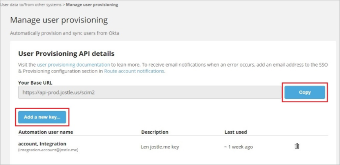
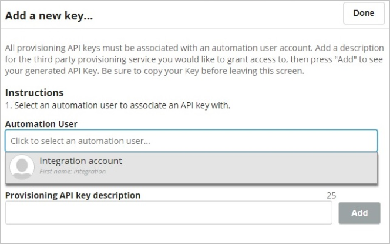

# Tutorial: Configure Jostle for automatic user provisioning

This tutorial describes the steps you need to perform in both Jostle and Microsoft Entra ID to configure automatic user provisioning. When configured, Microsoft Entra ID automatically provisions and de-provisions users and groups to [Jostle](https://www.jostle.me/) using the Microsoft Entra provisioning service. For important details on what this service does, how it works, and frequently asked questions, see [Automate user provisioning and deprovisioning to SaaS applications with Microsoft Entra ID](../app-provisioning/user-provisioning.md). 

## Capabilities Supported
> [!div class="checklist"]
> * Create users in Jostle
> * Remove users in Jostle when they do not require access anymore
> * Keep user attributes synchronized between Microsoft Entra ID and Jostle
> * [Single sign-on](jostle-tutorial.md) to Jostle (recommended)

## Prerequisites

The scenario outlined in this tutorial assumes that you already have the following prerequisites:

* [A Microsoft Entra tenant](../develop/quickstart-create-new-tenant.md) 
* A user account in Microsoft Entra ID with [permission](../roles/permissions-reference.md) to configure provisioning (for example, Application Administrator, Cloud Application administrator, Application Owner, or Global Administrator). 
* A [Jostle tenant](https://www.jostle.me/).
* A user account in Jostle with Admin permissions.

## Step 1: Plan your provisioning deployment

1. Learn about [how the provisioning service works](../app-provisioning/user-provisioning.md).
1. Determine who will be in [scope for provisioning](../app-provisioning/define-conditional-rules-for-provisioning-user-accounts.md).
1. Determine what data to [map between Microsoft Entra ID and Jostle](../app-provisioning/customize-application-attributes.md).

## Step 2: Configure Jostle to support provisioning with Microsoft Entra ID

### Automation account

Before you begin, you’ll need to create an **Automation user** in your Jostle intranet. This will be the account you’ll use to configure with Azure. Automation users can be created in Admin **Settings > User accounts and data > Manage Automation users**.

For more details on Automation users and how to create one, see [this article](https://forum.jostle.us/hc/en-us/articles/360057364073).

Once created, the Automation user account **must be activated** (i.e. logged in to your intranet at least once) before it can be used to configure Azure.

### Manage user provisioning

Before you begin, ensure that your account subscription **includes SSO/user provisioning features**. If it doesn't, you can contact your Customer Success Manager <success@jostle.me> and they can assist you in adding it to your account.

The next step is to obtain the **API URL** and **API key** from Jostle:

1. Go to the Main Navigation and click **Admin Settings**.
1. Under **User data to/from other systems** click **Manage user provisioning** .If you do not see "Manage user provisioning" here and have verified that your account includes SSO/user provisioning, contact Support <support@jostle.me> to have this page enabled in your Admin Settings).
1. In the **User Provisioning API details** section, go to **Your Base URL** field, click the Copy button and save the URL somewhere you can easily access it later.                                                           

   
                
1. Next, click the **Add a new key**... button
1. On the following screen, go to the **Automation User** field and use the drop-down menu to select your Automation user account. 

                                                                                                                                        
1. In the **Provisioning API key description** field give your key a name (i.e. “Azure”) and then click the **Add** button.

1. Once your key is generated, **make sure to copy it right away** and save it where you saved your URL (since this will be the only time your key will appear).                                                               
1. Next, you’ll use the **API URL** and **API key** to configure the integration in Azure.

## Step 3: Add Jostle from the Microsoft Entra application gallery

Add Jostle from the Microsoft Entra application gallery to start managing provisioning to Jostle. If you have previously setup Jostle for SSO, you can use the same application. However it's recommended that you create a separate app when testing out the integration initially. Learn more about adding an application from the gallery [here](../manage-apps/add-application-portal.md). 

## Step 4: Define who will be in scope for provisioning 

The Microsoft Entra provisioning service allows you to scope who will be provisioned based on assignment to the application and or based on attributes of the user / group. If you choose to scope who will be provisioned to your app based on assignment, you can use the following [steps](../manage-apps/assign-user-or-group-access-portal.md) to assign users and groups to the application. If you choose to scope who will be provisioned based solely on attributes of the user or group, you can use a scoping filter as described [here](../app-provisioning/define-conditional-rules-for-provisioning-user-accounts.md). 

* Start small. Test with a small set of users and groups before rolling out to everyone. When scope for provisioning is set to assigned users and groups, you can control this by assigning one or two users or groups to the app. When scope is set to all users and groups, you can specify an [attribute based scoping filter](../app-provisioning/define-conditional-rules-for-provisioning-user-accounts.md).

* If you need additional roles, you can [update the application manifest](../develop/howto-add-app-roles-in-azure-ad-apps.md) to add new roles.

## Step 5: Configure automatic user provisioning to Jostle 

This section guides you through the steps to configure the Microsoft Entra provisioning service to create, update, and disable users and groups in Jostle app based on user and group assignments in Microsoft Entra ID.

> [!NOTE]
> For more information on automatic user provisioning to Jostle, see [User-Provisioning-Azure-Integration](https://forum.jostle.us/hc/en-us/articles/360056368534-User-Provisioning-Azure-Integration).

### To configure automatic user provisioning for Jostle in Microsoft Entra ID:

1. Sign in to the [Microsoft Entra admin center](https://entra.microsoft.com) as at least a [Cloud Application Administrator](../roles/permissions-reference.md#cloud-application-administrator).
1. Browse to **Identity** > **Applications** > **Enterprise applications**

	

1. In the applications list, select **Jostle**.

	

1. Select the **Provisioning** tab and click **Get Started**.

	

1.  Set the **Provisioning Mode** to **Automatic**.

	

1. In the **Admin Credentials** section, enter your Jostle **Tenant URL** and **Secret token** information. Select **Test Connection** to ensure that Microsoft Entra ID can connect to Jostle. If the connection fails, ensure that your Jostle account has admin permissions and try again.

 	

1. In the **Notification Email** field, enter the email address of a person or group who should receive the provisioning error notifications. Select the **Send an email notification when a failure occurs** check box. But to be noted, Jostle will also send provisioning failure notifications, so this is optional.

	

1. Select **Save**.

1. In the **Mappings** section, select **Provision Microsoft Entra users to Jostle**.

1. Review the user attributes that are synchronized from Microsoft Entra ID to Jostle in the **Attribute Mapping** section. The attributes selected as **Matching** properties are used to match the user accounts in Jostle for update operations. If you change the [matching target attribute](../app-provisioning/customize-application-attributes.md), you'll need to ensure that the Jostle API supports filtering users based on that attribute. Select **Save** to commit any changes.

   |Attribute|Type|Supported for filtering|
   |---|---|---|
   |userName|String|&check;|
   |active|Boolean|
   |name.givenName|String|
   |name.familyName|String|
   |emails[type eq "work"].value|String|
   |emails[type eq "personal"].value|String|
   |emails[type eq "alternate1"].value|String|
   |emails[type eq "alternate2"].value|String|  
   |urn:ietf:params:scim:schemas:extension:jostle:2.0:User:alternateEmail1Label|String|
   |urn:ietf:params:scim:schemas:extension:jostle:2.0:User:alternateEmail2Label	|String|  

1. To configure scoping filters, see the instructions provided in the [Scoping filter tutorial](../app-provisioning/define-conditional-rules-for-provisioning-user-accounts.md).

1. To enable the Microsoft Entra provisioning service for Jostle, change **Provisioning Status** to **On** in the **Settings** section.

	

1. Define the users or groups that you want to provision to Jostle by selecting the desired values in **Scope** in the **Settings** section.For Jostle, the **Scope** should be set to "Sync only assigned users and groups".

	

1. When you're ready to provision, select **Save**.

	

This operation starts the initial synchronization cycle of all users and groups defined in **Scope** in the **Settings** section. The initial cycle takes longer to do than next cycles, which occur about every 40 minutes as long as the Microsoft Entra provisioning service is running.

## Step 6: Monitor your deployment

After you've configured provisioning, use the following resources to monitor your deployment:

* Use the [provisioning logs](../reports-monitoring/concept-provisioning-logs.md) to determine which users were provisioned successfully or unsuccessfully.
* Check the [progress bar](../app-provisioning/application-provisioning-when-will-provisioning-finish-specific-user.md) to see the status of the provisioning cycle and how close it's to completion.
* If the provisioning configuration seems to be in an unhealthy state, the application will go into quarantine. To learn more about quarantine states, see [Application provisioning status of quarantine](../app-provisioning/application-provisioning-quarantine-status.md).

## More resources

* [Managing user account provisioning for enterprise apps](../app-provisioning/configure-automatic-user-provisioning-portal.md)
* [What is application access and single sign-on with Microsoft Entra ID?](../manage-apps/what-is-single-sign-on.md)

## Next steps

* [Learn how to review logs and get reports on provisioning activity](../app-provisioning/check-status-user-account-provisioning.md)
