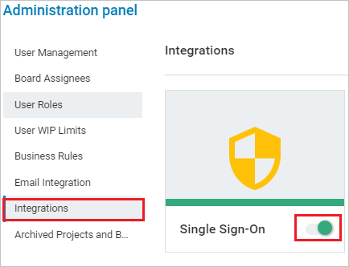
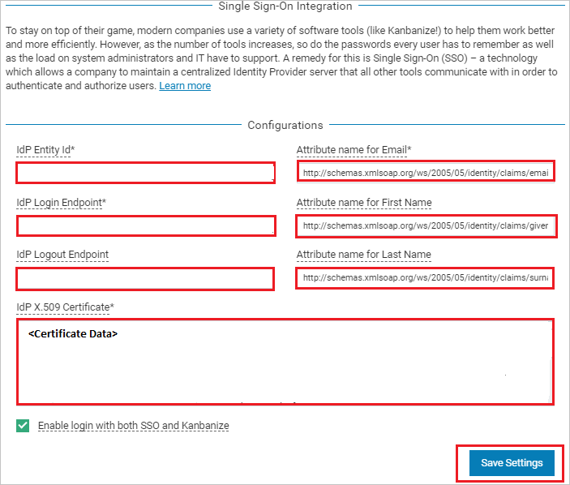

# Tutorial: Azure AD SSO integration with Kanbanize

In this tutorial, you'll learn how to integrate Kanbanize with Azure Active Directory (Azure AD). When you integrate Kanbanize with Azure AD, you can:

* Control in Azure AD who has access to Kanbanize.
* Enable your users to be automatically signed-in to Kanbanize with their Azure AD accounts.
* Manage your accounts in one central location - the Azure portal.

## Prerequisites

To get started, you need the following items:

* An Azure AD subscription. If you don't have a subscription, you can get a [free account](https://azure.microsoft.com/free/).
* Kanbanize single sign-on (SSO) enabled subscription.

## Scenario description

In this tutorial, you configure and test Azure AD SSO in a test environment.

* Kanbanize supports **SP and IDP** initiated SSO.
* Kanbanize supports **Just In Time** user provisioning.

## Add Kanbanize from the gallery

To configure the integration of Kanbanize into Azure AD, you need to add Kanbanize from the gallery to your list of managed SaaS apps.

1. Sign in to the Azure portal using either a work or school account, or a personal Microsoft account.
1. On the left navigation pane, select the **Azure Active Directory** service.
1. Navigate to **Enterprise Applications** and then select **All Applications**.
1. To add new application, select **New application**.
1. In the **Add from the gallery** section, type **Kanbanize** in the search box.
1. Select **Kanbanize** from results panel and then add the app. Wait a few seconds while the app is added to your tenant.

 Alternatively, you can also use the [Enterprise App Configuration Wizard](https://portal.office.com/AdminPortal/home?Q=Docs#/azureadappintegration). In this wizard, you can add an application to your tenant, add users/groups to the app, assign roles, as well as walk through the SSO configuration as well. [Learn more about Microsoft 365 wizards.](/microsoft-365/admin/misc/azure-ad-setup-guides)

## Configure and test Azure AD SSO for Kanbanize

Configure and test Azure AD SSO with Kanbanize using a test user called **B.Simon**. For SSO to work, you need to establish a link relationship between an Azure AD user and the related user in Kanbanize.

To configure and test Azure AD SSO with Kanbanize, perform the following steps:

1. **[Configure Azure AD SSO](#configure-azure-ad-sso)** - to enable your users to use this feature.
    1. **[Create an Azure AD test user](#create-an-azure-ad-test-user)** - to test Azure AD single sign-on with B.Simon.
    1. **[Assign the Azure AD test user](#assign-the-azure-ad-test-user)** - to enable B.Simon to use Azure AD single sign-on.
1. **[Configure Kanbanize SSO](#configure-kanbanize-sso)** - to configure the single sign-on settings on application side.
    1. **[Create Kanbanize test user](#create-kanbanize-test-user)** - to have a counterpart of B.Simon in Kanbanize that is linked to the Azure AD representation of user.
1. **[Test SSO](#test-sso)** - to verify whether the configuration works.

## Configure Azure AD SSO

Follow these steps to enable Azure AD SSO in the Azure portal.

1. In the Azure portal, on the **Kanbanize** application integration page, find the **Manage** section and select **single sign-on**.
1. On the **Select a single sign-on method** page, select **SAML**.
1. On the **Set up single sign-on with SAML** page, click the pencil icon for **Basic SAML Configuration** to edit the settings.

   

1. On the **Basic SAML Configuration** section, if you wish to configure the application in **IDP** initiated mode, perform the following steps:

     a. In the **Identifier** text box, type a URL using the following pattern:
    `https://<subdomain>.kanbanize.com/`

    b. In the **Reply URL** text box, type a URL using the following pattern:
    `https://<subdomain>.kanbanize.com/saml/acs`

	c. Click **Set additional URLs**.

    d. In the **Relay State** textbox, type the value: `/ctrl_login/saml_login`

1. Click **Set additional URLs** and perform the following step if you wish to configure the application in **SP** initiated mode:

    In the **Sign-on URL** text box, type a URL using the following pattern:
    `https://<subdomain>.kanbanize.com`

	> [!NOTE]
	> These values are not real. Update these values with the actual Identifier, Reply URL and Sign-on URL. Contact [Kanbanize Client support team](mailto:support@ms.kanbanize.com) to get these values. You can also refer to the patterns shown in the **Basic SAML Configuration** section in the Azure portal.

1. Kanbanize application expects the SAML assertions in a specific format, which requires you to add custom attribute mappings to your SAML token attributes configuration. The following screenshot shows the list of default attributes, where as nameidentifier is mapped with **user.userprincipalname**. Kanbanize application expects nameidentifier to be mapped with **user.mail**, so you need to edit the attribute mapping by clicking on Edit icon and change the attribute mapping.

	

1. On the **Set up single sign-on with SAML** page, in the **SAML Signing Certificate** section,  find **Certificate (Base64)** and select **Download** to download the certificate and save it on your computer.

	

1. On the **Set up Kanbanize** section, copy the appropriate URL(s) based on your requirement.

	

### Create an Azure AD test user

In this section, you'll create a test user in the Azure portal called B.Simon.

1. From the left pane in the Azure portal, select **Azure Active Directory**, select **Users**, and then select **All users**.
1. Select **New user** at the top of the screen.
1. In the **User** properties, follow these steps:
   1. In the **Name** field, enter `B.Simon`.  
   1. In the **User name** field, enter the username@companydomain.extension. For example, `B.Simon@contoso.com`.
   1. Select the **Show password** check box, and then write down the value that's displayed in the **Password** box.
   1. Click **Create**.

### Assign the Azure AD test user

In this section, you'll enable B.Simon to use Azure single sign-on by granting access to Kanbanize.

1. In the Azure portal, select **Enterprise Applications**, and then select **All applications**.
1. In the applications list, select **Kanbanize**.
1. In the app's overview page, find the **Manage** section and select **Users and groups**.
1. Select **Add user**, then select **Users and groups** in the **Add Assignment** dialog.
1. In the **Users and groups** dialog, select **B.Simon** from the Users list, then click the **Select** button at the bottom of the screen.
1. If you're expecting any role value in the SAML assertion, in the **Select Role** dialog, select the appropriate role for the user from the list and then click the **Select** button at the bottom of the screen.
1. In the **Add Assignment** dialog, click the **Assign** button.

## Configure Kanbanize SSO

1. To automate the configuration within Kanbanize, you need to install **My Apps Secure Sign-in browser extension** by clicking **Install the extension**.

	

2. After adding extension to the browser, click on **Set up Kanbanize** will direct you to the Kanbanize application. From there, provide the admin credentials to sign into Kanbanize. The browser extension will automatically configure the application for you and automate steps 3-7.

	

3. If you want to setup Kanbanize manually, open a new web browser window and sign into your Kanbanize company site as an administrator and perform the following steps:

4. Go to top  right of the page, click on **Settings** logo.

	

5. On the Administration panel page from the left side of menu click **Integrations** and then enable **Single Sign-On**.

	

6. Under Integrations section, click on **CONFIGURE** to open **Single Sign-On Integration** page.

	

7. On the **Single Sign-On Integration** page under **Configurations**, perform the following steps:

	

	a. In the **Idp Entity ID** textbox, paste the value of **Azure AD Identifier**, which you have copied from the Azure portal.

	b. In the **Idp Login Endpoint** textbox, paste the value of **Login URL**, which you have copied from the Azure portal.

	c. In the **Idp Logout Endpoint** textbox, paste the value of **Logout URL**, which you have copied from the Azure portal.

	d. In **Attribute name for Email** textbox, enter this value `http://schemas.xmlsoap.org/ws/2005/05/identity/claims/emailaddress`

	e. In **Attribute name for First Name** textbox, enter this value `http://schemas.xmlsoap.org/ws/2005/05/identity/claims/givenname`

	f. In **Attribute name for Last Name** textbox, enter this value `http://schemas.xmlsoap.org/ws/2005/05/identity/claims/surname`

	> [!Note]
	> You can get these values by combining namespace and name values of the respective attribute from the User attributes section in Azure portal.

	g. In Notepad, open the base-64 encoded certificate that you downloaded from the Azure portal, copy its content (without the start and end markers), and then paste it into the **Idp X.509 Certificate** box.

	h. Check **Enable login with both SSO and Kanbanize**.

	i. Click **Save Settings**.

### Create Kanbanize test user

In this section, a user called B.Simon is created in Kanbanize. Kanbanize supports just-in-time user provisioning, which is enabled by default. There is no action item for you in this section. If a user doesn't already exist in Kanbanize, a new one is created after authentication. If you need to create a user manually, contact [Kanbanize Client support team](mailto:support@ms.kanbanize.com).

## Test SSO 

In this section, you test your Azure AD single sign-on configuration with following options. 

#### SP initiated:

* Click on **Test this application** in Azure portal. This will redirect to Kanbanize Sign on URL where you can initiate the login flow.  

* Go to Kanbanize Sign-on URL directly and initiate the login flow from there.

#### IDP initiated:

* Click on **Test this application** in Azure portal and you should be automatically signed in to the Kanbanize for which you set up the SSO. 

You can also use Microsoft My Apps to test the application in any mode. When you click the Kanbanize tile in the My Apps, if configured in SP mode you would be redirected to the application sign on page for initiating the login flow and if configured in IDP mode, you should be automatically signed in to the Kanbanize for which you set up the SSO. For more information about the My Apps, see [Introduction to the My Apps](../user-help/my-apps-portal-end-user-access.md).

## Next steps

Once you configure Kanbanize you can enforce session control, which protects exfiltration and infiltration of your organization’s sensitive data in real time. Session control extends from Conditional Access. [Learn how to enforce session control with Microsoft Defender for Cloud Apps](/cloud-app-security/proxy-deployment-aad).
