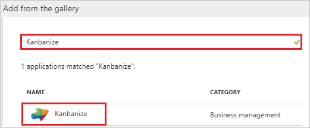
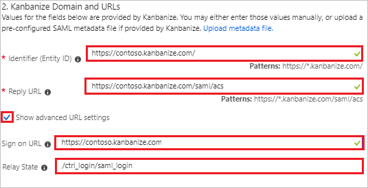
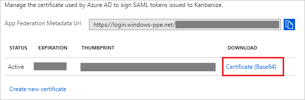
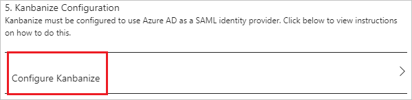
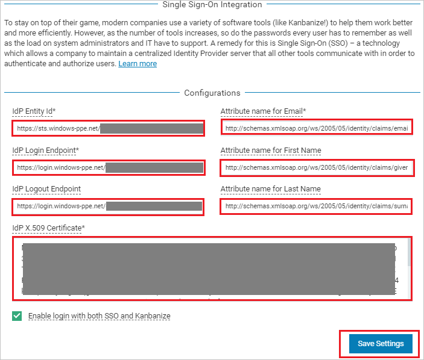
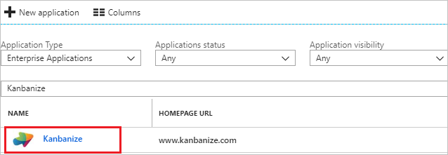

# Tutorial: Azure Active Directory integration with Kanbanize

In this tutorial, you learn how to integrate Kanbanize with Azure Active Directory (Azure AD).

Integrating Kanbanize with Azure AD provides you with the following benefits:

- You can control in Azure AD who has access to Kanbanize.
- You can enable your users to automatically get signed-on to Kanbanize (Single Sign-On) with their Azure AD accounts.
- You can manage your accounts in one central location - the Azure portal.

If you want to know more details about SaaS app integration with Azure AD, see [what is application access and single sign-on with Azure Active Directory](../manage-apps/what-is-single-sign-on.md).

## Prerequisites

To configure Azure AD integration with Kanbanize, you need the following items:

- An Azure AD subscription
- A Kanbanize single sign-on enabled subscription

> [!NOTE]
> To test the steps in this tutorial, we do not recommend using a production environment.

To test the steps in this tutorial, you should follow these recommendations:

- Do not use your production environment, unless it is necessary.
- If you don't have an Azure AD trial environment, you can [get a one-month trial](https://azure.microsoft.com/pricing/free-trial/).

## Scenario description
In this tutorial, you test Azure AD single sign-on in a test environment. 
The scenario outlined in this tutorial consists of two main building blocks:

1. Adding Kanbanize from the gallery
2. Configuring and testing Azure AD single sign-on

## Adding Kanbanize from the gallery
To configure the integration of Kanbanize into Azure AD, you need to add Kanbanize from the gallery to your list of managed SaaS apps.

**To add Kanbanize from the gallery, perform the following steps:**

1. In the **[Azure portal](https://portal.azure.com)**, on the left navigation panel, click **Azure Active Directory** icon. 

	![The Azure Active Directory button][1]

2. Navigate to **Enterprise applications**. Then go to **All applications**.

	![The Enterprise applications blade][2]
	
3. To add new application, click **New application** button on the top of dialog.

	![The New application button][3]

4. In the search box, type **Kanbanize**, select **Kanbanize** from result panel then click **Add** button to add the application.

	

## Configure and test Azure AD single sign-on

In this section, you configure and test Azure AD single sign-on with Kanbanize based on a test user called "Britta Simon".

For single sign-on to work, Azure AD needs to know what the counterpart user in Kanbanize is to a user in Azure AD. In other words, a link relationship between an Azure AD user and the related user in Kanbanize needs to be established.

To configure and test Azure AD single sign-on with Kanbanize, you need to complete the following building blocks:

1. **[Configure Azure AD Single Sign-On](#configure-azure-ad-single-sign-on)** - to enable your users to use this feature.
2. **[Create an Azure AD test user](#create-an-azure-ad-test-user)** - to test Azure AD single sign-on with Britta Simon.
3. **[Create a Kanbanize test user](#create-a-kanbanize-test-user)** - to have a counterpart of Britta Simon in Kanbanize that is linked to the Azure AD representation of user.
4. **[Assign the Azure AD test user](#assign-the-azure-ad-test-user)** - to enable Britta Simon to use Azure AD single sign-on.
5. **[Test single sign-on](#test-single-sign-on)** - to verify whether the configuration works.

### Configure Azure AD single sign-on

In this section, you enable Azure AD single sign-on in the Azure portal and configure single sign-on in your Kanbanize application.

**To configure Azure AD single sign-on with Kanbanize, perform the following steps:**

1. In the Azure portal, on the **Kanbanize** application integration page, click **Single sign-on**.

	![Configure single sign-on link][4]

2. On the **Single sign-on** dialog, select **Mode** as	**SAML-based Sign-on** to enable single sign-on.
 
	

3. On the **Kanbanize Domain and URLs** section, perform the following steps if you wish to configure the application in **IDP** initiated mode:

	

    a. In the **Identifier** textbox, type a URL using the following pattern: `https://<subdomain>.kanbanize.com/`

	b. In the **Reply URL** textbox, type a URL using the following pattern: `https://<subdomain>.kanbanize.com/saml/acs`

	c. Check **Show advanced URL settings**.

	d.  In the **Relay State** textbox, type a URL: `/ctrl_login/saml_login`

	e. If you wish to configure the application in **SP** initiated mode, in **Sign-on URL** textbox type a URL using the following pattern: `https://<subdomain>.kanbanize.com`
	 
	> [!NOTE] 
	> These values are not real. Update these values with the actual Identifier, Reply URL, and Sign-On URL. Contact [Kanbanize Client support team](mailto:support@ms.kanbanize.com) to get these values. 

5. Kanbanize application expects the SAML assertions in a specific format, which requires you to add custom attribute mappings to your SAML token attributes configuration. The following screenshot shows an example for this. The default value of **User Identifier** is **user.userprincipalname** but Kanbanize expects this to be mapped with the user's email address. For that you can use **user.mail** attribute from the list or use the appropriate attribute value based on your organization configuration
	
	

6. On the **SAML Signing Certificate** section, click **Certificate (Base64)** and then save the certificate file on your computer.

	 

7. Click **Save** button.

	
	
8. On the **Kanbanize Configuration** section, click **Configure Kanbanize** to open **Configure sign-on** window. Copy the **Sign-Out URL, SAML Entity ID, and SAML Single Sign-On Service URL** from the **Quick Reference section.**

	

9. In a different web browser window, login to Kanbanize as a Security Administrator. 

10. Go to top  right of the page, click on **Settings** logo.

	

11. On the Administration panel page from the left side of menu click **Integrations** and then enable **Single Sign-On**. 

	

12. Under Integrations section, click on **CONFIGURE** to open **Single Sign-On Integration** page.

	

13. On the **Single Sign-On Integration** page under **Configurations**, perform the following steps:

	

	a. In the **Idp Entity Id** textbox, paste the value of **SAML Entity ID**, which you have copied from the Azure portal.

	b. In the **Idp Login Endpoint** textbox, paste the value of **SAML Single Sign-On Service URL**, which you have copied from the Azure portal.

	c. In the **Idp Logout Endpoint** textbox, paste the value of **Sign-Out URL**, which you have copied from the Azure portal.

	d. In **Attribute name for Email** textbox, enter this value `http://schemas.xmlsoap.org/ws/2005/05/identity/claims/emailaddress`

	e. In **Attribute name for First Name** textbox, enter this value `http://schemas.xmlsoap.org/ws/2005/05/identity/claims/givenname`

	f. In **Attribute name for Last Name** textbox, enter this value `http://schemas.xmlsoap.org/ws/2005/05/identity/claims/surname` 
	> [!Note]
	> You can get these values by combining namespace and name values of the respective attribute from the User attributes section in Azure portal.

	g. In Notepad, open the base-64 encoded certificate that you downloaded from the Azure portal, copy its content (without the start and end markers), and then paste it into the **Idp X.509 Certificate** box.

	h. Check **Enable login with both SSO and Kanbanize**.
	
	i. Click **Save Settings**.

### Create an Azure AD test user

The objective of this section is to create a test user in the Azure portal called Britta Simon.

   ![Create an Azure AD test user][100]

**To create a test user in Azure AD, perform the following steps:**

1. In the Azure portal, in the left pane, click the **Azure Active Directory** button.

    

2. To display the list of users, go to **Users and groups**, and then click **All users**.

    

3. To open the **User** dialog box, click **Add** at the top of the **All Users** dialog box.

    

4. In the **User** dialog box, perform the following steps:

    

    a. In the **Name** box, type **BrittaSimon**.

    b. In the **User name** box, type the email address of user Britta Simon.

    c. Select the **Show Password** check box, and then write down the value that's displayed in the **Password** box.

    d. Click **Create**.
 
### Create a Kanbanize test user

The objective of this section is to create a user called Britta Simon in Kanbanize. Kanbanize supports just-in-time provisioning, which is by default enabled. There is no action item for you in this section. A new user is created during an attempt to access Kanbanize if it doesn't exist yet.

>[!Note]
>If you need to create a user manually, contact [Kanbanize Client support team](mailto:support@ms.kanbanize.com).

### Assign the Azure AD test user

In this section, you enable Britta Simon to use Azure single sign-on by granting access to Kanbanize.

![Assign the user role][200] 

**To assign Britta Simon to Kanbanize, perform the following steps:**

1. In the Azure portal, open the applications view, and then navigate to the directory view and go to **Enterprise applications** then click **All applications**.

	![Assign User][201] 

2. In the applications list, select **Kanbanize**.

	  

3. In the menu on the left, click **Users and groups**.

	![The "Users and groups" link][202]

4. Click **Add** button. Then select **Users and groups** on **Add Assignment** dialog.

	![The Add Assignment pane][203]

5. On **Users and groups** dialog, select **Britta Simon** in the Users list.

6. Click **Select** button on **Users and groups** dialog.

7. Click **Assign** button on **Add Assignment** dialog.
	
### Test single sign-on

In this section, you test your Azure AD single sign-on configuration using the Access Panel.

When you click the Kanbanize tile in the Access Panel, you should get automatically signed-on to your Kanbanize application.
For more information about the Access Panel, see [Introduction to the Access Panel](../active-directory-saas-access-panel-introduction.md). 

## Additional resources

* [List of Tutorials on How to Integrate SaaS Apps with Azure Active Directory](tutorial-list.md)
* [What is application access and single sign-on with Azure Active Directory?](../manage-apps/what-is-single-sign-on.md)

<!--Image references-->

[1]: ./media/kanbanize-tutorial/tutorial_general_01.png
[2]: ./media/kanbanize-tutorial/tutorial_general_02.png
[3]: ./media/kanbanize-tutorial/tutorial_general_03.png
[4]: ./media/kanbanize-tutorial/tutorial_general_04.png

[100]: ./media/kanbanize-tutorial/tutorial_general_100.png

[200]: ./media/kanbanize-tutorial/tutorial_general_200.png
[201]: ./media/kanbanize-tutorial/tutorial_general_201.png
[202]: ./media/kanbanize-tutorial/tutorial_general_202.png
[203]: ./media/kanbanize-tutorial/tutorial_general_203.png

