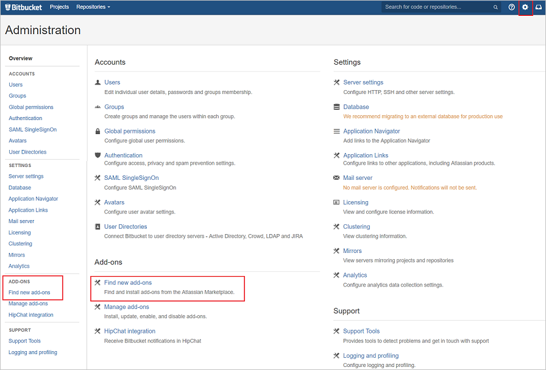
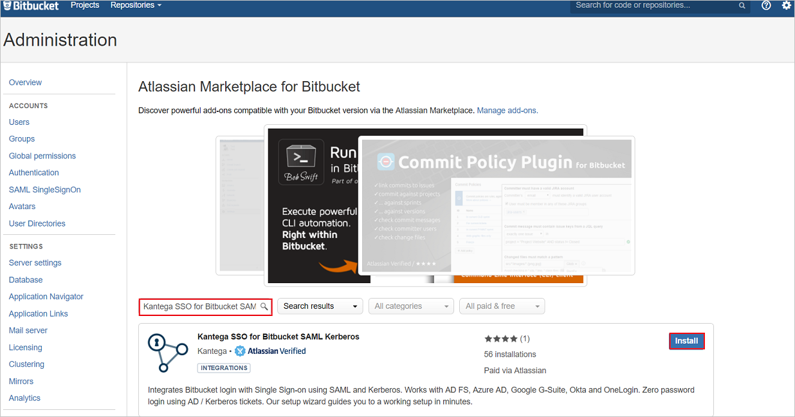
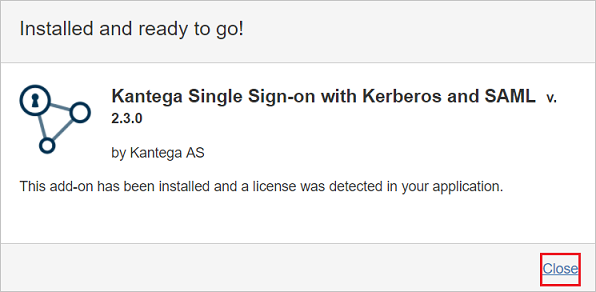
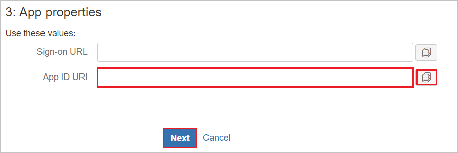
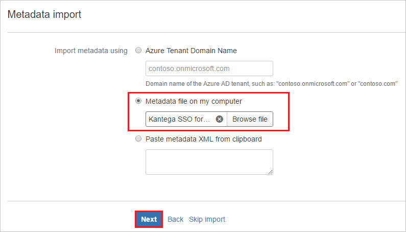
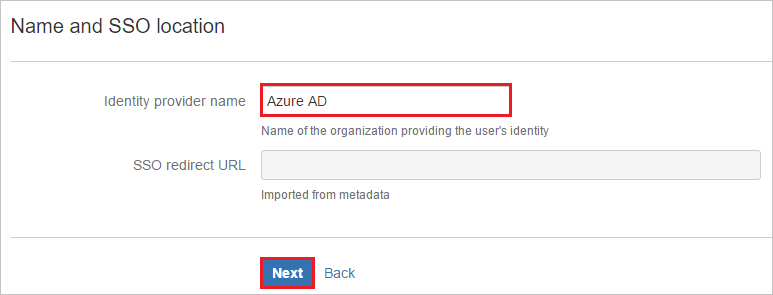
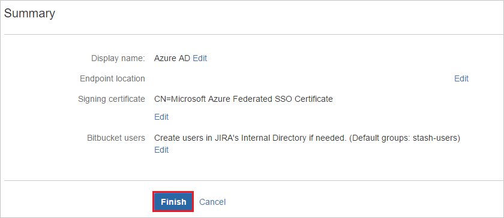
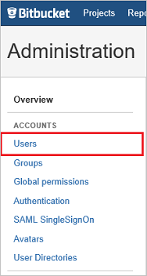
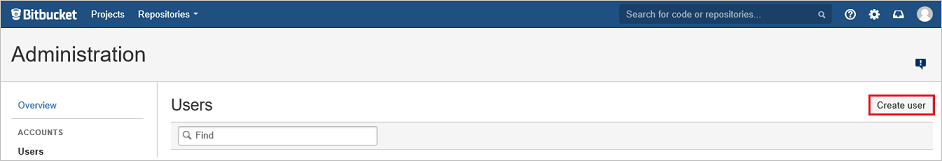

# Tutorial: Microsoft Entra SSO integration with Kantega SSO for Bitbucket

In this tutorial, you'll learn how to integrate Kantega SSO for Bitbucket with Microsoft Entra ID. When you integrate Kantega SSO for Bitbucket with Microsoft Entra ID, you can:

* Control in Microsoft Entra ID who has access to Kantega SSO for Bitbucket.
* Enable your users to be automatically signed-in to Kantega SSO for Bitbucket with their Microsoft Entra accounts.
* Manage your accounts in one central location.

## Prerequisites

To configure Microsoft Entra integration with Kantega SSO for Bitbucket, you need the following items:

* A Microsoft Entra subscription. If you don't have a Microsoft Entra environment, you can get a [free account](https://azure.microsoft.com/free/).
* Kantega SSO for Bitbucket single sign-on enabled subscription.

## Scenario description

In this tutorial, you configure and test Microsoft Entra single sign-on in a test environment.

* Kantega SSO for Bitbucket supports **SP and IDP** initiated SSO.

## Add Kantega SSO for Bitbucket from the gallery

To configure the integration of Kantega SSO for Bitbucket into Microsoft Entra ID, you need to add Kantega SSO for Bitbucket from the gallery to your list of managed SaaS apps.

1. Sign in to the [Microsoft Entra admin center](https://entra.microsoft.com) as at least a [Cloud Application Administrator](../roles/permissions-reference.md#cloud-application-administrator).
1. Browse to **Identity** > **Applications** > **Enterprise applications** > **New application**.
1. In the **Add from the gallery** section, type **Kantega SSO for Bitbucket** in the search box.
1. Select **Kantega SSO for Bitbucket** from results panel and then add the app. Wait a few seconds while the app is added to your tenant.

 Alternatively, you can also use the [Enterprise App Configuration Wizard](https://portal.office.com/AdminPortal/home?Q=Docs#/azureadappintegration). In this wizard, you can add an application to your tenant, add users/groups to the app, assign roles, as well as walk through the SSO configuration as well. [Learn more about Microsoft 365 wizards.](/microsoft-365/admin/misc/azure-ad-setup-guides)

## Configure and test Microsoft Entra SSO for Kantega SSO for Bitbucket

Configure and test Microsoft Entra SSO with Kantega SSO for Bitbucket using a test user called **B.Simon**. For SSO to work, you need to establish a link relationship between a Microsoft Entra user and the related user in Kantega SSO for Bitbucket.

To configure and test Microsoft Entra SSO with Kantega SSO for Bitbucket, perform the following steps:

1. **[Configure Microsoft Entra SSO](#configure-azure-ad-sso)** - to enable your users to use this feature.
    1. **[Create a Microsoft Entra test user](#create-an-azure-ad-test-user)** - to test Microsoft Entra single sign-on with B.Simon.
    1. **[Assign the Microsoft Entra test user](#assign-the-azure-ad-test-user)** - to enable B.Simon to use Microsoft Entra single sign-on.
1. **[Configure Kantega SSO for Bitbucket SSO](#configure-kantega-sso-for-bitbucket-sso)** - to configure the single sign-on settings on application side.
    1. **[Create Kantega SSO for Bitbucket test user](#create-kantega-sso-for-bitbucket-test-user)** - to have a counterpart of B.Simon in Kantega SSO for Bitbucket that is linked to the Microsoft Entra representation of user.
1. **[Test SSO](#test-sso)** - to verify whether the configuration works.

## Configure Microsoft Entra SSO

Follow these steps to enable Microsoft Entra SSO.

1. Sign in to the [Microsoft Entra admin center](https://entra.microsoft.com) as at least a [Cloud Application Administrator](../roles/permissions-reference.md#cloud-application-administrator).
1. Browse to **Identity** > **Applications** > **Enterprise applications** > **Kantega SSO for Bitbucket** > **Single sign-on**.
1. On the **Select a single sign-on method** page, select **SAML**.
1. On the **Set up single sign-on with SAML** page, click the pencil icon for **Basic SAML Configuration** to edit the settings.

   

1. On the **Basic SAML Configuration** section, If you wish to configure the application in **IDP** initiated mode, perform the following steps:

    a. In the **Identifier** text box, type a URL using the following pattern:
    `https://<server-base-url>/plugins/servlet/no.kantega.saml/sp/<uniqueid>/login`

    b. In the **Reply URL** text box, type a URL using the following pattern:
    `https://<server-base-url>/plugins/servlet/no.kantega.saml/sp/<uniqueid>/login`

5. Click **Set additional URLs** and perform the following step if you wish to configure the application in **SP** initiated mode:

    In the **Sign-on URL** text box, type a URL using the following pattern:
    `https://<server-base-url>/plugins/servlet/no.kantega.saml/sp/<uniqueid>/login`

	> [!NOTE]
	> These values are not real. Update these values with the actual Identifier, Reply URL, and Sign-On URL. These values are received during the configuration of Bitbucket plugin which is explained later in the tutorial.

6. On the **Set up Single Sign-On with SAML** page, in the **SAML Signing Certificate** section, click **Download** to download the **Federation Metadata XML** from the given options as per your requirement and save it on your computer.

	

7. On the **Set up Kantega SSO for Bitbucket** section, copy the appropriate URL(s) as per your requirement.

	

### Create a Microsoft Entra test user

In this section, you'll create a test user called B.Simon.

1. Sign in to the [Microsoft Entra admin center](https://entra.microsoft.com) as at least a [User Administrator](../roles/permissions-reference.md#user-administrator).
1. Browse to **Identity** > **Users** > **All users**.
1. Select **New user** > **Create new user**, at the top of the screen.
1. In the **User** properties, follow these steps:
   1. In the **Display name** field, enter `B.Simon`.  
   1. In the **User principal name** field, enter the username@companydomain.extension. For example, `B.Simon@contoso.com`.
   1. Select the **Show password** check box, and then write down the value that's displayed in the **Password** box.
   1. Select **Review + create**.
1. Select **Create**.

### Assign the Microsoft Entra test user

In this section, you'll enable B.Simon to use single sign-on by granting access to Kantega SSO for Bitbucket.

1. Sign in to the [Microsoft Entra admin center](https://entra.microsoft.com) as at least a [Cloud Application Administrator](../roles/permissions-reference.md#cloud-application-administrator).
1. Browse to **Identity** > **Applications** > **Enterprise applications** > **Kantega SSO for Bitbucket**.
1. In the app's overview page, select **Users and groups**.
1. Select **Add user/group**, then select **Users and groups** in the **Add Assignment** dialog.
   1. In the **Users and groups** dialog, select **B.Simon** from the Users list, then click the **Select** button at the bottom of the screen.
   1. If you are expecting a role to be assigned to the users, you can select it from the **Select a role** dropdown. If no role has been set up for this app, you see "Default Access" role selected.
   1. In the **Add Assignment** dialog, click the **Assign** button.

## Configure Kantega SSO for Bitbucket SSO

1. In a different web browser window, sign in to your Bitbucket admin portal as an administrator.

1. Click cog and click the **Find new add-ons**.

	

1. Search **Kantega SSO for Bitbucket SAML & Kerberos** and click **Install** button to install the new SAML plugin.

	

1. The plugin installation starts.

	

1. Once the installation is complete. Click **Close**.

	

1. Click **Manage**.

	

1. Click **Configure** to configure the new plugin.

	

1. In the **SAML** section. Select **Microsoft Entra ID** from the **Add identity provider** dropdown.

	

1. Select subscription level as **Basic**.

	

1. On the **App properties** section, perform following steps:

	

	a. Copy the **App ID URI** value and use it as **Identifier, Reply URL, and Sign-On URL** on the **Basic SAML Configuration** section in Azure portal.

	b. Click **Next**.

1. On the **Metadata import** section, perform following steps:

	

	a. Select **Metadata file on my computer**, and upload metadata file, which you have downloaded previously.

	b. Click **Next**.

1. On the **Name and SSO location** section, perform following steps:

	

	a. Add Name of the Identity Provider in **Identity provider name** textbox (e.g Microsoft Entra ID).

	b. Click **Next**.

1. Verify the Signing certificate and click **Next**.

	

1. On the **Bitbucket user accounts** section, perform following steps:

	

	a. Select **Create users in Bitbucket's internal Directory if needed** and enter the appropriate name of the group for users (can be multiple no. of groups separated by comma).

	b. Click **Next**.

1. Click **Finish**.

	

1. On the **Known domains for Microsoft Entra ID** section, perform following steps:

	

	a. Select **Known domains** from the left panel of the page.

	b. Enter domain name in the **Known domains** textbox.

	c. Click **Save**.

### Create Kantega SSO for Bitbucket test user

To enable Microsoft Entra users to sign in to Bitbucket, they must be provisioned into Bitbucket. In case of Kantega SSO for Bitbucket, provisioning is a manual task.

**To provision a user account, perform the following steps:**

1. Sign in to your Bitbucket company site as an administrator.

1. Click on settings icon.

     

1. Under **Administration** tab section, click **Users**.

	

1. Click **Create user**.

		 

1. On the **Create User** dialog page, perform the following steps:

	 

	a. In the **Username** textbox, type the email of user like Brittasimon@contoso.com.

	b. In the **Full Name** textbox, type full name of the user like Britta Simon.

	c. In the **Email address** textbox, type the email address of user like Brittasimon@contoso.com.

	d. In the **Password** textbox, type the password of user.

	e. In the **Confirm Password** textbox, reenter the password of user.

	f. Click **Create user**.

## Test SSO

In this section, you test your Microsoft Entra single sign-on configuration with following options. 

#### SP initiated:

* Click on **Test this application**, this will redirect to Kantega SSO for Bitbucket Sign on URL where you can initiate the login flow.  

* Go to Kantega SSO for Bitbucket Sign-on URL directly and initiate the login flow from there.

#### IDP initiated:

* Click on **Test this application**, and you should be automatically signed in to the Kantega SSO for Bitbucket for which you set up the SSO. 

You can also use Microsoft My Apps to test the application in any mode. When you click the Kantega SSO for Bitbucket tile in the My Apps, if configured in SP mode you would be redirected to the application sign on page for initiating the login flow and if configured in IDP mode, you should be automatically signed in to the Kantega SSO for Bitbucket for which you set up the SSO. For more information, see [Microsoft Entra My Apps](/azure/active-directory/manage-apps/end-user-experiences#azure-ad-my-apps).

## Next steps

Once you configure Kantega SSO for Bitbucket you can enforce session control, which protects exfiltration and infiltration of your organization’s sensitive data in real time. Session control extends from Conditional Access. [Learn how to enforce session control with Microsoft Defender for Cloud Apps](/cloud-app-security/proxy-deployment-aad).
