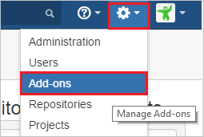
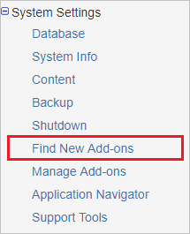
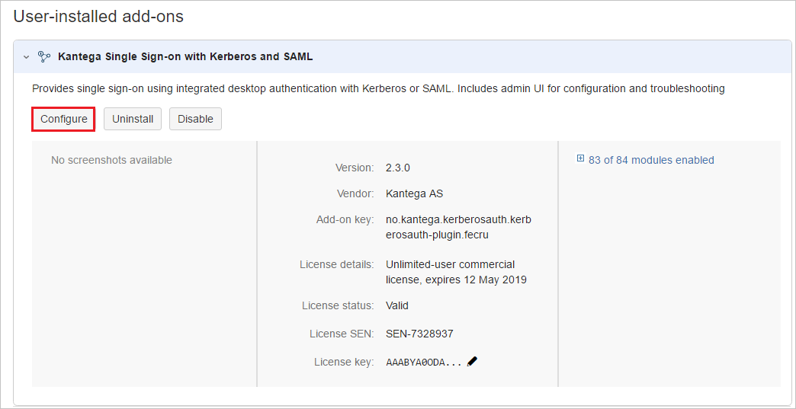
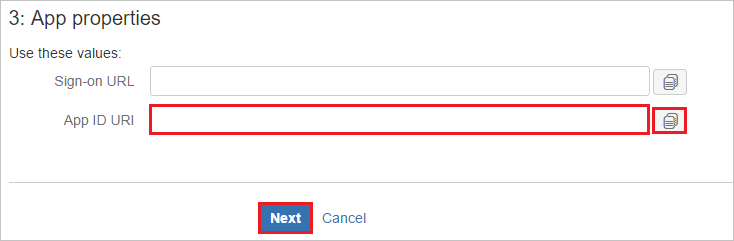
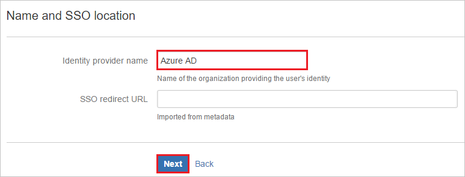
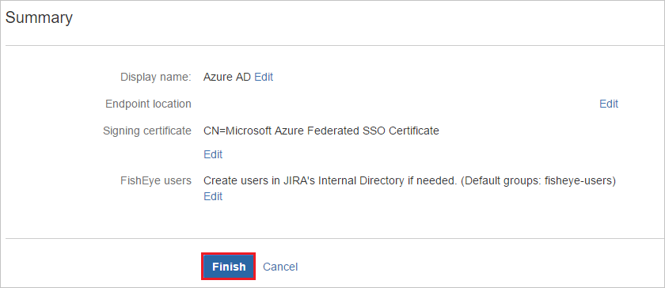
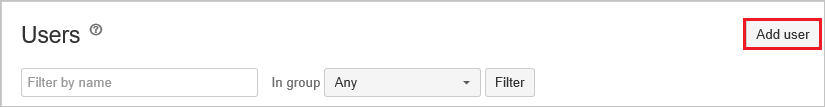
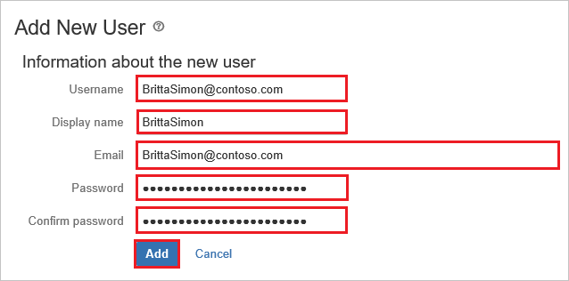

# Tutorial: Azure AD SSO integration with Kantega SSO for FishEye/Crucible

In this tutorial, you'll learn how to integrate Kantega SSO for FishEye/Crucible with Azure Active Directory (Azure AD). When you integrate Kantega SSO for FishEye/Crucible with Azure AD, you can:

* Control in Azure AD who has access to Kantega SSO for FishEye/Crucible.
* Enable your users to be automatically signed-in to Kantega SSO for FishEye/Crucible with their Azure AD accounts.
* Manage your accounts in one central location - the Azure portal.

## Prerequisites

To configure Azure AD integration with Kantega SSO for FishEye/Crucible, you need the following items:

* An Azure AD subscription. If you don't have an Azure AD environment, you can get a [free account](https://azure.microsoft.com/free/).
* Kantega SSO for FishEye/Crucible single sign-on enabled subscription.

## Scenario description

In this tutorial, you configure and test Azure AD single sign-on in a test environment.

* Kantega SSO for FishEye/Crucible supports **SP and IDP** initiated SSO.

## Add Kantega SSO for FishEye/Crucible from the gallery

To configure the integration of Kantega SSO for FishEye/Crucible into Azure AD, you need to add Kantega SSO for FishEye/Crucible from the gallery to your list of managed SaaS apps.

1. Sign in to the Azure portal using either a work or school account, or a personal Microsoft account.
1. On the left navigation pane, select the **Azure Active Directory** service.
1. Navigate to **Enterprise Applications** and then select **All Applications**.
1. To add new application, select **New application**.
1. In the **Add from the gallery** section, type **Kantega SSO for FishEye/Crucible** in the search box.
1. Select **Kantega SSO for FishEye/Crucible** from results panel and then add the app. Wait a few seconds while the app is added to your tenant.

 Alternatively, you can also use the [Enterprise App Configuration Wizard](https://portal.office.com/AdminPortal/home?Q=Docs#/azureadappintegration). In this wizard, you can add an application to your tenant, add users/groups to the app, assign roles, as well as walk through the SSO configuration as well. [Learn more about Microsoft 365 wizards.](/microsoft-365/admin/misc/azure-ad-setup-guides)

## Configure and test Azure AD SSO for Kantega SSO for FishEye/Crucible

Configure and test Azure AD SSO with Kantega SSO for FishEye/Crucible using a test user called **B.Simon**. For SSO to work, you need to establish a link relationship between an Azure AD user and the related user in Kantega SSO for FishEye/Crucible.

To configure and test Azure AD SSO with Kantega SSO for FishEye/Crucible, perform the following steps:

1. **[Configure Azure AD SSO](#configure-azure-ad-sso)** - to enable your users to use this feature.
    1. **[Create an Azure AD test user](#create-an-azure-ad-test-user)** - to test Azure AD single sign-on with B.Simon.
    1. **[Assign the Azure AD test user](#assign-the-azure-ad-test-user)** - to enable B.Simon to use Azure AD single sign-on.
1. **[Configure Kantega SSO for FishEye/Crucible SSO](#configure-kantega-sso-for-fisheyecrucible-sso)** - to configure the single sign-on settings on application side.
    1. **[Create Kantega SSO for FishEye/Crucible test user](#create-kantega-sso-for-fisheyecrucible-test-user)** - to have a counterpart of B.Simon in Kantega SSO for FishEye/Crucible that is linked to the Azure AD representation of user.
1. **[Test SSO](#test-sso)** - to verify whether the configuration works.

## Configure Azure AD SSO

Follow these steps to enable Azure AD SSO in the Azure portal.

1. In the Azure portal, on the **Kantega SSO for FishEye/Crucible** application integration page, find the **Manage** section and select **single sign-on**.
1. On the **Select a single sign-on method** page, select **SAML**.
1. On the **Set up single sign-on with SAML** page, click the pencil icon for **Basic SAML Configuration** to edit the settings.

   

4. On the **Basic SAML Configuration** section, if you wish to configure the application in **IDP** initiated mode, perform the following steps:

    a. In the **Identifier** text box, type a URL using the following pattern:
    `https://<server-base-url>/plugins/servlet/no.kantega.saml/sp/<uniqueid>/login`

    b. In the **Reply URL** text box, type a URL using the following pattern:
    `https://<server-base-url>/plugins/servlet/no.kantega.saml/sp/<uniqueid>/login`

5. Click **Set additional URLs** and perform the following step if you wish to configure the application in **SP** initiated mode:

    In the **Sign-on URL** text box, type a URL using the following pattern:
    `https://<server-base-url>/plugins/servlet/no.kantega.saml/sp/<uniqueid>/login`

	> [!NOTE]
	> These values are not real. Update these values with the actual Identifier, Reply URL and Sign-on URL. These values are received during the configuration of FishEye/Crucible plugin which is explained later in the tutorial.

6. On the **Set up Single Sign-On with SAML** page, in the **SAML Signing Certificate** section, click **Download** to download the **Federation Metadata XML** from the given options as per your requirement and save it on your computer.

	

7. On the **Set up Kantega SSO for FishEye/Crucible** section, copy the appropriate URL(s) as per your requirement.

	

### Create an Azure AD test user 

In this section, you'll create a test user in the Azure portal called B.Simon.

1. From the left pane in the Azure portal, select **Azure Active Directory**, select **Users**, and then select **All users**.
1. Select **New user** at the top of the screen.
1. In the **User** properties, follow these steps:
   1. In the **Name** field, enter `B.Simon`.  
   1. In the **User name** field, enter the username@companydomain.extension. For example, `B.Simon@contoso.com`.
   1. Select the **Show password** check box, and then write down the value that's displayed in the **Password** box.
   1. Click **Create**.

### Assign the Azure AD test user

In this section, you'll enable B.Simon to use Azure single sign-on by granting access to Kantega SSO for FishEye/Crucible.

1. In the Azure portal, select **Enterprise Applications**, and then select **All applications**.
1. In the applications list, select **Kantega SSO for FishEye/Crucible**.
1. In the app's overview page, find the **Manage** section and select **Users and groups**.
1. Select **Add user**, then select **Users and groups** in the **Add Assignment** dialog.
1. In the **Users and groups** dialog, select **B.Simon** from the Users list, then click the **Select** button at the bottom of the screen.
1. If you are expecting a role to be assigned to the users, you can select it from the **Select a role** dropdown. If no role has been set up for this app, you see "Default Access" role selected.
1. In the **Add Assignment** dialog, click the **Assign** button.

## Configure Kantega SSO for FishEye/Crucible SSO

1. In a different web browser window, sign in to your FishEye/Crucible on-premises server as an administrator.

1. Hover on cog and click the **Add-ons**.

	

1. Under System Settings section, click **Find new add-ons**. 

	

1. Search **Kantega SSO for Crucible** and click **Install** button to install the new SAML plugin.

	

1. The plugin installation starts. 

	

1. Once the installation is complete. Click **Close**.

	

1.	Click **Manage**.

	

1. Click **Configure** to configure the new plugin.	

	

1. In the **SAML** section. Select **Azure Active Directory (Azure AD)** from the **Add identity provider** dropdown.

	

1. Select subscription level as **Basic**.

	

1. On the **App properties** section, perform following steps:

	

	a. Copy the **App ID URI** value and use it as **Identifier, Reply URL, and Sign-On URL** on the **Basic SAML Configuration** section in Azure portal.

	b. Click **Next**.

1. On the **Metadata import** section, perform following steps:

	

	a. Select **Metadata file on my computer**, and upload metadata file, which you have downloaded from Azure portal.

	b. Click **Next**.

1. On the **Name and SSO location** section, perform following steps:

	

	a. Add Name of the Identity Provider in **Identity provider name** textbox (e.g Azure AD).

	b. Click **Next**.

1. Verify the Signing certificate and click **Next**.	

	

1. On the **FishEye user accounts** section, perform following steps:

	

	a. Select **Create users in FishEye's internal Directory if needed** and enter the appropriate name of the group for users (can be multiple no. of groups separated by comma).

	b. Click **Next**.

1. Click **Finish**.

	

1. On the **Known domains for Azure AD** section, perform following steps:	

	

	a. Select **Known domains** from the left panel of the page.

	b. Enter domain name in the **Known domains** textbox.

	c. Click **Save**.

### Create Kantega SSO for FishEye/Crucible test user

To enable Azure AD users to sign in to FishEye/Crucible, they must be provisioned into FishEye/Crucible. In Kantega SSO for FishEye/Crucible, provisioning is a manual task.

**To provision a user account, perform the following steps:**

1. Sign in to your Crucible on-premises server as an administrator.

1. Hover on cog and click the **Users**.

    

1. Under **Users** tab section, click **Add user**.

	

1. On the **Add New User** dialog page, perform the following steps:

	

	a. In the **Username** textbox, type the email of user like Brittasimon@contoso.com.

	b. In the **Display Name** textbox, type display name of the user like Britta Simon.

	c. In the **Email address** textbox, type the email address of user like Brittasimon@contoso.com.

	d. In the **Password** textbox, type the password of user.

	e. In the **Confirm Password** textbox, reenter the password of user.

	f. Click **Add**.

## Test SSO

In this section, you test your Azure AD single sign-on configuration with following options. 

#### SP initiated:

* Click on **Test this application** in Azure portal. This will redirect to Kantega SSO for FishEye/Crucible Sign on URL where you can initiate the login flow.  

* Go to Kantega SSO for FishEye/Crucible Sign-on URL directly and initiate the login flow from there.

#### IDP initiated:

* Click on **Test this application** in Azure portal and you should be automatically signed in to the Kantega SSO for FishEye/Crucible for which you set up the SSO. 

You can also use Microsoft My Apps to test the application in any mode. When you click the Kantega SSO for FishEye/Crucible tile in the My Apps, if configured in SP mode you would be redirected to the application sign on page for initiating the login flow and if configured in IDP mode, you should be automatically signed in to the Kantega SSO for FishEye/Crucible for which you set up the SSO. For more information about the My Apps, see [Introduction to the My Apps](../user-help/my-apps-portal-end-user-access.md).

## Next steps

Once you configure Kantega SSO for FishEye/Crucible you can enforce session control, which protects exfiltration and infiltration of your organization’s sensitive data in real time. Session control extends from Conditional Access. [Learn how to enforce session control with Microsoft Defender for Cloud Apps](/cloud-app-security/proxy-deployment-aad).
