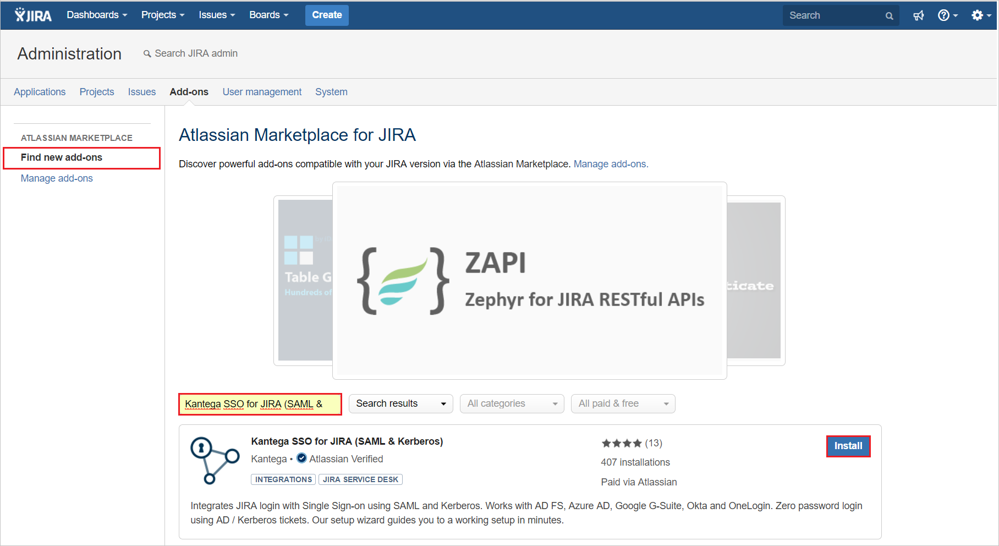
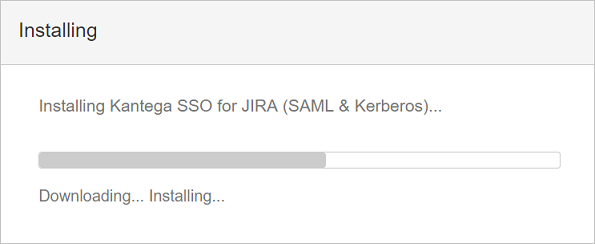
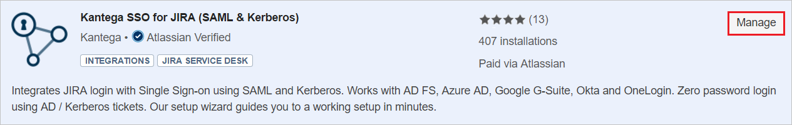
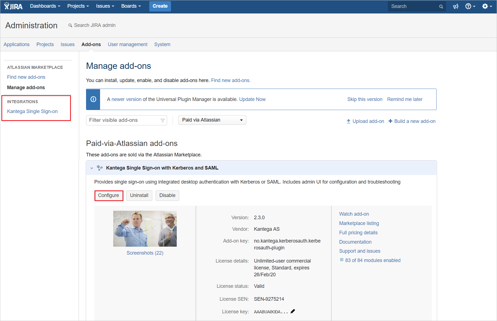
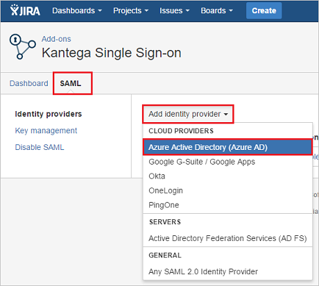
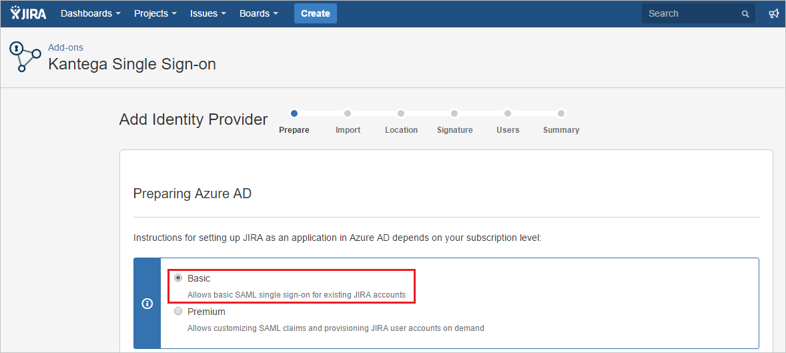
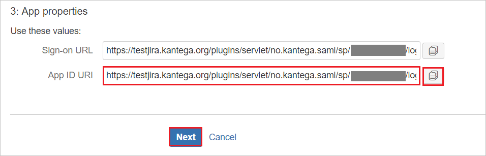
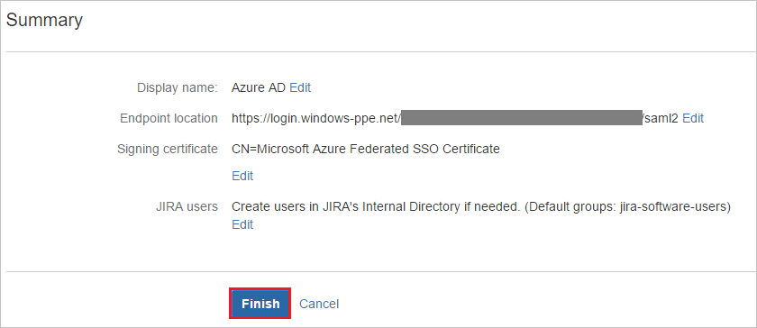
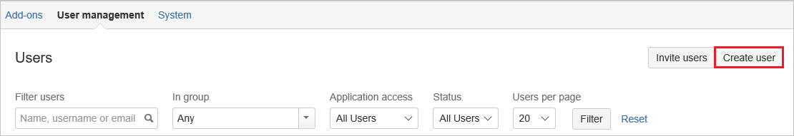

# Tutorial: Azure Active Directory integration with Kantega SSO for JIRA

In this tutorial, you learn how to integrate Kantega SSO for JIRA with Azure Active Directory (Azure AD).
Integrating Kantega SSO for JIRA with Azure AD provides you with the following benefits:

* You can control in Azure AD who has access to Kantega SSO for JIRA.
* You can enable your users to be automatically signed-in to Kantega SSO for JIRA (Single Sign-On) with their Azure AD accounts.
* You can manage your accounts in one central location - the Azure portal.

If you want to know more details about SaaS app integration with Azure AD, see [What is application access and single sign-on with Azure Active Directory](https://docs.microsoft.com/azure/active-directory/active-directory-appssoaccess-whatis).
If you don't have an Azure subscription, [create a free account](https://azure.microsoft.com/free/) before you begin.

## Prerequisites

To configure Azure AD integration with Kantega SSO for JIRA, you need the following items:

* An Azure AD subscription. If you don't have an Azure AD environment, you can get a [free account](https://azure.microsoft.com/free/)
* Kantega SSO for JIRA single sign-on enabled subscription

## Scenario description

In this tutorial, you configure and test Azure AD single sign-on in a test environment.

* Kantega SSO for JIRA supports **SP and IDP** initiated SSO

## Adding Kantega SSO for JIRA from the gallery

To configure the integration of Kantega SSO for JIRA into Azure AD, you need to add Kantega SSO for JIRA from the gallery to your list of managed SaaS apps.

**To add Kantega SSO for JIRA from the gallery, perform the following steps:**

1. In the **[Azure portal](https://portal.azure.com)**, on the left navigation panel, click **Azure Active Directory** icon.

	

2. Navigate to **Enterprise Applications** and then select the **All Applications** option.

	

3. To add new application, click **New application** button on the top of dialog.

	

4. In the search box, type **Kantega SSO for JIRA**, select **Kantega SSO for JIRA** from result panel then click **Add** button to add the application.

	

## Configure and test Azure AD single sign-on

In this section, you configure and test Azure AD single sign-on with Kantega SSO for JIRA based on a test user called **Britta Simon**.
For single sign-on to work, a link relationship between an Azure AD user and the related user in Kantega SSO for JIRA needs to be established.

To configure and test Azure AD single sign-on with Kantega SSO for JIRA, you need to complete the following building blocks:

1. **[Configure Azure AD Single Sign-On](#configure-azure-ad-single-sign-on)** - to enable your users to use this feature.
2. **[Configure Kantega SSO for JIRA Single Sign-On](#configure-kantega-sso-for-jira-single-sign-on)** - to configure the Single Sign-On settings on application side.
3. **[Create an Azure AD test user](#create-an-azure-ad-test-user)** - to test Azure AD single sign-on with Britta Simon.
4. **[Assign the Azure AD test user](#assign-the-azure-ad-test-user)** - to enable Britta Simon to use Azure AD single sign-on.
5. **[Create Kantega SSO for JIRA test user](#create-kantega-sso-for-jira-test-user)** - to have a counterpart of Britta Simon in Kantega SSO for JIRA that is linked to the Azure AD representation of user.
6. **[Test single sign-on](#test-single-sign-on)** - to verify whether the configuration works.

### Configure Azure AD single sign-on

In this section, you enable Azure AD single sign-on in the Azure portal.

To configure Azure AD single sign-on with Kantega SSO for JIRA, perform the following steps:

1. In the [Azure portal](https://portal.azure.com/), on the **Kantega SSO for JIRA** application integration page, select **Single sign-on**.

    

2. On the **Select a Single sign-on method** dialog, select **SAML/WS-Fed** mode to enable single sign-on.

    

3. On the **Set up Single Sign-On with SAML** page, click **Edit** icon to open **Basic SAML Configuration** dialog.

	

4. On the **Basic SAML Configuration** section, if you wish to configure the application in **IDP** initiated mode, perform the following steps:

    

    a. In the **Identifier** text box, type a URL using the following pattern:
    `https://<server-base-url>/plugins/servlet/no.kantega.saml/sp/<uniqueid>/login`

    b. In the **Reply URL** text box, type a URL using the following pattern:
    `https://<server-base-url>/plugins/servlet/no.kantega.saml/sp/<uniqueid>/login`

5. Click **Set additional URLs** and perform the following step if you wish to configure the application in **SP** initiated mode:

    

    In the **Sign-on URL** text box, type a URL using the following pattern:
    `https://<server-base-url>/plugins/servlet/no.kantega.saml/sp/<uniqueid>/login`

	> [!NOTE]
	> These values are not real. Update these values with the actual Identifier, Reply URL, and Sign-On URL. These values are received during the configuration of Jira plugin, which is explained later in the tutorial.

6. On the **Set up Single Sign-On with SAML** page, in the **SAML Signing Certificate** section, click **Download** to download the **Federation Metadata XML** from the given options as per your requirement and save it on your computer.

	

7. On the **Set up Kantega SSO for JIRA** section, copy the appropriate URL(s) as per your requirement.

	

	a. Login URL

	b. Azure AD Identifier

	c. Logout URL

### Configure Kantega SSO for JIRA Single Sign-On

1. In a different web browser window, sign in to your JIRA on-premises server as an administrator.

1. Hover on cog and click the **Add-ons**.

	

1. Under Add-ons tab section, click **Find new add-ons**. Search **Kantega SSO for JIRA (SAML & Kerberos)** and click **Install** button to install the new SAML plugin.

	

1. The plugin installation starts.

	

1. Once the installation is complete. Click **Close**.

	

1.	Click **Manage**.

	
    
1. New plugin is listed under **INTEGRATIONS**. Click **Configure** to configure the new plugin.

	

1. In the **SAML** section. Select **Azure Active Directory (Azure AD)** from the **Add identity provider** dropdown.

	

1. Select subscription level as **Basic**.

	  	 

1. On the **App properties** section, perform following steps: 

	

	a. Copy the **App ID URI** value and use it as **Identifier, Reply URL, and Sign-On URL** on the **Basic SAML Configuration** section in Azure portal.

	b. Click **Next**.

1. On the **Metadata import** section, perform following steps: 

	

	a. Select **Metadata file on my computer**, and upload metadata file, which you have downloaded from Azure portal.

	b. Click **Next**.

1. On the **Name and SSO location** section, perform following steps:

	

	a. Add Name of the Identity Provider in **Identity provider name** textbox (e.g Azure AD).

	b. Click **Next**.

1. Verify the Signing certificate and click **Next**.

	

1. On the **JIRA user accounts** section, perform following steps:

	

	a. Select **Create users in JIRA's internal Directory if needed** and enter the appropriate name of the group for users (can be multiple no. of groups separated by comma).

	b. Click **Next**.

1. Click **Finish**.

	

1. On the **Known domains for Azure AD** section, perform following steps:

	

	a. Select **Known domains** from the left panel of the page.

	b. Enter domain name in the **Known domains** textbox.

	c. Click **Save**.

### Create an Azure AD test user

The objective of this section is to create a test user in the Azure portal called Britta Simon.

1. In the Azure portal, in the left pane, select **Azure Active Directory**, select **Users**, and then select **All users**.

    

2. Select **New user** at the top of the screen.

    

3. In the User properties, perform the following steps.

    

    a. In the **Name** field enter **BrittaSimon**.
  
    b. In the **User name** field type `brittasimon@yourcompanydomain.extension`. For example, BrittaSimon@contoso.com

    c. Select **Show password** check box, and then write down the value that's displayed in the Password box.

    d. Click **Create**.

### Assign the Azure AD test user

In this section, you enable Britta Simon to use Azure single sign-on by granting access to Kantega SSO for JIRA.

1. In the Azure portal, select **Enterprise Applications**, select **All applications**, then select **Kantega SSO for JIRA**.

	

2. In the applications list, select **Kantega SSO for JIRA**.

	

3. In the menu on the left, select **Users and groups**.

    

4. Click the **Add user** button, then select **Users and groups** in the **Add Assignment** dialog.

    

5. In the **Users and groups** dialog select **Britta Simon** in the Users list, then click the **Select** button at the bottom of the screen.

6. If you are expecting any role value in the SAML assertion then in the **Select Role** dialog select the appropriate role for the user from the list, then click the **Select** button at the bottom of the screen.

7. In the **Add Assignment** dialog click the **Assign** button.

### Create Kantega SSO for JIRA test user

To enable Azure AD users to sign in to JIRA, they must be provisioned into JIRA. In Kantega SSO for JIRA, provisioning is a manual task.

**To provision a user account, perform the following steps:**

1. Sign in to your JIRA on-premises server as an administrator.

1. Hover on cog and click the **User management**.

     

1. Under **User management** tab section, click **Create user**.

	 

1. On the **“Create new user”** dialog page, perform the following steps:

	 

	a. In the **Email address** textbox, type the email address of user like Brittasimon@contoso.com.

	b. In the **Full Name** textbox, type full name of the user like Britta Simon.

	c. In the **Username** textbox, type the email of user like Brittasimon@contoso.com.

	d. In the **Password** textbox, type the password of user.

	e. Click **Create user**.

### Test single sign-on 

In this section, you test your Azure AD single sign-on configuration using the Access Panel.

When you click the Kantega SSO for JIRA tile in the Access Panel, you should be automatically signed in to the Kantega SSO for JIRA for which you set up SSO. For more information about the Access Panel, see [Introduction to the Access Panel](https://docs.microsoft.com/azure/active-directory/active-directory-saas-access-panel-introduction).

## Additional Resources

- [List of Tutorials on How to Integrate SaaS Apps with Azure Active Directory](https://docs.microsoft.com/azure/active-directory/active-directory-saas-tutorial-list)

- [What is application access and single sign-on with Azure Active Directory?](https://docs.microsoft.com/azure/active-directory/active-directory-appssoaccess-whatis)

- [What is Conditional Access in Azure Active Directory?](https://docs.microsoft.com/azure/active-directory/conditional-access/overview)
