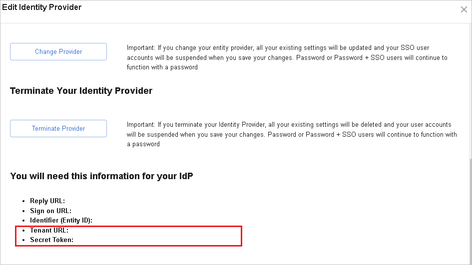

# Tutorial: Configure Keepabl for automatic user provisioning

This tutorial describes the steps you need to perform in both Keepabl and Azure Active Directory (Azure AD) to configure automatic user provisioning. When configured, Azure AD automatically provisions and de-provisions users to [Keepabl](https://keepabl.com/) using the Azure AD Provisioning service. For important details on what this service does, how it works, and frequently asked questions, see [Automate user provisioning and deprovisioning to SaaS applications with Azure Active Directory](../app-provisioning/user-provisioning.md). 

## Capabilities supported
> [!div class="checklist"]
> * Create users in Keepabl.
> * Remove users in Keepabl when they do not require access anymore.
> * Keep user attributes synchronized between Azure AD and Keepabl.
> * [Single sign-on](keepabl-tutorial.md) to Keepabl (recommended).

## Prerequisites

The scenario outlined in this tutorial assumes that you already have the following prerequisites:

* [An Azure AD tenant](../develop/quickstart-create-new-tenant.md). 
* A user account in Azure AD with [permission](../roles/permissions-reference.md) to configure provisioning (for example, Application Administrator, Cloud Application administrator, Application Owner, or Global Administrator). 
* A user account in Keepabl with Admin permissions.

## Step 1. Plan your provisioning deployment
1. Learn about [how the provisioning service works](../app-provisioning/user-provisioning.md).
1. Determine who will be in [scope for provisioning](../app-provisioning/define-conditional-rules-for-provisioning-user-accounts.md).
1. Determine what data to [map between Azure AD and Keepabl](../app-provisioning/customize-application-attributes.md). 

## Step 2. Configure Keepabl to support provisioning with Azure AD

1. Sign in to [Keepabl Admin Portal](https://app.keepabl.com) and then navigate to **Account Settings > Your Organization**, where you’ll see the **Single Sign-On (SSO)** section.
1. Click on the **Edit Identity Provider** button.You will be taken to the SSO Setup page, where once you select Microsoft Azure as your provider and then scroll down, you will see your **Tenant URL** and **Secret Token**. These value will be entered in the Provisioning tab of your Keepabl application in the Azure portal.

	

>[!NOTE]
>To Setup Identity Provider or SSO visit [here](https://keepabl.com/admin-guide-to-sso-keepabl).

## Step 3. Add Keepabl from the Azure AD application gallery

Add Keepabl from the Azure AD application gallery to start managing provisioning to Keepabl. If you have previously setup Keepabl for SSO, you can use the same application. However it is recommended that you create a separate app when testing out the integration initially. Learn more about adding an application from the gallery [here](../manage-apps/add-application-portal.md). 

## Step 4. Define who will be in scope for provisioning 

The Azure AD provisioning service allows you to scope who will be provisioned based on assignment to the application and or based on attributes of the user. If you choose to scope who will be provisioned to your app based on assignment, you can use the following [steps](../manage-apps/assign-user-or-group-access-portal.md) to assign users to the application. If you choose to scope who will be provisioned based solely on attributes of the user, you can use a scoping filter as described [here](../app-provisioning/define-conditional-rules-for-provisioning-user-accounts.md). 

* Start small. Test with a small set of users before rolling out to everyone. When scope for provisioning is set to assigned users, you can control this by assigning one or two users to the app. When scope is set to all users, you can specify an [attribute based scoping filter](../app-provisioning/define-conditional-rules-for-provisioning-user-accounts.md).

* If you need additional roles, you can [update the application manifest](../develop/howto-add-app-roles-in-azure-ad-apps.md) to add new roles.

## Step 5. Configure automatic user provisioning to Keepabl 

This section guides you through the steps to configure the Azure AD provisioning service to create, update, and disable users in Keepabl based on user assignments in Azure AD.

### To configure automatic user provisioning for Keepabl in Azure AD:

1. Sign in to the [Azure portal](https://portal.azure.com). Select **Enterprise Applications**, then select **All applications**.

	

1. In the applications list, select **Keepabl**.

	

1. Select the **Provisioning** tab.

	

1. Set the **Provisioning Mode** to **Automatic**.

	

1. Under the **Admin Credentials** section, input your Keepabl Tenant URL and corresponding Secret Token. Click **Test Connection** to ensure Azure AD can connect to Keepabl.

 	

1. In the **Notification Email** field, enter the email address of a person who should receive the provisioning error notifications and select the **Send an email notification when a failure occurs** check box.

	

1. Select **Save**.

1. Under the **Mappings** section, select **Synchronize Azure Active Directory Users to Keepabl**.

1. Review the user attributes that are synchronized from Azure AD to Keepabl in the **Attribute-Mapping** section. The attributes selected as **Matching** properties are used to match the user accounts in Keepabl for update operations. If you choose to change the [matching target attribute](../app-provisioning/customize-application-attributes.md), you will need to ensure that the Keepabl API supports filtering users based on that attribute. Select the **Save** button to commit any changes.

   |Attribute|Type|Supported for filtering|Required by Keepabl|
   |---|---|---|---|
   |userName|String|&check;|&check;
   |emails[type eq "work"].value|String|&check;|&check;
   |active|Boolean|||
   |name.givenName|String|||
   |name.familyName|String|||
	
1. To configure scoping filters, refer to the following instructions provided in the [Scoping filter tutorial](../app-provisioning/define-conditional-rules-for-provisioning-user-accounts.md).

1. To enable the Azure AD provisioning service for Keepabl, change the **Provisioning Status** to **On** in the **Settings** section.

	

1. Define the users that you would like to provision to Keepabl by choosing the desired values in **Scope** in the **Settings** section.

	

1. When you are ready to provision, click **Save**.

	

This operation starts the initial synchronization cycle of all users defined in **Scope** in the **Settings** section. The initial cycle takes longer to perform than subsequent cycles, which occur approximately every 40 minutes as long as the Azure AD provisioning service is running. 

## Step 6. Monitor your deployment
Once you've configured provisioning, use the following resources to monitor your deployment:

* Use the [provisioning logs](../reports-monitoring/concept-provisioning-logs.md) to determine which users have been provisioned successfully or unsuccessfully
* Check the [progress bar](../app-provisioning/application-provisioning-when-will-provisioning-finish-specific-user.md) to see the status of the provisioning cycle and how close it is to completion
* If the provisioning configuration seems to be in an unhealthy state, the application will go into quarantine. Learn more about quarantine states [here](../app-provisioning/application-provisioning-quarantine-status.md). 

## More resources

* [Managing user account provisioning for Enterprise Apps](../app-provisioning/configure-automatic-user-provisioning-portal.md)
* [What is application access and single sign-on with Azure Active Directory?](../manage-apps/what-is-single-sign-on.md)

## Next steps

* [Learn how to review logs and get reports on provisioning activity](../app-provisioning/check-status-user-account-provisioning.md)