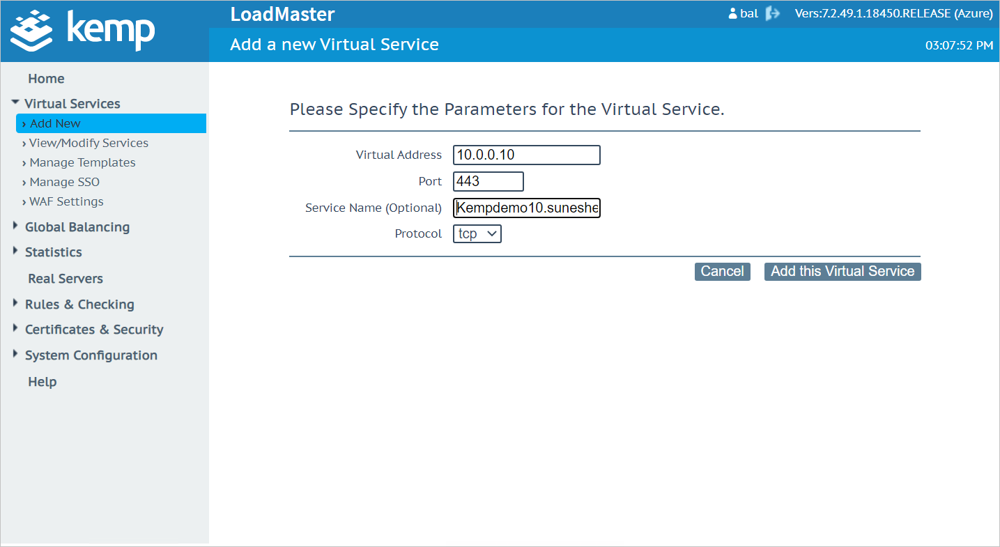
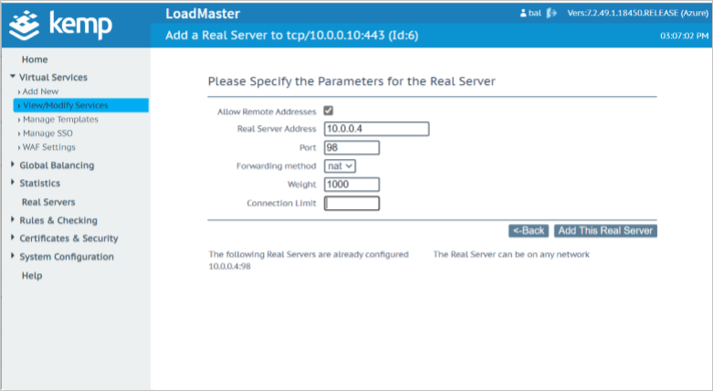
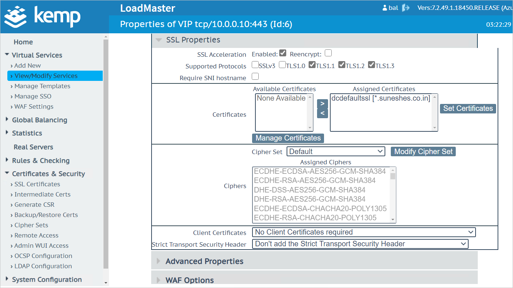
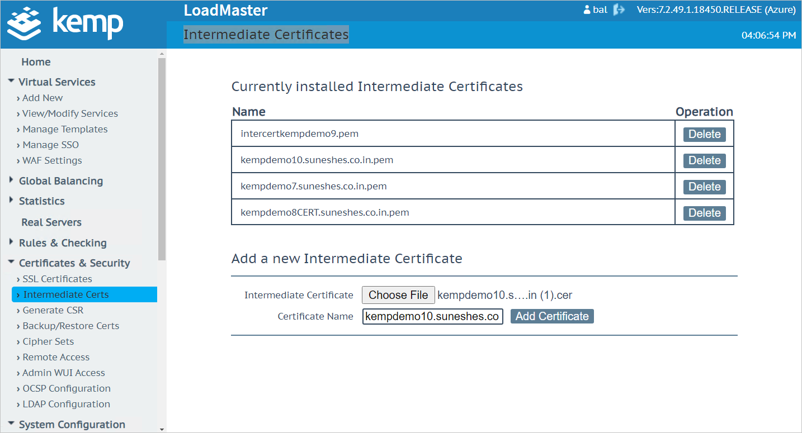
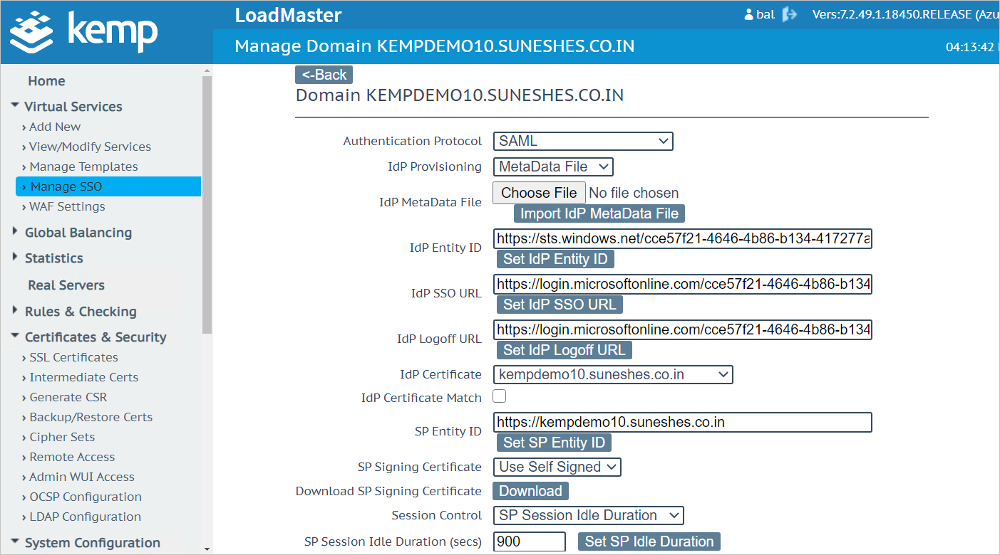
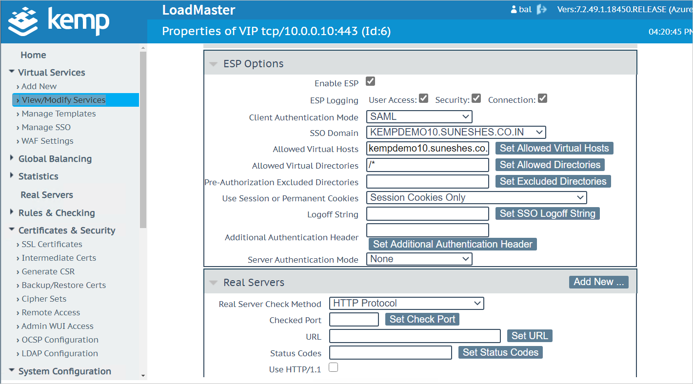
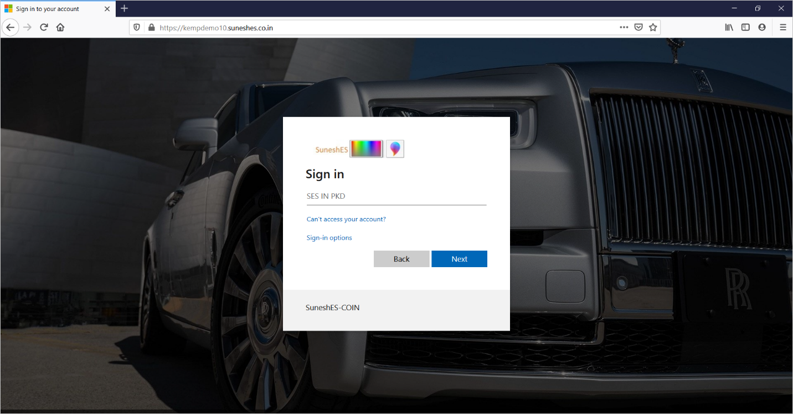
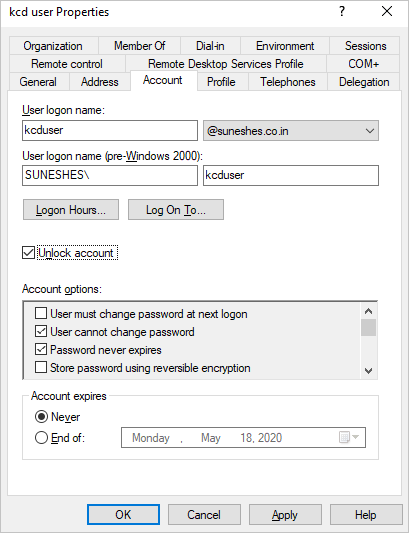
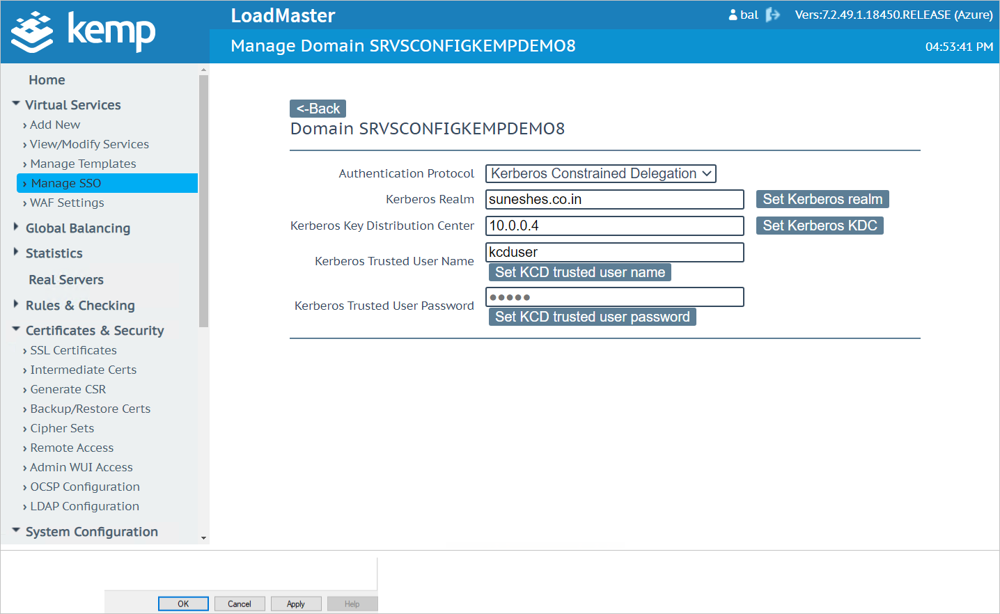
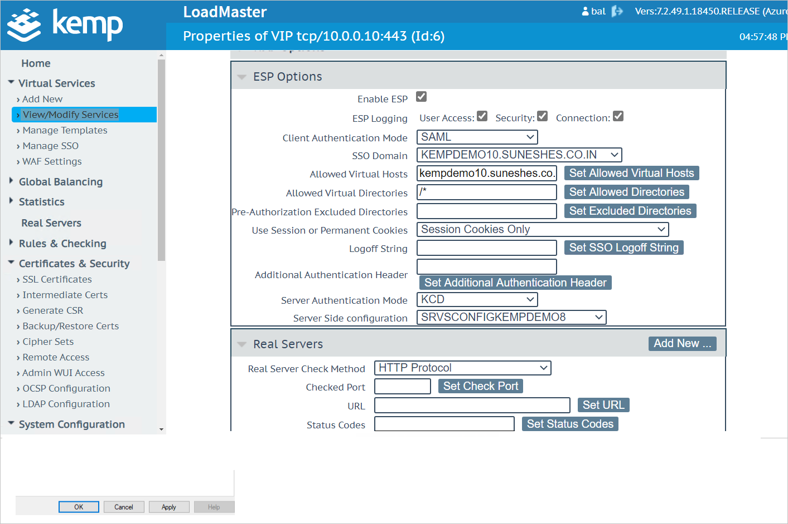

# Tutorial: Azure Active Directory SSO integration with Kemp LoadMaster Azure AD integration

In this tutorial, you'll learn how to integrate Kemp LoadMaster Azure AD integration with Azure Active Directory (Azure AD). When you integrate Kemp LoadMaster Azure AD integration with Azure AD, you can:

* Control in Azure AD who has access to Kemp LoadMaster Azure AD integration.
* Enable your users to be automatically signed-in to Kemp LoadMaster Azure AD integration with their Azure AD accounts.
* Manage your accounts in one central location - the Azure portal.

To learn more about SaaS app integration with Azure AD, see [What is application access and single sign-on with Azure Active Directory](../manage-apps/what-is-single-sign-on.md).

## Prerequisites

To get started, you need the following items:

* An Azure AD subscription. If you don't have a subscription, you can get a [free account](https://azure.microsoft.com/free/).
* Kemp LoadMaster Azure AD integration single sign-on (SSO) enabled subscription.

## Scenario description

In this tutorial, you configure and test Azure AD SSO in a test environment.

* Kemp LoadMaster Azure AD integration supports **IDP** initiated SSO
* Once you configure Kemp LoadMaster Azure AD integration you can enforce session control, which protects exfiltration and infiltration of your organization’s sensitive data in real time. Session control extends from Conditional Access. [Learn how to enforce session control with Microsoft Cloud App Security](/cloud-app-security/proxy-deployment-any-app).

## Adding Kemp LoadMaster Azure AD integration from the gallery

To configure the integration of Kemp LoadMaster Azure AD integration into Azure AD, you need to add Kemp LoadMaster Azure AD integration from the gallery to your list of managed SaaS apps.

1. Sign in to the [Azure portal](https://portal.azure.com) using either a work or school account, or a personal Microsoft account.
1. On the left navigation pane, select the **Azure Active Directory** service.
1. Navigate to **Enterprise Applications** and then select **All Applications**.
1. To add new application, select **New application**.
1. In the **Add from the gallery** section, type **Kemp LoadMaster Azure AD integration** in the search box.
1. Select **Kemp LoadMaster Azure AD integration** from results panel and then add the app. Wait a few seconds while the app is added to your tenant.

## Configure and test Azure AD SSO for Kemp LoadMaster Azure AD integration

Configure and test Azure AD SSO with Kemp LoadMaster Azure AD integration using a test user called **B.Simon**. For SSO to work, you need to establish a link relationship between an Azure AD user and the related user in Kemp LoadMaster Azure AD integration.

To configure and test Azure AD SSO with Kemp LoadMaster Azure AD integration, complete the following building blocks:

1. **[Configure Azure AD SSO](#configure-azure-ad-sso)** - to enable your users to use this feature.
    1. **[Create an Azure AD test user](#create-an-azure-ad-test-user)** - to test Azure AD single sign-on with B.Simon.
    1. **[Assign the Azure AD test user](#assign-the-azure-ad-test-user)** - to enable B.Simon to use Azure AD single sign-on.
1. **[Configure Kemp LoadMaster Azure AD integration SSO](#configure-kemp-loadmaster-azure-ad-integration-sso)** - to configure the single sign-on settings on application side.

1. **[Publishing Web Server](#publishing-web-server)**
    1. **[Create a Virtual Service](#create-a-virtual-service)**
    1. **[Certificates and Security](#certificates-and-security)**
    1. **[Kemp LoadMaster Azure AD integration SAML Profile](#kemp-loadmaster-azure-ad-integration-saml-profile)**
    1. **[Verify the changes](#verify-the-changes)**
1. **[Configuring Kerberos Based Authentication](#configuring-kerberos-based-authentication)**
    1. **[Create a Kerberos Delegation Account for Kemp LoadMaster Azure AD integration](#create-a-kerberos-delegation-account-for-kemp-loadmaster-azure-ad-integration)**
    1. **[Kemp LoadMaster Azure AD integration KCD (Kerberos Delegation Accounts)](#kemp-loadmaster-azure-ad-integration-kcd-kerberos-delegation-accounts)**
    1. **[Kemp LoadMaster Azure AD integration ESP](#kemp-loadmaster-azure-ad-integration-esp)**
    1. **[Create Kemp LoadMaster Azure AD integration test user](#create-kemp-loadmaster-azure-ad-integration-test-user)** - to have a counterpart of B.Simon in Kemp LoadMaster Azure AD integration that is linked to the Azure AD representation of user.
1. **[Test SSO](#test-sso)** - to verify whether the configuration works.

## Configure Azure AD SSO

Follow these steps to enable Azure AD SSO in the Azure portal.

1. In the [Azure portal](https://portal.azure.com/), on the **Kemp LoadMaster Azure AD integration** application integration page, find the **Manage** section and select **single sign-on**.
1. On the **Select a single sign-on method** page, select **SAML**.
1. On the **Set up single sign-on with SAML** page, click the edit/pen icon for **Basic SAML Configuration** to edit the settings.

   

1. On the **Basic SAML Configuration** section, enter the values for the following fields:

    a. In the **Identifier (Entity ID)** text box, type a URL:
    `https://<KEMP-CUSTOMER-DOMAIN>.com/`

	b. In the **Reply URL** text box, type a URL:
    `https://<KEMP-CUSTOMER-DOMAIN>.com/`

    > [!NOTE]
    > These values are not real. Update these values with the actual Identifier and Reply URL. Contact [Kemp LoadMaster Azure AD integration Client support team](mailto:support@kemp.ax) to get these values. You can also refer to the patterns shown in the Basic SAML Configuration section in the Azure portal.

1. On the **Set up single sign-on with SAML** page, in the **SAML Signing Certificate** section,  find **Certificate (Base64)** and **Federation Metadata XML**, select **Download** to download the certificate and federation metadata XML files and save it on your computer.

	

1. On the **Set up Kemp LoadMaster Azure AD integration** section, copy the appropriate URL(s) based on your requirement.

	

### Create an Azure AD test user

In this section, you'll create a test user in the Azure portal called B.Simon.

1. From the left pane in the Azure portal, select **Azure Active Directory**, select **Users**, and then select **All users**.
1. Select **New user** at the top of the screen.
1. In the **User** properties, follow these steps:
   1. In the **Name** field, enter `B.Simon`.  
   1. In the **User name** field, enter the username@companydomain.extension. For example, `B.Simon@contoso.com`.
   1. Select the **Show password** check box, and then write down the value that's displayed in the **Password** box.
   1. Click **Create**.

### Assign the Azure AD test user

In this section, you'll enable B.Simon to use Azure single sign-on by granting access to Kemp LoadMaster Azure AD integration.

1. In the Azure portal, select **Enterprise Applications**, and then select **All applications**.
1. In the applications list, select **Kemp LoadMaster Azure AD integration**.
1. In the app's overview page, find the **Manage** section and select **Users and groups**.

   

1. Select **Add user**, then select **Users and groups** in the **Add Assignment** dialog.

	

1. In the **Users and groups** dialog, select **B.Simon** from the Users list, then click the **Select** button at the bottom of the screen.
1. If you're expecting any role value in the SAML assertion, in the **Select Role** dialog, select the appropriate role for the user from the list and then click the **Select** button at the bottom of the screen.
1. In the **Add Assignment** dialog, click the **Assign** button.

## Configure Kemp LoadMaster Azure AD integration SSO

## Publishing Web Server 

### Create a Virtual Service 

1. Go to Kemp LoadMaster Azure AD integration LoadMaster Web UI > Virtual Services > Add New.

1. Click Add New.

1. Specify the Parameters for the Virtual Service.

    

    a. Virtual Address
    
    b. Port
    
    c. Service Name (Optional)
    
    d. Protocol 

1. Navigate to Real Servers section.

1. Click on Add New.

1. Specify the Parameters for the Real Server.
    
    

    a. Select Allow Remote Addresses
    
    b. Type in Real Server Address
    
    c. Port
    
    d. Forwarding method
    
    e. Weight
    
    f. Connection Limit
    
    g. Click on Add This Real Server

## Certificates and Security
 
### Import certificate on Kemp LoadMaster Azure AD integration 
 
1. Go to Kemp LoadMaster Azure AD integration Web Portal > Certificates & Security > SSL Certificates.

1. Under Manage Certificates > Certificate Configuration.

1. Click Import Certificate.

1. Specify the name of the file that contains the certificate. The file can also hold the private key. If the file does not contain the private key, then the file containing the private key must also be specified. The certificate can be in either .PEM or .PFX (IIS) format.

1. Click on Choose file on Certificate File.

1. Click on Key File (optional).

1. Click on Save.

### SSL Acceleration
 
1. Go to Kemp LoadMaster Web UI > Virtual Services > View/Modify Services.

1. Click in Modify under Operation.

1. Click on SSL Properties, (which operates at Layer 7).
    
    
    
    a. Click on Enabled in SSL Acceleration.
    
    b. Under Available Certificates, select the imported certificate and click on `>` symbol.
    
    c. Once the desired SSL certificate appears in Assigned Certificates, click on **Set Certificates**.

    > [!NOTE]
    > Make sure you click on the **Set Certificates**.

## Kemp LoadMaster Azure AD integration SAML Profile
 
### Import IdP certificate

Go to Kemp LoadMaster Azure AD integration Web Console 

1. Click Intermediate Certificates under Certificates and Authority.

    

    a. Click choose file in Add a new Intermediate Certificate.
    
    b. Navigate to certificate file previously downloaded from Azure AD Enterprise Application.
    
    c. Click on Open.
    
    d. Provide a Name in Certificate Name.
    
    e. Click on Add Certificate.

### Create Authentication Policy 
 
Go to Manage SSO under Virtual Services.

   
   
   a. Click Add under Add new Client Side Configuration after giving it a name.

   b. Select SAML under Authentication Protocol.

   c. Select MetaData File under IdP Provisioning. 

   d. Click on Choose File.

   e. Navigate to previously downloaded XML from Azure portal.

   f. Click on Open and click on Import IdP MetaData file.

   g. Select the intermediate certificate from IdP Certificate.

   h. Set the SP Entity ID which should match the identity created in Azure portal 

   i. Click on Set SP Entity ID.

### Set Authentication  
 
On Kemp LoadMaster Azure AD integration Web Console

1. Click on Virtual Services.

1. Click on View/Modify Services.

1. Click on Modify and navigate to ESP Options.
    
    

    a. Click on Enable ESP.
    
    b. Select SAML in Client Authentication Mode.
    
    c. Select previously created Client Side Authentication in SSO Domain.
    
    d. Type in host name in Allowed Virtual Hosts and click on Set Allowed Virtual Hosts.
    
    e. Type /* in Allowed Virtual Directories (based on access requirements) and click on Set Allowed Directories.

### Verify the changes 
 
Browse to the application URL 

You should see your tenanted login page instead of unauthenticated access previously. 

## Configuring Kerberos Based Authentication 
 
### Create a Kerberos Delegation Account for Kemp LoadMaster Azure AD integration 

1. Create a user Account (in this example AppDelegation).
    
    

    a. Select the Attribute Editor tab.

    b. Navigate to servicePrincipalName. 

    c. Select servicePrincipalName and click Edit.

    d. Type http/kcduser in the Value to add field and click Add. 

    e. Click Apply and OK. The window must close before you open it again (to see the new Delegation tab). 

1. Open the user properties window again and the Delegation tab becomes available. 

1. Select the Delegation tab.

    

    a. Select Trust this user for delegation to specified services only.

    b. Select Use any authentication protocol.

    c. Add the Real Servers and add http as the service. 
    
    d. Select the Expanded check box. 

    e. You can see all servers with both the host name and the FQDN.
    
    f. Click on OK.

> [!NOTE]
> Set the SPN on the Application / Website as applicable. To access application when the application pool identity has been set. To access the IIS application by using the FQDN name, go to Real Server command prompt and type SetSpn with required parameters. For e.g. Setspn –S HTTP/sescoindc.sunehes.co.in suneshes\kdcuser 

### Kemp LoadMaster Azure AD integration KCD (Kerberos Delegation Accounts) 

Go to  Kemp LoadMaster Azure AD integration Web Console > Virtual Services > Manage SSO.

a. Navigate to Server Side Single Sign On Configurations.

b. Type Name in Add new Server-Side Configuration and click on Add.

c. Select Kerberos Constrained Delegation in Authentication Protocol.

d. Type Domain Name in Kerberos Realm.

e. Click on Set Kerberos realm.

f. Type Domain Controller IP Address in Kerberos Key Distribution Center.

g. Click on Set Kerberos KDC.

h. Type KCD user name in Kerberos Trusted User Name.

i. Click on Set KDC trusted user name.

j. Type password in Kerberos Trusted User Password.

k. Click on Set KCD trusted user password.

### Kemp LoadMaster Azure AD integration ESP 

Go to Virtual Services > View/Modify Services.

a. Click on Modify on the Nick Name of the Virtual Service.
    
b. Click on ESP Options.
    
c. Under Server Authentication Mode, select KCD.
        
d. Under Server-Side configuration, select the previously created server-side profile.

### Create Kemp LoadMaster Azure AD integration test user

In this section, you create a user called B.Simon in Kemp LoadMaster Azure AD integration. Work with [Kemp LoadMaster Azure AD integration Client support team](mailto:support@kemp.ax) to add the users in the Kemp LoadMaster Azure AD integration platform. Users must be created and activated before you use single sign-on.

## Test SSO 

In this section, you test your Azure AD single sign-on configuration using the Access Panel.

When you click the Kemp LoadMaster Azure AD integration tile in the Access Panel, you should be automatically signed in to the Kemp LoadMaster Azure AD integration for which you set up SSO. For more information about the Access Panel, see [Introduction to the Access Panel](../user-help/my-apps-portal-end-user-access.md).

## Additional resources

- [ List of Tutorials on How to Integrate SaaS Apps with Azure Active Directory ](./tutorial-list.md)

- [What is application access and single sign-on with Azure Active Directory? ](../manage-apps/what-is-single-sign-on.md)

- [What is conditional access in Azure Active Directory?](../conditional-access/overview.md)

- [Try Kemp LoadMaster Azure AD integration with Azure AD](https://aad.portal.azure.com/)

- [What is session control in Microsoft Cloud App Security?](/cloud-app-security/proxy-intro-aad)

- [How to protect Kemp LoadMaster Azure AD integration with advanced visibility and controls](/cloud-app-security/proxy-intro-aad)