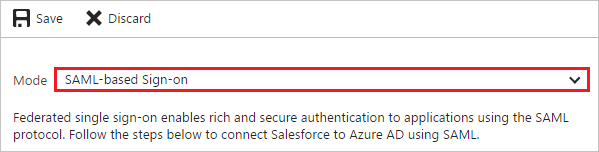
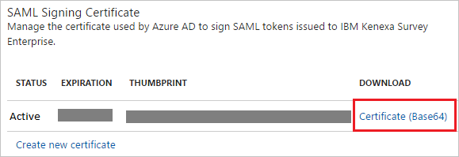

# Tutorial: Azure Active Directory integration with IBM Kenexa Survey Enterprise

In this tutorial, you learn how to integrate IBM Kenexa Survey Enterprise with Azure Active Directory (Azure AD).

Integrating IBM Kenexa Survey Enterprise with Azure AD provides you with the following benefits:

- You can control in Azure AD who has access to IBM Kenexa Survey Enterprise.
- You can enable your users to automatically sign in to IBM Kenexa Survey Enterprise by using single sign-on (SSO) with their Azure AD accounts.
- You can manage your accounts in one central location: the Azure portal.

If you want to know more about software as a service (SaaS) app integration with Azure AD, see [What is application access and single sign-on with Azure Active Directory?](../manage-apps/what-is-single-sign-on.md).

## Prerequisites

To configure Azure AD integration with IBM Kenexa Survey Enterprise, you need the following items:

- An Azure AD subscription
- An IBM Kenexa Survey Enterprise SSO-enabled subscription

> [!NOTE]
> When you test the steps in this tutorial, we recommend that you do not use a production environment.

To test the steps in this tutorial, follow these recommendations:

- Do not use your production environment, unless it is necessary.
- If you don't have an Azure AD trial environment, you can [get a one-month trial](https://azure.microsoft.com/pricing/free-trial/).

## Scenario description
In this tutorial, you test Azure AD SSO in a test environment. The scenario outlined in the tutorial consists of two main building blocks:

* Adding IBM Kenexa Survey Enterprise from the gallery
* Configuring and testing Azure AD SSO

## Add IBM Kenexa Survey Enterprise from the gallery
To configure the integration of IBM Kenexa Survey Enterprise into Azure AD, add IBM Kenexa Survey Enterprise from the gallery to your list of managed SaaS apps.

To add IBM Kenexa Survey Enterprise from the gallery, do the following:

1. In the [Azure portal](https://portal.azure.com), in the left pane, click the **Azure Active Directory** button. 

	![The Azure Active Directory button][1]

1. Select **Enterprise applications**, and then select **All applications**.

	![The Enterprise applications blade][2]
	
1. To add an application, click the **New application** button.

	![The New application button][3]

1. In the search box, type **IBM Kenexa Survey Enterprise**.

	

1. In the results list, select **IBM Kenexa Survey Enterprise**, and then click the **Add** button to add the application.

	

##  Configure and test Azure AD single sign-on
In this section, you configure and test Azure AD SSO with IBM Kenexa Survey Enterprise based on a test user called "Britta Simon."

For SSO to work, Azure AD needs to identify the IBM Kenexa Survey Enterprise user counterpart in Azure AD. In other words, Azure AD must establish a link relationship between an Azure AD user and a related user in IBM Kenexa Survey Enterprise.

To establish the link relationship, assign the value of the **user name** in IBM Kenexa Survey Enterprise as the value of the **Username** in Azure AD.

To configure and test Azure AD SSO with IBM Kenexa Survey Enterprise, complete the building blocks in the next two sections.

### Configure Azure AD SSO

In this section, you enable Azure AD SSO in the Azure portal and configure SSO in your IBM Kenexa Survey Enterprise application by doing the following:

1. In the Azure portal, on the **IBM Kenexa Survey Enterprise** application integration page, click **Single sign-on**.

	![IBM Kenexa Survey Enterprise Configure single sign-on link][4]

1. In the **Single sign-on** dialog box, in the **Mode** box, select **SAML-based Sign-on** to enable SSO.
 
	

1. In the **IBM Kenexa Survey Enterprise Domain and URLs** section, perform the following steps:

	

    a. In the **Identifier** textbox, type a URL with the following pattern: `https://surveys.kenexa.com/<companycode>`

	b. In the **Reply URL** textbox, type a URL with the following pattern: `https://surveys.kenexa.com/<companycode>/tools/sso.asp`

	> [!NOTE] 
	> The preceding values are not real. Update them with the actual identifier and reply URL. To obtain the actual values, contact the [IBM Kenexa Survey Enterprise support team](https://www.ibm.com/support/home/?lnk=fcw).

1. Under **SAML Signing Certificate**, click **Certificate (Base64)**, and then save the certificate file to your computer.

	 

    The IBM Kenexa Survey Enterprise application expects to receive the Security Assertions Markup Language (SAML) assertions in a specific format, which requires you to add custom attribute mappings to the configuration of your SAML token attributes. The value of the user-identifier claim in the response must match the SSO ID that's configured in the Kenexa system. To map the appropriate user identifier in your organization as SSO Internet Datagram Protocol (IDP), work with the [IBM Kenexa Survey Enterprise support team](https://www.ibm.com/support/home/?lnk=fcw). 

    By default, Azure AD sets the user identifier as the user principal name (UPN) value. You can change this value on the **Attribute** tab, as shown in the following screenshot. The integration works only after you've completed the mapping correctly.
	
    	

1. Click **Save**.

	

1. To open the **Configure sign-on** window, under **IBM Kenexa Survey Enterprise Configuration**, click **Configure IBM Kenexa Survey Enterprise**. 
 
	

1. Copy the **Sign-Out URL**, **SAML Entity ID**, and **SAML single sign-on Service URL** values from the **Quick Reference** section.

1. In the **Configure sign-on** window, under **Quick Reference**, copy the **Sign-Out URL**, **SAML Entity ID**, and **SAML single sign-on Service URL** values.

1. To configure SSO on the **IBM Kenexa Survey Enterprise** side, send the downloaded **Certificate (Base64)**, **Sign-Out URL**, **SAML Entity ID**, and **SAML single sign-on Service URL** values to the [IBM Kenexa Survey Enterprise support team](https://www.ibm.com/support/home/?lnk=fcw).

> [!TIP]
> You can refer to a concise version of these instructions in the [Azure portal](https://portal.azure.com) while you are setting up the app. After you add the app from the **Active Directory** > **Enterprise Applications** section, simply click the **single sign-on** tab, and then access the embedded documentation through the **Configuration** section at the end. To learn more about the embedded documentation feature, see [Azure AD embedded documentation](https://go.microsoft.com/fwlink/?linkid=845985).
> 

### Create an Azure AD test user
In this section, you create test user Britta Simon in the Azure portal by doing the following:

![Create an Azure AD test user][100]

1. In the Azure portal, in the left pane, click the **Azure Active Directory** button.

	 

1. To display the list of users, go to **Users and groups**, and then click **All users**.
	
	 

1. To open the **User** dialog box, click **Add** at the top of the **All Users** dialog box.
 
	 

1. In the **User** dialog box, perform the following steps:
 
	 

    a. In the **Name** box, type **BrittaSimon**.

    b. In the **User name** box, type the email address of user Britta Simon.

	c. Select the **Show Password** check box, and then write down the value that's displayed in the **Password** box.

    d. Click **Create**.
 
### Create an IBM Kenexa Survey Enterprise test user

In this section, you create a user called Britta Simon in IBM Kenexa Survey Enterprise. 

To create users in the IBM Kenexa Survey Enterprise system and map the SSO ID for them, you can work with the [IBM Kenexa Survey Enterprise support team](https://www.ibm.com/support/home/?lnk=fcw). This SSO ID value should also be mapped to the user identifier value from Azure AD. You can change this default setting on the **Attribute** tab.

### Assign the Azure AD test user

In this section, you enable user Britta Simon to use Azure SSO by granting access to IBM Kenexa Survey Enterprise.

![Assign the user role][200] 

To assign user Britta Simon to IBM Kenexa Survey Enterprise, do the following:

1. In the Azure portal, open the **Applications** view, go to the **Directory** view, select **Enterprise applications**, and then click **All applications**.

	![The "Enterprise applications" and "All applications" links][201] 

1. In the **Applications** list, select **IBM Kenexa Survey Enterprise**.

	 

1. In the left pane, click **Users and groups**.

	![The "Users and groups" link][202] 

1. Click the **Add** button and then, in the **Add Assignment** pane, select **Users and groups**.

	![The Add Assignment pane][203]

1. In the **Users and groups** dialog box, in the **Users** list, select **Britta Simon**.

1. In the **Users and groups** dialog box, click the **Select** button.

1. In the **Add Assignment** dialog box, click the **Assign** button.
	
### Test single sign-on

In this section, you test your Azure AD SSO configuration by using the Access Panel.

When you click the **IBM Kenexa Survey Enterprise** tile in the Access Panel, you should be automatically signed in to your IBM Kenexa Survey Enterprise application.

## Additional resources

* [List of tutorials on how to integrate SaaS apps with Azure Active Directory](tutorial-list.md)
* [What is application access and single sign-on with Azure Active Directory?](../manage-apps/what-is-single-sign-on.md)

<!--Image references-->

[1]: ./media/kenexasurvey-tutorial/tutorial_general_01.png
[2]: ./media/kenexasurvey-tutorial/tutorial_general_02.png
[3]: ./media/kenexasurvey-tutorial/tutorial_general_03.png
[4]: ./media/kenexasurvey-tutorial/tutorial_general_04.png

[100]: ./media/kenexasurvey-tutorial/tutorial_general_100.png

[200]: ./media/kenexasurvey-tutorial/tutorial_general_200.png
[201]: ./media/kenexasurvey-tutorial/tutorial_general_201.png
[202]: ./media/kenexasurvey-tutorial/tutorial_general_202.png
[203]: ./media/kenexasurvey-tutorial/tutorial_general_203.png

 
