# Tutorial: Azure Active Directory single sign-on (SSO) integration with F5

In this tutorial, you'll learn how to integrate F5 with Azure Active Directory (Azure AD). When you integrate F5 with Azure AD, you can:

* Control in Azure AD who has access to F5.
* Enable your users to be automatically signed-in to F5 with their Azure AD accounts.
* Manage your accounts in one central location - the Azure portal.

To learn more about SaaS app integration with Azure AD, see [What is application access and single sign-on with Azure Active Directory](https://docs.microsoft.com/azure/active-directory/active-directory-appssoaccess-whatis).

## Prerequisites

To get started, you need the following items:

* An Azure AD subscription. If you don't have a subscription, you can get a [free account](https://azure.microsoft.com/free/).

* F5 single sign-on (SSO) enabled subscription.

* Deploying the joint solution requires the following license:
    * F5 BIG-IP® Best bundle (or)

    * F5 BIG-IP Access Policy Manager™ (APM) standalone license

    * F5 BIG-IP Access Policy Manager™ (APM) add-on license on an existing BIG-IP F5 BIG-IP® Local Traffic Manager™ (LTM).

    * In addition to the above license, the F5 system may also be licensed with:

        * A URL Filtering subscription to use the URL category database

        * An F5 IP Intelligence subscription to detect and block known attackers and malicious traffic

        * A network hardware security module (HSM) to safeguard and manage digital keys for strong authentication

* F5 BIG-IP system is provisioned with APM modules (LTM is optional)

* Although optional, it is highly recommended to Deploy the F5 systems in a [sync/failover device group](https://techdocs.f5.com/content/techdocs/en-us/bigip-14-1-0/big-ip-device-service-clustering-administration-14-1-0.html) (S/F DG), which includes the active standby pair, with a floating IP address for high availability (HA). Further interface redundancy can be achieved using the Link Aggregation Control Protocol (LACP). LACP manages the connected physical interfaces as a single virtual interface (aggregate group) and detects any interface failures within the group.

* For Kerberos applications, an on-premises AD service account for constrained delegation.  Refer to [F5 Documentation](https://support.f5.com/csp/article/K43063049) for creating a AD delegation account.

## Access guided configuration

* Access guided configuration’ is supported on F5 TMOS version 13.1.0.8 and above. If your BIG-IP system is running a version below 13.1.0.8, please refer to the **Advanced configuration** section.

* Access guided configuration presents a completely new and streamlined user experience. This workflow-based architecture provides intuitive, re-entrant configuration steps tailored to the selected topology.

* Before proceeding to the configuration, upgrade the guided configuration by downloading the latest use case pack from [downloads.f5.com](https://login.f5.com/resource/login.jsp?ctx=719748). To upgrade, follow the below procedure.

	>[!NOTE]
	>The screenshots below are for the latest released version (BIG-IP 15.0 with AGC version 5.0). The configuration steps below are valid for this use case across from 13.1.0.8 to the latest BIG-IP version.

1. On the F5 BIG-IP Web UI, click on **Access >> Guide Configuration**.

2. On the **Guided Configuration** page, click on **Upgrade Guided Configuration** on the top left-hand corner.

	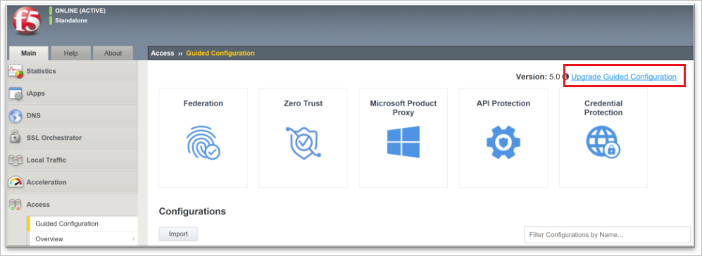 

3. On the Upgrade Guide Configuration pop screen, select **Choose File** to upload the downloaded use case pack and click on **Upload and Install** button.

	 

4. When upgrade is completed, click on the **Continue** button.

	

## Scenario description

In this tutorial, you configure and test Azure AD SSO in a test environment.

* F5 supports **SP and IDP** initiated SSO
* F5 SSO can be configured in three different ways.

- [Configure F5 single sign-on for Kerberos application](#configure-f5-single-sign-on-for-kerberos-application)

- [Configure F5 single sign-on for Header Based application](headerf5-tutorial.md)

- [Configure F5 single sign-on for Advanced Kerberos application](advance-kerbf5-tutorial.md)

### Key Authentication Scenarios

Apart from Azure Active Directory native integration support for modern authentication protocols like Open ID Connect, SAML and WS-Fed, F5 extends secure access for legacy-based authentication apps for both internal and external access with Azure AD, enabling modern scenarios (e.g. password-less access) to these applications. This include:

* Header-based authentication apps

* Kerberos authentication apps

* Anonymous authentication or no inbuilt authentication apps

* NTLM authentication apps (protection with dual prompts for the user)

* Forms Based Application (protection with dual prompts for the user)

## Adding F5 from the gallery

To configure the integration of F5 into Azure AD, you need to add F5 from the gallery to your list of managed SaaS apps.

1. Sign in to the [Azure portal](https://portal.azure.com) using either a work or school account, or a personal Microsoft account.
1. On the left navigation pane, select the **Azure Active Directory** service.
1. Navigate to **Enterprise Applications** and then select **All Applications**.
1. To add new application, select **New application**.
1. In the **Add from the gallery** section, type **F5** in the search box.
1. Select **F5** from results panel and then add the app. Wait a few seconds while the app is added to your tenant.

## Configure and test Azure AD single sign-on for F5

Configure and test Azure AD SSO with F5 using a test user called **B.Simon**. For SSO to work, you need to establish a link relationship between an Azure AD user and the related user in F5.

To configure and test Azure AD SSO with F5, complete the following building blocks:

1. **[Configure Azure AD SSO](#configure-azure-ad-sso)** - to enable your users to use this feature.
    1. **[Create an Azure AD test user](#create-an-azure-ad-test-user)** - to test Azure AD single sign-on with B.Simon.
    1. **[Assign the Azure AD test user](#assign-the-azure-ad-test-user)** - to enable B.Simon to use Azure AD single sign-on.
1. **[Configure F5 SSO](#configure-f5-sso)** - to configure the single sign-on settings on application side.
    1. **[Create F5 test user](#create-f5-test-user)** - to have a counterpart of B.Simon in F5 that is linked to the Azure AD representation of user.
1. **[Test SSO](#test-sso)** - to verify whether the configuration works.

## Configure Azure AD SSO

Follow these steps to enable Azure AD SSO in the Azure portal.

1. In the [Azure portal](https://portal.azure.com/), on the **F5** application integration page, find the **Manage** section and select **single sign-on**.
1. On the **Select a single sign-on method** page, select **SAML**.
1. On the **Set up single sign-on with SAML** page, click the edit/pen icon for **Basic SAML Configuration** to edit the settings.

   

1. On the **Basic SAML Configuration** section, if you wish to configure the application in **IDP** initiated mode, enter the values for the following fields:

    a. In the **Identifier** text box, type a URL using the following pattern:
    `https://<YourCustomFQDN>.f5.com/`

    b. In the **Reply URL** text box, type a URL using the following pattern:
    `https://<YourCustomFQDN>.f5.com/`

1. Click **Set additional URLs** and perform the following step if you wish to configure the application in **SP** initiated mode:

    In the **Sign-on URL** text box, type a URL using the following pattern:
    `https://<YourCustomFQDN>.f5.com/`

	> [!NOTE]
	> These values are not real. Update these values with the actual Identifier, Reply URL and Sign-on URL. Contact [F5 Client support team](https://support.f5.com/csp/knowledge-center/software/BIG-IP?module=BIG-IP%20APM45) to get these values. You can also refer to the patterns shown in the **Basic SAML Configuration** section in the Azure portal.

1. On the **Set up single sign-on with SAML** page, in the **SAML Signing Certificate** section,  find **Federation Metadata XML** and **Certificate (Base64)** then select **Download** to download the certificate and save it on your computer.

	

1. On the **Set up F5** section, copy the appropriate URL(s) based on your requirement.

	

### Create an Azure AD test user

In this section, you'll create a test user in the Azure portal called B.Simon.

1. From the left pane in the Azure portal, select **Azure Active Directory**, select **Users**, and then select **All users**.
1. Select **New user** at the top of the screen.
1. In the **User** properties, follow these steps:
   1. In the **Name** field, enter `B.Simon`.  
   1. In the **User name** field, enter the username@companydomain.extension. For example, `B.Simon@contoso.com`.
   1. Select the **Show password** check box, and then write down the value that's displayed in the **Password** box.
   1. Click **Create**.

### Assign the Azure AD test user

In this section, you'll enable B.Simon to use Azure single sign-on by granting access to F5.

1. In the Azure portal, select **Enterprise Applications**, and then select **All applications**.
1. In the applications list, select **F5**.
1. In the app's overview page, find the **Manage** section and select **Users and groups**.

   

1. Select **Add user**, then select **Users and groups** in the **Add Assignment** dialog.

	

1. In the **Users and groups** dialog, select **B.Simon** from the Users list, then click the **Select** button at the bottom of the screen.
1. If you're expecting any role value in the SAML assertion, in the **Select Role** dialog, select the appropriate role for the user from the list and then click the **Select** button at the bottom of the screen.
1. In the **Add Assignment** dialog, click the **Assign** button.
1. Click on **Conditional Access** .
1. Click on **New Policy**.
1. You can now see your F5 App as a resource for CA Policy and apply any conditional access including Multifactor Auth, Device based access control or Identity Protection Policy.

## Configure F5 SSO

- [Configure F5 single sign-on for Header Based application](headerf5-tutorial.md)

- [Configure F5 single sign-on for Advanced Kerberos application](advance-kerbf5-tutorial.md)

### Configure F5 single sign-on for Kerberos application

### Guided Configuration

1. Open a new web browser window and sign into your F5 (Kerberos) company site as an administrator and perform the following steps:

1. You will need to import the Metadata Certificate into the F5 which will be used later in the setup process.

1. Navigate to **System > Certificate Management > Traffic Certificate Management > SSL Certificate List**. Select **Import** from the right-hand corner. Specify a **Certificate Name** (will be referenced Later in the config). In the **Certificate Source**, select Upload File specify the certificate downloaded from Azure while configuring SAML Single Sign on. Click **Import**.

	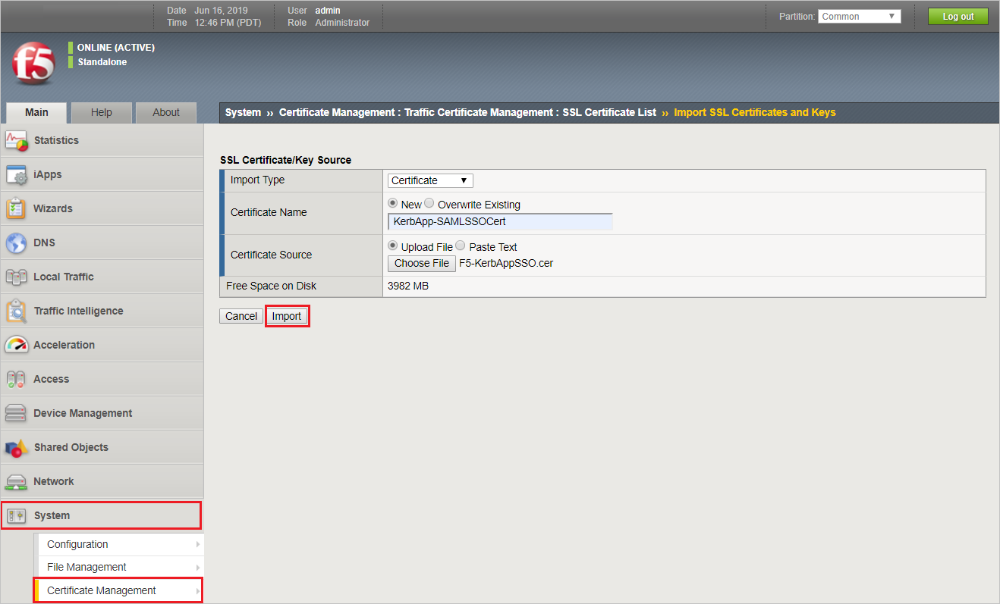 

1. Additionally, you will require **SSL Certificate for the Application Hostname. Navigate to System > Certificate Management > Traffic Certificate Management > SSL Certificate List**. Select **Import** from the right-hand corner. **Import Type** will be **PKCS 12(IIS)**. Specify a **Key Name** (will be referenced Later in the config) and the specify the PFX file. Specify the **Password** for the PFX. Click **Import**.

	>[!NOTE]
	>In the example our app name is `Kerbapp.superdemo.live`, we are using a Wild Card Certificate our keyname is `WildCard-SuperDemo.live`

    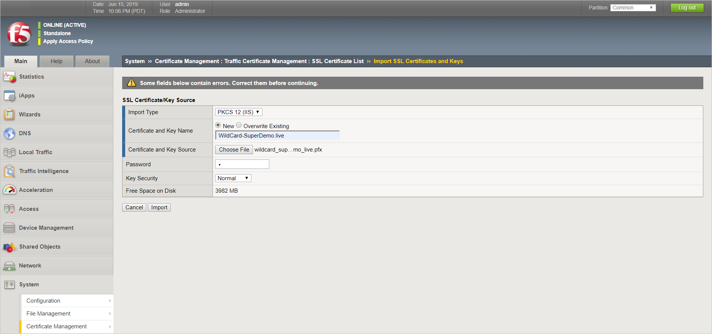 
 
1. We will use the Guided Experience to setup the Azure AD Federation and Application Access. Go to – F5 BIG-IP **Main** and select **Access > Guided Configuration > Federation > SAML Service Provider**. Click **Next** then click **Next** to begin configuration.

    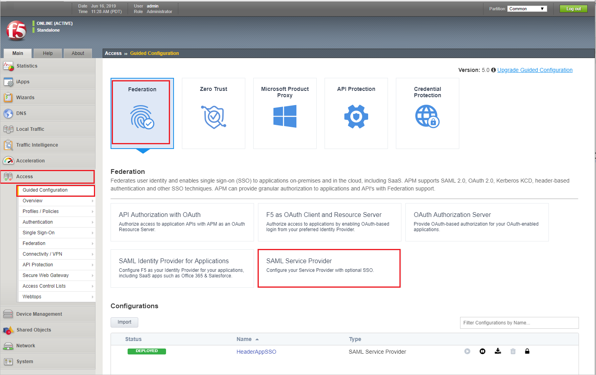 

    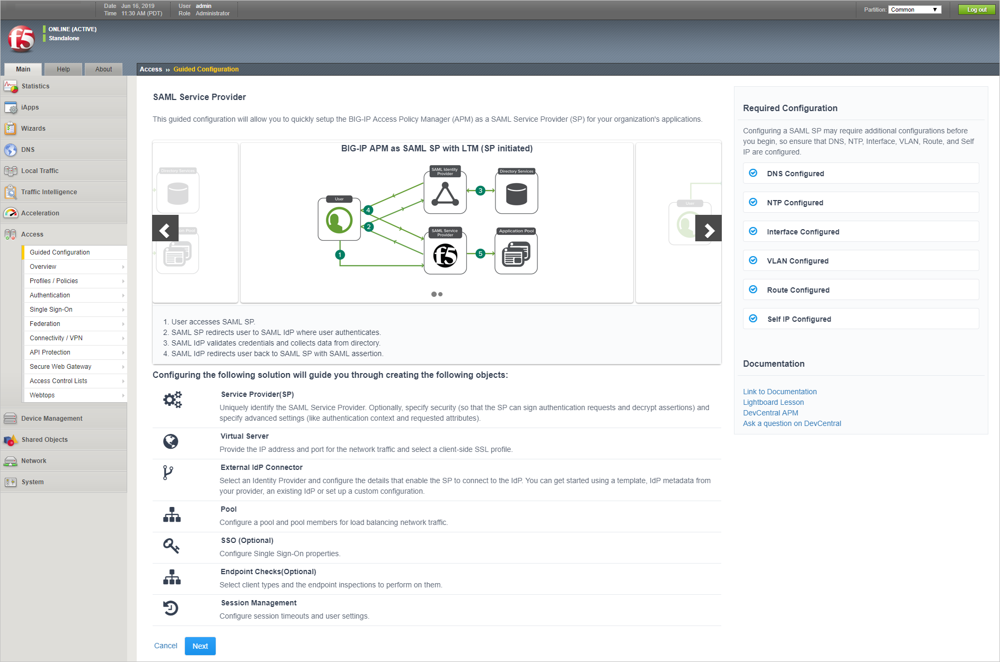

1. Provide a **Configuration Name**. Specify the **Entity ID** (same as what you configured on the Azure AD Application Configuration). Specify the **Host name**. Add a **Description** for reference. Accept the remaining default entries and select and then click **Save & Next**.

    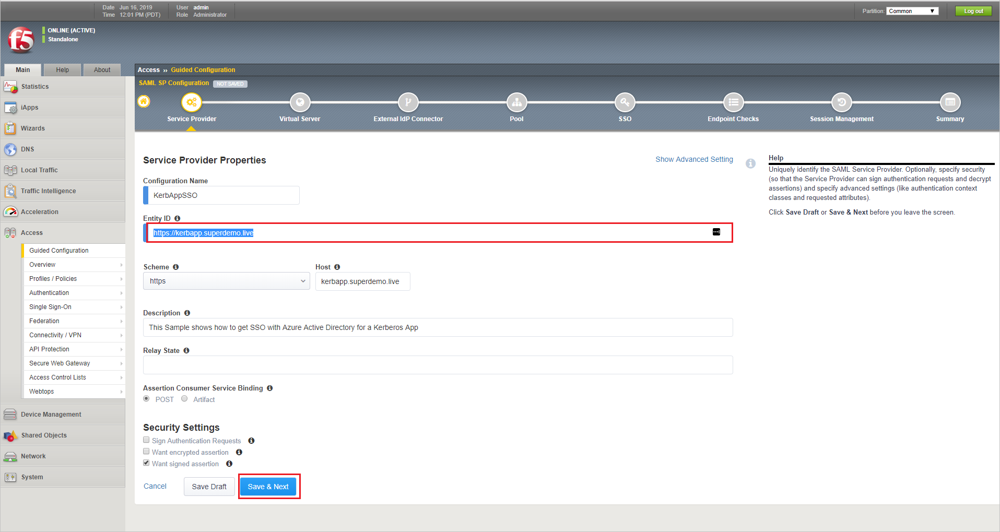 

1. In this example we are creating a new Virtual Server as 192.168.30.200 with port 443. Specify the Virtual Server IP address in the **Destination Address**. Select the Client **SSL Profile**, select Create new. Specify previously uploaded application certificate, (the wild card certificate in this example) and the associated key, and then click **Save & Next**.

	>[!NOTE]
	>in this example our Internal webserver is running on port 80 and we want to publish it with 443.

    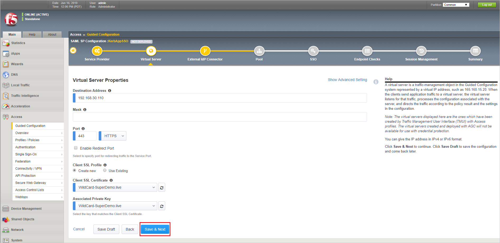

1. Under **Select method to configure your IdP connector**, specify Metadata, click on Choose File and upload the Metadata XML file downloaded earlier from Azure AD. Specify a unique **Name** for SAML IDP connector. Choose the **Metadata Signing Certificate** which was upload earlier. Click **Save & Next**.

    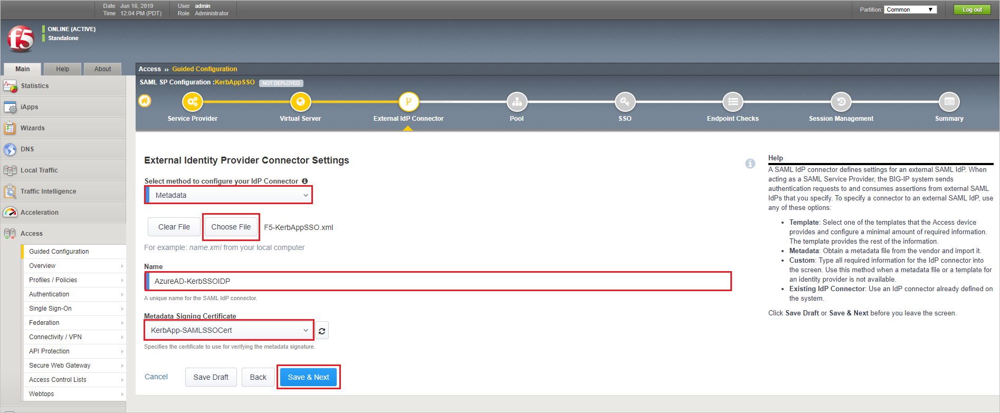  

1. Under **Select a Pool**, specify **Create New** (alternatively select a pool it already exists). Let other value be default.	Under Pool Servers, type the IP Address under **IP Address/Node Name**. Specify the **Port**. Click **Save & Next**.
 
    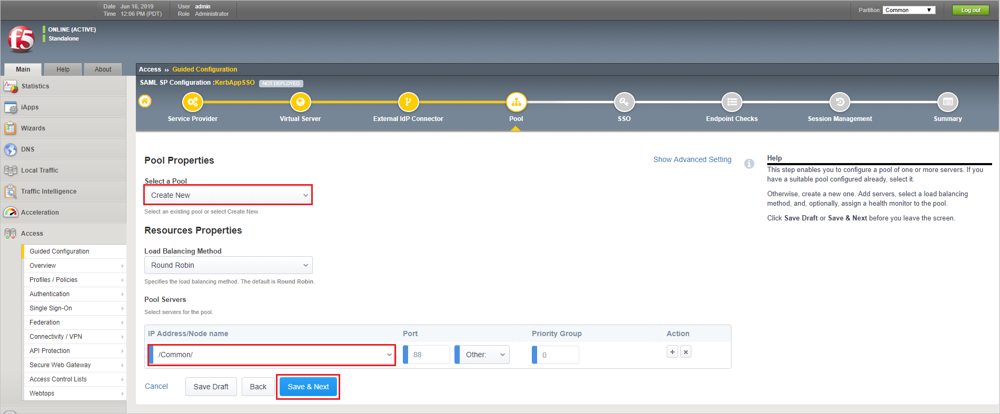

1. On the Single Sign-On Settings screen, select **Enable Single Sign-On**. Under **Selected Single Sign-On Type** choose **Kerberos**. Replace **session.saml.last.Identity**  with **session.saml.last.attr.name.Identity** under **Username Source** ( this variable it set using claims mapping in the Azure AD ). Select **Show Advanced Setting**. Under **Kerberos Realm** type the Domain Name. Under **Account Name/ Account Password** Specify the APM Delegation Account and Password. Specify the Domain Controller IP in the **KDC** Field. Click **Save & Next**.

    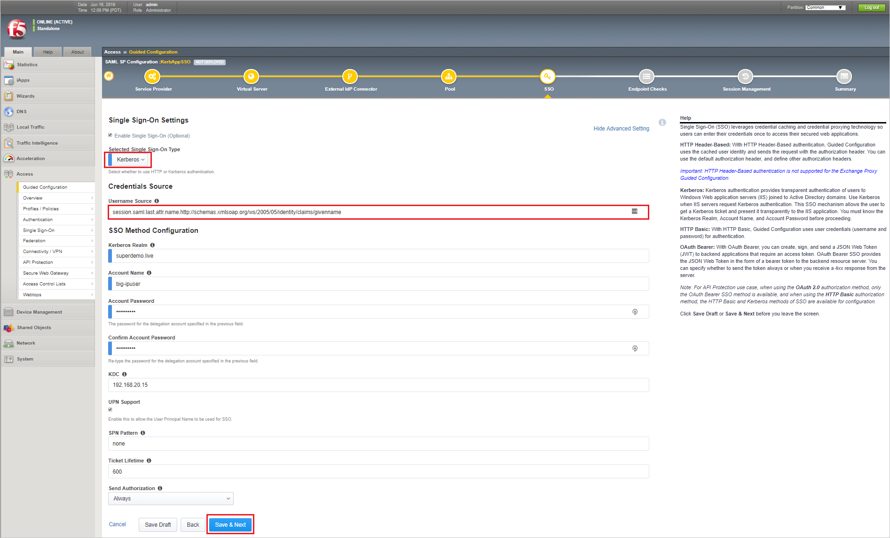   

1. For purposes of this guidance, we will skip endpoint checks.  Refer to F5 documentation for details.  On  screen select **Save & Next**.

    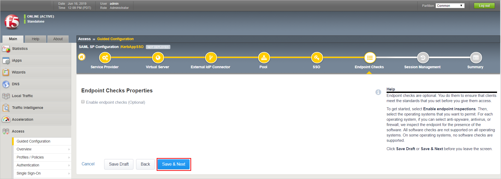 

1. Accept the defaults and click **Save & Next**. Consult F5 documentation for details regarding SAML session management settings.

    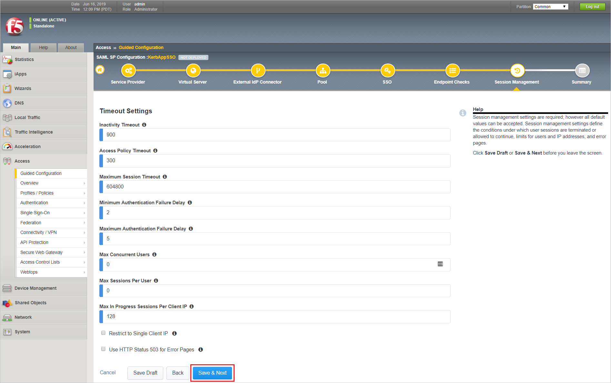 
 
1. Review the summary screen and select **Deploy** to configure the BIG-IP.
 
    

1. Once the application has been configured click on **Finish**.

    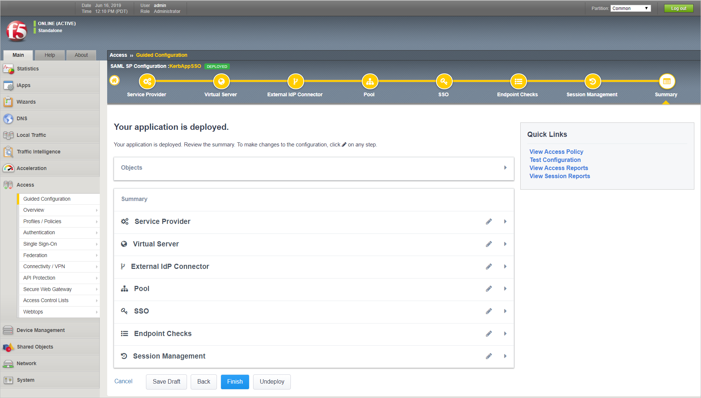

## Advanced Configuration

>[!NOTE]
>For reference click [here](https://techdocs.f5.com/kb/en-us/products/big-ip_apm/manuals/product/apm-authentication-single-sign-on-11-5-0/2.html)

### Configuring an Active Directory AAA server

You configure an Active Directory AAA server in Access Policy Manager (APM) to specify domain controllers and credentials for APM to use for authenticating users.

1.	On the Main tab, click **Access Policy > AAA Servers > Active Directory**. The Active Directory Servers list screen opens.

2.	Click **Create**. The New Server properties screen opens.

3.	In the **Name** field, type a unique name for the authentication server.

4.	In the **Domain Name** field, type the name of the Windows domain.

5.	For the **Server Connection** setting, select one of these options:

    * Select **Use Pool** to set up high availability for the AAA server.

    * Select **Direct** to set up the AAA server for standalone functionality.

6.	If you selected **Direct**, type a name in the **Domain Controller** field.

7.	If you selected Use **Pool**, configure the pool:

    * Type a name in the **Domain Controller Pool Name** field.

    * Specify the **Domain Controllers** in the pool by typing the IP address and host name for each, and clicking the **Add** button.

    * To monitor the health of the AAA server, you have the option of selecting a health monitor: only the **gateway_icmp** monitor is appropriate in this case; you can select it from the **Server Pool Monitor** list.

8.	In the **Admin Name** field, type a is case-sensitive name for an administrator who has Active Directory administrative permissions. APM uses the information in the **Admin Name** and **Admin Password** fields for AD Query. If Active Directory is configured for anonymous queries, you do not need to provide an Admin Name. Otherwise, APM needs an account with sufficient privilege to bind to an Active Directory server, fetch user group information, and fetch Active Directory password policies to support password-related functionality. (APM must fetch password policies, for example, if you select the Prompt user to change password before expiration option in an AD Query action.) If you do not provide Admin account information in this configuration, APM uses the user account to fetch information. This works if the user account has sufficient privilege.

9.	In the **Admin Password** field, type the administrator password associated with the Domain Name.

10.	In the **Verify Admin Password** field, retype the administrator password associated with the **Domain Name** setting.

11.	In the **Group Cache Lifetime** field, type the number of days. The default lifetime is 30 days.

12.	In the **Password Security Object Cache Lifetime** field, type the number of days. The default lifetime is 30 days.

13.	From the **Kerberos Preauthentication Encryption Type** list, select an encryption type. The default is **None**. If you specify an encryption type, the BIG-IP system includes Kerberos preauthentication data within the first authentication service request (AS-REQ) packet.

14.	In the **Timeout** field, type a timeout interval (in seconds) for the AAA server. (This setting is optional.)

15.	Click **Finished**. The new server displays on the list. 
This adds the new Active Directory server to the Active Directory Servers list.

    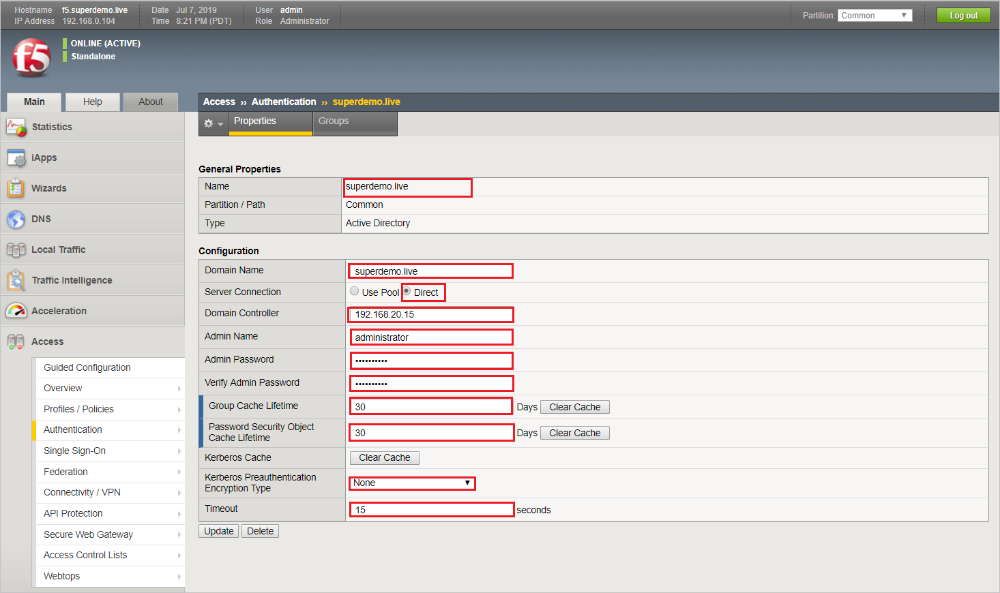

### SAML Configuration

1. You will need to import the Metadata Certificate into the F5 which will be used later in the setup process. Navigate to **System > Certificate Management > Traffic Certificate Management > SSL Certificate List**. Select **Import** from the right-hand corner.

    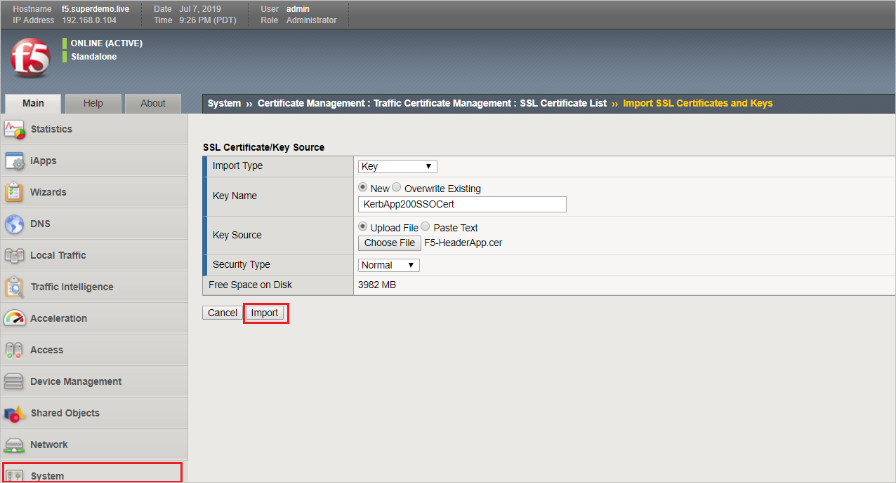

2. For setting up the SAML IDP, **navigate to Access > Federation > SAML: Service Provider > External Idp Connectors**, and click **Create > From Metadata**.

    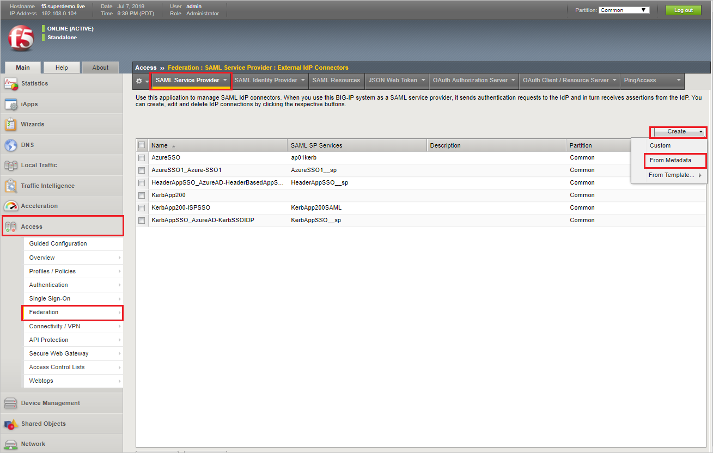

    

    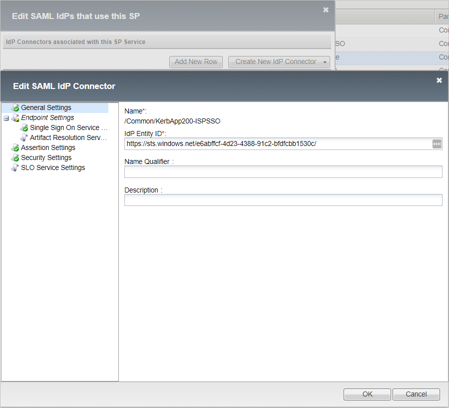

    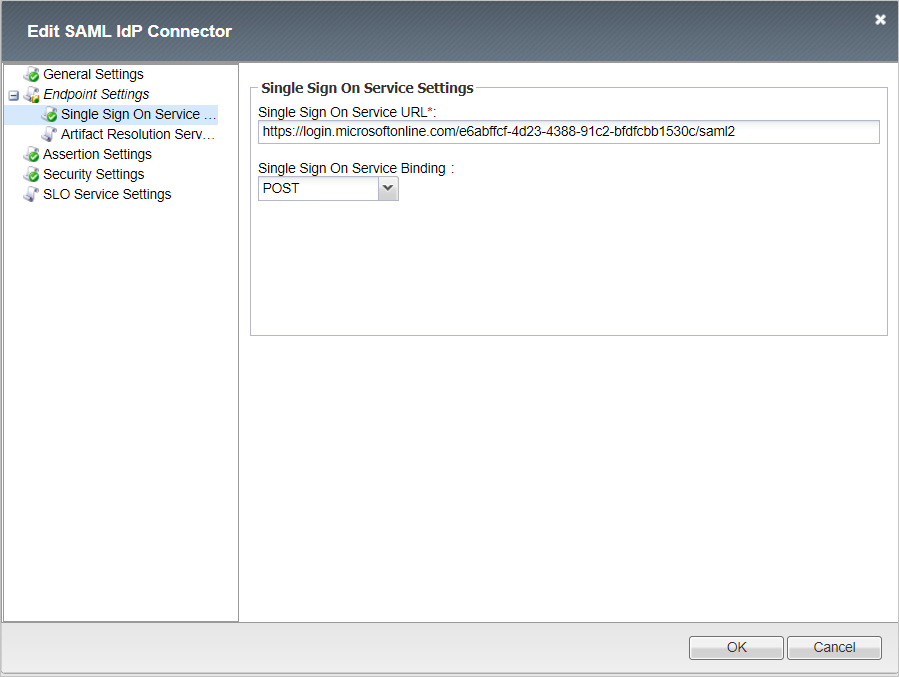

    

    

1. For setting up the SAML SP, navigate to **Access > Federation > SAML Service Provider > Local SP Services** and click **Create**. Complete the following information and click **OK**.

    * Type Name: KerbApp200SAML
    * Entity ID*: https://kerbapp200.superdemo.live
    * SP Name Settings
    * Scheme: https
    * Host: kerbapp200.superdemo.live
    * Description: kerbapp200.superdemo.live

     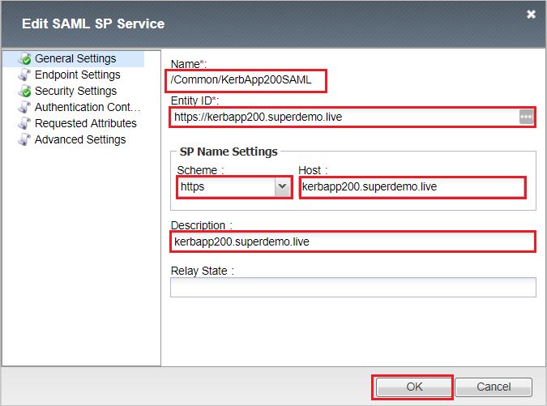

     b. Select the SP Configuration, KerbApp200SAML, and Click **Bind/UnBind IdP Connectors**.

     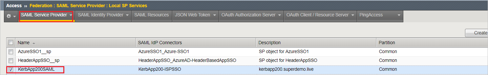

     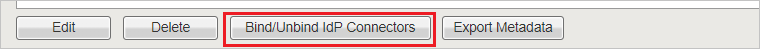

     c. Click on **Add New Row** and Select the **External IdP connector** created in previous step, click **Update**, and then click **OK**.

     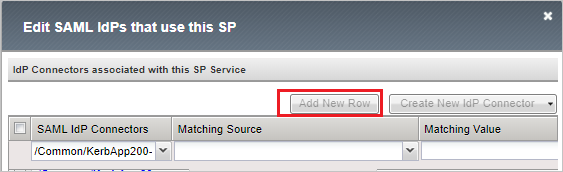

1. For configuring Kerberos SSO, navigate to **Access > Single Sign-on > Kerberos**, complete information and click **Finished**.

    >[!Note]
    > You will need the Kerberos Delegation Account to be created and specified. Refer KCD Section (Refer Appendix for Variable References)

    * **Username Source**: session.saml.last.attr.name.http:\//schemas.xmlsoap.org/ws/2005/05/identity/claims/givenname

    * **User Realm Source**: session.logon.last.domain

        

1. For configuring Access Profile, navigate to **Access > Profile/Policies > Access Profile (per session policies)**, click **Create**, complete the following information and click **Finished**.

    * Name: KerbApp200
    * Profile Type: All
    * Profile Scope: Profile
    * Languages: English

        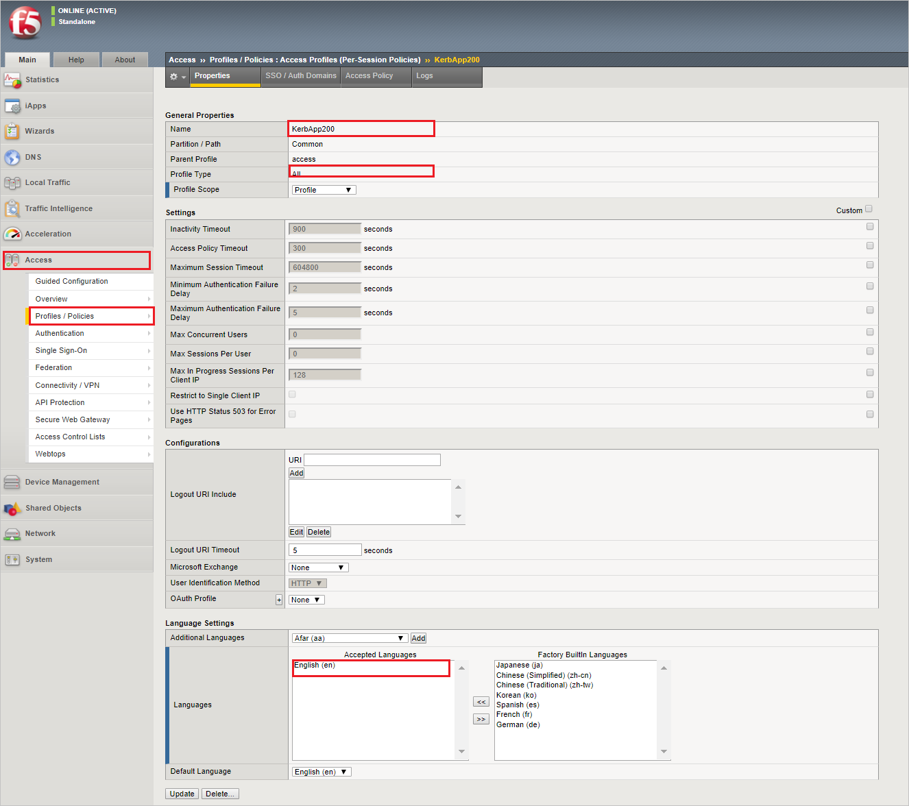

1. Click on the name, KerbApp200, complete the following information and click **Update**.

    * Domain Cookie: superdemo.live
    * SSO Configuration: KerAppSSO_sso

        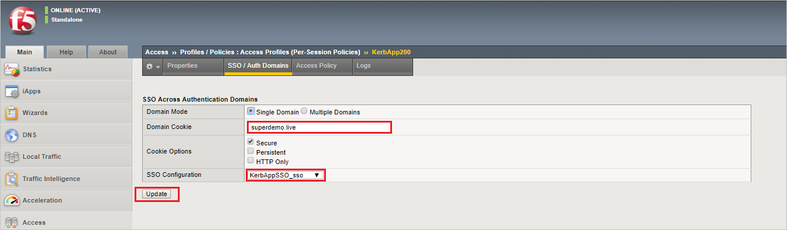

1. Click **Access Policy** and then click **Edit Access Policy** for Profile “KerbApp200”.

    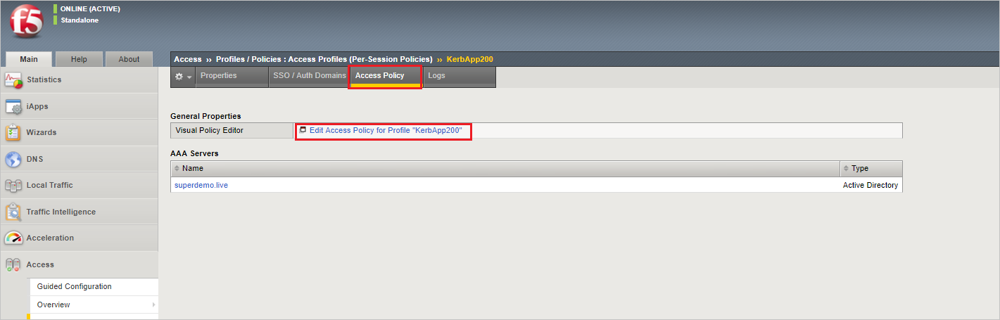

    

    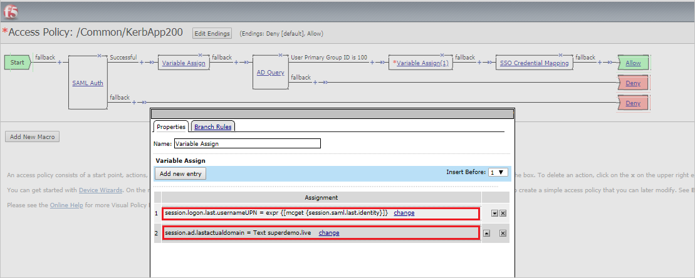

    * **session.logon.last.usernameUPN   expr {[mcget {session.saml.last.identity}]}**

    * **session.ad.lastactualdomain  TEXT superdemo.live**

        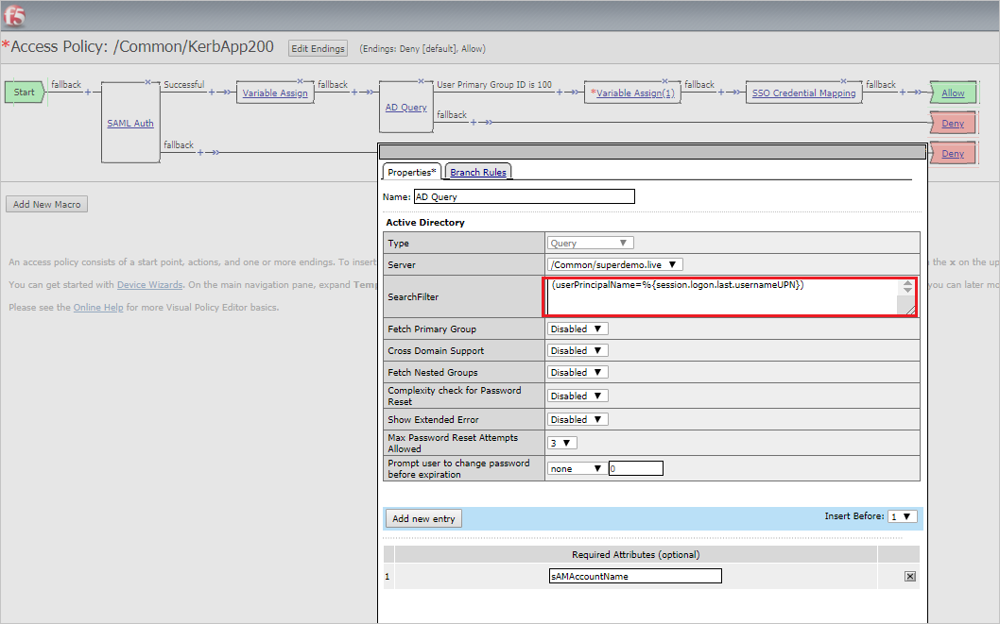

    * **(userPrincipalName=%{session.logon.last.usernameUPN})**

        

        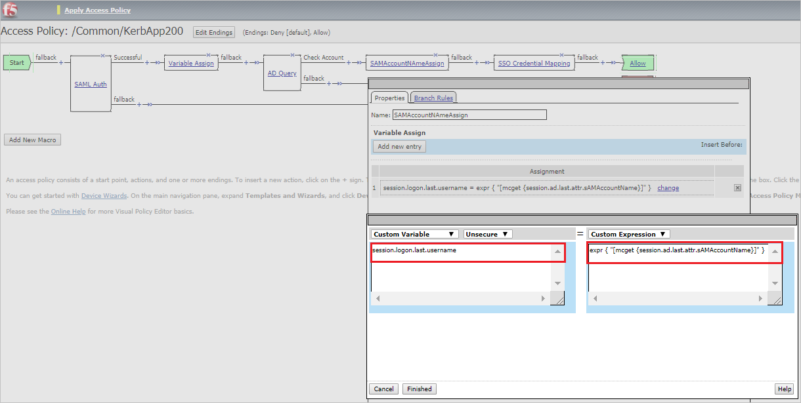

    * **session.logon.last.username  expr { "[mcget {session.ad.last.attr.sAMAccountName}]" }**

        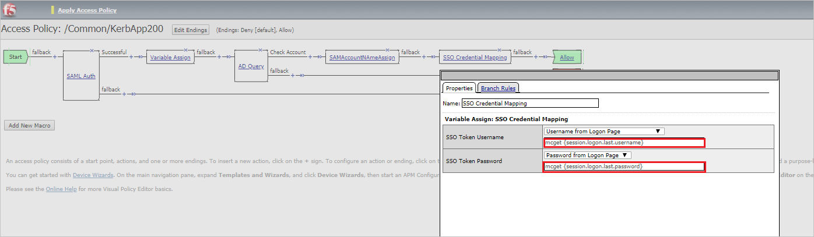

    * **mcget {session.logon.last.username}**
    * **mcget {session.logon.last.password**

1. For adding New Node, navigate to **Local Traffic > Nodes > Node List, click Create**, complete the following information, and then click **Finished**.

    * Name: KerbApp200
    * Description: KerbApp200
    * Address: 192.168.20.200

        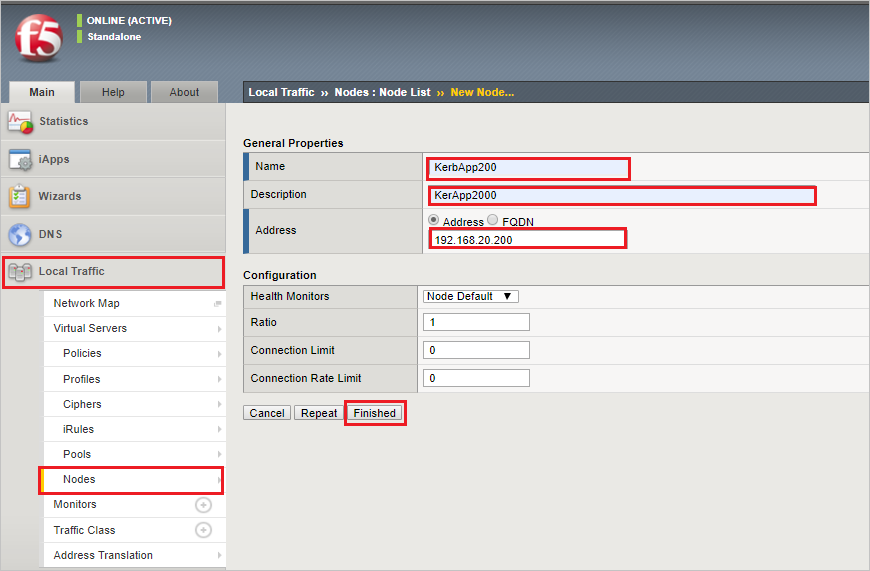

1. For creating a new Pool, navigate to **Local Traffic > Pools > Pool List, click Create**, complete the following information and click **Finished**.

    * Name: KerbApp200-Pool
    * Description: KerbApp200-Pool
    * Health Monitors: http
    * Address: 192.168.20.200
    * Service Port: 81

        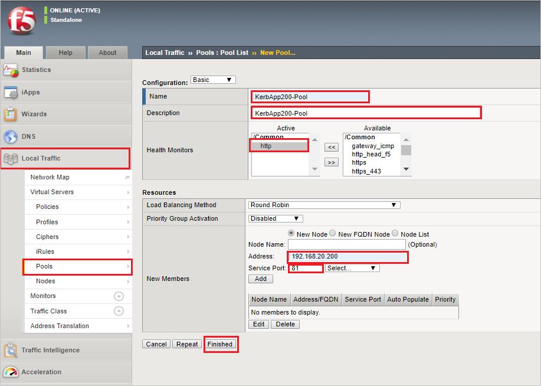

1. For creating Virtual Server, navigate to **Local Traffic > Virtual Servers > Virtual Server List > +**, complete the following information and click **Finished**.

    * Name: KerbApp200
    * Destination Address/Mask: Host 192.168.30.200
    * Service Port: Port 443 HTTPS
    * Access Profile: KerbApp200
    * Specify the Access Profile Created in Previous Step

        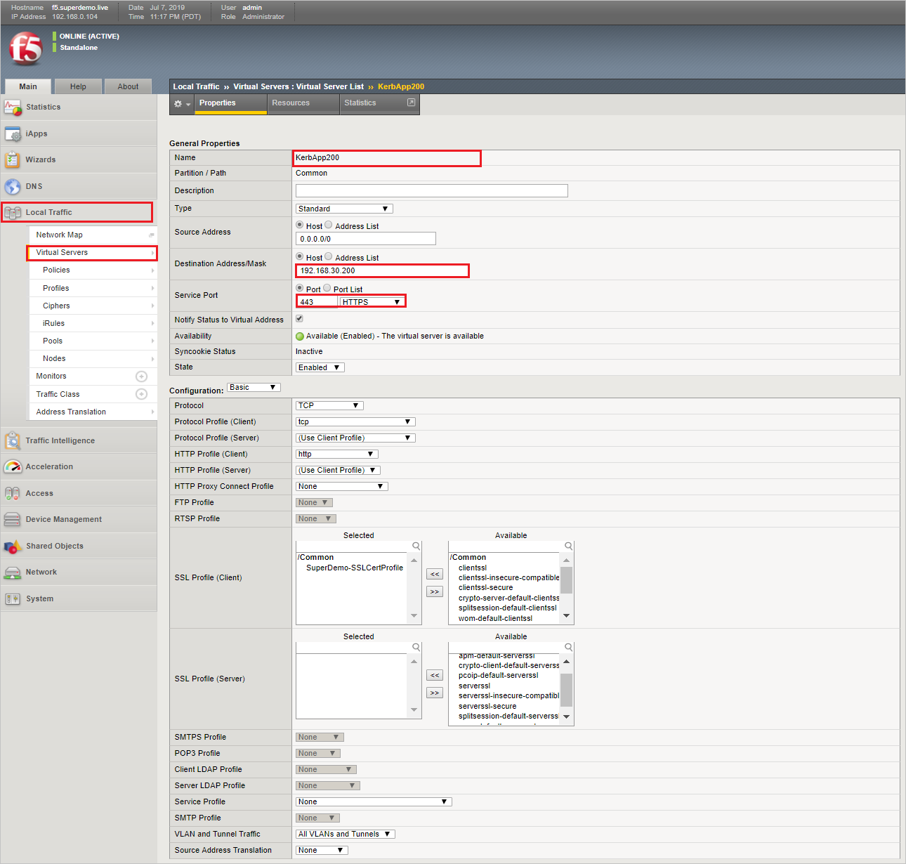

        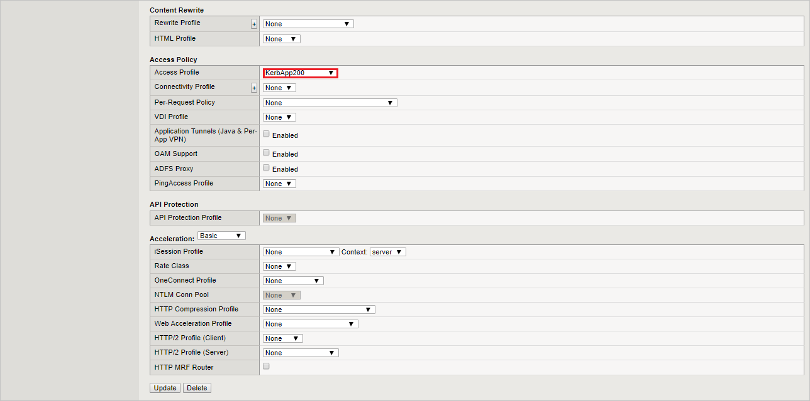

### Setting up Kerberos Delegation 

>[!NOTE]
>For reference click [here](https://www.f5.com/pdf/deployment-guides/kerberos-constrained-delegation-dg.pdf)

*  **Step 1:** Create a Delegation Account

    **Example:**
    * Domain Name: **superdemo.live**

    * Sam Account Name: **big-ipuser**

    * New-ADUser -Name "APM Delegation Account" -UserPrincipalName host/big-ipuser.superdemo.live@superdemo.live -SamAccountName "big-ipuser" -PasswordNeverExpires $true -Enabled $true -AccountPassword (Read-Host -AsSecureString "Password!1234")

* **Step 2:** Set SPN (on the APM Delegation Account)

    **Example:**
    * setspn –A **host/big-ipuser.superdemo.live** big-ipuser

* **Step 3:** SPN Delegation (for the App Service Account)
    Setup the appropriate Delegation for the F5 Delegation Account.
    In the example below, APM Delegation account is being configured for KCD for FRP-App1.superdemo. live app.

    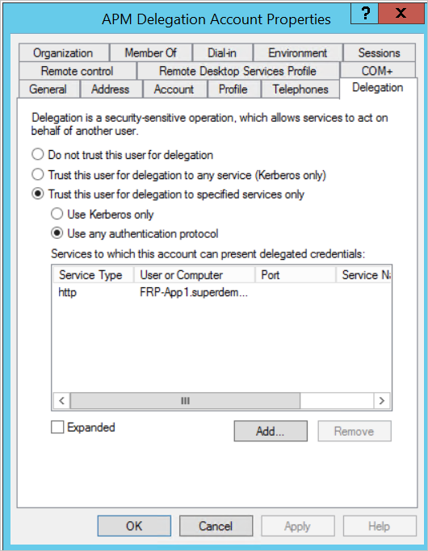

* Provide the details as mentioned in the above reference document under [this](https://techdocs.f5.com/kb/en-us/products/big-ip_apm/manuals/product/apm-authentication-single-sign-on-11-5-0/2.html).

### Create F5 test user

In this section, you create a user called B.Simon in F5. Work with [F5 Client support team](https://support.f5.com/csp/knowledge-center/software/BIG-IP?module=BIG-IP%20APM45) to add the users in the F5 platform. Users must be created and activated before you use single sign-on. 

## Test SSO 

In this section, you test your Azure AD single sign-on configuration using the Access Panel.

When you click the F5 tile in the Access Panel, you should be automatically signed in to the F5 for which you set up SSO. For more information about the Access Panel, see [Introduction to the Access Panel](https://docs.microsoft.com/azure/active-directory/active-directory-saas-access-panel-introduction).

## Additional resources

- [ List of Tutorials on How to Integrate SaaS Apps with Azure Active Directory ](https://docs.microsoft.com/azure/active-directory/active-directory-saas-tutorial-list)

- [What is application access and single sign-on with Azure Active Directory? ](https://docs.microsoft.com/azure/active-directory/active-directory-appssoaccess-whatis)

- [What is conditional access in Azure Active Directory?](https://docs.microsoft.com/azure/active-directory/conditional-access/overview)

- [Try F5 with Azure AD](https://aad.portal.azure.com/)

- [Configure F5 single sign-on for Header Based application](headerf5-tutorial.md)

- [Configure F5 single sign-on for Advanced Kerberos application](advance-kerbf5-tutorial.md)

