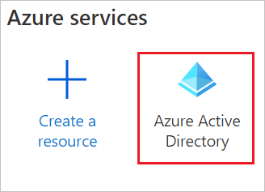
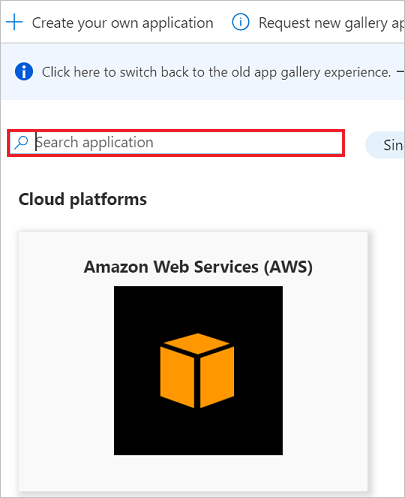
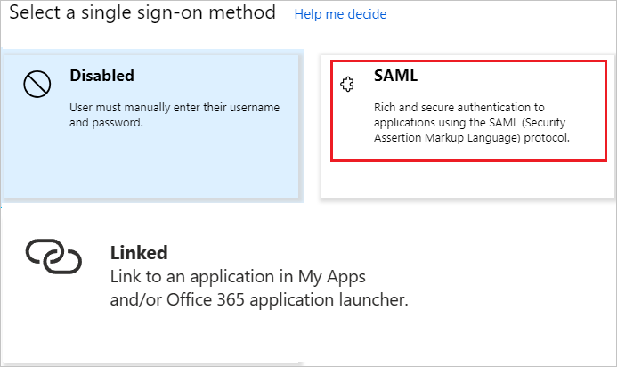
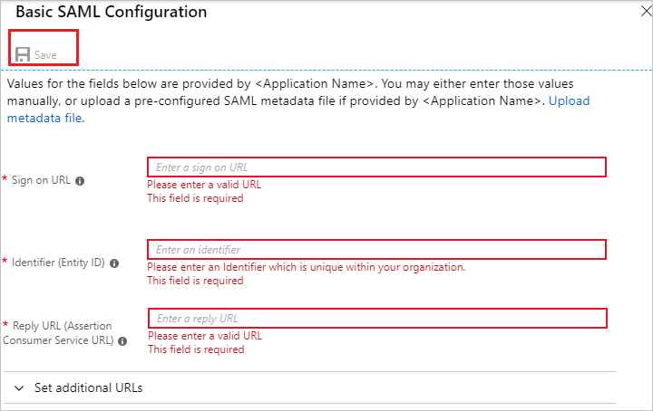
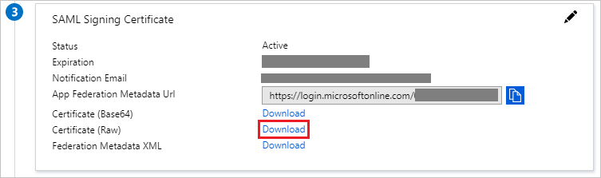
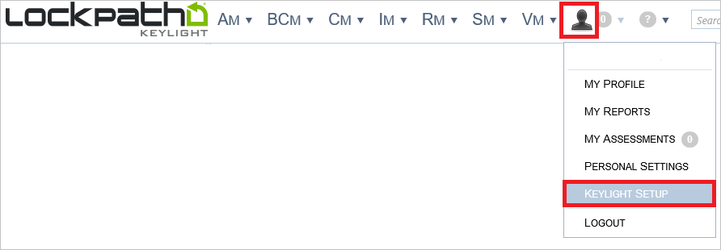
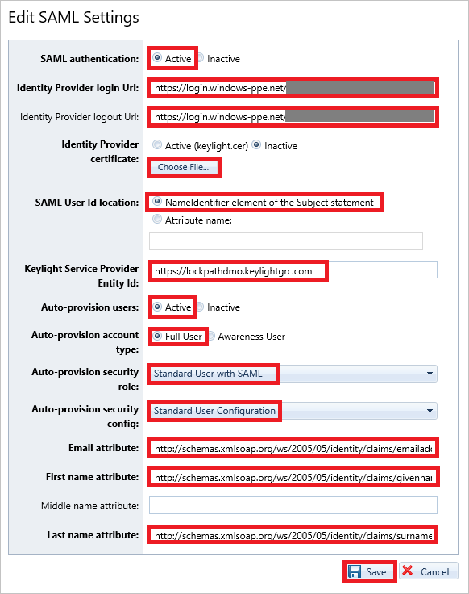

# Tutorial: Azure Active Directory integration with LockPath Keylight

In this tutorial, you learn how to integrate LockPath Keylight with Azure Active Directory (Azure AD).
Integrating LockPath Keylight with Azure AD provides you with the following benefits:

* You can control in Azure AD who has access to LockPath Keylight.
* You can enable your users to be automatically signed-in to LockPath Keylight (Single Sign-On) with their Azure AD accounts.
* You can manage your accounts in one central location - the Azure portal.

If you want to know more details about SaaS app integration with Azure AD, see [What is application access and single sign-on with Azure Active Directory](https://docs.microsoft.com/azure/active-directory/active-directory-appssoaccess-whatis).
If you don't have an Azure subscription, [create a free account](https://azure.microsoft.com/free/) before you begin.

## Prerequisites

To configure Azure AD integration with LockPath Keylight, you need the following items:

* An Azure AD subscription. If you don't have an Azure AD environment, you can get a [free account](https://azure.microsoft.com/free/)
* LockPath Keylight single sign-on enabled subscription

## Scenario description

In this tutorial, you configure and test Azure AD single sign-on in a test environment.

* LockPath Keylight supports **SP** initiated SSO
* LockPath Keylight supports **Just In Time** user provisioning

## Adding LockPath Keylight from the gallery

To configure the integration of LockPath Keylight into Azure AD, you need to add LockPath Keylight from the gallery to your list of managed SaaS apps.

**To add LockPath Keylight from the gallery, perform the following steps:**

1. In the **[Azure portal](https://portal.azure.com)**, on the left navigation panel, click **Azure Active Directory** icon.

	

2. Navigate to **Enterprise Applications** and then select the **All Applications** option.

	

3. To add new application, click **New application** button on the top of dialog.

	

4. In the search box, type **LockPath Keylight**, select **LockPath Keylight** from result panel then click **Add** button to add the application.

	

## Configure and test Azure AD single sign-on

In this section, you configure and test Azure AD single sign-on with LockPath Keylight based on a test user called **Britta Simon**.
For single sign-on to work, a link relationship between an Azure AD user and the related user in LockPath Keylight needs to be established.

To configure and test Azure AD single sign-on with LockPath Keylight, you need to complete the following building blocks:

1. **[Configure Azure AD Single Sign-On](#configure-azure-ad-single-sign-on)** - to enable your users to use this feature.
2. **[Configure LockPath Keylight Single Sign-On](#configure-lockpath-keylight-single-sign-on)** - to configure the Single Sign-On settings on application side.
3. **[Create an Azure AD test user](#create-an-azure-ad-test-user)** - to test Azure AD single sign-on with Britta Simon.
4. **[Assign the Azure AD test user](#assign-the-azure-ad-test-user)** - to enable Britta Simon to use Azure AD single sign-on.
5. **[Create LockPath Keylight test user](#create-lockpath-keylight-test-user)** - to have a counterpart of Britta Simon in LockPath Keylight that is linked to the Azure AD representation of user.
6. **[Test single sign-on](#test-single-sign-on)** - to verify whether the configuration works.

### Configure Azure AD single sign-on

In this section, you enable Azure AD single sign-on in the Azure portal.

To configure Azure AD single sign-on with LockPath Keylight, perform the following steps:

1. In the [Azure portal](https://portal.azure.com/), on the **LockPath Keylight** application integration page, select **Single sign-on**.

    

2. On the **Select a Single sign-on method** dialog, select **SAML/WS-Fed** mode to enable single sign-on.

    

3. On the **Set up Single Sign-On with SAML** page, click **Edit** icon to open **Basic SAML Configuration** dialog.

	

4. On the **Basic SAML Configuration** section, perform the following steps:

    

	a. In the **Sign on URL** text box, type a URL using the following pattern:
    `https://<company name>.keylightgrc.com/`

    b. In the **Identifier (Entity ID)** text box, type a URL using the following pattern:
    `https://<company name>.keylightgrc.com`

    c. In the **Reply URL** textbox, type a URL using the following pattern: `https://<company name>.keylightgrc.com/Login.aspx`

	> [!NOTE]
	> These values are not real. Update these values with the actual Sign on URL, Identifier and Reply URL. Contact [LockPath Keylight Client support team](https://www.lockpath.com/contact/) to get these values. You can also refer to the patterns shown in the **Basic SAML Configuration** section in the Azure portal.

5. On the **Set up Single Sign-On with SAML** page, in the **SAML Signing Certificate** section, click **Download** to download the **Certificate (Raw)** from the given options as per your requirement and save it on your computer.

	

6. On the **Set up LockPath Keylight** section, copy the appropriate URL(s) as per your requirement.

	

	a. Login URL

	b. Azure AD Identifier

	c. Logout URL

### Configure LockPath Keylight Single Sign-On

1. To enable SSO in LockPath Keylight, perform the following steps:

    a. Sign-on to your LockPath Keylight account as administrator.

    b. In the menu on the top, click **Person**, and select **Keylight Setup**.

    

    c. In the treeview on the left, click **SAML**.

    

    d. On the **SAML Settings** dialog, click **Edit**.

    

1. On the **Edit SAML Settings** dialog page, perform the following steps:

    

    a. Set **SAML authentication** to **Active**.

    b. In the **Identity Provider Login URL** textbox, paste the **Login URL** value which you have copied from the Azure portal.

    c. In the **Identity Provider Logout URL** textbox, paste the **Logout URL** value which you have copied from the Azure portal.

    d. Click **Choose File** to select your downloaded LockPath Keylight certificate, and then click **Open** to upload the certificate.

    e. Set **SAML User Id location** to **NameIdentifier element of the subject statement**.

    f. Provide the **Keylight Service Provider** using the following pattern: `https://<CompanyName>.keylightgrc.com`.

    g. Set **Auto-provision users** to **Active**.

    h. Set **Auto-provision account type** to **Full User**.

    i. Set **Auto-provision security role**, select **Standard User with SAML**.

    j. Set **Auto-provision security config**, select **Standard User Configuration**.

    k. In the **Email attribute** textbox, type `http://schemas.xmlsoap.org/ws/2005/05/identity/claims/emailaddress`.

    l. In the **First name attribute** textbox, type `http://schemas.xmlsoap.org/ws/2005/05/identity/claims/givenname`.

    m. In the **Last name attribute** textbox, type `http://schemas.xmlsoap.org/ws/2005/05/identity/claims/surname`.

    n. Click **Save**.

### Create an Azure AD test user

The objective of this section is to create a test user in the Azure portal called Britta Simon.

1. In the Azure portal, in the left pane, select **Azure Active Directory**, select **Users**, and then select **All users**.

    

2. Select **New user** at the top of the screen.

    

3. In the User properties, perform the following steps.

    

    a. In the **Name** field enter **BrittaSimon**.
  
    b. In the **User name** field type `brittasimon@yourcompanydomain.extension`. For example, BrittaSimon@contoso.com

    c. Select **Show password** check box, and then write down the value that's displayed in the Password box.

    d. Click **Create**.

### Assign the Azure AD test user

In this section, you enable Britta Simon to use Azure single sign-on by granting access to LockPath Keylight.

1. In the Azure portal, select **Enterprise Applications**, select **All applications**, then select **LockPath Keylight**.

	

2. In the applications list, select **LockPath Keylight**.

	

3. In the menu on the left, select **Users and groups**.

    

4. Click the **Add user** button, then select **Users and groups** in the **Add Assignment** dialog.

    

5. In the **Users and groups** dialog select **Britta Simon** in the Users list, then click the **Select** button at the bottom of the screen.

6. If you are expecting any role value in the SAML assertion then in the **Select Role** dialog select the appropriate role for the user from the list, then click the **Select** button at the bottom of the screen.

7. In the **Add Assignment** dialog click the **Assign** button.

### Create LockPath Keylight test user

In this section, a user called Britta Simon is created in LockPath Keylight. LockPath Keylight supports just-in-time user provisioning, which is enabled by default. There is no action item for you in this section. If a user doesn't already exist in LockPath Keylight, a new one is created after authentication. If you need to create a user manually, you need to contact the [LockPath Keylight Client support team](https://www.lockpath.com/contact/).

### Test single sign-on

In this section, you test your Azure AD single sign-on configuration using the Access Panel.

When you click the LockPath Keylight tile in the Access Panel, you should be automatically signed in to the LockPath Keylight for which you set up SSO. For more information about the Access Panel, see [Introduction to the Access Panel](https://docs.microsoft.com/azure/active-directory/active-directory-saas-access-panel-introduction).

## Additional Resources

- [List of Tutorials on How to Integrate SaaS Apps with Azure Active Directory](https://docs.microsoft.com/azure/active-directory/active-directory-saas-tutorial-list)

- [What is application access and single sign-on with Azure Active Directory?](https://docs.microsoft.com/azure/active-directory/active-directory-appssoaccess-whatis)

- [What is Conditional Access in Azure Active Directory?](https://docs.microsoft.com/azure/active-directory/conditional-access/overview)