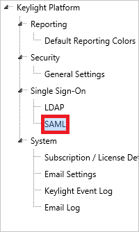

# Tutorial: Azure Active Directory integration with LockPath Keylight

In this tutorial, you'll learn how to integrate LockPath Keylight with Azure Active Directory (Azure AD). When you integrate LockPath Keylight with Azure AD, you can:

* Control in Azure AD who has access to LockPath Keylight.
* Enable your users to be automatically signed-in to LockPath Keylight with their Azure AD accounts.
* Manage your accounts in one central location - the Azure portal.

## Prerequisites

To configure Azure AD integration with LockPath Keylight, you need the following items:

* An Azure AD subscription. If you don't have an Azure AD environment, you can get a [free account](https://azure.microsoft.com/free/).
* LockPath Keylight single sign-on enabled subscription.

## Scenario description

In this tutorial, you configure and test Azure AD single sign-on in a test environment.

* LockPath Keylight supports **SP** initiated SSO.
* LockPath Keylight supports **Just In Time** user provisioning.

## Add LockPath Keylight from the gallery

To configure the integration of LockPath Keylight into Azure AD, you need to add LockPath Keylight from the gallery to your list of managed SaaS apps.

1. Sign in to the Azure portal using either a work or school account, or a personal Microsoft account.
1. On the left navigation pane, select the **Azure Active Directory** service.
1. Navigate to **Enterprise Applications** and then select **All Applications**.
1. To add new application, select **New application**.
1. In the **Add from the gallery** section, type **LockPath Keylight** in the search box.
1. Select **LockPath Keylight** from results panel and then add the app. Wait a few seconds while the app is added to your tenant.

## Configure and test Azure AD SSO for LockPath Keylight

Configure and test Azure AD SSO with LockPath Keylight using a test user called **B.Simon**. For SSO to work, you need to establish a link relationship between an Azure AD user and the related user in LockPath Keylight.

To configure and test Azure AD SSO with LockPath Keylight, perform the following steps:

1. **[Configure Azure AD SSO](#configure-azure-ad-sso)** - to enable your users to use this feature.
    1. **[Create an Azure AD test user](#create-an-azure-ad-test-user)** - to test Azure AD single sign-on with B.Simon.
    1. **[Assign the Azure AD test user](#assign-the-azure-ad-test-user)** - to enable B.Simon to use Azure AD single sign-on.
1. **[Configure LockPath Keylight SSO](#configure-lockpath-keylight-sso)** - to configure the single sign-on settings on application side.
    1. **[Create LockPath Keylight test user](#create-lockpath-keylight-test-user)** - to have a counterpart of B.Simon in LockPath Keylight that is linked to the Azure AD representation of user.
1. **[Test SSO](#test-sso)** - to verify whether the configuration works.

## Configure Azure AD SSO

In this section, you enable Azure AD single sign-on in the Azure portal.

Follow these steps to enable Azure AD SSO in the Azure portal.

1. In the Azure portal, on the **LockPath Keylight** application integration page, find the **Manage** section and select **single sign-on**.
1. On the **Select a single sign-on method** page, select **SAML**.
1. On the **Set up single sign-on with SAML** page, click the pencil icon for **Basic SAML Configuration** to edit the settings.

   

4. On the **Basic SAML Configuration** section, perform the following steps:

    a. In the **Identifier (Entity ID)** text box, type a URL using the following pattern:
    `https://<COMPANY_NAME>.keylightgrc.com`

    b. In the **Reply URL** textbox, type a URL using the following pattern: `https://<COMPANY_NAME>.keylightgrc.com/Login.aspx`

    c. In the **Sign on URL** text box, type a URL using the following pattern:
    `https://<COMPANY_NAME>.keylightgrc.com/`

	> [!NOTE]
	> These values are not real. Update these values with the actual Identifier, Reply URL and Sign on URL. Contact [LockPath Keylight Client support team](https://www.lockpath.com/contact/) to get these values. You can also refer to the patterns shown in the **Basic SAML Configuration** section in the Azure portal.

5. On the **Set up Single Sign-On with SAML** page, in the **SAML Signing Certificate** section, click **Download** to download the **Certificate (Raw)** from the given options as per your requirement and save it on your computer.

	

6. On the **Set up LockPath Keylight** section, copy the appropriate URL(s) as per your requirement.

	

### Create an Azure AD test user

In this section, you'll create a test user in the Azure portal called B.Simon.

1. From the left pane in the Azure portal, select **Azure Active Directory**, select **Users**, and then select **All users**.
1. Select **New user** at the top of the screen.
1. In the **User** properties, follow these steps:
   1. In the **Name** field, enter `B.Simon`.  
   1. In the **User name** field, enter the username@companydomain.extension. For example, `B.Simon@contoso.com`.
   1. Select the **Show password** check box, and then write down the value that's displayed in the **Password** box.
   1. Click **Create**.

### Assign the Azure AD test user

In this section, you'll enable B.Simon to use Azure single sign-on by granting access to LockPath Keylight.

1. In the Azure portal, select **Enterprise Applications**, and then select **All applications**.
1. In the applications list, select **LockPath Keylight**.
1. In the app's overview page, find the **Manage** section and select **Users and groups**.
1. Select **Add user**, then select **Users and groups** in the **Add Assignment** dialog.
1. In the **Users and groups** dialog, select **B.Simon** from the Users list, then click the **Select** button at the bottom of the screen.
1. If you are expecting a role to be assigned to the users, you can select it from the **Select a role** dropdown. If no role has been set up for this app, you see "Default Access" role selected.
1. In the **Add Assignment** dialog, click the **Assign** button.

## Configure LockPath Keylight SSO

1. To enable SSO in LockPath Keylight, perform the following steps:

    a. Sign-on to your LockPath Keylight account as administrator.

    b. In the menu on the top, click **Person**, and select **Keylight Setup**.

    

    c. In the treeview on the left, click **SAML**.

    

    d. On the **SAML Settings** dialog, click **Edit**.

    

1. On the **Edit SAML Settings** dialog page, perform the following steps:

    

    a. Set **SAML authentication** to **Active**.

    b. In the **Identity Provider Login URL** textbox, paste the **Login URL** value which you have copied from the Azure portal.

    c. In the **Identity Provider Logout URL** textbox, paste the **Logout URL** value which you have copied from the Azure portal.

    d. Click **Choose File** to select your downloaded LockPath Keylight certificate, and then click **Open** to upload the certificate.

    e. Set **SAML User Id location** to **NameIdentifier element of the subject statement**.

    f. Provide the **Keylight Service Provider** using the following pattern: `https://<CompanyName>.keylightgrc.com`.

    g. Set **Auto-provision users** to **Active**.

    h. Set **Auto-provision account type** to **Full User**.

    i. Set **Auto-provision security role**, select **Standard User with SAML**.

    j. Set **Auto-provision security config**, select **Standard User Configuration**.

    k. In the **Email attribute** textbox, type `http://schemas.xmlsoap.org/ws/2005/05/identity/claims/emailaddress`.

    l. In the **First name attribute** textbox, type `http://schemas.xmlsoap.org/ws/2005/05/identity/claims/givenname`.

    m. In the **Last name attribute** textbox, type `http://schemas.xmlsoap.org/ws/2005/05/identity/claims/surname`.

    n. Click **Save**.

### Create LockPath Keylight test user

In this section, a user called Britta Simon is created in LockPath Keylight. LockPath Keylight supports just-in-time user provisioning, which is enabled by default. There is no action item for you in this section. If a user doesn't already exist in LockPath Keylight, a new one is created after authentication. If you need to create a user manually, you need to contact the [LockPath Keylight Client support team](https://www.lockpath.com/contact/).

## Test SSO

In this section, you test your Azure AD single sign-on configuration with following options. 

* Click on **Test this application** in Azure portal. This will redirect to LockPath Keylight Sign-on URL where you can initiate the login flow. 

* Go to LockPath Keylight Sign-on URL directly and initiate the login flow from there.

* You can use Microsoft My Apps. When you click the LockPath Keylight tile in the My Apps, this will redirect to LockPath Keylight Sign-on URL. For more information about the My Apps, see [Introduction to the My Apps](../user-help/my-apps-portal-end-user-access.md).

## Next steps

Once you configure LockPath Keylight you can enforce session control, which protects exfiltration and infiltration of your organization’s sensitive data in real time. Session control extends from Conditional Access. [Learn how to enforce session control with Microsoft Cloud App Security](/cloud-app-security/proxy-deployment-aad).
