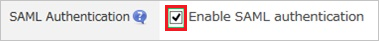
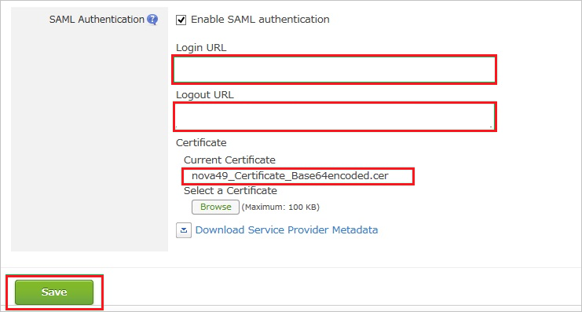
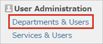
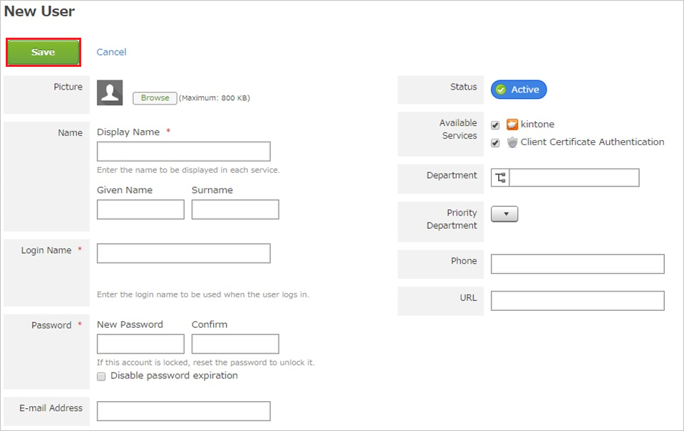

# Tutorial: Microsoft Entra SSO integration with Kintone

In this tutorial, you'll learn how to integrate Kintone with Microsoft Entra ID. When you integrate Kintone with Microsoft Entra ID, you can:

* Control in Microsoft Entra ID who has access to Kintone.
* Enable your users to be automatically signed-in to Kintone with their Microsoft Entra accounts.
* Manage your accounts in one central location.

## Prerequisites

To configure Microsoft Entra integration with Kintone, you need the following items:

* A Microsoft Entra subscription. If you don't have a Microsoft Entra environment, you can get a [free account](https://azure.microsoft.com/free/).
* Kintone single sign-on enabled subscription.

## Scenario description

In this tutorial, you configure and test Microsoft Entra single sign-on in a test environment.

* Kintone supports **SP** initiated SSO.

## Add Kintone from the gallery

To configure the integration of Kintone into Microsoft Entra ID, you need to add Kintone from the gallery to your list of managed SaaS apps.

1. Sign in to the [Microsoft Entra admin center](https://entra.microsoft.com) as at least a [Cloud Application Administrator](../roles/permissions-reference.md#cloud-application-administrator).
1. Browse to **Identity** > **Applications** > **Enterprise applications** > **New application**.
1. In the **Add from the gallery** section, type **Kintone** in the search box.
1. Select **Kintone** from results panel and then add the app. Wait a few seconds while the app is added to your tenant.

 Alternatively, you can also use the [Enterprise App Configuration Wizard](https://portal.office.com/AdminPortal/home?Q=Docs#/azureadappintegration). In this wizard, you can add an application to your tenant, add users/groups to the app, assign roles, as well as walk through the SSO configuration as well. [Learn more about Microsoft 365 wizards.](/microsoft-365/admin/misc/azure-ad-setup-guides)

## Configure and test Microsoft Entra SSO for Kintone

Configure and test Microsoft Entra SSO with Kintone using a test user called **B.Simon**. For SSO to work, you need to establish a link relationship between a Microsoft Entra user and the related user in Kintone.

To configure and test Microsoft Entra SSO with Kintone, perform the following steps:

1. **[Configure Microsoft Entra SSO](#configure-azure-ad-sso)** - to enable your users to use this feature.
    1. **[Create a Microsoft Entra test user](#create-an-azure-ad-test-user)** - to test Microsoft Entra single sign-on with B.Simon.
    1. **[Assign the Microsoft Entra test user](#assign-the-azure-ad-test-user)** - to enable B.Simon to use Microsoft Entra single sign-on.
1. **[Configure Kintone SSO](#configure-kintone-sso)** - to configure the single sign-on settings on application side.
    1. **[Create Kintone test user](#create-kintone-test-user)** - to have a counterpart of B.Simon in Kintone that is linked to the Microsoft Entra representation of user.
1. **[Test SSO](#test-sso)** - to verify whether the configuration works.

## Configure Microsoft Entra SSO

Follow these steps to enable Microsoft Entra SSO.

1. Sign in to the [Microsoft Entra admin center](https://entra.microsoft.com) as at least a [Cloud Application Administrator](../roles/permissions-reference.md#cloud-application-administrator).
1. Browse to **Identity** > **Applications** > **Enterprise applications** > **Kintone** > **Single sign-on**.
1. On the **Select a single sign-on method** page, select **SAML**.
1. On the **Set up single sign-on with SAML** page, click the pencil icon for **Basic SAML Configuration** to edit the settings.

   

1. On the **Basic SAML Configuration** section, perform the following steps:

    a. In the **Identifier (Entity ID)** text box, type a URL using the following pattern:
	`https://<companyname>.kintone.com`
    
    b. In the **Sign on URL** text box, type a URL using the following pattern:
    `https://<companyname>.kintone.com`

	> [!NOTE]
	> These values are not real. Update these values with the actual Identifier and Sign on URL. Contact [Kintone Client support team](https://www.kintone.com/contact/) to get these values. You can also refer to the patterns shown in the **Basic SAML Configuration** section.

1. On the **Set up Single Sign-On with SAML** page, in the **SAML Signing Certificate** section, click **Download** to download the **Certificate (Base64)** from the given options as per your requirement and save it on your computer.

	

1. On the **Set up Kintone** section, copy the appropriate URL(s) as per your requirement.

	

### Create a Microsoft Entra test user

In this section, you'll create a test user called B.Simon.

1. Sign in to the [Microsoft Entra admin center](https://entra.microsoft.com) as at least a [User Administrator](../roles/permissions-reference.md#user-administrator).
1. Browse to **Identity** > **Users** > **All users**.
1. Select **New user** > **Create new user**, at the top of the screen.
1. In the **User** properties, follow these steps:
   1. In the **Display name** field, enter `B.Simon`.  
   1. In the **User principal name** field, enter the username@companydomain.extension. For example, `B.Simon@contoso.com`.
   1. Select the **Show password** check box, and then write down the value that's displayed in the **Password** box.
   1. Select **Review + create**.
1. Select **Create**.

### Assign the Microsoft Entra test user

In this section, you'll enable B.Simon to use single sign-on by granting access to Kintone.

1. Sign in to the [Microsoft Entra admin center](https://entra.microsoft.com) as at least a [Cloud Application Administrator](../roles/permissions-reference.md#cloud-application-administrator).
1. Browse to **Identity** > **Applications** > **Enterprise applications** > **Kintone**.
1. In the app's overview page, select **Users and groups**.
1. Select **Add user/group**, then select **Users and groups** in the **Add Assignment** dialog.
   1. In the **Users and groups** dialog, select **B.Simon** from the Users list, then click the **Select** button at the bottom of the screen.
   1. If you are expecting a role to be assigned to the users, you can select it from the **Select a role** dropdown. If no role has been set up for this app, you see "Default Access" role selected.
   1. In the **Add Assignment** dialog, click the **Assign** button.

## Configure Kintone SSO

1. In a different web browser window, sign into your **Kintone** company site as an administrator.

1. Click **Settings icon**.

    

1. Click **Users & System Administration**.

    

1. Under **System Administration \> Security** click **Login**.

    

1. Click **Enable SAML authentication**.

    

1. In the SAML Authentication section, perform the following steps:

    

    a. In the **Login URL** textbox, paste the value of **Login URL**..

	b. In the **Logout URL** textbox, paste the value: `https://login.microsoftonline.com/common/wsfederation?wa=wsignout1.0`.

	c. Click **Browse** to upload your downloaded certificate file from Azure portal.

	d. Click **Save**.

### Create Kintone test user

To enable Microsoft Entra users to sign in to Kintone, they must be provisioned into Kintone. In the case of Kintone, provisioning is a manual task.

### To provision a user account, perform the following steps:

1. Sign in to your **Kintone** company site as an administrator.

1. Click **Settings icon**.

    

1. Click **Users & System Administration**.

    

1. Under **User Administration**, click **Departments & Users**.

    

1. Click **New User**.

    

1. In the **New User** section, perform the following steps:

    

    a. Type a **Display Name**, **Login Name**, **New Password**, **Confirm Password**, **E-mail Address**, and other details of a valid Microsoft Entra account you want to provision into the related textboxes.

    b. Click **Save**.

> [!NOTE]
> You can use any other Kintone user account creation tools or APIs provided by Kintone to provision Microsoft Entra user accounts.

## Test SSO

In this section, you test your Microsoft Entra single sign-on configuration with following options. 

* Click on **Test this application**, this will redirect to Kintone Sign-on URL where you can initiate the login flow. 

* Go to Kintone Sign-on URL directly and initiate the login flow from there.

* You can use Microsoft My Apps. When you click the Kintone tile in the My Apps, this will redirect to Kintone Sign-on URL. For more information, see [Microsoft Entra My Apps](/azure/active-directory/manage-apps/end-user-experiences#azure-ad-my-apps).

## Next steps

Once you configure Kintone you can enforce session control, which protects exfiltration and infiltration of your organization’s sensitive data in real time. Session control extends from Conditional Access. [Learn how to enforce session control with Microsoft Defender for Cloud Apps](/cloud-app-security/proxy-deployment-aad).
