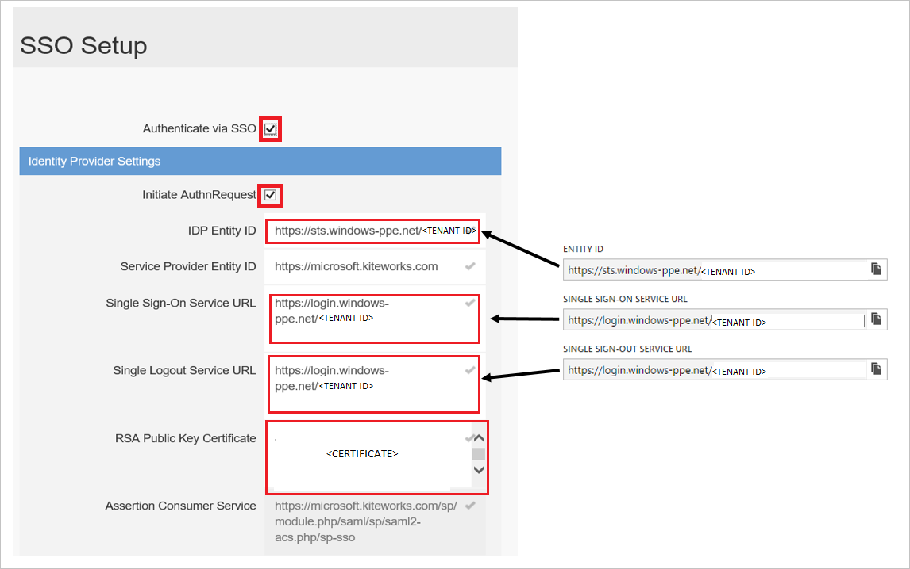

# Tutorial: Integrate Kiteworks with Azure Active Directory

In this tutorial, you'll learn how to integrate Kiteworks with Azure Active Directory (Azure AD). When you integrate Kiteworks with Azure AD, you can:

* Control in Azure AD who has access to Kiteworks.
* Enable your users to be automatically signed-in to Kiteworks with their Azure AD accounts.
* Manage your accounts in one central location - the Azure portal.

To learn more about SaaS app integration with Azure AD, see [What is application access and single sign-on with Azure Active Directory](https://docs.microsoft.com/azure/active-directory/active-directory-appssoaccess-whatis).

## Prerequisites

To get started, you need the following items:

* An Azure AD subscription. If you don't have a subscription, you can get one-month free trial [here](https://azure.microsoft.com/pricing/free-trial/).
* Kiteworks single sign-on (SSO) enabled subscription.

## Scenario description

In this tutorial, you configure and test Azure AD SSO in a test environment.

* Kiteworks supports **SP** initiated SSO
* Kiteworks supports **Just In Time** user provisioning

## Adding Kiteworks from the gallery

To configure the integration of Kiteworks into Azure AD, you need to add Kiteworks from the gallery to your list of managed SaaS apps.

1. Sign in to the [Azure portal](https://portal.azure.com) using either a work or school account, or a personal Microsoft account.
1. On the left navigation pane, select the **Azure Active Directory** service.
1. Navigate to **Enterprise Applications** and then select **All Applications**.
1. To add new application, select **New application**.
1. In the **Add from the gallery** section, type **Kiteworks** in the search box.
1. Select **Kiteworks** from results panel and then add the app. Wait a few seconds while the app is added to your tenant.

## Configure and test Azure AD single sign-on

Configure and test Azure AD SSO with Kiteworks using a test user called **B.Simon**. For SSO to work, you need to establish a link relationship between an Azure AD user and the related user in Kiteworks.

To configure and test Azure AD SSO with Kiteworks, complete the following building blocks:

1. **[Configure Azure AD SSO](#configure-azure-ad-sso)** - to enable your users to use this feature.
2. **[Configure Kiteworks SSO](#configure-kiteworks-sso)** - to configure the Single Sign-On settings on application side.
3. **[Create an Azure AD test user](#create-an-azure-ad-test-user)** - to test Azure AD single sign-on with Britta Simon.
4. **[Assign the Azure AD test user](#assign-the-azure-ad-test-user)** - to enable Britta Simon to use Azure AD single sign-on.
5. **[Create Kiteworks test user](#create-kiteworks-test-user)** - to have a counterpart of Britta Simon in Kiteworks that is linked to the Azure AD representation of user.
6. **[Test SSO](#test-sso)** - to verify whether the configuration works.

### Configure Azure AD SSO

Follow these steps to enable Azure AD SSO in the Azure portal.

1. In the [Azure portal](https://portal.azure.com/), on the **Kiteworks** application integration page, find the **Manage** section and select **Single sign-on**.
1. On the **Select a Single sign-on method** page, select **SAML**.
1. On the **Set up Single Sign-On with SAML** page, click the edit/pen icon for **Basic SAML Configuration** to edit the settings.

   

1. On the **Basic SAML Configuration** section, enter the values for the following fields:

	a. In the **Sign on URL** text box, type a URL using the following pattern:
    `https://<kiteworksURL>.kiteworks.com`

    b. In the **Identifier (Entity ID)** text box, type a URL using the following pattern:
    `https://<kiteworksURL>/sp/module.php/saml/sp/saml2-acs.php/sp-sso`

	> [!NOTE]
	> These values are not real. Update these values with the actual Sign on URL and Identifier. Contact [Kiteworks Client support team](https://accellion.com/support) to get these values. You can also refer to the patterns shown in the **Basic SAML Configuration** section in the Azure portal.

1. On the **Set up Single Sign-On with SAML** page, in the **SAML Signing Certificate** section,  find **Certificate (Base64)** and select **Download** to download the certificate and save it on your computer.

	

1. On the **Set up Kiteworks** section, copy the appropriate URL(s) based on your requirement.

	

### Configure Kiteworks SSO

1. Sign on to your Kiteworks company site as an administrator.

1. In the toolbar on the top, click **Settings**.

    

1. In the **Authentication and Authorization** section, click **SSO Setup**.

    

1. On the SSO Setup page, perform the following steps:

    

    a. Select **Authenticate via SSO**.

    b. Select **Initiate AuthnRequest**.

    c. In the **IDP Entity ID** textbox, paste the value of **Azure AD Identifier**, which you have copied from Azure portal.

    d. In the **Single Sign-On Service URL** textbox, paste the value of **Login URL**, which you have copied from Azure portal.

    e. In the **Single Logout Service URL** textbox, paste the value of **Logout URL**, which you have copied from Azure portal.

    f. Open your downloaded certificate in Notepad, copy the content, and then paste it into the **RSA Public Key Certificate** textbox.

    g. Click **Save**.

### Create an Azure AD test user

In this section, you'll create a test user in the Azure portal called B.Simon.

1. From the left pane in the Azure portal, select **Azure Active Directory**, select **Users**, and then select **All users**.
1. Select **New user** at the top of the screen.
1. In the **User** properties, follow these steps:
   1. In the **Name** field, enter `B.Simon`.
   1. In the **User name** field, enter the username@companydomain.extension. For example, `B.Simon@contoso.com`.
   1. Select the **Show password** check box, and then write down the value that's displayed in the **Password** box.
   1. Click **Create**.

### Assign the Azure AD test user

In this section, you'll enable B.Simon to use Azure single sign-on by granting access to Kiteworks.

1. In the Azure portal, select **Enterprise Applications**, and then select **All applications**.
1. In the applications list, select **Kiteworks**.
1. In the app's overview page, find the **Manage** section and select **Users and groups**.

   

1. Select **Add user**, then select **Users and groups** in the **Add Assignment** dialog.

	

1. In the **Users and groups** dialog, select **B.Simon** from the Users list, then click the **Select** button at the bottom of the screen.
1. If you're expecting any role value in the SAML assertion, in the **Select Role** dialog, select the appropriate role for the user from the list and then click the **Select** button at the bottom of the screen.
1. In the **Add Assignment** dialog, click the **Assign** button.

### Create Kiteworks test user

The objective of this section is to create a user called Britta Simon in Kiteworks.

Kiteworks supports just-in-time provisioning, which is by default enabled. There is no action item for you in this section. A new user is created during an attempt to access Kiteworks if it doesn't exist yet.

> [!NOTE]
> If you need to create a user manually, you need to contact the [Kiteworks support team](https://accellion.com/support).

### Test SSO

In this section, you test your Azure AD single sign-on configuration using the Access Panel.

When you click the Kiteworks tile in the Access Panel, you should be automatically signed in to the Kiteworks for which you set up SSO. For more information about the Access Panel, see [Introduction to the Access Panel](https://docs.microsoft.com/azure/active-directory/active-directory-saas-access-panel-introduction).

## Additional Resources

- [List of Tutorials on How to Integrate SaaS Apps with Azure Active Directory](https://docs.microsoft.com/azure/active-directory/active-directory-saas-tutorial-list)

- [What is application access and single sign-on with Azure Active Directory?](https://docs.microsoft.com/azure/active-directory/active-directory-appssoaccess-whatis)

- [What is conditional access in Azure Active Directory?](https://docs.microsoft.com/azure/active-directory/conditional-access/overview)
