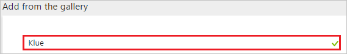
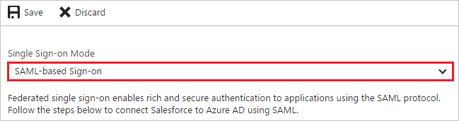
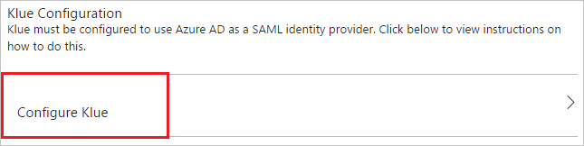

---
title: 'Tutorial: Azure Active Directory integration with Klue | Microsoft Docs'
description: Learn how to configure single sign-on between Azure Active Directory and Klue.
services: active-directory
documentationCenter: na
author: jeevansd
manager: mtillman

ms.assetid: 08341008-980b-4111-adb2-97bbabbf1e47
ms.service: active-directory
ms.component: saas-app-tutorial
ms.workload: identity
ms.tgt_pltfrm: na
ms.devlang: na
ms.topic: article
ms.date: 08/28/2018
ms.author: jeedes

---
# Tutorial: Azure Active Directory integration with Klue

In this tutorial, you learn how to integrate Klue with Azure Active Directory (Azure AD).

Integrating Klue with Azure AD provides you with the following benefits:

- You can control in Azure AD who has access to Klue
- You can enable your users to automatically get signed-on to Klue (Single Sign-On) with their Azure AD accounts
- You can manage your accounts in one central location - the Azure portal

If you want to know more details about SaaS app integration with Azure AD, see [what is application access and single sign-on with Azure Active Directory](../manage-apps/what-is-single-sign-on.md).

## Prerequisites

To configure Azure AD integration with Klue, you need the following items:

- An Azure AD subscription
- A Klue single sign-on enabled subscription

> [!NOTE]
> To test the steps in this tutorial, we do not recommend using a production environment.

To test the steps in this tutorial, you should follow these recommendations:

- Do not use your production environment, unless it is necessary.
- If you don't have an Azure AD trial environment, you can get a one-month trial [here](https://azure.microsoft.com/pricing/free-trial/).

## Scenario description

In this tutorial, you test Azure AD single sign-on in a test environment. 
The scenario outlined in this tutorial consists of two main building blocks:

1. Adding Klue from the gallery
2. Configuring and testing Azure AD single sign-on

## Adding Klue from the gallery

To configure the integration of Klue into Azure AD, you need to add Klue from the gallery to your list of managed SaaS apps.

**To add Klue from the gallery, perform the following steps:**

1. In the **[Azure portal](https://portal.azure.com)**, on the left navigation panel, click **Azure Active Directory** icon. 

	![Active Directory][1]

2. Navigate to **Enterprise applications**. Then go to **All applications**.

	![Applications][2]

3. To add new application, click **New application** button on the top of dialog.

	![Applications][3]

4. In the search box, type **Klue**.

	

5. In the results panel, select **Klue**, and then click **Add** button to add the application.

	

##  Configuring and testing Azure AD single sign-on

In this section, you configure and test Azure AD single sign-on with Klue based on a test user called "Britta Simon".

For single sign-on to work, Azure AD needs to know what the counterpart user in Klue is to a user in Azure AD. In other words, a link relationship between an Azure AD user and the related user in Klue needs to be established.

In Klue, assign the value of the **user name** in Azure AD as the value of the **Username** to establish the link relationship.

To configure and test Azure AD single sign-on with Klue, you need to complete the following building blocks:

1. **[Configuring Azure AD Single Sign-On](#configuring-azure-ad-single-sign-on)** - to enable your users to use this feature.
2. **[Creating an Azure AD test user](#creating-an-azure-ad-test-user)** - to test Azure AD single sign-on with Britta Simon.
3. **[Creating a Klue test user](#creating-a-klue-test-user)** - to have a counterpart of Britta Simon in Klue that is linked to the Azure AD representation of user.
4. **[Assigning the Azure AD test user](#assigning-the-azure-ad-test-user)** - to enable Britta Simon to use Azure AD single sign-on.
5. **[Testing Single Sign-On](#testing-single-sign-on)** - to verify whether the configuration works.

### Configuring Azure AD single sign-on

In this section, you enable Azure AD single sign-on in the Azure portal and configure single sign-on in your Klue application.

**To configure Azure AD single sign-on with Klue, perform the following steps:**

1. In the Azure portal, on the **Klue** application integration page, click **Single sign-on**.

	![Configure Single Sign-On][4]

2. On the **Single sign-on** dialog, select **Mode** as	**SAML-based Sign-on** to enable single sign-on.

	

3. On the **Klue Domain and URLs** section, If you wish to configure the application in **IDP** initiated mode:

	

    a. In the **Identifier** textbox, type a URL using the following pattern: `urn:klue:<Customer ID>`

	b. In the **Reply URL** textbox, type a URL using the following pattern: `https://app.klue.com/account/auth/saml/<Customer UUID>/callback`

4. Check **Show advanced URL settings**. If you wish to configure the application in **SP** initiated mode:

	

    In the **Sign-on URL** textbox, type a URL using the following pattern: `https://app.klue.com/account/auth/saml/<Customer UUID>/`

	> [!NOTE]
	> These values are not real. Update these values with the actual Reply URL, Identifier, and Sign-On URL. Contact [Klue Client support team](mailto:support@klue.com) to get these values.

5. The Klue application expects the SAML assertions in a specific format, which requires you to add custom attribute mappings to your SAML token attributes configuration. You can manage the values of these attributes from the "**User Attributes**" section on application integration page.

	

6. In the **User Attributes** section on the **Single sign-on** dialog, configure SAML token attribute as shown in the preceding image and perform the following steps:

	| Attribute Name      | Attribute Value      |
	| ------------------- | -------------------- |
	| first_name          | user.givenname |
	| last_name 		  | user.surname |
	| email               | user.userprincipalname|

	a. Click **Add attribute** to open the **Add Attribute** dialog.

	

	

	b. In the **Name** textbox, type the attribute name shown for that row.

	c. From the **Value** list, type the attribute value shown for that row.

	d. Click **Ok**.

	> [!NOTE]
	> Please leave the **Namespace** value blank.

7. On the **SAML Signing Certificate** section, click **Certificate(Base64)** and then save the certificate file on your computer.

	 

8. Click **Save** button.

	

9. On the **Klue Configuration** section, click **Configure Klue** to open **Configure sign-on** window. Copy the **SAML Entity ID and SAML Single Sign-On Service URL** from the **Quick Reference section.**

	 

10. To configure single sign-on on **Klue** side, you need to send the downloaded **Certificate(Base64), SAML Single Sign-On Service URL, and SAML Entity ID** to [Klue support team](mailto:support@klue.com).

### Creating an Azure AD test user

The objective of this section is to create a test user in the Azure portal called Britta Simon.

![Create Azure AD User][100]

**To create a test user in Azure AD, perform the following steps:**

1. In the **Azure portal**, on the left navigation pane, click **Azure Active Directory** icon.

	

2. To display the list of users, go to **Users and groups** and click **All users**.

	

3. To open the **User** dialog, click **Add** on the top of the dialog.

	

4. On the **User** dialog page, perform the following steps:

	 

    a. In the **Name** textbox, type **BrittaSimon**.

    b. In the **User name** textbox, type the **email address** of BrittaSimon.

	c. Select **Show Password** and write down the value of the **Password**.

    d. Click **Create**.

### Creating a Klue test user

The objective of this section is to create a user called Britta Simon in Klue. Klue supports just-in-time provisioning, which is by default enabled. There is no action item for you in this section. A new user is created during an attempt to access Klue if it doesn't exist yet.

> [!Note]
> If you need to create a user manually, Contact [Klue support team](mailto:support@klue.com).

### Assigning the Azure AD test user

In this section, you enable Britta Simon to use Azure single sign-on by granting access to Klue.

![Assign User][200] 

**To assign Britta Simon to Klue, perform the following steps:**

1. In the Azure portal, open the applications view, and then navigate to the directory view and go to **Enterprise applications** then click **All applications**.

	![Assign User][201] 

2. In the applications list, select **Klue**.

	 

3. In the menu on the left, click **Users and groups**.

	![Assign User][202]

4. Click **Add** button. Then select **Users and groups** on **Add Assignment** dialog.

	![Assign User][203]

5. On **Users and groups** dialog, select **Britta Simon** in the Users list.

6. Click **Select** button on **Users and groups** dialog.

7. Click **Assign** button on **Add Assignment** dialog.

### Testing single sign-on

In this section, you test your Azure AD single sign-on configuration using the Access Panel.

When you click the Klue tile in the Access Panel, you should get automatically signed-on to your Klue application.
For more information about the Access Panel, see [Introduction to the Access Panel](../user-help/active-directory-saas-access-panel-introduction.md). 

## Additional resources

* [List of Tutorials on How to Integrate SaaS Apps with Azure Active Directory](tutorial-list.md)
* [What is application access and single sign-on with Azure Active Directory?](../manage-apps/what-is-single-sign-on.md)

<!--Image references-->

[1]: ./media/klue-tutorial/tutorial_general_01.png
[2]: ./media/klue-tutorial/tutorial_general_02.png
[3]: ./media/klue-tutorial/tutorial_general_03.png
[4]: ./media/klue-tutorial/tutorial_general_04.png

[100]: ./media/klue-tutorial/tutorial_general_100.png

[200]: ./media/klue-tutorial/tutorial_general_200.png
[201]: ./media/klue-tutorial/tutorial_general_201.png
[202]: ./media/klue-tutorial/tutorial_general_202.png
[203]: ./media/klue-tutorial/tutorial_general_203.png