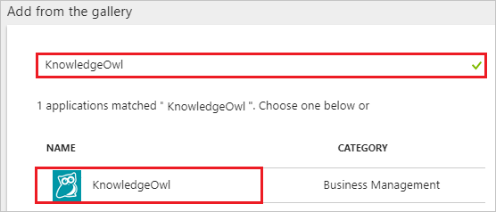
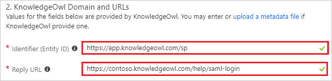
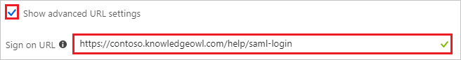
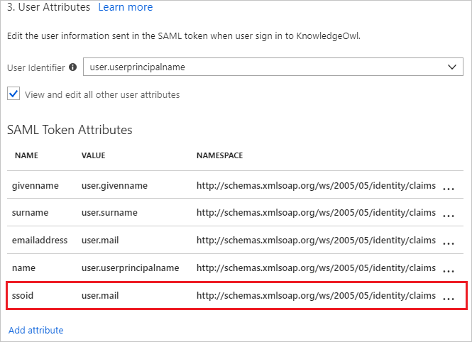
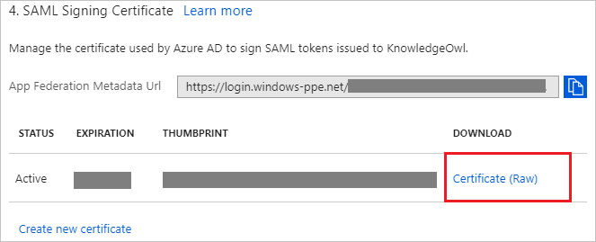
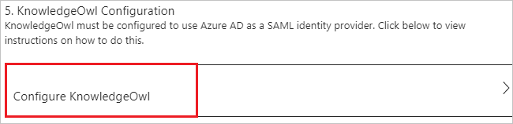
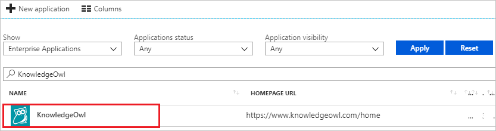

---
title: 'Tutorial: Azure Active Directory integration with KnowledgeOwl | Microsoft Docs'
description: Learn how to configure single sign-on between Azure Active Directory and KnowledgeOwl.
services: active-directory
documentationCenter: na
author: jeevansd
manager: femila
ms.reviewer: joflore

ms.assetid: 2ae30996-864d-4872-90bc-f770e1ea159a
ms.service: active-directory
ms.component: saas-app-tutorial
ms.workload: identity
ms.tgt_pltfrm: na
ms.devlang: na
ms.topic: article
ms.date: 04/27/2018
ms.author: jeedes

---
# Tutorial: Azure Active Directory integration with KnowledgeOwl

In this tutorial, you learn how to integrate KnowledgeOwl with Azure Active Directory (Azure AD).

Integrating KnowledgeOwl with Azure AD provides you with the following benefits:

- You can control in Azure AD who has access to KnowledgeOwl.
- You can enable your users to automatically get signed-on to KnowledgeOwl (Single Sign-On) with their Azure AD accounts.
- You can manage your accounts in one central location - the Azure portal.

If you want to know more details about SaaS app integration with Azure AD, see [what is application access and single sign-on with Azure Active Directory](../manage-apps/what-is-single-sign-on.md).

## Prerequisites

To configure Azure AD integration with KnowledgeOwl, you need the following items:

- An Azure AD subscription
- A KnowledgeOwl single sign-on enabled subscription

> [!NOTE]
> To test the steps in this tutorial, we do not recommend using a production environment.

To test the steps in this tutorial, you should follow these recommendations:

- Do not use your production environment, unless it is necessary.
- If you don't have an Azure AD trial environment, you can [get a one-month trial](https://azure.microsoft.com/pricing/free-trial/).

## Scenario description
In this tutorial, you test Azure AD single sign-on in a test environment. 
The scenario outlined in this tutorial consists of two main building blocks:

1. Adding KnowledgeOwl from the gallery
1. Configuring and testing Azure AD single sign-on

## Adding KnowledgeOwl from the gallery
To configure the integration of KnowledgeOwl into Azure AD, you need to add KnowledgeOwl from the gallery to your list of managed SaaS apps.

**To add KnowledgeOwl from the gallery, perform the following steps:**

1. In the **[Azure portal](https://portal.azure.com)**, on the left navigation panel, click **Azure Active Directory** icon. 

	![The Azure Active Directory button][1]

1. Navigate to **Enterprise applications**. Then go to **All applications**.

	![The Enterprise applications blade][2]
	
1. To add new application, click **New application** button on the top of dialog.

	![The New application button][3]

1. In the search box, type **KnowledgeOwl**, select **KnowledgeOwl** from result panel then click **Add** button to add the application.

	

## Configure and test Azure AD single sign-on

In this section, you configure and test Azure AD single sign-on with KnowledgeOwl based on a test user called "Britta Simon".

For single sign-on to work, Azure AD needs to know what the counterpart user in KnowledgeOwl is to a user in Azure AD. In other words, a link relationship between an Azure AD user and the related user in KnowledgeOwl needs to be established.

To configure and test Azure AD single sign-on with KnowledgeOwl, you need to complete the following building blocks:

1. **[Configure Azure AD Single Sign-On](#configure-azure-ad-single-sign-on)** - to enable your users to use this feature.
1. **[Create an Azure AD test user](#create-an-azure-ad-test-user)** - to test Azure AD single sign-on with Britta Simon.
1. **[Create a KnowledgeOwl test user](#create-a-knowledgeowl-test-user)** - to have a counterpart of Britta Simon in KnowledgeOwl that is linked to the Azure AD representation of user.
1. **[Assign the Azure AD test user](#assign-the-azure-ad-test-user)** - to enable Britta Simon to use Azure AD single sign-on.
1. **[Test single sign-on](#test-single-sign-on)** - to verify whether the configuration works.

### Configure Azure AD single sign-on

In this section, you enable Azure AD single sign-on in the Azure portal and configure single sign-on in your KnowledgeOwl application.

**To configure Azure AD single sign-on with KnowledgeOwl, perform the following steps:**

1. In the Azure portal, on the **KnowledgeOwl** application integration page, click **Single sign-on**.

	![Configure single sign-on link][4]

1. On the **Single sign-on** dialog, select **Mode** as	**SAML-based Sign-on** to enable single sign-on.
 
	

1. On the **KnowledgeOwl Domain and URLs** section, perform the following steps if you wish to configure the application in **IDP** initiated mode:

	

    a. In the **Identifier (Entity ID)** textbox, type a URL using the following pattern:
	|||
	|-|-|
	| `https://app.knowledgeowl.com/sp`|
	| `https://app.knowledgeowl.com/sp/id/<unique ID>`|
	|||

	b. In the **Reply URL** textbox, type a URL using the following pattern:
	|||
	|-|-|
	| `https://subdomain.knowledgeowl.com/help/saml-login`|
	| `https://subdomain.knowledgeowl.com/docs/saml-login`|
	| `https://subdomain.knowledgeowl.com/home/saml-login`|
	| `https://privatedomain.com/help/saml-login`|
	| `https://privatedomain.com/docs/saml-login`|
	| `https://privatedomain.com/home/saml-login`|
	|||

1. Check **Show advanced URL settings** and perform the following step if you wish to configure the application in **SP** initiated mode:

	

    In the **Sign-on URL** textbox, type a URL using the following pattern:
	|||
	|-|-|
	| `https://subdomain.knowledgeowl.com/help/saml-login`|
	| `https://subdomain.knowledgeowl.com/docs/saml-login`|
	| `https://subdomain.knowledgeowl.com/home/saml-login`|
	| `https://privatedomain.com/help/saml-login`|
	| `https://privatedomain.com/docs/saml-login`|
	| `https://privatedomain.com/home/saml-login`|
	|||
	 
	> [!NOTE]
	> These values are not real. You'll need to update these value from actual Identifier, Reply URL, and Sign-On URL which is explained later in the tutorial.

1. The KnowledgeOwl application expects the SAML assertions in a specific format, which requires you to add custom attribute mappings to your SAML token attributes configuration. Configure the following claims for this application. You can manage the values of these attributes from the "**User Attributes**" section on application integration page.

	

1. In the **User Attributes** section on the **Single sign-on** dialog, configure SAML token attribute as shown in the preceding image and perform the following steps:
	
	| Attribute Name | Attribute Value | Namespace|
	| ------------------- | -------------------- | -----|
	| ssoid | user.mail | `http://schemas.xmlsoap.org/ws/2005/05/identity/claims`|
	
	a. Click **Add attribute** to open the **Add Attribute** dialog.
	
	

	

	b. In the **Name** textbox, type the attribute name shown for that row.
	
	c. From the **Value** list, type the attribute value shown for that row.

	d.From the **Namespace** list, enter the namespace value shown for that row.
	
	e. Click **Ok**.

1. On the **SAML Signing Certificate** section, click **Certificate (Raw)** and then save the certificate file on your computer.

	 

1. Click **Save** button.

	
	
1. On the **KnowledgeOwl Configuration** section, click **Configure KnowledgeOwl** to open **Configure sign-on** window. Copy the **Sign-Out URL, SAML Entity ID, and SAML Single Sign-On Service URL** from the **Quick Reference section.**

	

1. In a different web browser window, log into your KnowledgeOwl company site as an administrator.

1. Click on **Settings** and then select **Security**.

	

1. Scroll down upto the **SAML SSO Integration** and perform the following steps:
	
	

	a. Select **Enable SAML SSO**.

	b. Copy the **SP Entity ID** value and paste it into the **Identifier (Entity ID)** in the **KnowledgeOwl Domain and URLs** section on the Azure portal.

	c. Copy the **SP Login URL** value and paste it into the **Sign-on URL and Reply URL** textboxes in the **KnowledgeOwl Domain and URLs** section on the Azure portal.

	d. In the **IdP entityID** textbox, paste the **SAML Entity ID** value, which you have copied from the Azure portal.

	e. In the **IdP Login URL** textbox, paste the **SAML Single Sign-On Service URL** value, which you have copied from the Azure portal.

	f. In the **IdP Logout URL** textbox, paste the **Sign-Out URL** value, which you have copied from the Azure portal

	g. Upload the downloaded certificate form the Azure portal by clicking the **Upload IdP Certificate**.

	h. Click on **Map SAML Attributes** to map attributes and perform the following steps:
	
	

	* Enter `http://schemas.xmlsoap.org/ws/2005/05/identity/claims/ssoid` into the **SSO ID** textbox
	* Enter `http://schemas.xmlsoap.org/ws/2005/05/identity/claims/emailaddress` into the **Username/Email** textbox.
	* Enter `http://schemas.xmlsoap.org/ws/2005/05/identity/claims/givenname` into the **First Name** textbox.
	* Enter `http://schemas.xmlsoap.org/ws/2005/05/identity/claims/surname` into the **Last Name** textbox.
	* Click **Save**

	i. Click **Save** at the bottom of the page.

	

### Create an Azure AD test user

The objective of this section is to create a test user in the Azure portal called Britta Simon.

   ![Create an Azure AD test user][100]

**To create a test user in Azure AD, perform the following steps:**

1. In the Azure portal, in the left pane, click the **Azure Active Directory** button.

    

1. To display the list of users, go to **Users and groups**, and then click **All users**.

    

1. To open the **User** dialog box, click **Add** at the top of the **All Users** dialog box.

    

1. In the **User** dialog box, perform the following steps:

    

    a. In the **Name** box, type **BrittaSimon**.

    b. In the **User name** box, type the email address of user Britta Simon.

    c. Select the **Show Password** check box, and then write down the value that's displayed in the **Password** box.

    d. Click **Create**.
 
### Create a KnowledgeOwl test user

The objective of this section is to create a user called Britta Simon in KnowledgeOwl. KnowledgeOwl supports just-in-time provisioning, which is by default enabled. There is no action item for you in this section. A new user is created during an attempt to access KnowledgeOwl if it doesn't exist yet.
>[!Note]
>If you need to create a user manually, contact [KnowledgeOwl support team](mailto:support@knowledgeowl.com).

### Assign the Azure AD test user

In this section, you enable Britta Simon to use Azure single sign-on by granting access to KnowledgeOwl.

![Assign the user role][200] 

**To assign Britta Simon to KnowledgeOwl, perform the following steps:**

1. In the Azure portal, open the applications view, and then navigate to the directory view and go to **Enterprise applications** then click **All applications**.

	![Assign User][201] 

1. In the applications list, select **KnowledgeOwl**.

	  

1. In the menu on the left, click **Users and groups**.

	![The "Users and groups" link][202]

1. Click **Add** button. Then select **Users and groups** on **Add Assignment** dialog.

	![The Add Assignment pane][203]

1. On **Users and groups** dialog, select **Britta Simon** in the Users list.

1. Click **Select** button on **Users and groups** dialog.

1. Click **Assign** button on **Add Assignment** dialog.
	
### Test single sign-on

In this section, you test your Azure AD single sign-on configuration using the Access Panel.

When you click the KnowledgeOwl tile in the Access Panel, you should get automatically signed-on to your KnowledgeOwl application.
For more information about the Access Panel, see [Introduction to the Access Panel](../user-help/active-directory-saas-access-panel-introduction.md). 

## Additional resources

* [List of Tutorials on How to Integrate SaaS Apps with Azure Active Directory](tutorial-list.md)
* [What is application access and single sign-on with Azure Active Directory?](../manage-apps/what-is-single-sign-on.md)

<!--Image references-->

[1]: ./media/knowledgeowl-tutorial/tutorial_general_01.png
[2]: ./media/knowledgeowl-tutorial/tutorial_general_02.png
[3]: ./media/knowledgeowl-tutorial/tutorial_general_03.png
[4]: ./media/knowledgeowl-tutorial/tutorial_general_04.png

[100]: ./media/knowledgeowl-tutorial/tutorial_general_100.png

[200]: ./media/knowledgeowl-tutorial/tutorial_general_200.png
[201]: ./media/knowledgeowl-tutorial/tutorial_general_201.png
[202]: ./media/knowledgeowl-tutorial/tutorial_general_202.png
[203]: ./media/knowledgeowl-tutorial/tutorial_general_203.png

