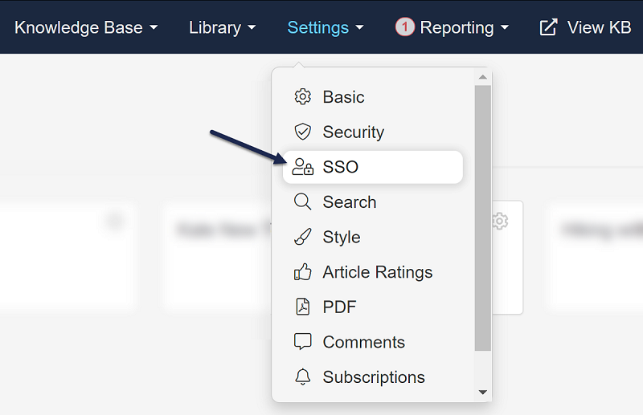
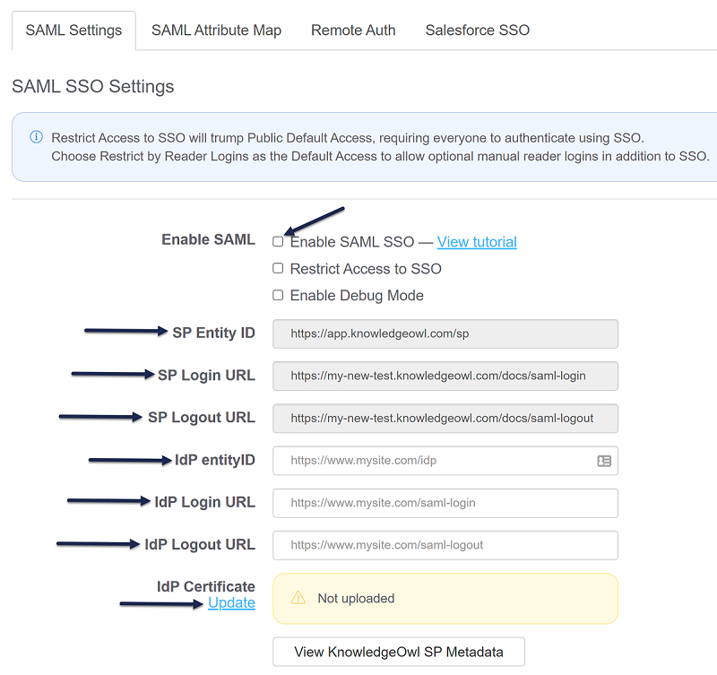
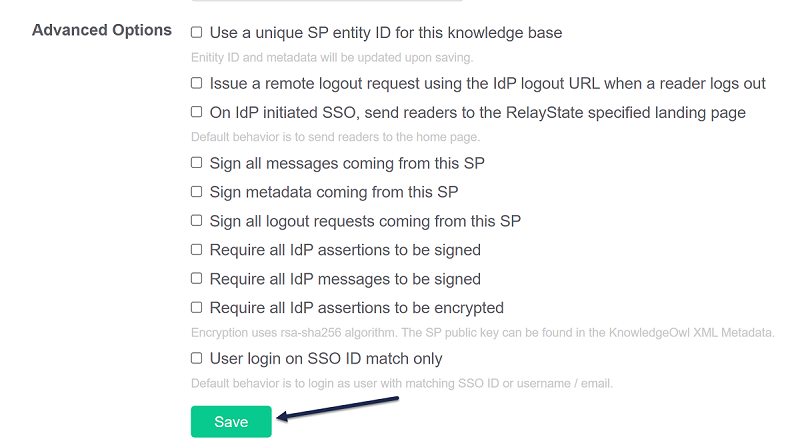
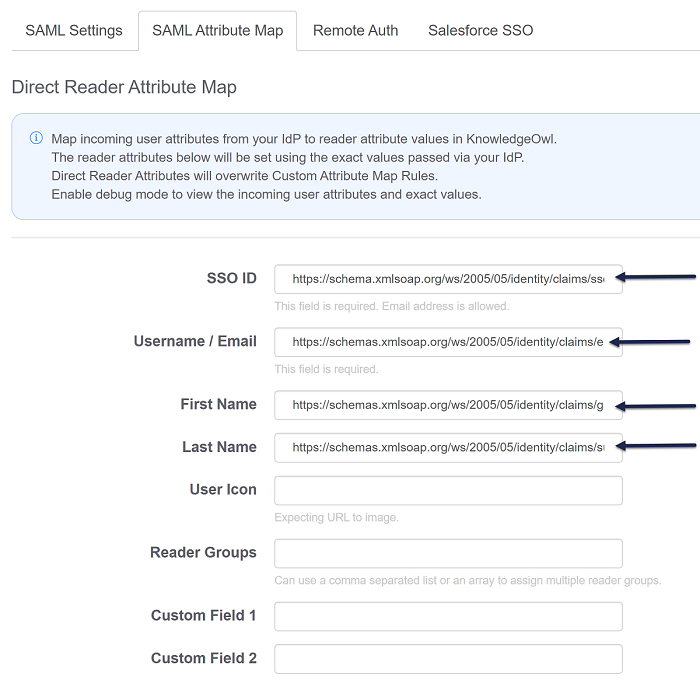
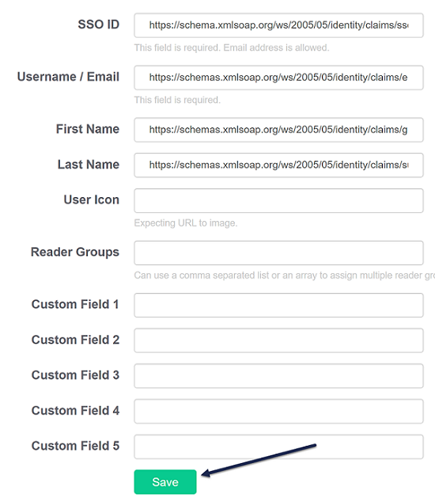

# Tutorial: Azure Active Directory single sign-on (SSO) integration with KnowledgeOwl

In this tutorial, you'll learn how to integrate KnowledgeOwl with Azure Active Directory (Azure AD). When you integrate KnowledgeOwl with Azure AD, you can:

* Control in Azure AD who has access to KnowledgeOwl.
* Enable your users to be automatically signed-in to KnowledgeOwl with their Azure AD accounts.
* Manage your accounts in one central location - the Azure portal.

## Prerequisites

To get started, you need the following items:

* An Azure AD subscription. If you don't have a subscription, you can get a [free account](https://azure.microsoft.com/free/).
* KnowledgeOwl single sign-on (SSO) enabled subscription.

## Scenario description

In this tutorial, you configure and test Azure AD SSO in a test environment.

* KnowledgeOwl supports **SP and IDP** initiated SSO.
* KnowledgeOwl supports **Just In Time** user provisioning.

## Add KnowledgeOwl from the gallery

To configure the integration of KnowledgeOwl into Azure AD, you need to add KnowledgeOwl from the gallery to your list of managed SaaS apps.

1. Sign in to the Azure portal using either a work or school account, or a personal Microsoft account.
1. On the left navigation pane, select the **Azure Active Directory** service.
1. Navigate to **Enterprise Applications** and then select **All Applications**.
1. To add new application, select **New application**.
1. In the **Add from the gallery** section, type **KnowledgeOwl** in the search box.
1. Select **KnowledgeOwl** from results panel and then add the app. Wait a few seconds while the app is added to your tenant.

## Configure and test Azure AD SSO for KnowledgeOwl

Configure and test Azure AD SSO with KnowledgeOwl using a test user called **B.Simon**. For SSO to work, you need to establish a link relationship between an Azure AD user and the related user in KnowledgeOwl.

To configure and test Azure AD SSO with KnowledgeOwl, perform the following steps:

1. **[Configure Azure AD SSO](#configure-azure-ad-sso)** - to enable your users to use this feature.
    1. **[Create an Azure AD test user](#create-an-azure-ad-test-user)** - to test Azure AD single sign-on with B.Simon.
    1. **[Assign the Azure AD test user](#assign-the-azure-ad-test-user)** - to enable B.Simon to use Azure AD single sign-on.
1. **[Configure KnowledgeOwl SSO](#configure-knowledgeowl-sso)** - to configure the single sign-on settings on application side.
    1. **[Create KnowledgeOwl test user](#create-knowledgeowl-test-user)** - to have a counterpart of B.Simon in KnowledgeOwl that is linked to the Azure AD representation of user.
1. **[Test SSO](#test-sso)** - to verify whether the configuration works.

## Configure Azure AD SSO

Follow these steps to enable Azure AD SSO in the Azure portal.

1. In the Azure portal, on the **KnowledgeOwl** application integration page, find the **Manage** section and select **single sign-on**.
1. On the **Select a single sign-on method** page, select **SAML**.
1. On the **Set up single sign-on with SAML** page, click the pencil icon for **Basic SAML Configuration** to edit the settings.

   

1. On the **Basic SAML Configuration** section, if you wish to configure the application in **IDP** initiated mode, enter the values for the following fields:

    a. In the **Identifier** text box, type the URL using one of the following patterns:
	
    ```http
    https://app.knowledgeowl.com/sp
    https://app.knowledgeowl.com/sp/id/<unique ID>
    ```

	b. In the **Reply URL** text box, type the URL using one of the following patterns:
	
    ```http
    https://subdomain.knowledgeowl.com/help/saml-login
    https://subdomain.knowledgeowl.com/docs/saml-login
    https://subdomain.knowledgeowl.com/home/saml-login
    https://privatedomain.com/help/saml-login
    https://privatedomain.com/docs/saml-login
    https://privatedomain.com/home/saml-login
    ```

1. Click **Set additional URLs** and perform the following step if you wish to configure the application in **SP** initiated mode:

    In the **Sign-on URL** text box, type the URL using one of the following patterns:
	
    ```http
    https://subdomain.knowledgeowl.com/help/saml-login
    https://subdomain.knowledgeowl.com/docs/saml-login
    https://subdomain.knowledgeowl.com/home/saml-login
    https://privatedomain.com/help/saml-login
    https://privatedomain.com/docs/saml-login
    https://privatedomain.com/home/saml-login
    ```

	> [!NOTE]
	> These values are not real. You'll need to update these value from actual Identifier, Reply URL, and Sign-On URL which is explained later in the tutorial.

1. KnowledgeOwl application expects the SAML assertions in a specific format, which requires you to add custom attribute mappings to your SAML token attributes configuration. The following screenshot shows the list of default attributes.

	

1. In addition to above, KnowledgeOwl application expects few more attributes to be passed back in SAML response which are shown below. These attributes are also pre populated but you can review them as per your requirements.

	| Name | Source Attribute | Namespace |
	| ------------ | -------------------- | -----|
	| ssoid | user.mail | `http://schemas.xmlsoap.org/ws/2005/05/identity/claims`|

1. On the **Set up single sign-on with SAML** page, in the **SAML Signing Certificate** section,  find **Certificate (Raw)** and select **Download** to download the certificate and save it on your computer.

	

1. On the **Set up KnowledgeOwl** section, copy the appropriate URL(s) based on your requirement.

	

### Create an Azure AD test user

In this section, you'll create a test user in the Azure portal called B.Simon.

1. From the left pane in the Azure portal, select **Azure Active Directory**, select **Users**, and then select **All users**.
1. Select **New user** at the top of the screen.
1. In the **User** properties, follow these steps:
   1. In the **Name** field, enter `B.Simon`.  
   1. In the **User name** field, enter the username@companydomain.extension. For example, `B.Simon@contoso.com`.
   1. Select the **Show password** check box, and then write down the value that's displayed in the **Password** box.
   1. Click **Create**.

### Assign the Azure AD test user

In this section, you'll enable B.Simon to use Azure single sign-on by granting access to KnowledgeOwl.

1. In the Azure portal, select **Enterprise Applications**, and then select **All applications**.
1. In the applications list, select **KnowledgeOwl**.
1. In the app's overview page, find the **Manage** section and select **Users and groups**.
1. Select **Add user**, then select **Users and groups** in the **Add Assignment** dialog.
1. In the **Users and groups** dialog, select **B.Simon** from the Users list, then click the **Select** button at the bottom of the screen.
1. If you are expecting a role to be assigned to the users, you can select it from the **Select a role** dropdown. If no role has been set up for this app, you see "Default Access" role selected.
1. In the **Add Assignment** dialog, click the **Assign** button.

## Configure KnowledgeOwl SSO

1. In a different web browser window, sign in to your KnowledgeOwl company site as an administrator.

1. Click on **Settings** and then select **SSO**.

	

1. In the Scroll to **SAML Settings** tab, perform the following steps:

	

	a. Select **Enable SAML SSO**.

	b. Copy the **SP Entity ID** value and paste it into the **Identifier (Entity ID)** in the **Basic SAML Configuration** section on the Azure portal.

	c. Copy the **SP Login URL** value and paste it into the **Sign-on URL and Reply URL** textboxes in the **Basic SAML Configuration** section on the Azure portal.

	d. In the **IdP entityID** textbox, paste the **Azure AD Identifier** value, which you have copied from the Azure portal.

	e. In the **IdP Login URL** textbox, paste the **Login URL** value, which you have copied from the Azure portal.

	f. In the **IdP Logout URL** textbox, paste the **Logout URL** value, which you have copied from the Azure portal.

	g. Upload the downloaded certificate form the Azure portal by clicking the **Upload** link beneath **IdP Certificate**.
	
	h. Click **Save** at the bottom of the page.
	
	

	i. Open the **SAML Attribute Map** tab to map attributes and perform the following steps:

	

	* Enter `http://schemas.xmlsoap.org/ws/2005/05/identity/claims/ssoid` into the **SSO ID** textbox.
	* Enter `http://schemas.xmlsoap.org/ws/2005/05/identity/claims/emailaddress` into the **Username/Email** textbox.
	* Enter `http://schemas.xmlsoap.org/ws/2005/05/identity/claims/givenname` into the **First Name** textbox.
	* Enter `http://schemas.xmlsoap.org/ws/2005/05/identity/claims/surname` into the **Last Name** textbox.

	j. Click **Save** at the bottom of the page.

	

### Create KnowledgeOwl test user

In this section, a user called B.Simon is created in KnowledgeOwl. KnowledgeOwl supports just-in-time user provisioning, which is enabled by default. There is no action item for you in this section. If a user doesn't already exist in KnowledgeOwl, a new one is created after authentication.

> [!Note]
> If you need to create a user manually, contact [KnowledgeOwl support team](mailto:support@knowledgeowl.com).

## Test SSO

In this section, you test your Azure AD single sign-on configuration with following options. 

#### SP initiated:

* Click on **Test this application** in Azure portal. This will redirect to KnowledgeOwl Sign on URL where you can initiate the login flow.  

* Go to the KnowledgeOwl sign-on URL directly and initiate the login flow from there.

#### IDP initiated:

* Click on **Test this application** in the Azure portal and you should be automatically signed in to the KnowledgeOwl application for which you set up the SSO. 

You can also use Microsoft My Apps to test the application in any mode. When you click the KnowledgeOwl tile in My Apps, if configured in SP mode you would be redirected to the application sign on page for initiating the login flow and if configured in IDP mode, you should be automatically signed in to the KnowledgeOwl application for which you set up the SSO. For more information about My Apps, see [Introduction to My Apps](../user-help/my-apps-portal-end-user-access.md).

## Next steps

Once you configure KnowledgeOwl, you can enforce session control, which protects exfiltration and infiltration of your organization’s sensitive data in real time. Session control extends from Conditional Access. [Learn how to enforce session control with Microsoft Cloud App Security](/cloud-app-security/proxy-deployment-any-app).
