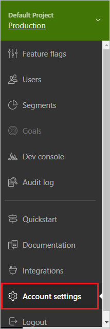
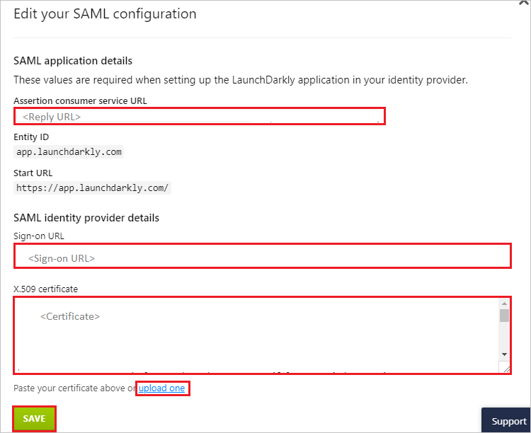

# Tutorial: Azure Active Directory integration with LaunchDarkly

In this tutorial, you'll learn how to integrate LaunchDarkly with Azure Active Directory (Azure AD). When you integrate LaunchDarkly with Azure AD, you can:

* Control in Azure AD who has access to LaunchDarkly.
* Enable your users to be automatically signed-in to LaunchDarkly with their Azure AD accounts.
* Manage your accounts in one central location - the Azure portal.

	> [!NOTE]
	> The LaunchDarkly Azure Active Directory integration is one-way. After you configure the integration, you can use Azure AD to manage users, SSO, and accounts in LaunchDarkly, but you **cannot** use LaunchDarkly to manage users, SSO, and accounts in Azure.

## Prerequisites

To get started, you need the following items:

* An Azure AD subscription. If you don't have a subscription, you can get a [free account](https://azure.microsoft.com/free/).
* LaunchDarkly single sign-on enabled subscription.

## Scenario description

In this tutorial, you configure and test Azure AD single sign-on in a test environment.

* LaunchDarkly supports **IDP** initiated SSO.
* LaunchDarkly supports **Just In Time** user provisioning.

> [!NOTE]
> Identifier of this application is a fixed string value so only one instance can be configured in one tenant.

## Add LaunchDarkly from the gallery

To configure the integration of LaunchDarkly into Azure AD, you need to add LaunchDarkly from the gallery to your list of managed SaaS apps.

1. Sign in to the Azure portal using either a work or school account, or a personal Microsoft account.
1. On the left navigation pane, select the **Azure Active Directory** service.
1. Navigate to **Enterprise Applications** and then select **All Applications**.
1. To add new application, select **New application**.
1. In the **Add from the gallery** section, type **LaunchDarkly** in the search box.
1. Select **LaunchDarkly** from results panel and then add the app. Wait a few seconds while the app is added to your tenant.

 Alternatively, you can also use the [Enterprise App Configuration Wizard](https://portal.office.com/AdminPortal/home?Q=Docs#/azureadappintegration). In this wizard, you can add an application to your tenant, add users/groups to the app, assign roles, as well as walk through the SSO configuration as well. [Learn more about Microsoft 365 wizards.](/microsoft-365/admin/misc/azure-ad-setup-guides)

## Configure and test Azure AD SSO for LaunchDarkly

Configure and test Azure AD SSO with LaunchDarkly using a test user called **B.Simon**. For SSO to work, you need to establish a link relationship between an Azure AD user and the related user in LaunchDarkly.

To configure and test Azure AD SSO with LaunchDarkly, perform the following steps:

1. **[Configure Azure AD SSO](#configure-azure-ad-sso)** - to enable your users to use this feature.
    1. **[Create an Azure AD test user](#create-an-azure-ad-test-user)** - to test Azure AD single sign-on with B.Simon.
    1. **[Assign the Azure AD test user](#assign-the-azure-ad-test-user)** - to enable B.Simon to use Azure AD single sign-on.
1. **[Configure LaunchDarkly SSO](#configure-launchdarkly-sso)** - to configure the single sign-on settings on application side.
    1. **[Create LaunchDarkly test user](#create-launchdarkly-test-user)** - to have a counterpart of B.Simon in LaunchDarkly that is linked to the Azure AD representation of user.
1. **[Test SSO](#test-sso)** - to verify whether the configuration works.

## Configure Azure AD SSO

Follow these steps to enable Azure AD SSO in the Azure portal.

1. In the Azure portal, on the **LaunchDarkly** application integration page, find the **Manage** section and select **single sign-on**.
1. On the **Select a single sign-on method** page, select **SAML**.
1. On the **Set up single sign-on with SAML** page, click the pencil icon for **Basic SAML Configuration** to edit the settings.

   

4. On the **Basic SAML Configuration** section, perform the following steps:

    a. In the **Identifier** text box, type the URL:
    `app.launchdarkly.com`

    b. In the **Reply URL** text box, type a URL using the following pattern:
    `https://app.launchdarkly.com/trust/saml2/acs/<customers-unique-id>`

	> [!NOTE]
	> The Reply URL value is not real. You will update the value with the actual Reply URL, which is explained later in the tutorial. LaunchDarkly currently supports **IDP** initiated SSO. To use this application in **IDP** mode, you need to leave the **Sign on URL** field blank, otherwise you will not be able to initiate the login from the **IDP**. You can also refer to the patterns shown in the **Basic SAML Configuration** section in the Azure portal.

6. On the **Set up Single Sign-On with SAML** page, in the **SAML Signing Certificate** section, click **Download** to download the **Certificate (Base64)** from the given options as per your requirement and save it on your computer.

	

7. On the **Set up LaunchDarkly** section, copy the appropriate URL(s) as per your requirement.

	

### Create an Azure AD test user

In this section, you'll create a test user in the Azure portal called B.Simon.

1. From the left pane in the Azure portal, select **Azure Active Directory**, select **Users**, and then select **All users**.
1. Select **New user** at the top of the screen.
1. In the **User** properties, follow these steps:
   1. In the **Name** field, enter `B.Simon`.  
   1. In the **User name** field, enter the username@companydomain.extension. For example, `B.Simon@contoso.com`.
   1. Select the **Show password** check box, and then write down the value that's displayed in the **Password** box.
   1. Click **Create**.

### Assign the Azure AD test user

In this section, you'll enable B.Simon to use Azure single sign-on by granting access to LaunchDarkly.

1. In the Azure portal, select **Enterprise Applications**, and then select **All applications**.
1. In the applications list, select **LaunchDarkly**.
1. In the app's overview page, find the **Manage** section and select **Users and groups**.
1. Select **Add user**, then select **Users and groups** in the **Add Assignment** dialog.
1. In the **Users and groups** dialog, select **B.Simon** from the Users list, then click the **Select** button at the bottom of the screen.
1. If you are expecting a role to be assigned to the users, you can select it from the **Select a role** dropdown. If no role has been set up for this app, you see "Default Access" role selected.
1. In the **Add Assignment** dialog, click the **Assign** button.

## Configure LaunchDarkly SSO

1. In a different web browser window, log into your LaunchDarkly company site as an administrator.

2. Select **Account Settings** from the left navigation panel.

	

3. Click **Security** tab.

	

4. Click **ENABLE SSO** and then **EDIT SAML CONFIGURATION**.

	

5. On the **Edit your SAML configuration** section, perform the following steps:

	

	a. Copy the **SAML consumer service URL** for your instance and paste it in Reply URL textbox in **LaunchDarkly Domain and URLs** section on Azure portal.

	b. In the **Sign-on URL** textbox, paste the **Login URL** value, which you have copied from the Azure portal.

	c. Open the downloaded certificate from the Azure portal into Notepad, copy the content and then paste it into the **X.509 certificate** box or you can directly upload the certificate by clicking the **upload one**.

	d. Click **Save**.

### Create LaunchDarkly test user

In this section, a user called B.Simon is created in LaunchDarkly. LaunchDarkly supports just-in-time user provisioning, which is enabled by default. There's no action item for you in this section. If a user doesn't already exist in LaunchDarkly, a new one is created after authentication.

## Test SSO

In this section, you test your Azure AD single sign-on configuration with following options.

* Click on Test this application in Azure portal and you should be automatically signed in to the LaunchDarkly for which you set up the SSO.

* You can use Microsoft My Apps. When you click the LaunchDarkly tile in the My Apps, you should be automatically signed in to the LaunchDarkly for which you set up the SSO. For more information about the My Apps, see [Introduction to the My Apps](https://support.microsoft.com/account-billing/sign-in-and-start-apps-from-the-my-apps-portal-2f3b1bae-0e5a-4a86-a33e-876fbd2a4510).

## Next steps

Once you configure LaunchDarkly you can enforce session control, which protects exfiltration and infiltration of your organization’s sensitive data in real time. Session control extends from Conditional Access. [Learn how to enforce session control with Microsoft Defender for Cloud Apps](/cloud-app-security/proxy-deployment-any-app).
