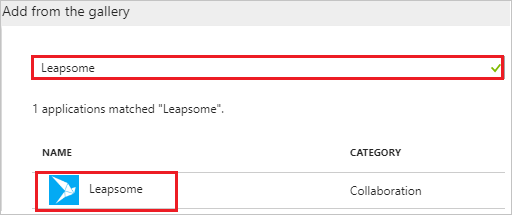
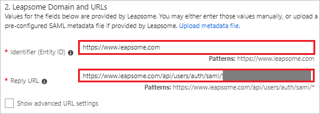
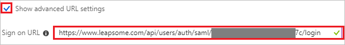
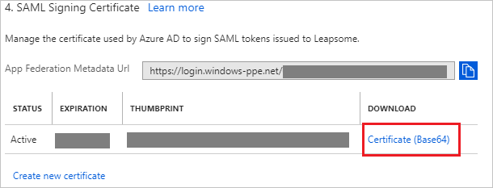
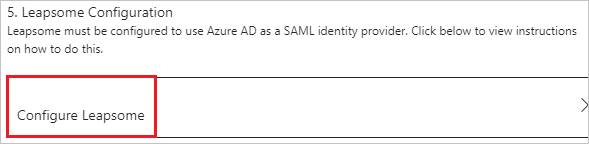
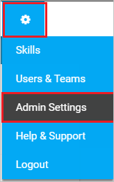
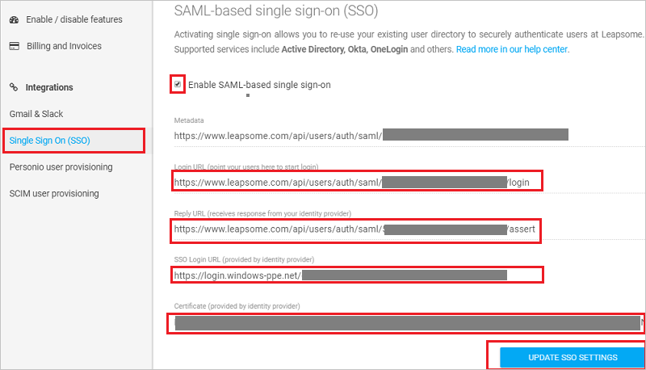
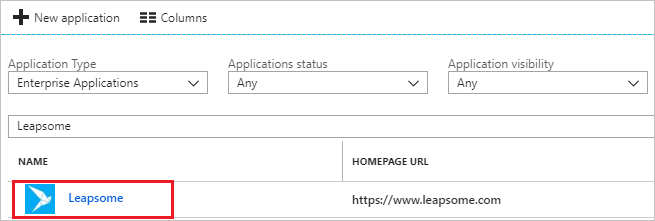

---
title: 'Tutorial: Azure Active Directory integration with Leapsome | Microsoft Docs'
description: Learn how to configure single sign-on between Azure Active Directory and Leapsome.
services: active-directory
documentationCenter: na
author: jeevansd
manager: femila
ms.reviewer: joflore

ms.assetid: cb523e97-add8-4289-b106-927bf1a02188
ms.service: active-directory
ms.workload: identity
ms.tgt_pltfrm: na
ms.devlang: na
ms.topic: article
ms.date: 06/22/2018
ms.author: jeedes

---
# Tutorial: Azure Active Directory integration with Leapsome

In this tutorial, you learn how to integrate Leapsome with Azure Active Directory (Azure AD).

Integrating Leapsome with Azure AD provides you with the following benefits:

- You can control in Azure AD who has access to Leapsome.
- You can enable your users to automatically get signed-on to Leapsome (Single Sign-On) with their Azure AD accounts.
- You can manage your accounts in one central location - the Azure portal.

If you want to know more details about SaaS app integration with Azure AD, see [what is application access and single sign-on with Azure Active Directory](../manage-apps/what-is-single-sign-on.md).

## Prerequisites

To configure Azure AD integration with Leapsome, you need the following items:

- An Azure AD subscription
- A Leapsome single sign-on enabled subscription

> [!NOTE]
> To test the steps in this tutorial, we do not recommend using a production environment.

To test the steps in this tutorial, you should follow these recommendations:

- Do not use your production environment, unless it is necessary.
- If you don't have an Azure AD trial environment, you can [get a one-month trial](https://azure.microsoft.com/pricing/free-trial/).

## Scenario description
In this tutorial, you test Azure AD single sign-on in a test environment. 
The scenario outlined in this tutorial consists of two main building blocks:

1. Adding Leapsome from the gallery
1. Configuring and testing Azure AD single sign-on

## Adding Leapsome from the gallery
To configure the integration of Leapsome into Azure AD, you need to add Leapsome from the gallery to your list of managed SaaS apps.

**To add Leapsome from the gallery, perform the following steps:**

1. In the **[Azure portal](https://portal.azure.com)**, on the left navigation panel, click **Azure Active Directory** icon. 

	![The Azure Active Directory button][1]

1. Navigate to **Enterprise applications**. Then go to **All applications**.

	![The Enterprise applications blade][2]
	
1. To add new application, click **New application** button on the top of dialog.

	![The New application button][3]

1. In the search box, type **Leapsome**, select **Leapsome** from result panel then click **Add** button to add the application.

	

## Configure and test Azure AD single sign-on

In this section, you configure and test Azure AD single sign-on with Leapsome based on a test user called "Britta Simon".

For single sign-on to work, Azure AD needs to know what the counterpart user in Leapsome is to a user in Azure AD. In other words, a link relationship between an Azure AD user and the related user in Leapsome needs to be established.

To configure and test Azure AD single sign-on with Leapsome, you need to complete the following building blocks:

1. **[Configure Azure AD Single Sign-On](#configure-azure-ad-single-sign-on)** - to enable your users to use this feature.
1. **[Create an Azure AD test user](#create-an-azure-ad-test-user)** - to test Azure AD single sign-on with Britta Simon.
1. **[Create a Leapsome test user](#create-a-leapsome-test-user)** - to have a counterpart of Britta Simon in Leapsome that is linked to the Azure AD representation of user.
1. **[Assign the Azure AD test user](#assign-the-azure-ad-test-user)** - to enable Britta Simon to use Azure AD single sign-on.
1. **[Test single sign-on](#test-single-sign-on)** - to verify whether the configuration works.

### Configure Azure AD single sign-on

In this section, you enable Azure AD single sign-on in the Azure portal and configure single sign-on in your Leapsome application.

**To configure Azure AD single sign-on with Leapsome, perform the following steps:**

1. In the Azure portal, on the **Leapsome** application integration page, click **Single sign-on**.

	![Configure single sign-on link][4]

1. On the **Single sign-on** dialog, select **Mode** as	**SAML-based Sign-on** to enable single sign-on.
 
	

1. On the **Leapsome Domain and URLs** section, perform the following steps if you wish to configure the application in **IDP** initiated mode:

	

    a. In the **Identifier** textbox, type a URL: `https://www.leapsome.com`

	b. In the **Reply URL** textbox, type a URL using the following pattern: `https://www.leapsome.com/api/users/auth/saml/<CLIENTID>/assert`

1. Check **Show advanced URL settings** and perform the following step if you wish to configure the application in **SP** initiated mode:

	

    In the **Sign-on URL** textbox, type a URL using the following pattern: `https://www.leapsome.com/api/users/auth/saml/<CLIENTID>/login`
	 
	> [!NOTE] 
	> The preceding Reply URL and Sign-on URL value is not real value. You will update these with the actual values, which is explained later in the tutorial.

1. Leapsome application expects the SAML assertions in a specific format. Configure the following claims for this application. You can manage the values of these attributes from the **User Attributes** section on application integration page. The following screenshot shows an example.
	
	

1. In the **User Attributes** section on the **Single sign-on** dialog, configure SAML token attribute as shown in the image above and perform the following steps:
    
	| Attribute Name | Attribute Value | Namespace |
	| ---------------| --------------- | --------- |   
	| firstname | user.givenname | http://schemas.xmlsoap.org/ws/2005/05/identity/claims |
	| lastname | user.surname | http://schemas.xmlsoap.org/ws/2005/05/identity/claims |
	| title | user.jobtitle | http://schemas.xmlsoap.org/ws/2005/05/identity/claims |
	| picture | URL to the employee's picture | http://schemas.xmlsoap.org/ws/2005/05/identity/claims |

	> [!Note]
	> The value of picture attribute is not real. Update this value with actual picture URL. To get this value contact [Leapsome Client support team](mailto:support@leapsome.com).
	
	a. Click **Add attribute** to open the **Add Attribute** dialog.

	

	
	
	b. In the **Name** textbox, type the attribute name shown for that row.
	
	c. From the **Value** list, type the attribute value shown for that row.

	d. In the **Namespace** textbox, type the namespace uri for that row.
	
	e. Click **Ok**

1. On the **SAML Signing Certificate** section, click **Certificate (Base64)** and then save the certificate file on your computer.

	 

1. Click **Save** button.

	
	
1. On the **Leapsome Configuration** section, click **Configure Leapsome** to open **Configure sign-on** window. Copy the **SAML Single Sign-On Service URL** from the **Quick Reference section.**

	

1. In a different web browser window, log in to Leapsome as a Security Administrator.

1. On the top right, Click on Settings logo and then click **Admin Settings**. 

	

1. On the left menu bar click **Single Sign On (SSO)**, and on the **SAML-based single sign-on (SSO)** page perform the following steps:
	
	

	a. Select **Enable SAML-based single sign-on**.

	b. Copy the **Login URL (point your users here to start login)** value and paste it into the **Sign-on URL** textbox in **Leapsome Domain and URLs** section on Azure portal.

	c. Copy the **Reply URL (recieves response from your identity provider)** value and paste it into the **Reply URL** textbox in  **Leapsome Domain and URLs** section on Azure portal.

	d. In the **SSO Login URL (provided by identity provider)** textbox, paste the value of **SAML Single Sign-On Service URL**, which you copied from the Azure portal.

	e. Copy the Certificate that you have downloaded from Azure portal without --BEGIN CERTIFICATE and END CERTIFICATE-- comments and paste it in the **Certificate (provided by identity provider)** textbox.

	f. Click **UPDATE SSO SETTINGS**.
	
### Create an Azure AD test user

The objective of this section is to create a test user in the Azure portal called Britta Simon.

   ![Create an Azure AD test user][100]

**To create a test user in Azure AD, perform the following steps:**

1. In the Azure portal, in the left pane, click the **Azure Active Directory** button.

    

1. To display the list of users, go to **Users and groups**, and then click **All users**.

    

1. To open the **User** dialog box, click **Add** at the top of the **All Users** dialog box.

    

1. In the **User** dialog box, perform the following steps:

    

    a. In the **Name** box, type **BrittaSimon**.

    b. In the **User name** box, type the email address of user Britta Simon.

    c. Select the **Show Password** check box, and then write down the value that's displayed in the **Password** box.

    d. Click **Create**.
 
### Create a Leapsome test user

In this section, you create a user called Britta Simon in Leapsome. Work with [Leapsome Client support team](mailto:support@leapsome.com) to add the users or the domain, which needs to be whitelisted in the Leapsome platform. If the domain is added by the team, users will get automatically provisioned to the Leapsome platform. Users must be created and activated before you use single sign-on. 

### Assign the Azure AD test user

In this section, you enable Britta Simon to use Azure single sign-on by granting access to Leapsome.

![Assign the user role][200] 

**To assign Britta Simon to Leapsome, perform the following steps:**

1. In the Azure portal, open the applications view, and then navigate to the directory view and go to **Enterprise applications** then click **All applications**.

	![Assign User][201] 

1. In the applications list, select **Leapsome**.

	  

1. In the menu on the left, click **Users and groups**.

	![The "Users and groups" link][202]

1. Click **Add** button. Then select **Users and groups** on **Add Assignment** dialog.

	![The Add Assignment pane][203]

1. On **Users and groups** dialog, select **Britta Simon** in the Users list.

1. Click **Select** button on **Users and groups** dialog.

1. Click **Assign** button on **Add Assignment** dialog.
	
### Test single sign-on

In this section, you test your Azure AD single sign-on configuration using the Access Panel.

When you click the Leapsome tile in the Access Panel, you should get automatically signed-on to your Leapsome application.
For more information about the Access Panel, see [Introduction to the Access Panel](../user-help/active-directory-saas-access-panel-introduction.md). 

## Additional resources

* [List of Tutorials on How to Integrate SaaS Apps with Azure Active Directory](tutorial-list.md)
* [What is application access and single sign-on with Azure Active Directory?](../manage-apps/what-is-single-sign-on.md)

<!--Image references-->

[1]: ./media/leapsome-tutorial/tutorial_general_01.png
[2]: ./media/leapsome-tutorial/tutorial_general_02.png
[3]: ./media/leapsome-tutorial/tutorial_general_03.png
[4]: ./media/leapsome-tutorial/tutorial_general_04.png

[100]: ./media/leapsome-tutorial/tutorial_general_100.png

[200]: ./media/leapsome-tutorial/tutorial_general_200.png
[201]: ./media/leapsome-tutorial/tutorial_general_201.png
[202]: ./media/leapsome-tutorial/tutorial_general_202.png
[203]: ./media/leapsome-tutorial/tutorial_general_203.png

