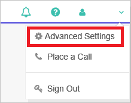
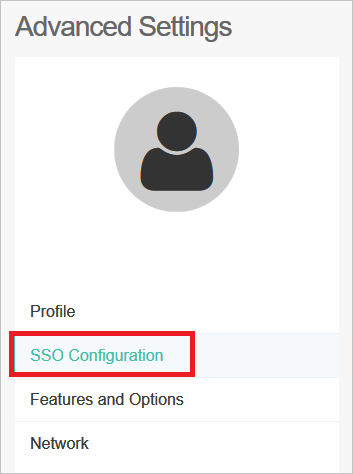
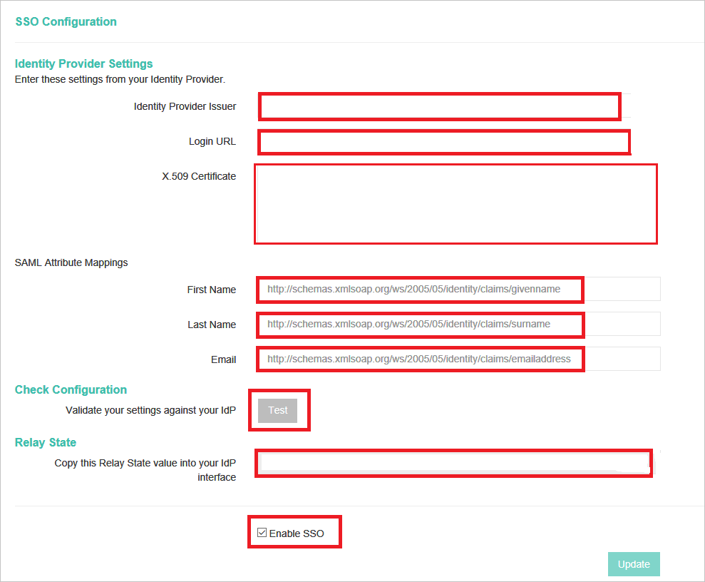

# Tutorial: Microsoft Entra integration with Lifesize Cloud

In this tutorial, you'll learn how to integrate Lifesize Cloud with Microsoft Entra ID. When you integrate Lifesize Cloud with Microsoft Entra ID, you can:

* Control in Microsoft Entra ID who has access to Lifesize Cloud.
* Enable your users to be automatically signed-in to Lifesize Cloud with their Microsoft Entra accounts.
* Manage your accounts in one central location.

## Prerequisites

To get started, you need the following items:

* A Microsoft Entra subscription. If you don't have a subscription, you can get a [free account](https://azure.microsoft.com/free/).
* Lifesize Cloud single sign-on (SSO) enabled subscription.

> [!NOTE]
> This integration is also available to use from Microsoft Entra US Government Cloud environment. You can find this application in the Microsoft Entra US Government Cloud Application Gallery and configure it in the same way as you do from public cloud.

## Scenario description

In this tutorial, you configure and test Microsoft Entra single sign-on in a test environment.

* Lifesize Cloud supports **SP** initiated SSO.

* Lifesize Cloud supports **Automated** user provisioning.

## Add Lifesize Cloud from the gallery

To configure the integration of Lifesize Cloud into Microsoft Entra ID, you need to add Lifesize Cloud from the gallery to your list of managed SaaS apps.

1. Sign in to the [Microsoft Entra admin center](https://entra.microsoft.com) as at least a [Cloud Application Administrator](../roles/permissions-reference.md#cloud-application-administrator).
1. Browse to **Identity** > **Applications** > **Enterprise applications** > **New application**.
1. In the **Add from the gallery** section, type **Lifesize Cloud** in the search box.
1. Select **Lifesize Cloud** from results panel and then add the app. Wait a few seconds while the app is added to your tenant.

 Alternatively, you can also use the [Enterprise App Configuration Wizard](https://portal.office.com/AdminPortal/home?Q=Docs#/azureadappintegration). In this wizard, you can add an application to your tenant, add users/groups to the app, assign roles, as well as walk through the SSO configuration as well. [Learn more about Microsoft 365 wizards.](/microsoft-365/admin/misc/azure-ad-setup-guides)

## Configure and test Microsoft Entra SSO for Lifesize Cloud

Configure and test Microsoft Entra SSO with Lifesize Cloud using a test user called **B.Simon**. For SSO to work, you need to establish a link relationship between a Microsoft Entra user and the related user in Lifesize Cloud.

To configure and test Microsoft Entra SSO with Lifesize Cloud, perform the following steps:

1. **[Configure Microsoft Entra SSO](#configure-azure-ad-sso)** - to enable your users to use this feature.
    1. **[Create a Microsoft Entra test user](#create-an-azure-ad-test-user)** - to test Microsoft Entra single sign-on with B.Simon.
    1. **[Assign the Microsoft Entra test user](#assign-the-azure-ad-test-user)** - to enable B.Simon to use Microsoft Entra single sign-on.
1. **[Configure Lifesize Cloud SSO](#configure-lifesize-cloud-sso)** - to configure the single sign-on settings on application side.
    1. **[Create Lifesize Cloud test user](#create-lifesize-cloud-test-user)** - to have a counterpart of B.Simon in Lifesize Cloud that is linked to the Microsoft Entra representation of user.
1. **[Test SSO](#test-sso)** - to verify whether the configuration works.

## Configure Microsoft Entra SSO

Follow these steps to enable Microsoft Entra SSO.

1. Sign in to the [Microsoft Entra admin center](https://entra.microsoft.com) as at least a [Cloud Application Administrator](../roles/permissions-reference.md#cloud-application-administrator).
1. Browse to **Identity** > **Applications** > **Enterprise applications** > **Lifesize Cloud** > **Single sign-on**.
1. On the **Select a single sign-on method** page, select **SAML**.
1. On the **Set up single sign-on with SAML** page, click the pencil icon for **Basic SAML Configuration** to edit the settings.

   

1. On the **Basic SAML Configuration** section, perform the following steps:

    a. In the **Sign-on URL** text box, type a URL using the following pattern:
    `https://login.lifesizecloud.com/ls/?acs`

    b. In the **Identifier** text box, type a URL using the following pattern:
    `https://login.lifesizecloud.com/<COMPANY_NAME>`

    c. Click **set additional URLs**.

    d. In the **Relay State** text box, type a URL using the following pattern:
    `https://webapp.lifesizecloud.com/?ent=<IDENTIFIER>`

    > [!NOTE]
    > These values are not real. Update these values with the actual Sign-on URL, Identifier and Relay State. Contact [Lifesize Cloud Client support team](https://support.lifesize.com/) to get Sign-On URL, and Identifier values and you can get Relay State value from SSO Configuration that is explained later in the tutorial. You can also refer to the patterns shown in the **Basic SAML Configuration** section.

1. On the **Set up Single Sign-On with SAML** page, in the **SAML Signing Certificate** section, click **Download** to download the **Certificate (Base64)** from the given options as per your requirement and save it on your computer.

	

1. On the **Set up Lifesize Cloud** section, copy the appropriate URL(s) as per your requirement.

	

### Create a Microsoft Entra test user

In this section, you'll create a test user called B.Simon.

1. Sign in to the [Microsoft Entra admin center](https://entra.microsoft.com) as at least a [User Administrator](../roles/permissions-reference.md#user-administrator).
1. Browse to **Identity** > **Users** > **All users**.
1. Select **New user** > **Create new user**, at the top of the screen.
1. In the **User** properties, follow these steps:
   1. In the **Display name** field, enter `B.Simon`.  
   1. In the **User principal name** field, enter the username@companydomain.extension. For example, `B.Simon@contoso.com`.
   1. Select the **Show password** check box, and then write down the value that's displayed in the **Password** box.
   1. Select **Review + create**.
1. Select **Create**.

### Assign the Microsoft Entra test user

In this section, you'll enable B.Simon to use single sign-on by granting access to Lifesize Cloud.

1. Sign in to the [Microsoft Entra admin center](https://entra.microsoft.com) as at least a [Cloud Application Administrator](../roles/permissions-reference.md#cloud-application-administrator).
1. Browse to **Identity** > **Applications** > **Enterprise applications** > **Lifesize Cloud**.
1. In the app's overview page, select **Users and groups**.
1. Select **Add user/group**, then select **Users and groups** in the **Add Assignment** dialog.
   1. In the **Users and groups** dialog, select **B.Simon** from the Users list, then click the **Select** button at the bottom of the screen.
   1. If you are expecting a role to be assigned to the users, you can select it from the **Select a role** dropdown. If no role has been set up for this app, you see "Default Access" role selected.
   1. In the **Add Assignment** dialog, click the **Assign** button.

## Configure Lifesize Cloud SSO

1. To get SSO configured for your application, login into the Lifesize Cloud application with Admin privileges.

2. In the top right corner click on your name and then click on the **Advance Settings**.

    

3. In the Advance Settings now click on the **SSO Configuration** link. It will open the SSO Configuration page for your instance.

    

4. Now configure the following values in the SSO configuration UI.

    

	a. In **Identity Provider Issuer** textbox, paste the value of **Microsoft Entra Identifier**..

    b.  In **Login URL** textbox, paste the value of **Login URL**..

    c. Open your base-64 encoded certificate in notepad downloaded from Azure portal, copy the content of it into your clipboard, and then paste it to the **X.509 Certificate** textbox.
  
    d. In the SAML Attribute mappings for the First Name text box enter the value as `http://schemas.xmlsoap.org/ws/2005/05/identity/claims/givenname`

	e. In the SAML Attribute mapping for the **Last Name** text box enter the value as `http://schemas.xmlsoap.org/ws/2005/05/identity/claims/surname`

	f. In the SAML Attribute mapping for the **Email** text box enter the value as `http://schemas.xmlsoap.org/ws/2005/05/identity/claims/emailaddress`

5. To check the configuration you can click on the **Test** button.

    >[!NOTE]
    >For successful testing you need to complete the configuration wizard in Microsoft Entra ID and also provide access to users or groups who can perform the test.

6. Enable the SSO by checking on the **Enable SSO** button.

7. Now click on the **Update** button so that all the settings are saved. This will generate the RelayState value. Copy the RelayState value, which is generated in the text box, paste it in the **Relay State** textbox under **Lifesize Cloud Domain and URLs** section.

### Create Lifesize Cloud test user

In this section, you create a user called Britta Simon in Lifesize Cloud. Lifesize cloud does support automatic user provisioning. After successful authentication at Microsoft Entra ID, the user will be automatically provisioned in the application.

## Test SSO

In this section, you test your Microsoft Entra single sign-on configuration with following options. 

* Click on **Test this application**, this will redirect to Lifesize Cloud Sign-on URL where you can initiate the login flow. 

* Go to Lifesize Cloud Sign-on URL directly and initiate the login flow from there.

* You can use Microsoft My Apps. When you click the Lifesize Cloud tile in the My Apps, this will redirect to Lifesize Cloud Sign-on URL. For more information about the My Apps, see [Introduction to the My Apps](https://support.microsoft.com/account-billing/sign-in-and-start-apps-from-the-my-apps-portal-2f3b1bae-0e5a-4a86-a33e-876fbd2a4510).

## Next steps

Once you configure Lifesize Cloud you can enforce session control, which protects exfiltration and infiltration of your organization’s sensitive data in real time. Session control extends from Conditional Access. [Learn how to enforce session control with Microsoft Defender for Cloud Apps](/cloud-app-security/proxy-deployment-aad).
