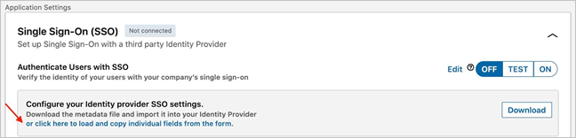
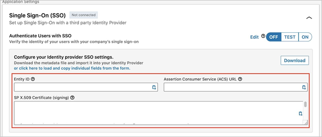

# Tutorial: Microsoft Entra single sign-on (SSO) integration with LinkedIn Talent Solutions

In this tutorial, you'll learn how to integrate LinkedIn Talent Solutions with Microsoft Entra ID. When you integrate LinkedIn Talent Solutions with Microsoft Entra ID, you can:

* Control in Microsoft Entra ID who has access to LinkedIn Talent Solutions.
* Enable your users to be automatically signed-in to LinkedIn Talent Solutions with their Microsoft Entra accounts.
* Manage your accounts in one central location.

## Prerequisites

To get started, you need the following items:

* A Microsoft Entra subscription. If you don't have a subscription, you can get a [free account](https://azure.microsoft.com/free/).
* Access to Account Center in your LinkedIn Talent Solutions dashboard

## Scenario description

In this tutorial, you configure and test Microsoft Entra SSO in a test environment.

* LinkedIn Talent Solutions supports **SP and IDP** initiated SSO
* LinkedIn Talent Solutions supports **Just In Time** user provisioning

## Adding LinkedIn Talent Solutions from the gallery

To configure the integration of LinkedIn Talent Solutions into Microsoft Entra ID, you need to add LinkedIn Talent Solutions from the gallery to your list of managed SaaS apps.

1. Sign in to the [Microsoft Entra admin center](https://entra.microsoft.com) as at least a [Cloud Application Administrator](../roles/permissions-reference.md#cloud-application-administrator).
1. Browse to **Identity** > **Applications** > **Enterprise applications** > **New application**.
1. In the **Add from the gallery** section, type **LinkedIn Talent Solutions** in the search box.
1. Select **LinkedIn Talent Solutions** from results panel and then add the app. Wait a few seconds while the app is added to your tenant.

 Alternatively, you can also use the [Enterprise App Configuration Wizard](https://portal.office.com/AdminPortal/home?Q=Docs#/azureadappintegration). In this wizard, you can add an application to your tenant, add users/groups to the app, assign roles, as well as walk through the SSO configuration as well. [Learn more about Microsoft 365 wizards.](/microsoft-365/admin/misc/azure-ad-setup-guides)

## Configure and test Microsoft Entra SSO for LinkedIn Talent Solutions

Configure and test Microsoft Entra SSO with LinkedIn Talent Solutions using a test user called **B.Simon**. For SSO to work, you need to establish a link relationship between a Microsoft Entra user and the related user in LinkedIn Talent Solutions.

To configure and test Microsoft Entra SSO with LinkedIn Talent Solutions, perform the following steps:

1. **[Configure Microsoft Entra SSO](#configure-azure-ad-sso)** - to enable your users to use this feature.
    1. **[Create a Microsoft Entra test user](#create-an-azure-ad-test-user)** - to test Microsoft Entra single sign-on with B.Simon.
    1. **[Assign the Microsoft Entra test user](#assign-the-azure-ad-test-user)** - to enable B.Simon to use Microsoft Entra single sign-on.
1. **[Configure LinkedIn Talent Solutions SSO](#configure-linkedin-talent-solutions-sso)** - to configure the single sign-on settings on application side.
    1. **[Create LinkedIn Talent Solutions test user](#create-linkedin-talent-solutions-test-user)** - to have a counterpart of B.Simon in LinkedIn Talent Solutions that is linked to the Microsoft Entra representation of user.
1. **[Test SSO](#test-sso)** - to verify whether the configuration works.

## Configure Microsoft Entra SSO

Follow these steps to enable Microsoft Entra SSO.

1. Sign in to the [Microsoft Entra admin center](https://entra.microsoft.com) as at least a [Cloud Application Administrator](../roles/permissions-reference.md#cloud-application-administrator).
1. Browse to **Identity** > **Applications** > **Enterprise applications** > **LinkedIn Talent Solutions** > **Single sign-on**.
1. On the **Select a single sign-on method** page, select **SAML**.
1. On the **Set up single sign-on with SAML** page, click the edit/pen icon for **Basic SAML Configuration** to edit the settings.

   

1. On the **Basic SAML Configuration** section, if you have **Service Provider metadata file**, perform the following steps:

	a. Click **Upload metadata file**.

    

	b. Click on **folder logo** to select the metadata file and click **Upload**.

	

	c. Once the metadata file is successfully uploaded, the **Identifier** and **Reply URL** values get auto populated in Basic SAML Configuration section:

	

	> [!Note]
	> If the **Identifier** and **Reply URL** values are not getting auto polulated, then fill in the values manually according to your requirement.

1. Click **Set additional URLs** and perform the following step if you wish to configure the application in **SP** initiated mode:

    In the **Sign-on URL** text box, type the URL:
    `https://www.linkedin.com/talent/`

1. On the **Set up single sign-on with SAML** page, in the **SAML Signing Certificate** section,  find **Federation Metadata XML** and select **Download** to download the certificate and save it on your computer.

	

1. On the **Set up LinkedIn Talent Solutions** section, copy the appropriate URL(s) based on your requirement.

	

### Create a Microsoft Entra test user

In this section, you'll create a test user called B.Simon.

1. Sign in to the [Microsoft Entra admin center](https://entra.microsoft.com) as at least a [User Administrator](../roles/permissions-reference.md#user-administrator).
1. Browse to **Identity** > **Users** > **All users**.
1. Select **New user** > **Create new user**, at the top of the screen.
1. In the **User** properties, follow these steps:
   1. In the **Display name** field, enter `B.Simon`.  
   1. In the **User principal name** field, enter the username@companydomain.extension. For example, `B.Simon@contoso.com`.
   1. Select the **Show password** check box, and then write down the value that's displayed in the **Password** box.
   1. Select **Review + create**.
1. Select **Create**.

### Assign the Microsoft Entra test user

In this section, you'll enable B.Simon to use single sign-on by granting access to LinkedIn Talent Solutions.

1. Sign in to the [Microsoft Entra admin center](https://entra.microsoft.com) as at least a [Cloud Application Administrator](../roles/permissions-reference.md#cloud-application-administrator).
1. Browse to **Identity** > **Applications** > **Enterprise applications** > **LinkedIn Talent Solutions**.
1. In the app's overview page, select **Users and groups**.
1. Select **Add user/group**, then select **Users and groups** in the **Add Assignment** dialog.
   1. In the **Users and groups** dialog, select **B.Simon** from the Users list, then click the **Select** button at the bottom of the screen.
   1. If you are expecting a role to be assigned to the users, you can select it from the **Select a role** dropdown. If no role has been set up for this app, you see "Default Access" role selected.
   1. In the **Add Assignment** dialog, click the **Assign** button.

## Configure LinkedIn Talent Solutions SSO

1. Sign into LinkedIn Talent Solutions website as an administrator.
1. Navigate to **Account Center**. 
1. Select **Settings** tab from the navigation bar.

    

1. Expand the **Single Sign-On (SSO)** section. 

1. Click on **Download** button to download the **metadata file** or click on **or click here to load and copy individual fields from the form** link to reveal the configuration data.

    

1. Perform the following steps to copy the individual fields from the form.

    

    a. Copy **Entity ID** value, paste this value into the **Microsoft Entra Identifier** text box in the **Basic SAML Configuration** section.

    b. Copy **ACS URL** value, paste this value into the **Reply URL** text box in the **Basic SAML Configuration** section.

    c. Copy the content of the **SP X.509 Certificate(signing)** textbox into the notepad and save it in your computer.

1. Click on **Upload XML file** to upload the **Federation Metadata XML** file which you copied previously.

    

### Create LinkedIn Talent Solutions test user

In this section, a user called Britta Simon is created in LinkedIn Talent Solutions. LinkedIn Talent Solutions supports just-in-time user provisioning, which is enabled by default. There is no action item for you in this section. If a user doesn't already exist in LinkedIn Talent Solutions, a new one is created after authentication.

## Test SSO 

In this section, you test your Microsoft Entra single sign-on configuration with following options. 

#### SP initiated:

* Click on **Test this application**, this will redirect to LinkedIn Talent Solutions Sign on URL where you can initiate the login flow.  

* Go to LinkedIn Talent Solutions Sign-on URL directly and initiate the login flow from there.

#### IDP initiated:

* Click on **Test this application**, and you should be automatically signed in to the LinkedIn Talent Solutions for which you set up the SSO 

You can also use Microsoft My Apps to test the application in any mode. When you click the LinkedIn Talent Solutions tile in the My Apps, if configured in SP mode you would be redirected to the application sign on page for initiating the login flow and if configured in IDP mode, you should be automatically signed in to the LinkedIn Talent Solutions for which you set up the SSO. For more information about the My Apps, see [Introduction to the My Apps](https://support.microsoft.com/account-billing/sign-in-and-start-apps-from-the-my-apps-portal-2f3b1bae-0e5a-4a86-a33e-876fbd2a4510).

## Next steps

Once you configure LinkedIn Talent Solutions you can enforce session control, which protects exfiltration and infiltration of your organization’s sensitive data in real time. Session control extends from Conditional Access. [Learn how to enforce session control with Microsoft Defender for Cloud Apps](/cloud-app-security/proxy-deployment-any-app).
