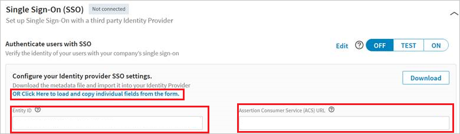
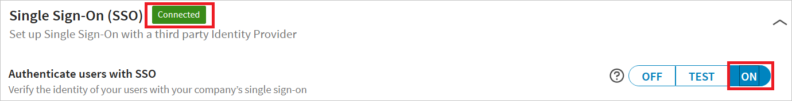

# Tutorial: Microsoft Entra single sign-on (SSO) integration with LinkedIn Elevate

In this tutorial, you'll learn how to integrate LinkedIn Elevate with Microsoft Entra ID. When you integrate LinkedIn Elevate with Microsoft Entra ID, you can:

* Control in Microsoft Entra ID who has access to LinkedIn Elevate.
* Enable your users to be automatically signed-in to LinkedIn Elevate with their Microsoft Entra accounts.
* Manage your accounts in one central location.

## Prerequisites

To get started, you need the following items:

* A Microsoft Entra subscription. If you don't have a subscription, you can get a [free account](https://azure.microsoft.com/free/).
* LinkedIn Elevate single sign-on (SSO) enabled subscription.

## Scenario description

In this tutorial, you configure and test Microsoft Entra SSO in a test environment.

* LinkedIn Elevate supports **SP and IDP** initiated SSO.
* LinkedIn Elevate supports **Just In Time** user provisioning.
* LinkedIn Elevate supports [**Automated** user provisioning](linkedinelevate-provisioning-tutorial.md).

## Add LinkedIn Elevate from the gallery

To configure the integration of LinkedIn Elevate into Microsoft Entra ID, you need to add LinkedIn Elevate from the gallery to your list of managed SaaS apps.

1. Sign in to the [Microsoft Entra admin center](https://entra.microsoft.com) as at least a [Cloud Application Administrator](../roles/permissions-reference.md#cloud-application-administrator).
1. Browse to **Identity** > **Applications** > **Enterprise applications** > **New application**.
1. In the **Add from the gallery** section, type **LinkedIn Elevate** in the search box.
1. Select **LinkedIn Elevate** from results panel and then add the app. Wait a few seconds while the app is added to your tenant.

 Alternatively, you can also use the [Enterprise App Configuration Wizard](https://portal.office.com/AdminPortal/home?Q=Docs#/azureadappintegration). In this wizard, you can add an application to your tenant, add users/groups to the app, assign roles, as well as walk through the SSO configuration as well. [Learn more about Microsoft 365 wizards.](/microsoft-365/admin/misc/azure-ad-setup-guides)

## Configure and test Microsoft Entra SSO for LinkedIn Elevate

Configure and test Microsoft Entra SSO with LinkedIn Elevate using a test user called **B.Simon**. For SSO to work, you need to establish a link relationship between a Microsoft Entra user and the related user in LinkedIn Elevate.

To configure and test Microsoft Entra SSO with LinkedIn Elevate, perform the following steps:

1. **[Configure Microsoft Entra SSO](#configure-azure-ad-sso)** - to enable your users to use this feature.
    1. **[Create a Microsoft Entra test user](#create-an-azure-ad-test-user)** - to test Microsoft Entra single sign-on with B.Simon.
    1. **[Assign the Microsoft Entra test user](#assign-the-azure-ad-test-user)** - to enable B.Simon to use Microsoft Entra single sign-on.
1. **[Configure LinkedIn Elevate SSO](#configure-linkedin-elevate-sso)** - to configure the single sign-on settings on application side.
    1. **[Create LinkedIn Elevate test user](#create-linkedin-elevate-test-user)** - to have a counterpart of B.Simon in LinkedIn Elevate that is linked to the Microsoft Entra representation of user.
1. **[Test SSO](#test-sso)** - to verify whether the configuration works.

## Configure Microsoft Entra SSO

Follow these steps to enable Microsoft Entra SSO.

1. Sign in to the [Microsoft Entra admin center](https://entra.microsoft.com) as at least a [Cloud Application Administrator](../roles/permissions-reference.md#cloud-application-administrator).
1. Browse to **Identity** > **Applications** > **Enterprise applications** > **LinkedIn Elevate** > **Single sign-on**.
1. On the **Select a single sign-on method** page, select **SAML**.
1. On the **Set up single sign-on with SAML** page, click the pencil icon for **Basic SAML Configuration** to edit the settings.

   

1. On the **Basic SAML Configuration** section, if you wish to configure the application in **IDP** initiated mode, perform the following steps:

    a. In the **Identifier** text box, enter the **Entity ID** value, you will copy Entity ID value from the Linkedin Portal explained later in this tutorial.

    b. In the **Reply URL** text box, enter the **Assertion Consumer Access (ACS) Url** value, you will copy Assertion Consumer Access (ACS) URL value from the Linkedin Portal explained later in this tutorial.

5. Click **Set additional URLs** and perform the following step if you wish to configure the application in **SP** initiated mode:

    In the **Sign-on URL** text box, type a URL using the following pattern:
    `https://www.linkedin.com/checkpoint/enterprise/login/<ACCOUNT_ID>?application=elevate&applicationInstanceId=<INSTANCE_ID>`

1. LinkedIn Elevate application expects the SAML assertions in a specific format, which requires you to add custom attribute mappings to your SAML token attributes configuration. The following screenshot shows the list of default attributes, where as **nameidentifier** is mapped with **user.userprincipalname**. LinkedIn Elevate application expects nameidentifier to be mapped with **user.mail**, so you need to edit the attribute mapping by clicking on Edit icon and change the attribute mapping.

	

1. In addition to above, LinkedIn Elevate application expects few more attributes to be passed back in SAML response which are shown below. These attributes are also pre populated but you can review them as per your requirement.

	| Name | Source Attribute|
	| -------| -------------|
	| department | user.department |

1. On the **Set up single sign-on with SAML** page, in the **SAML Signing Certificate** section,  find **Federation Metadata XML** and select **Download** to download the certificate and save it on your computer.

	

1. On the **Set up LinkedIn Elevate** section, copy the appropriate URL(s) based on your requirement.

	

### Create a Microsoft Entra test user

In this section, you'll create a test user called B.Simon.

1. Sign in to the [Microsoft Entra admin center](https://entra.microsoft.com) as at least a [User Administrator](../roles/permissions-reference.md#user-administrator).
1. Browse to **Identity** > **Users** > **All users**.
1. Select **New user** > **Create new user**, at the top of the screen.
1. In the **User** properties, follow these steps:
   1. In the **Display name** field, enter `B.Simon`.  
   1. In the **User principal name** field, enter the username@companydomain.extension. For example, `B.Simon@contoso.com`.
   1. Select the **Show password** check box, and then write down the value that's displayed in the **Password** box.
   1. Select **Review + create**.
1. Select **Create**.

### Assign the Microsoft Entra test user

In this section, you'll enable B.Simon to use single sign-on by granting access to LinkedIn Elevate.

1. Sign in to the [Microsoft Entra admin center](https://entra.microsoft.com) as at least a [Cloud Application Administrator](../roles/permissions-reference.md#cloud-application-administrator).
1. Browse to **Identity** > **Applications** > **Enterprise applications** > **LinkedIn Elevate**.
1. In the app's overview page, select **Users and groups**.
1. Select **Add user/group**, then select **Users and groups** in the **Add Assignment** dialog.
   1. In the **Users and groups** dialog, select **B.Simon** from the Users list, then click the **Select** button at the bottom of the screen.
   1. If you are expecting a role to be assigned to the users, you can select it from the **Select a role** dropdown. If no role has been set up for this app, you see "Default Access" role selected.
   1. In the **Add Assignment** dialog, click the **Assign** button.

## Configure LinkedIn Elevate SSO

1. In a different web browser window, sign-on to your LinkedIn Elevate tenant as an administrator.

1. In **Account Center**, click **Global Settings** under **Settings**. Also, select **Elevate - Elevate Microsoft Entra ID Test** from the dropdown list.

	

1. Click on **OR Click Here to load and copy individual fields from the form** and perform the following steps:

	

	a. Copy **Entity ID** and paste it into the **Identifier** text box in the **Basic SAML Configuration**.

	b. Copy **Assertion Consumer Access (ACS) Url** and paste it into the **Reply URL** text box in the **Basic SAML Configuration**.

1. Go to **LinkedIn Admin Settings** section. Upload the XML file that you have downloaded by clicking on the Upload XML file option.

	

1. Click **On** to enable SSO. SSO status will change from **Not Connected** to **Connected**.

	

### Create LinkedIn Elevate test user

LinkedIn Elevate Application supports Just in time user provisioning and after authentication users will be created in the application automatically. On the admin settings page on the LinkedIn Elevate portal flip the switch **Automatically Assign licenses** to active Just in time provisioning and this will also assign a license to the user. LinkedIn Elevate also supports automatic user provisioning, you can find more details [here](linkedinelevate-provisioning-tutorial.md) on how to configure automatic user provisioning.

   

## Test SSO 

In this section, you test your Microsoft Entra single sign-on configuration with following options. 

#### SP initiated:

* Click on **Test this application**, this will redirect to LinkedIn Elevate Sign on URL where you can initiate the login flow.  

* Go to LinkedIn Elevate Sign-on URL directly and initiate the login flow from there.

#### IDP initiated:

* Click on **Test this application**, and you should be automatically signed in to the LinkedIn Elevate for which you set up the SSO. 

You can also use Microsoft My Apps to test the application in any mode. When you click the LinkedIn Elevate tile in the My Apps, if configured in SP mode you would be redirected to the application sign on page for initiating the login flow and if configured in IDP mode, you should be automatically signed in to the LinkedIn Elevate for which you set up the SSO. For more information about the My Apps, see [Introduction to the My Apps](https://support.microsoft.com/account-billing/sign-in-and-start-apps-from-the-my-apps-portal-2f3b1bae-0e5a-4a86-a33e-876fbd2a4510).

## Next steps

Once you configure LinkedIn Elevate you can enforce session control, which protects exfiltration and infiltration of your organization’s sensitive data in real time. Session control extends from Conditional Access. [Learn how to enforce session control with Microsoft Defender for Cloud Apps](/cloud-app-security/proxy-deployment-aad).
