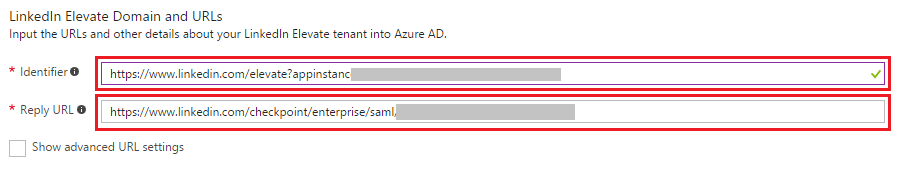
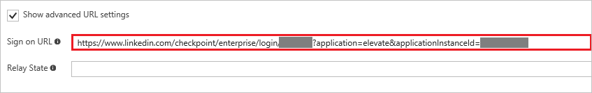
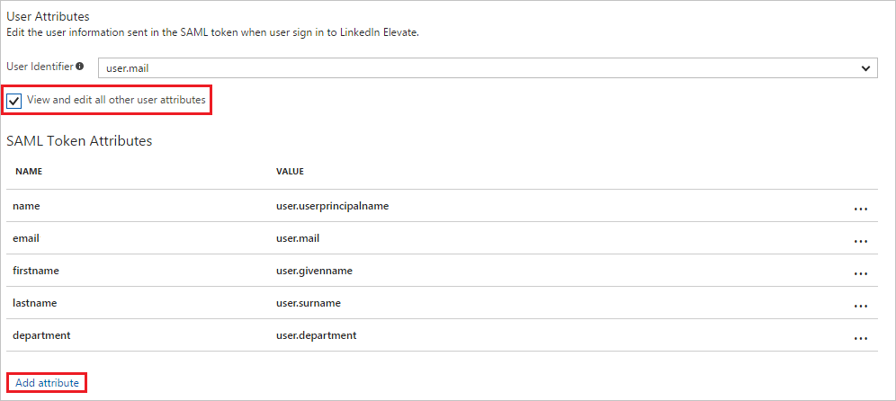

# Tutorial: Azure Active Directory integration with LinkedIn Elevate

In this tutorial, you learn how to integrate LinkedIn Elevate with Azure Active Directory (Azure AD).

Integrating LinkedIn Elevate with Azure AD provides you with the following benefits:

- You can control in Azure AD who has access to LinkedIn Elevate
- You can enable your users to automatically get signed-on to LinkedIn Elevate (Single Sign-On) with their Azure AD accounts
- You can manage your accounts in one central location - the Azure Management portal

If you want to know more details about SaaS app integration with Azure AD, see [What is application access and single sign-on with Azure Active Directory](../manage-apps/what-is-single-sign-on.md).

## Prerequisites

To configure Azure AD integration with LinkedIn Elevate, you need the following items:

- An Azure AD subscription
- A LinkedIn Elevate single-sign on enabled subscription

> [!NOTE]
> To test the steps in this tutorial, we do not recommend using a production environment.

To test the steps in this tutorial, you should follow these recommendations:

- You should not use your production environment, unless this is necessary.
- If you don't have an Azure AD trial environment, you can get a one-month trial [here](https://azure.microsoft.com/pricing/free-trial/).

## Scenario description
In this tutorial, you test Azure AD single sign-on in a test environment.
The scenario outlined in this tutorial consists of two main building blocks:

1. Adding LinkedIn Elevate from the gallery
1. Configuring and testing Azure AD single sign-on

## Adding LinkedIn Elevate from the gallery
To configure the integration of LinkedIn Elevate into Azure AD, you need to add LinkedIn Elevate from the gallery to your list of managed SaaS apps.

**To add LinkedIn Elevate from the gallery, perform the following steps:**

1. In the **[Azure Management Portal](https://portal.azure.com)**, on the left navigation panel, click **Azure Active Directory** icon.

	![Active Directory][1]

1. Navigate to **Enterprise applications**. Then go to **All applications**.

	![Applications][2]

1. Click **Add** button on the top of the dialog.

	![Applications][3]

1. In the search box, type **LinkedIn Elevate**. From results panel, click **LinkedIn Elevate** to add the application.

	

##  Configuring and testing Azure AD single sign-on
In this section, you configure and test Azure AD single sign-on with LinkedIn Elevate based on a test user called "Britta Simon".

For single sign-on to work, Azure AD needs to know what the counterpart user in LinkedIn Elevate is to a user in Azure AD. In other words, a link relationship between an Azure AD user and the related user in LinkedIn Elevate needs to be established.

This link relationship is established by assigning the value of the **user name** in Azure AD as the value of the **Username** in LinkedIn Elevate.

To configure and test Azure AD single sign-on with LinkedIn Elevate, you need to complete the following building blocks:

1. **[Configuring Azure AD Single Sign-On](#configuring-azure-ad-single-sign-on)** - to enable your users to use this feature.
1. **[Creating an Azure AD test user](#creating-an-azure-ad-test-user)** - to test Azure AD single sign-on with Britta Simon.
1. **[Creating a LinkedIn Elevate test user](#creating-a-linkedin-elevate-test-user)** - to test Azure AD single sign-on with Britta Simon.
1. **[Assigning the Azure AD test user](#assigning-the-azure-ad-test-user)** - to enable Britta Simon to use Azure AD single sign-on.
1. **[Testing Single Sign-On](#testing-single-sign-on)** - to verify whether the configuration works.

### Configuring Azure AD single sign-on

In this section, you enable Azure AD single sign-on in the Azure Management portal and configure single sign-on in your LinkedIn Elevate application.

**To configure Azure AD single sign-on with LinkedIn Elevate, perform the following steps:**

1. In the Azure Management portal, on the **LinkedIn Elevate** application integration page, click **Single sign-on**.

	![Configure Single Sign-On][4]

1. On the **Single sign-on** dialog, as **Mode** select **SAML-based Sign-on** to enable single sign on.

	

1. In a different web browser window, sign-on to your LinkedIn Elevate tenant as an administrator.

1. In **Account Center**, click **Global Settings** under **Settings**. Also, select **Elevate - Elevate AAD Test** from the dropdown list.

	

1. Click on **OR Click Here to load and copy individual fields from the form** and copy **Entity Id** and **Assertion Consumer Access (ACS) Url**

	

1. On Azure Portal, under **LinkedIn Elevate Domain and URLs**, perform the following steps if you want to configure SSO in **IdP Initiated** mode

	

    a. In the **Identifier** textbox, enter the **Entity ID** copied from LinkedIn Portal 

	b. In the **Reply URL** textbox, enter the **Assertion Consumer Access (ACS) Url** copied from LinkedIn Portal

1. If you want to configure SSO in **SP Initiated**, then click Show Advanced URL setting option in the configuration section and configure the sign on URL with the following pattern:

	`https://www.linkedin.com/checkpoint/enterprise/login/<AccountId>?application=elevate&applicationInstanceId=<InstanceId>` 

	 

1. Your LinkedIn Elevate application expects the SAML assertions in a specific format, which requires you to add custom attribute mappings to your SAML token attributes configuration. The following screenshot shows an example for this. The default value of **User Identifier** is **user.userprincipalname** but LinkedIn Elevate expects this to be mapped with the user's email address. For that you can use **user.mail** attribute from the list or use the appropriate attribute value based on your organization configuration.

	

1. In **User Attributes** section, click **View and edit all other user attributes** and set the attributes. You need to add another claim named **department** and the value needs to be mapped to **user.department**.

	| Attribute Name | Attribute Value |
	| --- | --- |
	| department| user.department |

      

      a. Click on Add attribute to open the attribute details page add the department attribute as shown below-

      

      b. Click on **Ok** to save the attribute.

      c. Change the name of the attribute **emailaddress** to **email**.

1. On the **SAML Signing Certificate** section, click **Metadata XML** and then save the XML file on your computer.

	 

1. Click **Save**.

	

1. Go to **LinkedIn Admin Settings** section. Upload the XML file you just downloaded from the Azure portal by clicking on the Upload XML file option.

	

1. Click **On** to enable SSO. SSO status will change from **Not Connected** to **Connected**

	

### Creating an Azure AD test user
The objective of this section is to create a test user in the Azure Management portal called Britta Simon.

![Create Azure AD User][100]

**To create a test user in Azure AD, perform the following steps:**

1. In the **Azure Management portal**, on the left navigation pane, click **Azure Active Directory** icon.

	 

1. Go to **Users and groups** and click **All users** to display the list of users.

	 

1. At the top of the dialog click **Add** to open the **User** dialog.

	 

1. On the **User** dialog page, perform the following steps:

	 

    a. In the **Name** textbox, type **BrittaSimon**.

    b. In the **User name** textbox, type the **email address** of BrittaSimon.

	c. Select **Show Password** and write down the value of the **Password**.

    d. Click **Create**.

### Creating a LinkedIn Elevate test user

LinkedIn Elevate Application supports Just in time user provisioning and after authentication users will be created in the application automatically. On the admin settings page on the LinkedIn Elevate portal flip the switch **Automatically Assign licenses** to active Just in time provisioning and this will also assign a license to the user. LinkedIn Elevate also supports automatic user provisioning, you can find more details [here](linkedinelevate-provisioning-tutorial.md) on how to configure automatic user provisioning.

   

### Assigning the Azure AD test user

In this section, you enable Britta Simon to use Azure single sign-on by granting her access to LinkedIn Elevate.

![Assign User][200] 

**To assign Britta Simon to LinkedIn Elevate, perform the following steps:**

1. In the Azure Management portal, open the applications view, and then navigate to the directory view and go to **Enterprise applications** then click **All applications**.

	![Assign User][201]

1. In the applications list, select **LinkedIn Elevate**.

	 

1. In the menu on the left, click **Users and groups**.

	![Assign User][202] 

1. Click **Add** button. Then select **Users and groups** on **Add Assignment** dialog.

	![Assign User][203]

1. On **Users and groups** dialog, select **Britta Simon** in the Users list.

1. Click **Select** button on **Users and groups** dialog.

1. Click **Assign** button on **Add Assignment** dialog.

### Testing single sign-on

In this section, you test your Azure AD single sign-on configuration using the Access Panel.

When you click the LinkedIn Elevate tile in the Access Panel, you should get the Azure Sign-on page and on after successful sign-on, you should get into your LinkedIn Elevate application.

## Additional resources

* [Tutorial: Configuring LinkedIn Elevate for automatic user provisioning with Azure Active Directory](linkedinelevate-provisioning-tutorial.md)
* [List of Tutorials on How to Integrate SaaS Apps with Azure Active Directory](tutorial-list.md)
* [What is application access and single sign-on with Azure Active Directory?](../manage-apps/what-is-single-sign-on.md)
* [Configure User Provisioning](linkedinelevate-provisioning-tutorial.md)

<!--Image references-->

[1]: ./media/linkedinElevate-tutorial/tutorial_general_01.png
[2]: ./media/linkedinElevate-tutorial/tutorial_general_02.png
[3]: ./media/linkedinElevate-tutorial/tutorial_general_03.png
[4]: ./media/linkedinElevate-tutorial/tutorial_general_04.png

[100]: ./media/linkedinElevate-tutorial/tutorial_general_100.png

[200]: ./media/linkedinElevate-tutorial/tutorial_general_200.png
[201]: ./media/linkedinElevate-tutorial/tutorial_general_201.png
[202]: ./media/linkedinElevate-tutorial/tutorial_general_202.png
[203]: ./media/linkedinElevate-tutorial/tutorial_general_203.png