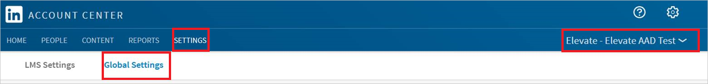

# Tutorial: Azure Active Directory single sign-on (SSO) integration with LinkedIn Elevate

In this tutorial, you'll learn how to integrate LinkedIn Elevate with Azure Active Directory (Azure AD). When you integrate LinkedIn Elevate with Azure AD, you can:

* Control in Azure AD who has access to LinkedIn Elevate.
* Enable your users to be automatically signed-in to LinkedIn Elevate with their Azure AD accounts.
* Manage your accounts in one central location - the Azure portal.

To learn more about SaaS app integration with Azure AD, see [What is application access and single sign-on with Azure Active Directory](https://docs.microsoft.com/azure/active-directory/active-directory-appssoaccess-whatis).

## Prerequisites

To get started, you need the following items:

* An Azure AD subscription. If you don't have a subscription, you can get a [free account](https://azure.microsoft.com/free/).
* LinkedIn Elevate single sign-on (SSO) enabled subscription.

## Scenario description

In this tutorial, you configure and test Azure AD SSO in a test environment.

* LinkedIn Elevate supports **SP and IDP** initiated SSO
* LinkedIn Elevate supports **Just In Time** user provisioning
* LinkedIn Elevate supports [**Automated** user provisioning](linkedinelevate-provisioning-tutorial.md)

## Adding LinkedIn Elevate from the gallery

To configure the integration of LinkedIn Elevate into Azure AD, you need to add LinkedIn Elevate from the gallery to your list of managed SaaS apps.

1. Sign in to the [Azure portal](https://portal.azure.com) using either a work or school account, or a personal Microsoft account.
1. On the left navigation pane, select the **Azure Active Directory** service.
1. Navigate to **Enterprise Applications** and then select **All Applications**.
1. To add new application, select **New application**.
1. In the **Add from the gallery** section, type **LinkedIn Elevate** in the search box.
1. Select **LinkedIn Elevate** from results panel and then add the app. Wait a few seconds while the app is added to your tenant.

## Configure and test Azure AD single sign-on for LinkedIn Elevate

Configure and test Azure AD SSO with LinkedIn Elevate using a test user called **B.Simon**. For SSO to work, you need to establish a link relationship between an Azure AD user and the related user in LinkedIn Elevate.

To configure and test Azure AD SSO with LinkedIn Elevate, complete the following building blocks:

1. **[Configure Azure AD SSO](#configure-azure-ad-sso)** - to enable your users to use this feature.
    1. **[Create an Azure AD test user](#create-an-azure-ad-test-user)** - to test Azure AD single sign-on with B.Simon.
    1. **[Assign the Azure AD test user](#assign-the-azure-ad-test-user)** - to enable B.Simon to use Azure AD single sign-on.
1. **[Configure LinkedIn Elevate SSO](#configure-linkedin-elevate-sso)** - to configure the single sign-on settings on application side.
    1. **[Create LinkedIn Elevate test user](#create-linkedin-elevate-test-user)** - to have a counterpart of B.Simon in LinkedIn Elevate that is linked to the Azure AD representation of user.
1. **[Test SSO](#test-sso)** - to verify whether the configuration works.

## Configure Azure AD SSO

Follow these steps to enable Azure AD SSO in the Azure portal.

1. In the [Azure portal](https://portal.azure.com/), on the **LinkedIn Elevate** application integration page, find the **Manage** section and select **single sign-on**.
1. On the **Select a single sign-on method** page, select **SAML**.
1. On the **Set up single sign-on with SAML** page, click the edit/pen icon for **Basic SAML Configuration** to edit the settings.

   

1. On the **Basic SAML Configuration** section, if you wish to configure the application in **IDP** initiated mode, enter the values for the following fields:

    a. In the **Identifier** text box, enter the **Entity ID** value, you will copy Entity ID value from the Linkedin Portal explained later in this tutorial.

    b. In the **Reply URL** text box, enter the **Assertion Consumer Access (ACS) Url** value, you will copy Assertion Consumer Access (ACS) Url value from the Linkedin Portal explained later in this tutorial.

5. Click **Set additional URLs** and perform the following step if you wish to configure the application in **SP** initiated mode:

    In the **Sign-on URL** text box, type a URL using the following pattern:
    `https://www.linkedin.com/checkpoint/enterprise/login/<AccountId>?application=elevate&applicationInstanceId=<InstanceId>`

1. LinkedIn Elevate application expects the SAML assertions in a specific format, which requires you to add custom attribute mappings to your SAML token attributes configuration. The following screenshot shows the list of default attributes, where as **nameidentifier** is mapped with **user.userprincipalname**. LinkedIn Elevate application expects nameidentifier to be mapped with **user.mail**, so you need to edit the attribute mapping by clicking on Edit icon and change the attribute mapping.

	

1. In addition to above, LinkedIn Elevate application expects few more attributes to be passed back in SAML response which are shown below. These attributes are also pre populated but you can review them as per your requirement.

	| Name | Source Attribute|
	| -------| -------------|
	| department | user.department |

1. On the **Set up single sign-on with SAML** page, in the **SAML Signing Certificate** section,  find **Federation Metadata XML** and select **Download** to download the certificate and save it on your computer.

	

1. On the **Set up LinkedIn Elevate** section, copy the appropriate URL(s) based on your requirement.

	

### Create an Azure AD test user

In this section, you'll create a test user in the Azure portal called B.Simon.

1. From the left pane in the Azure portal, select **Azure Active Directory**, select **Users**, and then select **All users**.
1. Select **New user** at the top of the screen.
1. In the **User** properties, follow these steps:
   1. In the **Name** field, enter `B.Simon`.  
   1. In the **User name** field, enter the username@companydomain.extension. For example, `B.Simon@contoso.com`.
   1. Select the **Show password** check box, and then write down the value that's displayed in the **Password** box.
   1. Click **Create**.

### Assign the Azure AD test user

In this section, you'll enable B.Simon to use Azure single sign-on by granting access to LinkedIn Elevate.

1. In the Azure portal, select **Enterprise Applications**, and then select **All applications**.
1. In the applications list, select **LinkedIn Elevate**.
1. In the app's overview page, find the **Manage** section and select **Users and groups**.

   

1. Select **Add user**, then select **Users and groups** in the **Add Assignment** dialog.

	

1. In the **Users and groups** dialog, select **B.Simon** from the Users list, then click the **Select** button at the bottom of the screen.
1. If you're expecting any role value in the SAML assertion, in the **Select Role** dialog, select the appropriate role for the user from the list and then click the **Select** button at the bottom of the screen.
1. In the **Add Assignment** dialog, click the **Assign** button.

## Configure LinkedIn Elevate SSO

1. In a different web browser window, sign-on to your LinkedIn Elevate tenant as an administrator.

1. In **Account Center**, click **Global Settings** under **Settings**. Also, select **Elevate - Elevate AAD Test** from the dropdown list.

	

1. Click on **OR Click Here to load and copy individual fields from the form** and perform the following steps:

	

	a. Copy **Entity ID** and paste it into the **Identifier** text box in the **Basic SAML Configuration** in the Azure portal.

	b. Copy **Assertion Consumer Access (ACS) Url** and paste it into the **Reply URL** text box in the **Basic SAML Configuration** in the Azure portal.

1. Go to **LinkedIn Admin Settings** section. Upload the XML file that you have downloaded from the Azure portal by clicking on the Upload XML file option.

	

1. Click **On** to enable SSO. SSO status will change from **Not Connected** to **Connected**

	

### Create LinkedIn Elevate test user

LinkedIn Elevate Application supports Just in time user provisioning and after authentication users will be created in the application automatically. On the admin settings page on the LinkedIn Elevate portal flip the switch **Automatically Assign licenses** to active Just in time provisioning and this will also assign a license to the user. LinkedIn Elevate also supports automatic user provisioning, you can find more details [here](linkedinelevate-provisioning-tutorial.md) on how to configure automatic user provisioning.

   

## Test SSO 

In this section, you test your Azure AD single sign-on configuration using the Access Panel.

When you click the LinkedIn Elevate tile in the Access Panel, you should be automatically signed in to the LinkedIn Elevate for which you set up SSO. For more information about the Access Panel, see [Introduction to the Access Panel](https://docs.microsoft.com/azure/active-directory/active-directory-saas-access-panel-introduction).

## Additional resources

- [ List of Tutorials on How to Integrate SaaS Apps with Azure Active Directory ](https://docs.microsoft.com/azure/active-directory/active-directory-saas-tutorial-list)

- [What is application access and single sign-on with Azure Active Directory? ](https://docs.microsoft.com/azure/active-directory/active-directory-appssoaccess-whatis)

- [What is conditional access in Azure Active Directory?](https://docs.microsoft.com/azure/active-directory/conditional-access/overview)

- [Try LinkedIn Elevate with Azure AD](https://aad.portal.azure.com/)

