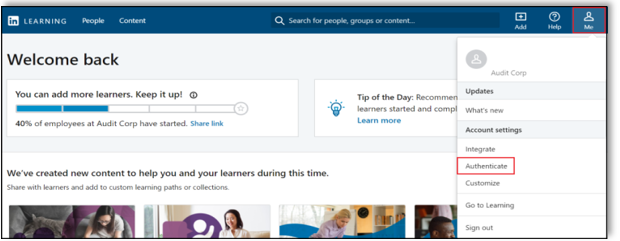
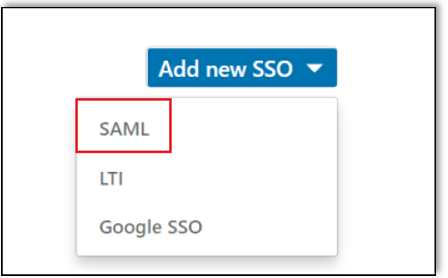
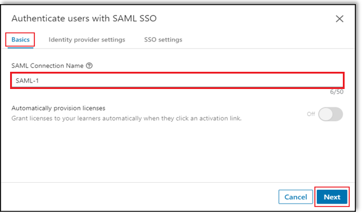
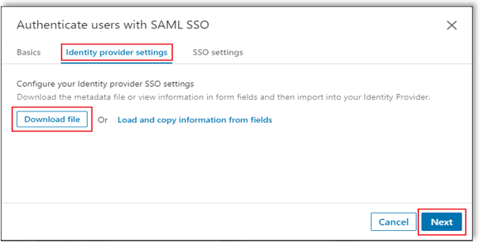
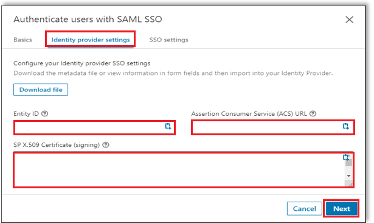
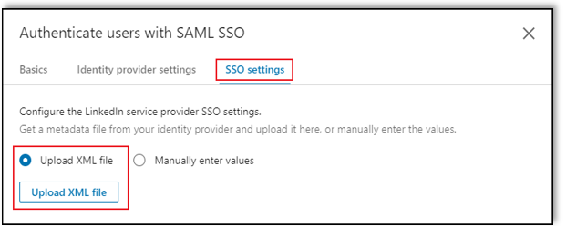
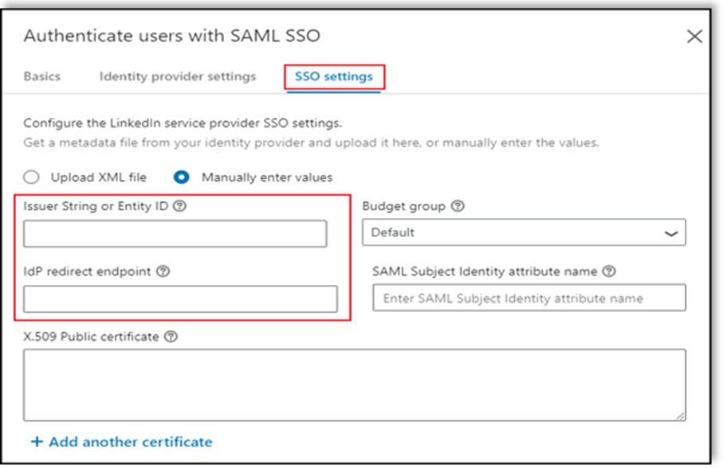
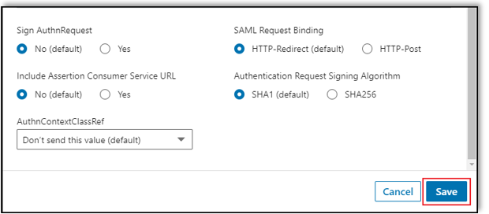
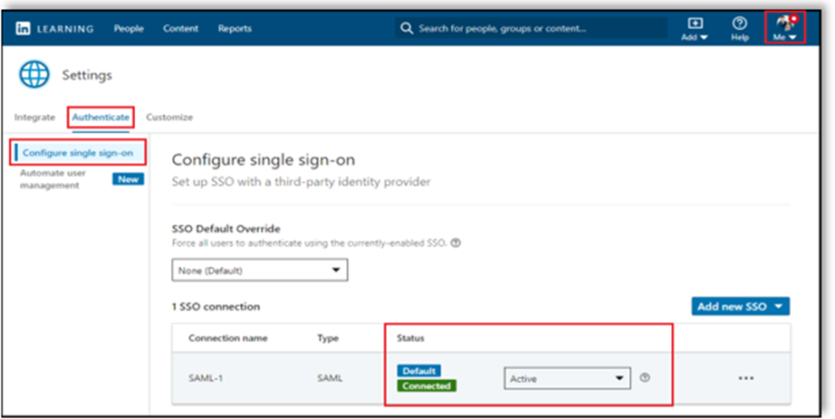
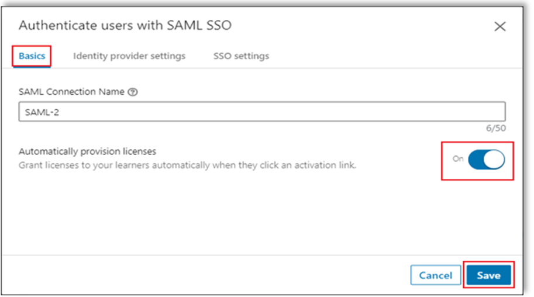

# Tutorial: Microsoft Entra SSO integration with LinkedIn Learning

In this tutorial, you'll learn how to integrate LinkedIn Learning with Microsoft Entra ID. When you integrate LinkedIn Learning with Microsoft Entra ID, you can:

* Control in Microsoft Entra ID who has access to LinkedIn Learning.
* Enable your users to be automatically signed-in to LinkedIn Learning with their Microsoft Entra accounts.
* Manage your accounts in one central location.

## Prerequisites

To get started, you need the following items:

* A Microsoft Entra subscription. If you don't have a subscription, you can get a [free account](https://azure.microsoft.com/free/).
* LinkedIn Learning single sign-on (SSO) enabled subscription.

## Scenario description

In this tutorial, you configure and test Microsoft Entra SSO in a test environment.

* LinkedIn Learning supports **SP and IDP** initiated SSO.
* LinkedIn Learning supports **Just In Time** user provisioning.

## Add LinkedIn Learning from the gallery

To configure the integration of LinkedIn Learning into Microsoft Entra ID, you need to add LinkedIn Learning from the gallery to your list of managed SaaS apps.

1. Sign in to the [Microsoft Entra admin center](https://entra.microsoft.com) as at least a [Cloud Application Administrator](../roles/permissions-reference.md#cloud-application-administrator).
1. Browse to **Identity** > **Applications** > **Enterprise applications** > **New application**.
1. In the **Add from the gallery** section, type **LinkedIn Learning** in the search box.
1. Select **LinkedIn Learning** from results panel and then add the app. Wait a few seconds while the app is added to your tenant.

 Alternatively, you can also use the [Enterprise App Configuration Wizard](https://portal.office.com/AdminPortal/home?Q=Docs#/azureadappintegration). In this wizard, you can add an application to your tenant, add users/groups to the app, assign roles, as well as walk through the SSO configuration as well. [Learn more about Microsoft 365 wizards.](/microsoft-365/admin/misc/azure-ad-setup-guides)

## Configure and test Microsoft Entra SSO for LinkedIn Learning

Configure and test Microsoft Entra SSO with LinkedIn Learning using a test user called **B.Simon**. For SSO to work, you need to establish a link relationship between a Microsoft Entra user and the related user in LinkedIn Learning.

To configure and test Microsoft Entra SSO with LinkedIn Learning, perform the following steps:

1. **[Configure Microsoft Entra SSO](#configure-azure-ad-sso)** - to enable your users to use this feature.
    1. **[Create a Microsoft Entra test user](#create-an-azure-ad-test-user)** - to test Microsoft Entra single sign-on with B.Simon.
    1. **[Assign the Microsoft Entra test user](#assign-the-azure-ad-test-user)** - to enable B.Simon to use Microsoft Entra single sign-on.
1. **[Configure LinkedIn Learning SSO](#configure-linkedin-learning-sso)** - to configure the single sign-on settings on application side.
    1. **[Assign Licenses](#assign-licenses)**- to have a counterpart of B.Simon in LinkedIn Learning that is linked to the Microsoft Entra representation of user.
1. **[Test SSO](#test-sso)** - to verify whether the configuration works.

## Configure Microsoft Entra SSO

Follow these steps to enable Microsoft Entra SSO.

1. Sign in to the [Microsoft Entra admin center](https://entra.microsoft.com) as at least a [Cloud Application Administrator](../roles/permissions-reference.md#cloud-application-administrator).
1. Browse to **Identity** > **Applications** > **Enterprise applications** > **LinkedIn Learning** > **Single sign-on**.
1. On the **Select a single sign-on method** page, select **SAML**.
1. On the **Set up single sign-on with SAML** page, click the pencil icon for **Basic SAML Configuration** to edit the settings.

   

1. On the **Basic SAML Configuration** section, if you wish to configure the application in **IDP** initiated mode, perform the following steps:

    a. In the **Identifier** textbox, enter the **Entity ID** copied from LinkedIn Portal. 

	b. In the **Reply URL** textbox, enter the **Assertion Consumer Service (ACS) Url** copied from LinkedIn Portal.

	c. If you wish to configure the application in **SP Initiated** mode then click **Set additional URLs** option in the **Basic SAML Configuration**  section where you will specify your sign-on URL. To create your login URL copy the **Assertion Consumer Service (ACS) Url** and replace /saml/ with /login/. Once that has been done, the sign-on URL should have the following pattern:

    `https://www.linkedin.com/checkpoint/enterprise/login/<AccountId>?application=learning&applicationInstanceId=<InstanceId>`

	> [!NOTE]
	> These values are not real. You will update these values with the actual Identifier, Reply URL and Sign on URL which is explained later in the **Configure LinkedIn Learning SSO** section of tutorial.

1. LinkedIn Learning application expects the SAML assertions in a specific format, which requires you to add custom attribute mappings to your SAML token attributes configuration. The following screenshot shows the list of default attributes, whereas **nameidentifier** is mapped with **user.userprincipalname**. LinkedIn Learning application expects **nameidentifier** to be mapped with **user.mail**, so you need to edit the attribute mapping by clicking on **Edit** icon and change the attribute mapping.

	

1. On the **Set up single sign-on with SAML** page, in the **SAML Signing Certificate** section,  find **Federation Metadata XML** and select **Download** to download the certificate and save it on your computer.

	

1. On the **Set up LinkedIn Learning** section, copy the appropriate URL(s) based on your requirement.

	

### Create a Microsoft Entra test user

In this section, you'll create a test user called B.Simon.

1. Sign in to the [Microsoft Entra admin center](https://entra.microsoft.com) as at least a [User Administrator](../roles/permissions-reference.md#user-administrator).
1. Browse to **Identity** > **Users** > **All users**.
1. Select **New user** > **Create new user**, at the top of the screen.
1. In the **User** properties, follow these steps:
   1. In the **Display name** field, enter `B.Simon`.  
   1. In the **User principal name** field, enter the username@companydomain.extension. For example, `B.Simon@contoso.com`.
   1. Select the **Show password** check box, and then write down the value that's displayed in the **Password** box.
   1. Select **Review + create**.
1. Select **Create**.

### Assign the Microsoft Entra test user

In this section, you'll enable B.Simon to use single sign-on by granting access to LinkedIn Learning.

1. Sign in to the [Microsoft Entra admin center](https://entra.microsoft.com) as at least a [Cloud Application Administrator](../roles/permissions-reference.md#cloud-application-administrator).
1. Browse to **Identity** > **Applications** > **Enterprise applications** > **LinkedIn Learning**.
1. In the app's overview page, select **Users and groups**.
1. Select **Add user/group**, then select **Users and groups** in the **Add Assignment** dialog.
   1. In the **Users and groups** dialog, select **B.Simon** from the Users list, then click the **Select** button at the bottom of the screen.
   1. If you are expecting a role to be assigned to the users, you can select it from the **Select a role** dropdown. If no role has been set up for this app, you see "Default Access" role selected.
   1. In the **Add Assignment** dialog, click the **Assign** button.

## Configure LinkedIn Learning SSO

1. Log in to your LinkedIn Learning company site as an administrator.

1. Select **Go to Admin** > **Me** > **Authenticate**. 

     

1. Select **Configure single sign-on** under **Authenticate** and click **Add new SSO**.    

    

1. Select **SAML** from the **Add new SSO** dropdown.

    

1. Under **Basics** tab, enter **SAML Connection Name** and click **Next**.

    

1. Navigate to **Identity provider settings** tab, click **Download file** to download the metadata file and save it on your computer and click **Next**.

    

    > [!NOTE]    
    > You may not be able to import this file into your Identity Provider. For example, Okta does not have this functionality. If this case matches your configuration requirements, continue to Working with Individual Fields.

1. In the **Identity provider settings** tab, click **Load and copy information from fields** to copy the required fields and paste into the **Basic SAML Configuration** section and click **Next**.

    

1. Navigate to **SSO settings** tab, click **Upload XML file** to upload the **Federation Metadata XML** file which you have downloaded.

    

1. Fill the required fields manually which you have copied under **SSO settings** tab.

    

1. Under **SSO settings**, select your SSO options as per your requirement and click **Save**.

    

#### Enabling Single Sign-On

After completing your configuration, enable SSO by selecting **Active** from the SSO Status drop down.

  

### Assign licenses

Once you have enabled SSO, you can automatically assign licenses to your employees by toggling **Automatically provision licenses** to **On** and click **Save**. When you enable this option, users are automatically granted a license when they are authenticated for the first time.

   

> [!NOTE]   
> If you do not enable this option, an admin must add users manually in the People tab. LinkedIn Learning identifies users by their email address.

## Test SSO 

In this section, you test your Microsoft Entra single sign-on configuration with following options. 

#### SP initiated:

* Click on **Test this application**, this will redirect to LinkedIn Learning Sign on URL where you can initiate the login flow.  

* Go to LinkedIn Learning Sign-on URL directly and initiate the login flow from there.

#### IDP initiated:

* Click on **Test this application**, and you should be automatically signed in to the LinkedIn Learning for which you set up the SSO. 

You can also use Microsoft My Apps to test the application in any mode. When you click the LinkedIn Learning tile in the My Apps, if configured in SP mode you would be redirected to the application sign on page for initiating the login flow and if configured in IDP mode, you should be automatically signed in to the LinkedIn Learning for which you set up the SSO. For more information about the My Apps, see [Introduction to the My Apps](https://support.microsoft.com/account-billing/sign-in-and-start-apps-from-the-my-apps-portal-2f3b1bae-0e5a-4a86-a33e-876fbd2a4510).

## Next steps

Once you configure LinkedIn Learning you can enforce Session control, which protects exfiltration and infiltration of your organization’s sensitive data in real time. Session control extends from Conditional Access. [Learn how to enforce session control with Microsoft Defender for Cloud Apps](/cloud-app-security/proxy-deployment-aad).
