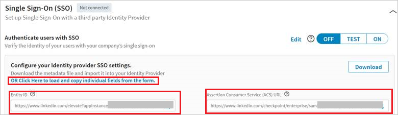
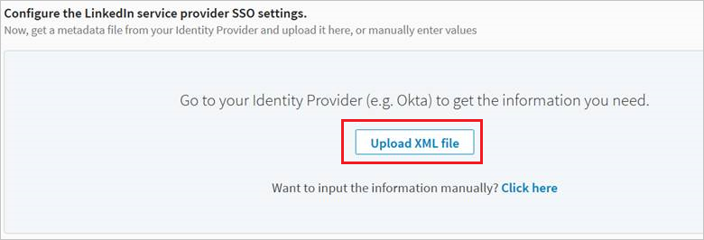

# Tutorial: Azure Active Directory integration with LinkedIn Learning

In this tutorial, you learn how to integrate LinkedIn Learning with Azure Active Directory (Azure AD).
Integrating LinkedIn Learning with Azure AD provides you with the following benefits:

* You can control in Azure AD who has access to LinkedIn Learning.
* You can enable your users to be automatically signed-in to LinkedIn Learning (Single Sign-On) with their Azure AD accounts.
* You can manage your accounts in one central location - the Azure portal.

If you want to know more details about SaaS app integration with Azure AD, see [What is application access and single sign-on with Azure Active Directory](https://docs.microsoft.com/azure/active-directory/active-directory-appssoaccess-whatis).
If you don't have an Azure subscription, [create a free account](https://azure.microsoft.com/free/) before you begin.

## Prerequisites

To configure Azure AD integration with LinkedIn Learning, you need the following items:

* An Azure AD subscription. If you don't have an Azure AD environment, you can get one-month trial [here](https://azure.microsoft.com/pricing/free-trial/)
* LinkedIn Learning single sign-on enabled subscription

## Scenario description

In this tutorial, you configure and test Azure AD single sign-on in a test environment.

* LinkedIn Learning supports **SP and IDP** initiated SSO
* LinkedIn Learning supports **Just In Time** user provisioning

## Adding LinkedIn Learning from the gallery

To configure the integration of LinkedIn Learning into Azure AD, you need to add LinkedIn Learning from the gallery to your list of managed SaaS apps.

**To add LinkedIn Learning from the gallery, perform the following steps:**

1. In the **[Azure portal](https://portal.azure.com)**, on the left navigation panel, click **Azure Active Directory** icon.

	

2. Navigate to **Enterprise Applications** and then select the **All Applications** option.

	

3. To add new application, click **New application** button on the top of dialog.

	

4. In the search box, type **LinkedIn Learning**, select **LinkedIn Learning** from result panel then click **Add** button to add the application.

	 

## Configure and test Azure AD single sign-on

In this section, you configure and test Azure AD single sign-on with LinkedIn Learning based on a test user called **Britta Simon**.
For single sign-on to work, a link relationship between an Azure AD user and the related user in LinkedIn Learning needs to be established.

To configure and test Azure AD single sign-on with LinkedIn Learning, you need to complete the following building blocks:

1. **[Configure Azure AD Single Sign-On](#configure-azure-ad-single-sign-on)** - to enable your users to use this feature.
2. **[Configure LinkedIn Learning Single Sign-On](#configure-linkedin-learning-single-sign-on)** - to configure the Single Sign-On settings on application side.
3. **[Create an Azure AD test user](#create-an-azure-ad-test-user)** - to test Azure AD single sign-on with Britta Simon.
4. **[Assign the Azure AD test user](#assign-the-azure-ad-test-user)** - to enable Britta Simon to use Azure AD single sign-on.
5. **[Create LinkedIn Learning test user](#create-linkedin-learning-test-user)** - to have a counterpart of Britta Simon in LinkedIn Learning that is linked to the Azure AD representation of user.
6. **[Test single sign-on](#test-single-sign-on)** - to verify whether the configuration works.

### Configure Azure AD single sign-on

In this section, you enable Azure AD single sign-on in the Azure portal.

To configure Azure AD single sign-on with LinkedIn Learning, perform the following steps:

1. In the [Azure portal](https://portal.azure.com/), on the **LinkedIn Learning** application integration page, select **Single sign-on**.

    

2. On the **Select a Single sign-on method** dialog, select **SAML/WS-Fed** mode to enable single sign-on.

    

3. On the **Set up Single Sign-On with SAML** page, click **Edit** icon to open **Basic SAML Configuration** dialog.

	

4. On the **Basic SAML Configuration** section, if you wish to configure the application in **IdP Initiated** mode perform the following steps:

    

    a. In the **Identifier** textbox, enter the **Entity ID** copied from LinkedIn Portal. 

	b. In the **Reply URL** textbox, enter the **Assertion Consumer Service (ACS) Url** copied from LinkedIn Portal.

	c. If you wish to configure the application in **SP Initiated** mode then click **Set additional URLs** option in the **Basic SAML Configuration**  section where you will specify your sign-on URL. To create your login Url copy the **Assertion Consumer Service (ACS) Url** and replace /saml/ with /login/. Once that has been done, the sign-on URL should have the following pattern:

    `https://www.linkedin.com/checkpoint/enterprise/login/<AccountId>?application=learning&applicationInstanceId=<InstanceId>`

    

	> [!NOTE]
	> These values are not real value. You will update these values with the actual Identifier and Reply URL, which is explained later in the **Configure LinkedIn Learning Single Sign-On** section of tutorial.

5. Your LinkedIn Learning application expects the SAML assertions in a specific format, which requires you to add custom attribute mappings to your SAML token attributes configuration. The following screenshot shows the list of default attributes, where as **nameidentifier** is mapped with **user.userprincipalname**. LinkedIn Learning application expects **nameidentifier** to be mapped with **user.mail**, so you need to edit the attribute mapping by clicking on **Edit** icon and change the attribute mapping.

	

6. In addition to above, LinkedIn Learning application expects few more attributes to be passed back in SAML response. In the **User Claims** section on the **User Attributes** dialog, perform the following steps to add SAML token attribute as shown in the below table:
    
	| Name | Source Attribute |
	| ---------------| --------------- |
	| email  | user.mail  |
	| department  | user.department  |
	| firstname  | user.givenname  |
	| lastname  | user.surname  |

	a. Click **Add new claim** to open the **Manage user claims** dialog.

	

	

	b. In the **Name** textbox, type the attribute name shown for that row.

	c. Leave the **Namespace** blank.

	d. Select Source as **Attribute**.

	e. From the **Source attribute** list, type the attribute value shown for that row.

	f. Click **Ok**

	g. Click **Save**.

7. On the **Set up Single Sign-On with SAML** page, in the **SAML Signing Certificate** section, click **Download** to download the **Federation Metadata XML** from the given options as per your requirement and save it on your computer.

	

### Configure LinkedIn Learning Single Sign-On

1. In a different web browser window, sign-on to your LinkedIn Learning tenant as an administrator.

2. In **Account Center**, click **Global Settings** under **Settings**. Also, select **Learning - Default** from the dropdown list.

	

3. Click **OR Click Here to load and copy individual fields from the form** and copy **Entity Id** and **Assertion Consumer Service (ACS) Url** and paste it in the **Basic SAML Configuration** section in Azure portal.

	

4. Go to **LinkedIn Admin Settings** section. Upload the XML file you downloaded from the Azure portal by clicking the **Upload XML file** option.

	

5. Click **On** to enable SSO. SSO status changes from **Not Connected** to **Connected**

	

### Create an Azure AD test user 

The objective of this section is to create a test user in the Azure portal called Britta Simon.

1. In the Azure portal, in the left pane, select **Azure Active Directory**, select **Users**, and then select **All users**.

    

2. Select **New user** at the top of the screen.

    

3. In the User properties, perform the following steps.

    

    a. In the **Name** field enter **BrittaSimon**.
  
    b. In the **User name** field type **brittasimon\@yourcompanydomain.extension**  
    For example, BrittaSimon@contoso.com

    c. Select **Show password** check box, and then write down the value that's displayed in the Password box.

    d. Click **Create**.

### Assign the Azure AD test user

In this section, you enable Britta Simon to use Azure single sign-on by granting access to LinkedIn Learning.

1. In the Azure portal, select **Enterprise Applications**, select **All applications**, then select **LinkedIn Learning**.

	

2. In the applications list, type and select **LinkedIn Learning**.

	

3. In the menu on the left, select **Users and groups**.

    

4. Click the **Add user** button, then select **Users and groups** in the **Add Assignment** dialog.

    

5. In the **Users and groups** dialog select **Britta Simon** in the Users list, then click the **Select** button at the bottom of the screen.

6. If you are expecting any role value in the SAML assertion then in the **Select Role** dialog select the appropriate role for the user from the list, then click the **Select** button at the bottom of the screen.

7. In the **Add Assignment** dialog click the **Assign** button.

### Create LinkedIn Learning test user

LinkedIn Learning Application supports Just in time user provisioning and after authentication users are created in the application automatically. On the admin settings page on the LinkedIn Learning portal flip the switch **Automatically Assign licenses** to active Just in time provisioning and this will also assign a license to the user.

   

### Test single sign-on 

In this section, you test your Azure AD single sign-on configuration using the Access Panel.

When you click the LinkedIn Learning tile in the Access Panel, you should be automatically signed in to the LinkedIn Learning for which you set up SSO. For more information about the Access Panel, see [Introduction to the Access Panel](https://docs.microsoft.com/azure/active-directory/active-directory-saas-access-panel-introduction).

## Additional Resources

- [List of Tutorials on How to Integrate SaaS Apps with Azure Active Directory](https://docs.microsoft.com/azure/active-directory/active-directory-saas-tutorial-list)

- [What is application access and single sign-on with Azure Active Directory?](https://docs.microsoft.com/azure/active-directory/active-directory-appssoaccess-whatis)

- [What is Conditional Access in Azure Active Directory?](https://docs.microsoft.com/azure/active-directory/conditional-access/overview)

