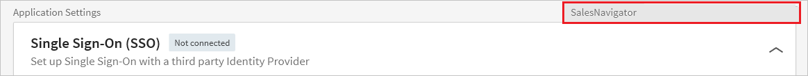
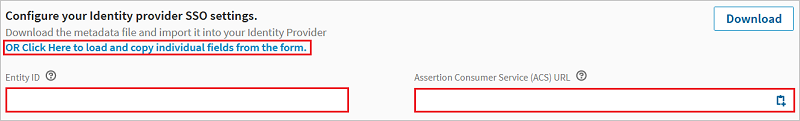
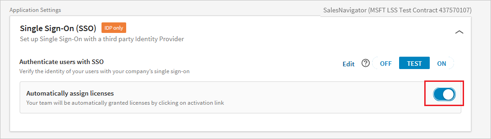

# Tutorial: Azure Active Directory single sign-on (SSO) integration with LinkedIn Sales Navigator

In this tutorial, you'll learn how to integrate LinkedIn Sales Navigator with Azure Active Directory (Azure AD). When you integrate LinkedIn Sales Navigator with Azure AD, you can:

* Control in Azure AD who has access to LinkedIn Sales Navigator.
* Enable your users to be automatically signed-in to LinkedIn Sales Navigator with their Azure AD accounts.
* Manage your accounts in one central location - the Azure portal.

## Prerequisites

To get started, you need the following items:

* An Azure AD subscription. If you don't have a subscription, you can get a [free account](https://azure.microsoft.com/free/).
* LinkedIn Sales Navigator single sign-on (SSO) enabled subscription.

## Scenario description

In this tutorial, you configure and test Azure AD SSO in a test environment.

* LinkedIn Sales Navigator supports **SP and IDP** initiated SSO.
* LinkedIn Sales Navigator supports **Just In Time** user provisioning.
* LinkedIn Sales Navigator supports **Automated** user provisioning.

> [!NOTE]
> Identifier of this application is a fixed string value so only one instance can be configured in one tenant.

## Add LinkedIn Sales Navigator from the gallery

To configure the integration of LinkedIn Sales Navigator into Azure AD, you need to add LinkedIn Sales Navigator from the gallery to your list of managed SaaS apps.

1. Sign in to the Azure portal using either a work or school account, or a personal Microsoft account.
1. On the left navigation pane, select the **Azure Active Directory** service.
1. Navigate to **Enterprise Applications** and then select **All Applications**.
1. To add new application, select **New application**.
1. In the **Add from the gallery** section, type **LinkedIn Sales Navigator** in the search box.
1. Select **LinkedIn Sales Navigator** from results panel and then add the app. Wait a few seconds while the app is added to your tenant.

## Configure and test Azure AD SSO for LinkedIn Sales Navigator

Configure and test Azure AD SSO with LinkedIn Sales Navigator using a test user called **B.Simon**. For SSO to work, you need to establish a link relationship between an Azure AD user and the related user in LinkedIn Sales Navigator.

To configure and test Azure AD SSO with LinkedIn Sales Navigator, perform the following steps:

1. **[Configure Azure AD SSO](#configure-azure-ad-sso)** - to enable your users to use this feature.
    1. **[Create an Azure AD test user](#create-an-azure-ad-test-user)** - to test Azure AD single sign-on with B.Simon.
    1. **[Assign the Azure AD test user](#assign-the-azure-ad-test-user)** - to enable B.Simon to use Azure AD single sign-on.
1. **[Configure LinkedIn Sales Navigator SSO](#configure-linkedin-sales-navigator-sso)** - to configure the single sign-on settings on application side.
    1. **[Create LinkedIn Sales Navigator test user](#create-linkedin-sales-navigator-test-user)** - to have a counterpart of B.Simon in LinkedIn Sales Navigator that is linked to the Azure AD representation of user.
1. **[Test SSO](#test-sso)** - to verify whether the configuration works.

## Configure Azure AD SSO

Follow these steps to enable Azure AD SSO in the Azure portal.

1. In the Azure portal, on the **LinkedIn Sales Navigator** application integration page, find the **Manage** section and select **single sign-on**.
1. On the **Select a single sign-on method** page, select **SAML**.
1. On the **Set up single sign-on with SAML** page, click the pencil icon for **Basic SAML Configuration** to edit the settings.

   

1. On the **Basic SAML Configuration** section, if you wish to configure the application in **IDP** initiated mode, perform the following steps:

    a. In the **Identifier** text box, enter the **Entity ID** value, you will copy Entity ID value from the Linkedin Portal explained later in this tutorial.

    b. In the **Reply URL** text box, enter the **Assertion Consumer Access (ACS) Url** value, you will copy Assertion Consumer Access (ACS) Url value from the Linkedin Portal explained later in this tutorial.

1. Click **Set additional URLs** and perform the following step if you wish to configure the application in **SP** initiated mode:

    In the **Sign-on URL** text box, type a URL using the following pattern:
    `https://www.linkedin.com/checkpoint/enterprise/login/<account id>?application=salesNavigator`

1. LinkedIn Sales Navigator application expects the SAML assertions in a specific format, which requires you to add custom attribute mappings to your SAML token attributes configuration. The following screenshot shows the list of default attributes.

	

1. In addition to above, LinkedIn Sales Navigator application expects few more attributes to be passed back in SAML response which are shown below. These attributes are also pre populated but you can review them as per your requirements.

	| Name | Source Attribute|
	| --- | --- |
	| email| user.mail |
	| department| user.department |
	| firstname| user.givenname |
	| lastname| user.surname |
	| Unique User Identifier | user.mail |

1. On the **Set up single sign-on with SAML** page, in the **SAML Signing Certificate** section,  find **Federation Metadata XML** and select **Download** to download the certificate and save it on your computer.

	

1. On the **Set up LinkedIn Sales Navigator** section, copy the appropriate URL(s) based on your requirement.

	

### Create an Azure AD test user

In this section, you'll create a test user in the Azure portal called B.Simon.

1. From the left pane in the Azure portal, select **Azure Active Directory**, select **Users**, and then select **All users**.
1. Select **New user** at the top of the screen.
1. In the **User** properties, follow these steps:
   1. In the **Name** field, enter `B.Simon`.  
   1. In the **User name** field, enter the username@companydomain.extension. For example, `B.Simon@contoso.com`.
   1. Select the **Show password** check box, and then write down the value that's displayed in the **Password** box.
   1. Click **Create**.

### Assign the Azure AD test user

In this section, you'll enable B.Simon to use Azure single sign-on by granting access to LinkedIn Sales Navigator.

1. In the Azure portal, select **Enterprise Applications**, and then select **All applications**.
1. In the applications list, select **LinkedIn Sales Navigator**.
1. In the app's overview page, find the **Manage** section and select **Users and groups**.
1. Select **Add user**, then select **Users and groups** in the **Add Assignment** dialog.
1. In the **Users and groups** dialog, select **B.Simon** from the Users list, then click the **Select** button at the bottom of the screen.
1. If you are expecting a role to be assigned to the users, you can select it from the **Select a role** dropdown. If no role has been set up for this app, you see "Default Access" role selected.
1. In the **Add Assignment** dialog, click the **Assign** button.

## Configure LinkedIn Sales Navigator SSO

1. In a different web browser window, sign-on to your **LinkedIn Sales Navigator** website as an administrator.

1. In **Account Center**, click **Global Settings** under **Settings**. Also, select **Sales Navigator** from the dropdown list.

	

1. Click on **OR Click Here to load and copy individual fields from the form** and perform the following steps:

	

	a. Copy **Entity Id** and paste it into the **Identifier** text box in the **Basic SAML Configuration** in the Azure portal.

	b. Copy **Assertion Consumer Access (ACS) Url** and paste it into the **Reply URL** text box in the **Basic SAML Configuration** in the Azure portal.

1. Go to **LinkedIn Admin Settings** section. Upload the XML file that you have downloaded from the Azure portal by clicking on the **Upload XML file** option.

	

1. Click **On** to enable SSO. SSO status changes from **Not Connected** to **Connected**

	

### Create LinkedIn Sales Navigator test user

Linked Sales Navigator Application supports Just in Time (JIT) user provisioning and after authentication users are created in the application automatically. Activate **Automatically assign licenses** to assign a license to the user.

   

## Test SSO 

In this section, you test your Azure AD single sign-on configuration with following options. 

#### SP initiated:

* Click on **Test this application** in Azure portal. This will redirect to LinkedIn Sales Navigator Sign on URL where you can initiate the login flow.  

* Go to LinkedIn Sales Navigator Sign-on URL directly and initiate the login flow from there.

#### IDP initiated:

* Click on **Test this application** in Azure portal and you should be automatically signed in to the LinkedIn Sales Navigator for which you set up the SSO. 

You can also use Microsoft My Apps to test the application in any mode. When you click the LinkedIn Sales Navigator tile in the My Apps, if configured in SP mode you would be redirected to the application sign on page for initiating the login flow and if configured in IDP mode, you should be automatically signed in to the LinkedIn Sales Navigator for which you set up the SSO. For more information about the My Apps, see [Introduction to the My Apps](../user-help/my-apps-portal-end-user-access.md).

## Next steps

Once you configure LinkedIn Sales Navigator you can enforce session control, which protects exfiltration and infiltration of your organization’s sensitive data in real time. Session control extends from Conditional Access. [Learn how to enforce session control with Microsoft Cloud App Security](/cloud-app-security/proxy-deployment-any-app).