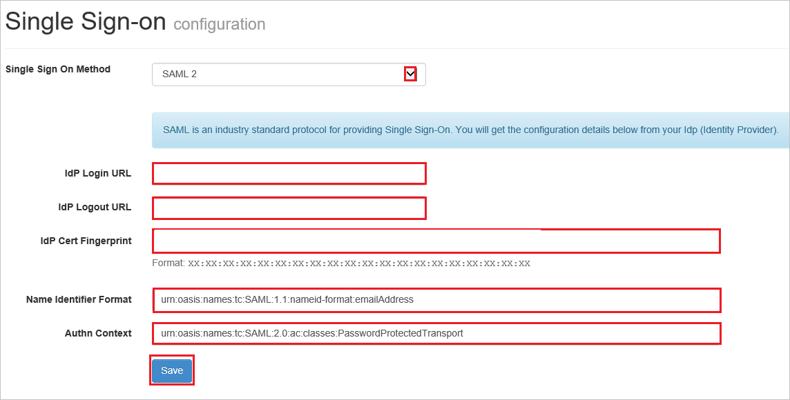

# Tutorial: Azure AD SSO integration with LiquidFiles

In this tutorial, you'll learn how to integrate LiquidFiles with Azure Active Directory (Azure AD). When you integrate LiquidFiles with Azure AD, you can:

* Control in Azure AD who has access to LiquidFiles.
* Enable your users to be automatically signed-in to LiquidFiles with their Azure AD accounts.
* Manage your accounts in one central location - the Azure portal.

## Prerequisites

To configure Azure AD integration with LiquidFiles, you need the following items:

* An Azure AD subscription. If you don't have an Azure AD environment, you can get a [free account](https://azure.microsoft.com/free/).
* LiquidFiles single sign-on enabled subscription.

> [!NOTE]
> This integration is also available to use from Azure AD US Government Cloud environment. You can find this application in the Azure AD US Government Cloud Application Gallery and configure it in the same way as you do from public cloud.

## Scenario description

In this tutorial, you configure and test Azure AD single sign-on in a test environment.

* LiquidFiles supports **SP** initiated SSO.

## Add LiquidFiles from the gallery

To configure the integration of LiquidFiles into Azure AD, you need to add LiquidFiles from the gallery to your list of managed SaaS apps.

1. Sign in to the Azure portal using either a work or school account, or a personal Microsoft account.
1. On the left navigation pane, select the **Azure Active Directory** service.
1. Navigate to **Enterprise Applications** and then select **All Applications**.
1. To add new application, select **New application**.
1. In the **Add from the gallery** section, type **LiquidFiles** in the search box.
1. Select **LiquidFiles** from results panel and then add the app. Wait a few seconds while the app is added to your tenant.

 Alternatively, you can also use the [Enterprise App Configuration Wizard](https://portal.office.com/AdminPortal/home?Q=Docs#/azureadappintegration). In this wizard, you can add an application to your tenant, add users/groups to the app, assign roles, as well as walk through the SSO configuration as well. [Learn more about Microsoft 365 wizards.](/microsoft-365/admin/misc/azure-ad-setup-guides)

## Configure and test Azure AD SSO for LiquidFiles

Configure and test Azure AD SSO with LiquidFiles using a test user called **B.Simon**. For SSO to work, you need to establish a link relationship between an Azure AD user and the related user in LiquidFiles.

To configure and test Azure AD SSO with LiquidFiles, perform the following steps:

1. **[Configure Azure AD SSO](#configure-azure-ad-sso)** - to enable your users to use this feature.
    1. **[Create an Azure AD test user](#create-an-azure-ad-test-user)** - to test Azure AD single sign-on with B.Simon.
    1. **[Assign the Azure AD test user](#assign-the-azure-ad-test-user)** - to enable B.Simon to use Azure AD single sign-on.
1. **[Configure LiquidFiles SSO](#configure-liquidfiles-sso)** - to configure the single sign-on settings on application side.
    1. **[Create LiquidFiles test user](#create-liquidfiles-test-user)** - to have a counterpart of B.Simon in LiquidFiles that is linked to the Azure AD representation of user.
1. **[Test SSO](#test-sso)** - to verify whether the configuration works.

## Configure Azure AD SSO

Follow these steps to enable Azure AD SSO in the Azure portal.

1. In the Azure portal, on the **LiquidFiles** application integration page, find the **Manage** section and select **single sign-on**.
1. On the **Select a single sign-on method** page, select **SAML**.
1. On the **Set up single sign-on with SAML** page, click the pencil icon for **Basic SAML Configuration** to edit the settings.

   

4. On the **Basic SAML Configuration** section, perform the following steps:

    a. In the **Identifier (Entity ID)** text box, type a URL using the following pattern:
    `https://<YOUR_SERVER_URL>`

    b. In the **Reply URL** textbox, type a URL using the following pattern: `https://<YOUR_SERVER_URL>/saml/consume`

	c. In the **Sign on URL** text box, type a URL using the following pattern:
    `https://<YOUR_SERVER_URL>/saml/init`

	> [!NOTE]
	> These values are not real. Update these values with the actual Identifier,Reply URL and Sign on URL. Contact [LiquidFiles Client support team](https://www.liquidfiles.com/support.html) to get these values. You can also refer to the patterns shown in the **Basic SAML Configuration** section in the Azure portal.

5. In the **SAML Signing Certificate** section, click **Edit** button to open **SAML Signing Certificate** dialog.

	

6. In the **SAML Signing Certificate** section, copy the **THUMBPRINT** and save it on your computer.

    

7. On the **Set up LiquidFiles** section, copy the appropriate URL(s) as per your requirement.

	

### Create an Azure AD test user

In this section, you'll create a test user in the Azure portal called B.Simon.

1. From the left pane in the Azure portal, select **Azure Active Directory**, select **Users**, and then select **All users**.
1. Select **New user** at the top of the screen.
1. In the **User** properties, follow these steps:
   1. In the **Name** field, enter `B.Simon`.  
   1. In the **User name** field, enter the username@companydomain.extension. For example, `B.Simon@contoso.com`.
   1. Select the **Show password** check box, and then write down the value that's displayed in the **Password** box.
   1. Click **Create**.

### Assign the Azure AD test user

In this section, you'll enable B.Simon to use Azure single sign-on by granting access to LiquidFiles.

1. In the Azure portal, select **Enterprise Applications**, and then select **All applications**.
1. In the applications list, select **LiquidFiles**.
1. In the app's overview page, find the **Manage** section and select **Users and groups**.
1. Select **Add user**, then select **Users and groups** in the **Add Assignment** dialog.
1. In the **Users and groups** dialog, select **B.Simon** from the Users list, then click the **Select** button at the bottom of the screen.
1. If you are expecting a role to be assigned to the users, you can select it from the **Select a role** dropdown. If no role has been set up for this app, you see "Default Access" role selected.
1. In the **Add Assignment** dialog, click the **Assign** button.

## Configure LiquidFiles SSO

1. Sign-on to your LiquidFiles company site as administrator.

1. Click **Single Sign-On** in the **Admin > Configuration** from the menu.

1. On the **Single Sign-On Configuration** page, perform the following steps.

    

    a. As **Single Sign On Method**, select **SAML 2**.

	b. In the **IDP Login URL** textbox, paste the value of **Login URL**, which you have copied from Azure portal.

	c. In the **IDP Logout URL** textbox, paste the value of **Logout URL**, which you have copied from Azure portal.

	d. In the **IDP Cert Fingerprint** textbox, paste the **THUMBPRINT** value which you have copied from Azure portal.

	e. In the Name Identifier Format textbox, type the value `urn:oasis:names:tc:SAML:1.1:nameid-format:emailAddress`.

	f. In the Authn Context textbox, type the value `urn:oasis:names:tc:SAML:2.0:ac:classes:PasswordProtectedTransport`.

	g. Click **Save**.

### Create LiquidFiles test user

The objective of this section is to create a user called Britta Simon in LiquidFiles. Work with your LiquidFiles server administrator to get yourself added as a user before logging in to your LiquidFiles application.

## Test SSO

In this section, you test your Azure AD single sign-on configuration with following options. 

* Click on **Test this application** in Azure portal. This will redirect to LiquidFiles Sign-on URL where you can initiate the login flow. 

* Go to LiquidFiles Sign-on URL directly and initiate the login flow from there.

* You can use Microsoft My Apps. When you click the LiquidFiles tile in the My Apps, this will redirect to LiquidFiles Sign-on URL. For more information about the My Apps, see [Introduction to the My Apps](../user-help/my-apps-portal-end-user-access.md).

## Next steps

Once you configure LiquidFiles you can enforce session control, which protects exfiltration and infiltration of your organization’s sensitive data in real time. Session control extends from Conditional Access. [Learn how to enforce session control with Microsoft Defender for Cloud Apps](/cloud-app-security/proxy-deployment-aad).
