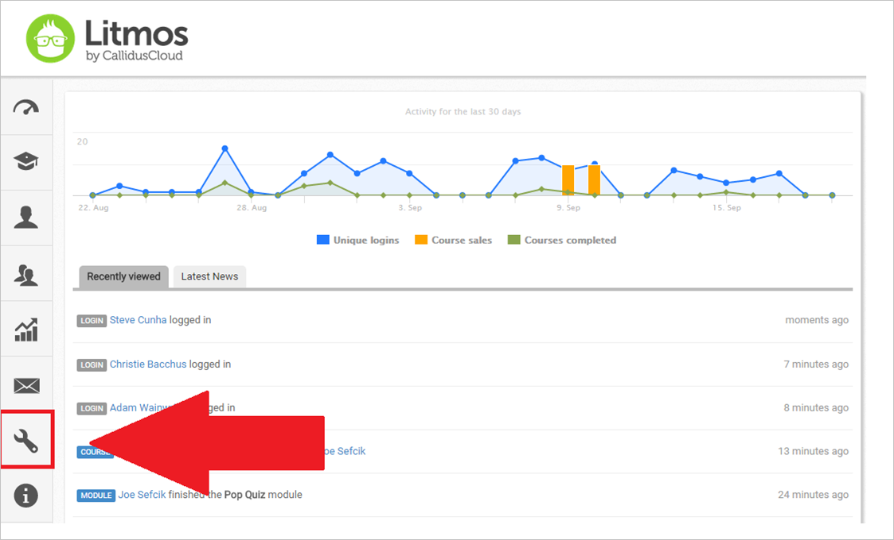
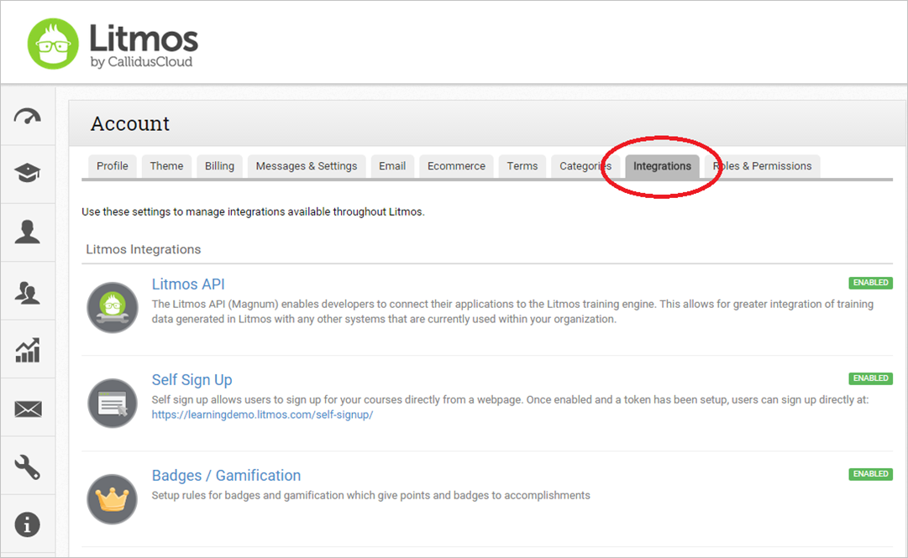
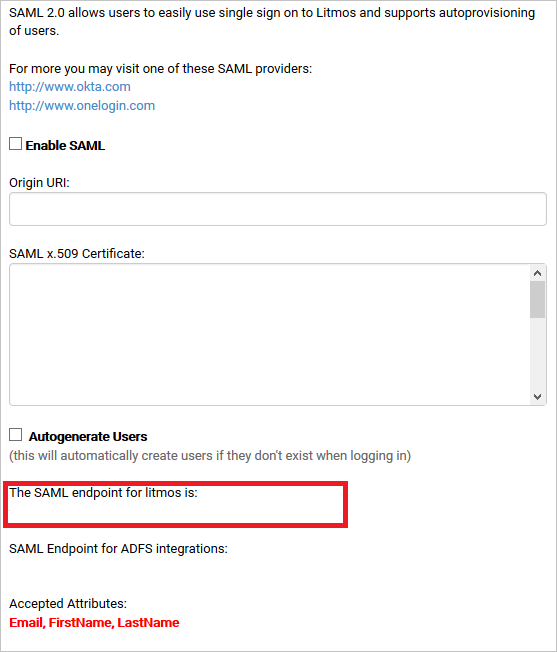
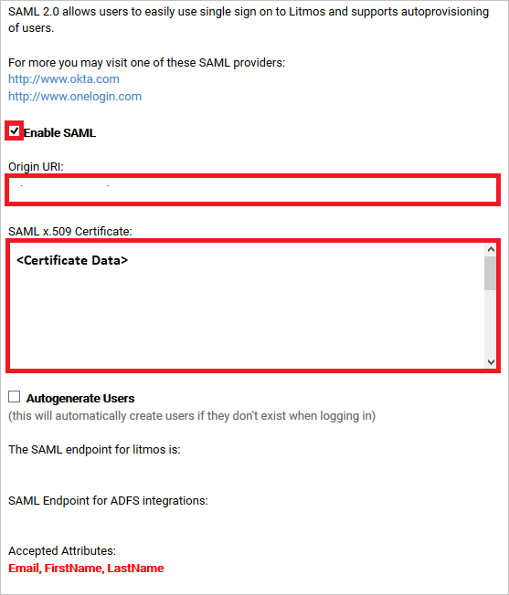
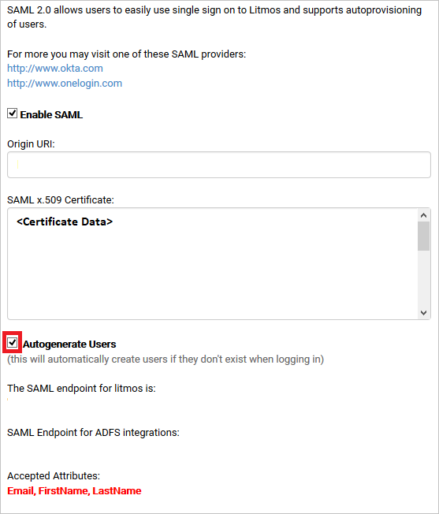

# Tutorial: Microsoft Entra SSO integration with SAP Litmos

In this tutorial, you'll learn how to integrate SAP Litmos with Microsoft Entra ID. When you integrate SAP Litmos with Microsoft Entra ID, you can:

* Control in Microsoft Entra ID who has access to SAP Litmos.
* Enable your users to be automatically signed-in to SAP Litmos with their Microsoft Entra accounts.
* Manage your accounts in one central location.

## Prerequisites

To get started, you need the following items:

* A Microsoft Entra subscription. If you don't have a subscription, you can get a [free account](https://azure.microsoft.com/free/).
* SAP Litmos single sign-on (SSO) enabled subscription.

## Scenario description

In this tutorial, you configure and test Microsoft Entra SSO in a test environment.

* SAP Litmos supports **SP** and **IDP** initiated SSO.
* SAP Litmos supports **Just In Time** user provisioning.

## Add SAP Litmos from the gallery

To configure the integration of SAP Litmos into Microsoft Entra ID, you need to add SAP Litmos from the gallery to your list of managed SaaS apps.

1. Sign in to the [Microsoft Entra admin center](https://entra.microsoft.com) as at least a [Cloud Application Administrator](../roles/permissions-reference.md#cloud-application-administrator).
1. Browse to **Identity** > **Applications** > **Enterprise applications** > **New application**.
1. In the **Add from the gallery** section, type **SAP Litmos** in the search box.
1. Select **SAP Litmos** from results panel and then add the app. Wait a few seconds while the app is added to your tenant.

 Alternatively, you can also use the [Enterprise App Configuration Wizard](https://portal.office.com/AdminPortal/home?Q=Docs#/azureadappintegration). In this wizard, you can add an application to your tenant, add users/groups to the app, assign roles, as well as walk through the SSO configuration as well. [Learn more about Microsoft 365 wizards.](/microsoft-365/admin/misc/azure-ad-setup-guides)

## Configure and test Microsoft Entra SSO for SAP Litmos

Configure and test Microsoft Entra SSO with SAP Litmos using a test user called **B.Simon**. For SSO to work, you need to establish a link relationship between a Microsoft Entra user and the related user in SAP Litmos.

To configure and test Microsoft Entra SSO with SAP Litmos, perform the following steps:

1. **[Configure Microsoft Entra SSO](#configure-azure-ad-sso)** - to enable your users to use this feature.
    1. **[Create a Microsoft Entra test user](#create-an-azure-ad-test-user)** - to test Microsoft Entra single sign-on with B.Simon.
    1. **[Assign the Microsoft Entra test user](#assign-the-azure-ad-test-user)** - to enable B.Simon to use Microsoft Entra single sign-on.
1. **[Configure SAP Litmos SSO](#configure-sap-litmos-sso)** - to configure the single sign-on settings on application side.
    1. **[Create SAP Litmos test user](#create-sap-litmos-test-user)** - to have a counterpart of B.Simon in SAP Litmos that is linked to the Microsoft Entra representation of user.
1. **[Test SSO](#test-sso)** - to verify whether the configuration works.

## Configure Microsoft Entra SSO

Follow these steps to enable Microsoft Entra SSO.

1. Sign in to the [Microsoft Entra admin center](https://entra.microsoft.com) as at least a [Cloud Application Administrator](../roles/permissions-reference.md#cloud-application-administrator).
1. Browse to **Identity** > **Applications** > **Enterprise applications** > **SAP Litmos** > **Single sign-on**.
1. On the **Select a single sign-on method** page, select **SAML**.
1. On the **Set up single sign-on with SAML** page, click the pencil icon for **Basic SAML Configuration** to edit the settings.

   

1. On the **Basic SAML Configuration** section, perform the following steps:

    a. In the **Identifier** text box, type one of the following URLs:

    | **Identifier** |
    |--------|
    | `https://<CustomerName>.litmos.com` |
    | `https://<CustomerName>.litmos.com.au` |
    | `https://<CustomerName>.litmoseu.com` |

    b. In the **Reply URL** text box, type one of the following URLs:
    
    | **Reply URL** |
    |--------|
    | `https://<CompanyName>.litmos.com/integration/splogin` |
    | `https://<CompanyName>.litmos.com/integration/splogin?IdP=1` |
    | `https://<CompanyName>.litmos.com/integration/splogin?IdP=2` |
    | `https://<CompanyName>.litmos.com/integration/splogin?IdP=3` |
    | `https://<CompanyName>.litmos.com/integration/splogin?IdP=14` | 
    | `https://<CompanyName>.litmos.com.au/integration/splogin` |
    | `https://<CompanyName>.litmos.com.au/integration/splogin?IdP=1` |
    | `https://<CompanyName>.litmos.com.au/integration/splogin?IdP=2` |
    | `https://<CompanyName>.litmos.com.au/integration/splogin?IdP=3` |
    | `https://<CompanyName>.litmos.com.au/integration/splogin?IdP=14` |
    | `https://<CompanyName>.litmoseu.com/integration/splogin` |
    | `https://<CompanyName>.litmoseu.com/integration/splogin?IdP=1`|
    | `https://<CompanyName>.litmoseu.com/integration/splogin?IdP=2`|
    | `https://<CompanyName>.litmoseu.com/integration/splogin?IdP=3` |
    | `https://<CompanyName>.litmoseu.com/integration/splogin?IdP=14` |

    c. In the **Sign on URL** text box, type one of the following URLs:

    | **Sign on URL** |
    |-------|
    | `https://<CompanyName>.litmos.com/integration/splogin` |
    | `https://<CompanyName>.litmos.com/integration/splogin?IdP=1` |
    | `https://<CompanyName>.litmos.com/integration/splogin?IdP=2` |
    | `https://<CompanyName>.litmos.com/integration/splogin?IdP=3` |
    | `https://<CompanyName>.litmos.com/integration/splogin?IdP=14` | 
    | `https://<CompanyName>.litmos.com.au/integration/splogin` |
    | `https://<CompanyName>.litmos.com.au/integration/splogin?IdP=1` |
    | `https://<CompanyName>.litmos.com.au/integration/splogin?IdP=2` |
    | `https://<CompanyName>.litmos.com.au/integration/splogin?IdP=3` |
    | `https://<CompanyName>.litmos.com.au/integration/splogin?IdP=14` |
    | `https://<CompanyName>.litmoseu.com/integration/splogin` |
    | `https://<CompanyName>.litmoseu.com/integration/splogin?IdP=1`|
    | `https://<CompanyName>.litmoseu.com/integration/splogin?IdP=2`|
    | `https://<CompanyName>.litmoseu.com/integration/splogin?IdP=3` |
    | `https://<CompanyName>.litmoseu.com/integration/splogin?IdP=14` |

    d. In the **Relay State URL** text box, type one of the following URLs:

    | **Relay State URL** |
    |--------|
    | `https://<CompanyName>.litmos.com/integration/splogin?RelayState=https://<CustomerName>.litmos.com/Course/12345` |
    | `https://<CompanyName>.litmos.com/integration/splogin?RelayState=https://<CustomerName>.litmos.com/LearningPath/12345` |

    > [!NOTE]
	> These values are not real. Update these values with the actual Identifier, Reply URL, Sign on URL and Relay State URL which are explained later in tutorial or contact [SAP Litmos Client support team](https://www.litmos.com/contact-us) to get these values. You can also refer to the patterns shown in the **Basic SAML Configuration** section.

1. On the **Set up single sign-on with SAML** page, in the **SAML Signing Certificate** section,  find **Certificate (Base64)** and select **Download** to download the certificate and save it on your computer.

	

1. On the **Set up SAP Litmos** section, copy the appropriate URL(s) based on your requirement.

	

### Create a Microsoft Entra test user

In this section, you'll create a test user called B.Simon.

1. Sign in to the [Microsoft Entra admin center](https://entra.microsoft.com) as at least a [User Administrator](../roles/permissions-reference.md#user-administrator).
1. Browse to **Identity** > **Users** > **All users**.
1. Select **New user** > **Create new user**, at the top of the screen.
1. In the **User** properties, follow these steps:
   1. In the **Display name** field, enter `B.Simon`.  
   1. In the **User principal name** field, enter the username@companydomain.extension. For example, `B.Simon@contoso.com`.
   1. Select the **Show password** check box, and then write down the value that's displayed in the **Password** box.
   1. Select **Review + create**.
1. Select **Create**.

### Assign the Microsoft Entra test user

In this section, you'll enable B.Simon to use single sign-on by granting access to SAP Litmos.

1. Sign in to the [Microsoft Entra admin center](https://entra.microsoft.com) as at least a [Cloud Application Administrator](../roles/permissions-reference.md#cloud-application-administrator).
1. Browse to **Identity** > **Applications** > **Enterprise applications** > **SAP Litmos**.
1. In the app's overview page, select **Users and groups**.
1. Select **Add user/group**, then select **Users and groups** in the **Add Assignment** dialog.
   1. In the **Users and groups** dialog, select **B.Simon** from the Users list, then click the **Select** button at the bottom of the screen.
   1. If you are expecting a role to be assigned to the users, you can select it from the **Select a role** dropdown. If no role has been set up for this app, you see "Default Access" role selected.
   1. In the **Add Assignment** dialog, click the **Assign** button.

## Configure SAP Litmos SSO

1. In a different browser window, sign-on to your SAP Litmos company site as administrator.

2. In the navigation bar on the left side, click **Accounts**.

    

3. Click the **Integrations** tab.

    

4. On the **Integrations** tab, scroll down to **3rd Party Integrations**, and then click **SAML 2.0** tab.

    

5. Copy the value under **The SAML endpoint for litmos is:** and paste it into the **Reply URL** textbox in the **Litmos Domain and URLs** section in Azure portal.

    

6. In your **SAP Litmos** application, perform the following steps:

    

	a. Click **Enable SAML**.

	b. Open your base-64 encoded certificate in notepad, copy the content of it into your clipboard, and then paste it to the **SAML X.509 Certificate** textbox.

	c. Click **Save Changes**.

### Create SAP Litmos test user

In this section, a user called B.Simon is created in SAP Litmos. SAP Litmos supports just-in-time user provisioning, which is enabled by default. There's no action item for you in this section. If a user doesn't already exist in SAP Litmos, a new one is created after authentication.

**To create a user called Britta Simon in SAP Litmos, perform the following steps:**

1. In a different browser window, sign-on to your SAP Litmos company site as administrator.

2. In the navigation bar on the left side, click **Accounts**.

    

3. Click the **Integrations** tab.

    

4. On the **Integrations** tab, scroll down to **3rd Party Integrations**, and then click **SAML 2.0** tab.

    

5. Select **Autogenerate Users**
  
    

## Test SSO 

In this section, you test your Microsoft Entra single sign-on configuration with following options. 

#### SP initiated:

* Click on **Test this application**, this will redirect to SAP Litmos Sign on URL where you can initiate the login flow.  

* Go to SAP Litmos Sign-on URL directly and initiate the login flow from there.

#### IDP initiated:

* Click on **Test this application**, and you should be automatically signed in to the SAP Litmos for which you set up the SSO. 

You can also use Microsoft My Apps to test the application in any mode. When you click the SAP Litmos tile in the My Apps, if configured in SP mode you would be redirected to the application sign on page for initiating the login flow and if configured in IDP mode, you should be automatically signed in to the SAP Litmos for which you set up the SSO. For more information, see [Microsoft Entra My Apps](/azure/active-directory/manage-apps/end-user-experiences#azure-ad-my-apps).

## Next steps

Once you configure SAP Litmos you can enforce session control, which protects exfiltration and infiltration of your organization’s sensitive data in real time. Session control extends from Conditional Access. [Learn how to enforce session control with Microsoft Cloud App Security](/cloud-app-security/proxy-deployment-aad).
