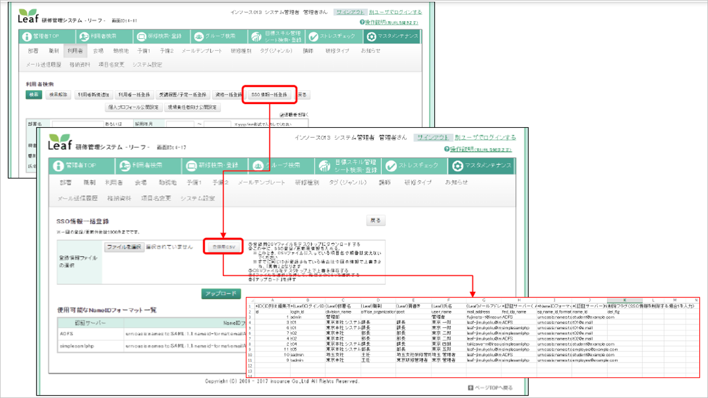
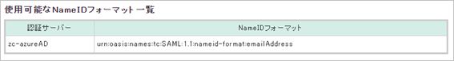

# Tutorial: Azure AD SSO integration with LMS and Education Management System Leaf

In this tutorial, you'll learn how to integrate LMS and Education Management System Leaf with Azure Active Directory (Azure AD). When you integrate LMS and Education Management System Leaf with Azure AD, you can:

* Control in Azure AD who has access to LMS and Education Management System Leaf.
* Enable your users to be automatically signed-in to LMS and Education Management System Leaf with their Azure AD accounts.
* Manage your accounts in one central location - the Azure portal.

## Prerequisites

To get started, you need the following items:

* An Azure AD subscription. If you don't have a subscription, you can get a [free account](https://azure.microsoft.com/free/).
* LMS and Education Management System Leaf single sign-on (SSO) enabled subscription.
* Along with Cloud Application Administrator, Application Administrator can also add or manage applications in Azure AD.
For more information, see [Azure built-in roles](../roles/permissions-reference.md).

## Scenario description

In this tutorial, you configure and test Azure AD SSO in a test environment.

* LMS and Education Management System Leaf supports **SP** initiated SSO.

## Add LMS and Education Management System Leaf from the gallery

To configure the integration of LMS and Education Management System Leaf into Azure AD, you need to add LMS and Education Management System Leaf from the gallery to your list of managed SaaS apps.

1. Sign in to the Azure portal using either a work or school account, or a personal Microsoft account.
1. On the left navigation pane, select the **Azure Active Directory** service.
1. Navigate to **Enterprise Applications** and then select **All Applications**.
1. To add new application, select **New application**.
1. In the **Add from the gallery** section, type **LMS and Education Management System Leaf** in the search box.
1. Select **LMS and Education Management System Leaf** from results panel and then add the app. Wait a few seconds while the app is added to your tenant.

 Alternatively, you can also use the [Enterprise App Configuration Wizard](https://portal.office.com/AdminPortal/home?Q=Docs#/azureadappintegration). In this wizard, you can add an application to your tenant, add users/groups to the app, assign roles, as well as walk through the SSO configuration as well. [Learn more about Microsoft 365 wizards.](/microsoft-365/admin/misc/azure-ad-setup-guides)

## Configure and test Azure AD SSO for LMS and Education Management System Leaf

Configure and test Azure AD SSO with LMS and Education Management System Leaf using a test user called **B.Simon**. For SSO to work, you need to establish a link relationship between an Azure AD user and the related user in LMS and Education Management System Leaf.

To configure and test Azure AD SSO with LMS and Education Management System Leaf, perform the following steps:

1. **[Configure Azure AD SSO](#configure-azure-ad-sso)** - to enable your users to use this feature.
    1. **[Create an Azure AD test user](#create-an-azure-ad-test-user)** - to test Azure AD single sign-on with B.Simon.
    1. **[Assign the Azure AD test user](#assign-the-azure-ad-test-user)** - to enable B.Simon to use Azure AD single sign-on.
1. **[Configure LMS and Education Management System Leaf SSO](#configure-lms-and-education-management-system-leaf-sso)** - to configure the single sign-on settings on application side.
    1. **[Create LMS and Education Management System Leaf test user](#create-lms-and-education-management-system-leaf-test-user)** - to have a counterpart of B.Simon in LMS and Education Management System Leaf that is linked to the Azure AD representation of user.
1. **[Test SSO](#test-sso)** - to verify whether the configuration works.

## Configure Azure AD SSO

Follow these steps to enable Azure AD SSO in the Azure portal.

1. In the Azure portal, on the **LMS and Education Management System Leaf** application integration page, find the **Manage** section and select **single sign-on**.
1. On the **Select a single sign-on method** page, select **SAML**.
1. On the **Set up single sign-on with SAML** page, click the pencil icon for **Basic SAML Configuration** to edit the settings.

    

1. On the **Basic SAML Configuration** section, perform the following steps:

    a. In the **Identifier** textbox, type a URL using the following pattern:
    `https://<SUBDOMAIN>.leaf-hrm.jp/`

    b. In the **Reply URL** textbox, type a URL using the following pattern:
    `https://<SUBDOMAIN>.leaf-hrm.jp/loginusers/acs`   

    c. In the **Sign on URL** text box, type a URL using the following pattern:
    `https://<SUBDOMAIN>.leaf-hrm.jp/loginusers/sso/1`

    > [!Note]
    > These values are not real. Update these values with the actual Identifier, Reply URL and Sign on URL. Contact [LMS and Education Management System Leaf support team](mailto:leaf-jimukyoku@insource.co.jp) to get these values. You can also refer to the patterns shown in the **Basic SAML Configuration** section in the Azure portal.

1. Your LMS and Education Management System Leaf application expects the SAML assertions in a specific format, which requires you to add custom attribute mappings to your SAML token attributes configuration. The following screenshot shows an example for this. The default value of **Unique User Identifier** is **user.userprincipalname** but LMS and Education Management System Leaf expects this to be mapped with the user's email address. For that you can use **user.mail** attribute from the list or use the appropriate attribute value based on your organization configuration.

	

1. On the **Set-up single sign-on with SAML** page, in the **SAML Signing Certificate** section,  find **Federation Metadata XML** and select **Download** to download the certificate and save it on your computer.

    

1. On the **Set up LMS and Education Management System Leaf** section, copy the appropriate URL(s) based on your requirement.

	  

### Create an Azure AD test user

In this section, you'll create a test user in the Azure portal called B.Simon.

1. From the left pane in the Azure portal, select **Azure Active Directory**, select **Users**, and then select **All users**.
1. Select **New user** at the top of the screen.
1. In the **User** properties, follow these steps:
   1. In the **Name** field, enter `B.Simon`.  
   1. In the **User name** field, enter the username@companydomain.extension. For example, `B.Simon@contoso.com`.
   1. Select the **Show password** check box, and then write down the value that's displayed in the **Password** box.
   1. Click **Create**.

### Assign the Azure AD test user

In this section, you'll enable B.Simon to use Azure single sign-on by granting access to LMS and Education Management System Leaf.

1. In the Azure portal, select **Enterprise Applications**, and then select **All applications**.
1. In the applications list, select **LMS and Education Management System Leaf**.
1. In the app's overview page, find the **Manage** section and select **Users and groups**.
1. Select **Add user**, then select **Users and groups** in the **Add Assignment** dialog.
1. In the **Users and groups** dialog, select **B.Simon** from the Users list, then click the **Select** button at the bottom of the screen.
1. If you are expecting a role to be assigned to the users, you can select it from the **Select a role** dropdown. If no role has been set up for this app, you see "Default Access" role selected.
1. In the **Add Assignment** dialog, click the **Assign** button.

## Configure LMS and Education Management System Leaf SSO

To configure single sign-on on **LMS and Education Management System Leaf** side, you need to send the downloaded **Federation Metadata XML** and appropriate copied URLs from Azure portal to [LMS and Education Management System Leaf support team](mailto:leaf-jimukyoku@insource.co.jp). They set this setting to have the SAML SSO connection set properly on both sides.

### Create LMS and Education Management System Leaf test user

1. Log in as the Leaf system administrator user. From the **User tab** of **Master Maintenance**, create a user with a login ID of `leaftest`.
2. From the User tab of Master Maintenance, click the **SSO Information Bulk Registration** button.
3. Click the **Registration CSV** button to download the registration CSV.
4. Open the downloaded CSV, enter (Leaf) login ID, nameID format, authentication server, and save.

    

    

    a. Please enter `leaftest` in the **(Leaf) Login ID** column.

    b. In the Authentication Server column, enter the value corresponding to the Authentication Server in the above figure.

    c. In the NameID format column, enter the value corresponding to **NameID format**.

    d.Enter **leaftest@company。.extension** in the [NameID] column.

5. Click the **Select File** button and select the CSV you edited earlier.
6. Click the **Upload** button.

> [!NOTE]
> As a way to associate with Leaf, the login ID (user) on which Leaf is linked with the NameID (user) 
and NameID format (format) on which IdP (authentication server) is specified.

## Test SSO 

In this section, you test your Azure AD single sign-on configuration with following options. 

* Click on **Test this application** in Azure portal. This will redirect to LMS and Education Management System Leaf Sign-on URL where you can initiate the login flow. 

* Go to LMS and Education Management System Leaf Sign-on URL directly and initiate the login flow from there.

* You can use Microsoft My Apps. When you click the LMS and Education Management System Leaf tile in the My Apps, this will redirect to LMS and Education Management System Leaf Sign-on URL. For more information about the My Apps, see [Introduction to the My Apps](../user-help/my-apps-portal-end-user-access.md).

## Next steps

Once you configure LMS and Education Management System Leaf you can enforce session control, which protects exfiltration and infiltration of your organization’s sensitive data in real time. Session control extends from Conditional Access. [Learn how to enforce session control with Microsoft Cloud App Security](/cloud-app-security/proxy-deployment-aad).
