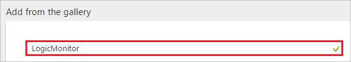
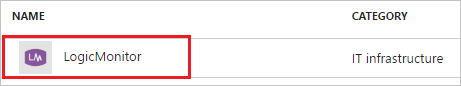
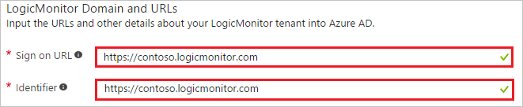
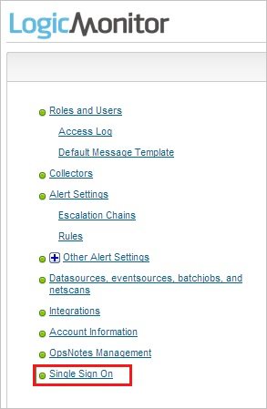
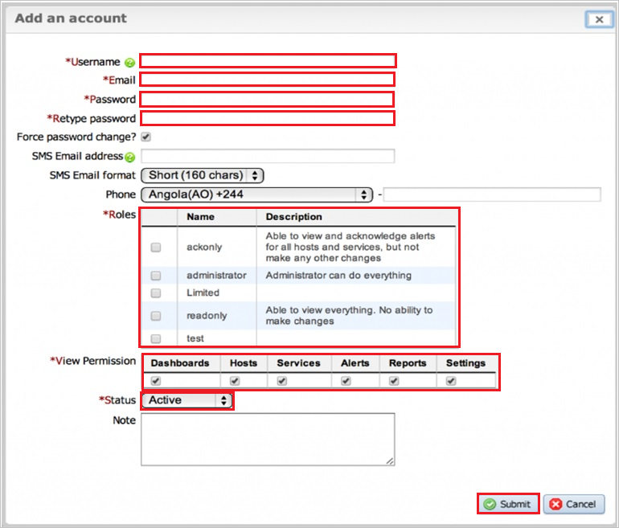
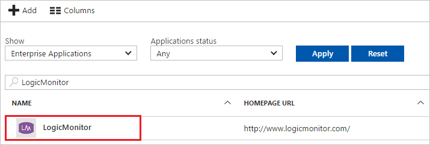

---
title: 'Tutorial: Azure Active Directory integration with LogicMonitor | Microsoft Docs'
description: Learn how to configure single sign-on between Azure Active Directory and LogicMonitor.
services: active-directory
documentationCenter: na
author: jeevansd
manager: mtillman

ms.assetid: 496156c3-0e22-4492-b36f-2c29c055e087
ms.service: active-directory
ms.component: saas-app-tutorial
ms.workload: identity
ms.tgt_pltfrm: na
ms.devlang: na
ms.topic: article
ms.date: 08/02/2018
ms.author: jeedes

---
# Tutorial: Azure Active Directory integration with LogicMonitor

In this tutorial, you learn how to integrate LogicMonitor with Azure Active Directory (Azure AD).

Integrating LogicMonitor with Azure AD provides you with the following benefits:

- You can control in Azure AD who has access to LogicMonitor
- You can enable your users to automatically get signed-on to LogicMonitor (Single Sign-On) with their Azure AD accounts
- You can manage your accounts in one central location - the Azure portal

If you want to know more details about SaaS app integration with Azure AD, see [what is application access and single sign-on with Azure Active Directory](../manage-apps/what-is-single-sign-on.md).

## Prerequisites

To configure Azure AD integration with LogicMonitor, you need the following items:

- An Azure AD subscription
- A LogicMonitor single sign-on enabled subscription

> [!NOTE]
> To test the steps in this tutorial, we do not recommend using a production environment.

To test the steps in this tutorial, you should follow these recommendations:

- Do not use your production environment, unless it is necessary.
- If you don't have an Azure AD trial environment, you can get a one-month trial [here](https://azure.microsoft.com/pricing/free-trial/).

## Scenario description
In this tutorial, you test Azure AD single sign-on in a test environment. 
The scenario outlined in this tutorial consists of two main building blocks:

1. Adding LogicMonitor from the gallery
1. Configuring and testing Azure AD single sign-on

## Adding LogicMonitor from the gallery
To configure the integration of LogicMonitor into Azure AD, you need to add LogicMonitor from the gallery to your list of managed SaaS apps.

**To add LogicMonitor from the gallery, perform the following steps:**

1. In the **[Azure portal](https://portal.azure.com)**, on the left navigation panel, click **Azure Active Directory** icon. 

	![Active Directory][1]

1. Navigate to **Enterprise applications**. Then go to **All applications**.

	![Applications][2]
	
1. To add new application, click **New application** button on the top of dialog.

	![Applications][3]

1. In the search box, type **LogicMonitor**.

	

1. In the results panel, select **LogicMonitor**, and then click **Add** button to add the application.

	

##  Configuring and testing Azure AD single sign-on
In this section, you configure and test Azure AD single sign-on with LogicMonitor based on a test user called "Britta Simon".

For single sign-on to work, Azure AD needs to know what the counterpart user in LogicMonitor is to a user in Azure AD. In other words, a link relationship between an Azure AD user and the related user in LogicMonitor needs to be established.

In LogicMonitor, assign the value of the **user name** in Azure AD as the value of the **Username** to establish the link relationship.

To configure and test Azure AD single sign-on with LogicMonitor, you need to complete the following building blocks:

1. **[Configuring Azure AD Single Sign-On](#configuring-azure-ad-single-sign-on)** - to enable your users to use this feature.
1. **[Creating an Azure AD test user](#creating-an-azure-ad-test-user)** - to test Azure AD single sign-on with Britta Simon.
1. **[Creating a LogicMonitor test user](#creating-a-logicmonitor-test-user)** - to have a counterpart of Britta Simon in LogicMonitor that is linked to the Azure AD representation of user.
1. **[Assigning the Azure AD test user](#assigning-the-azure-ad-test-user)** - to enable Britta Simon to use Azure AD single sign-on.
1. **[Testing Single Sign-On](#testing-single-sign-on)** - to verify whether the configuration works.

### Configuring Azure AD single sign-on

In this section, you enable Azure AD single sign-on in the Azure portal and configure single sign-on in your LogicMonitor application.

**To configure Azure AD single sign-on with LogicMonitor, perform the following steps:**

1. In the Azure portal, on the **LogicMonitor** application integration page, click **Single sign-on**.

	![Configure Single Sign-On][4]

1. On the **Single sign-on** dialog, select **Mode** as	**SAML-based Sign-on** to enable single sign-on.
 
	

1. On the **LogicMonitor Domain and URLs** section, perform the following steps:

	

    a. In the **Sign-on URL** textbox, type a URL using the following pattern: `https://<companyname>.logicmonitor.com`

	b. In the **Identifier** textbox, type a URL using the following pattern: `https://<companyname>.logicmonitor.com`

	> [!NOTE] 
	> These values are not real. Update these values with the actual Sign-On URL and Identifier. Contact [LogicMonitor Client support team](https://www.logicmonitor.com/contact/) to get these values. 
 

1. On the **SAML Signing Certificate** section, click **Metadata XML** and then save the metadata file on your computer.

	 

1. Click **Save** button.

	

1. Log in to your **LogicMonitor** company site as an administrator.

1. In the menu on the top, click **Settings**.
   
    

1. In the navigation bat on the left side, click **Single Sign On**
   
    

1. In the **Single Sign-on (SSO) settings** section, perform the following steps:
   
    
   
    a. Select **Enable Single Sign-on**.

    b. As **Default Role Assignment**, select **readonly**.
   
    c. Open the downloaded metadata file in notepad, and then paste content of the file into the **Identity Provider Metadata** textbox.
   
    d. Click **Save Changes**.

### Creating an Azure AD test user
The objective of this section is to create a test user in the Azure portal called Britta Simon.

![Create Azure AD User][100]

**To create a test user in Azure AD, perform the following steps:**

1. In the **Azure portal**, on the left navigation pane, click **Azure Active Directory** icon.

	 

1. To display the list of users, go to **Users and groups** and click **All users**.
	
	 

1. To open the **User** dialog, click **Add** on the top of the dialog.
 
	 

1. On the **User** dialog page, perform the following steps:
 
	 

    a. In the **Name** textbox, type **BrittaSimon**.

    b. In the **User name** textbox, type the **email address** of BrittaSimon.

	c. Select **Show Password** and write down the value of the **Password**.

    d. Click **Create**.
 
### Creating a LogicMonitor test user

For Azure AD users to be able to sign in, they must be provisioned to the LogicMonitor application using their Azure Active Directory user names.

**To configure user provisioning, perform the following steps:**

1. Log in to your LogicMonitor company site as an administrator.

1. In the menu on the top, click **Settings**, and then click **Roles and Users**.
   
    

1. Click **Add**.

1. In the **Add an account** section, perform the following steps:
   
    
   
    a. Type the **Username**, **Email**, **Password**, and **Retype password** values of the Azure Active Directory user you want to provision into the related textboxes.
   
    b. Select **Roles**, **View Permissions**, and the **Status**.
   
    c. Click **Submit**.

>[!NOTE]
>You can use any other LogicMonitor user account creation tools or APIs provided by LogicMonitor to provision Azure Active Directory user accounts. 

### Assigning the Azure AD test user

In this section, you enable Britta Simon to use Azure single sign-on by granting access to LogicMonitor.

![Assign User][200] 

**To assign Britta Simon to LogicMonitor, perform the following steps:**

1. In the Azure portal, open the applications view, and then navigate to the directory view and go to **Enterprise applications** then click **All applications**.

	![Assign User][201] 

1. In the applications list, select **LogicMonitor**.

	 

1. In the menu on the left, click **Users and groups**.

	![Assign User][202] 

1. Click **Add** button. Then select **Users and groups** on **Add Assignment** dialog.

	![Assign User][203]

1. On **Users and groups** dialog, select **Britta Simon** in the Users list.

1. Click **Select** button on **Users and groups** dialog.

1. Click **Assign** button on **Add Assignment** dialog.
	
### Testing single sign-on

In this section, you test your Azure AD single sign-on configuration using the Access Panel.
 
When you click the LogicMonitor tile in the Access Panel, you should get automatically signed-on to your LogicMonitor application.
For more information about the Access Panel, see [Introduction to the Access Panel](../active-directory-saas-access-panel-introduction.md). 

## Additional resources

* [List of Tutorials on How to Integrate SaaS Apps with Azure Active Directory](tutorial-list.md)
* [What is application access and single sign-on with Azure Active Directory?](../manage-apps/what-is-single-sign-on.md)

<!--Image references-->

[1]: ./media/logicmonitor-tutorial/tutorial_general_01.png
[2]: ./media/logicmonitor-tutorial/tutorial_general_02.png
[3]: ./media/logicmonitor-tutorial/tutorial_general_03.png
[4]: ./media/logicmonitor-tutorial/tutorial_general_04.png

[100]: ./media/logicmonitor-tutorial/tutorial_general_100.png

[200]: ./media/logicmonitor-tutorial/tutorial_general_200.png
[201]: ./media/logicmonitor-tutorial/tutorial_general_201.png
[202]: ./media/logicmonitor-tutorial/tutorial_general_202.png
[203]: ./media/logicmonitor-tutorial/tutorial_general_203.png

