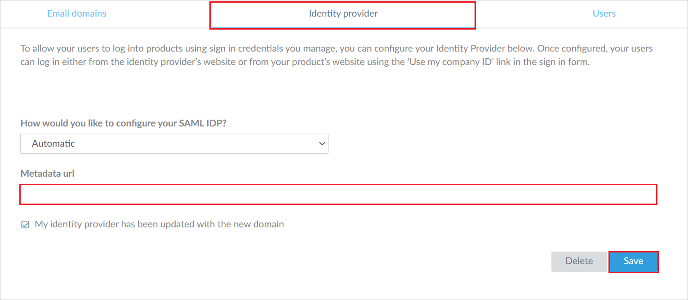
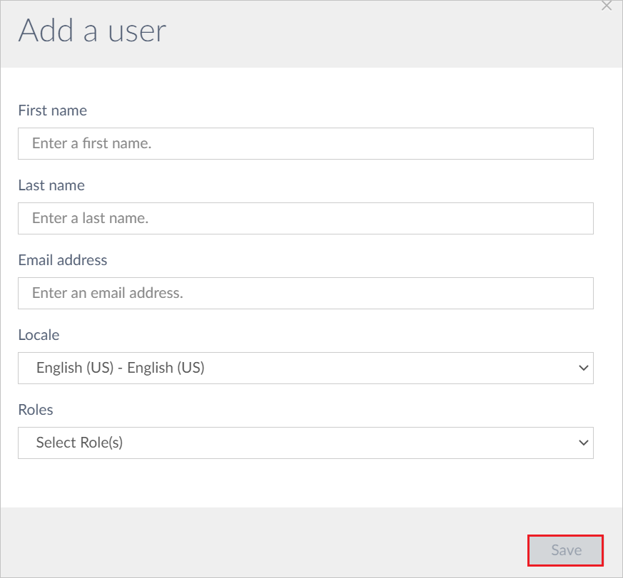

# Tutorial: Azure Active Directory single sign-on (SSO) integration with LogMeIn

In this tutorial, you'll learn how to integrate LogMeIn with Azure Active Directory (Azure AD). When you integrate LogMeIn with Azure AD, you can:

* Control in Azure AD who has access to LogMeIn.
* Enable your users to be automatically signed-in to LogMeIn with their Azure AD accounts.
* Manage your accounts in one central location - the Azure portal.

## Prerequisites

To get started, you need the following items:

* An Azure AD subscription. If you don't have a subscription, you can get a [free account](https://azure.microsoft.com/free/).
* LogMeIn single sign-on (SSO) enabled subscription.

## Scenario description

In this tutorial, you configure and test Azure AD SSO in a test environment.

* LogMeIn supports **SP and IDP** initiated SSO.

## Adding LogMeIn from the gallery

To configure the integration of LogMeIn into Azure AD, you need to add LogMeIn from the gallery to your list of managed SaaS apps.

1. Sign in to the Azure portal using either a work or school account, or a personal Microsoft account.
1. On the left navigation pane, select the **Azure Active Directory** service.
1. Navigate to **Enterprise Applications** and then select **All Applications**.
1. To add new application, select **New application**.
1. In the **Add from the gallery** section, type **LogMeIn** in the search box.
1. Select **LogMeIn** from results panel and then add the app. Wait a few seconds while the app is added to your tenant.

## Configure and test Azure AD SSO for LogMeIn

Configure and test Azure AD SSO with LogMeIn using a test user called **B.Simon**. For SSO to work, you need to establish a link relationship between an Azure AD user and the related user in LogMeIn.

To configure and test Azure AD SSO with LogMeIn, perform the following steps:

1. **[Configure Azure AD SSO](#configure-azure-ad-sso)** - to enable your users to use this feature.
    * **[Create an Azure AD test user](#create-an-azure-ad-test-user)** - to test Azure AD single sign-on with B.Simon.
    * **[Assign the Azure AD test user](#assign-the-azure-ad-test-user)** - to enable B.Simon to use Azure AD single sign-on.
1. **[Configure LogMeIn SSO](#configure-logmein-sso)** - to configure the single sign-on settings on application side.
    * **[Create LogMeIn test user](#create-logmein-test-user)** - to have a counterpart of B.Simon in LogMeIn that is linked to the Azure AD representation of user.
1. **[Test SSO](#test-sso)** - to verify whether the configuration works.

## Configure Azure AD SSO

Follow these steps to enable Azure AD SSO in the Azure portal.

1. In the Azure portal, on the **LogMeIn** application integration page, find the **Manage** section and select **single sign-on**.
1. On the **Select a single sign-on method** page, select **SAML**.
1. On the **Set up single sign-on with SAML** page, click the edit/pen icon for **Basic SAML Configuration** to edit the settings.

   

1. On the **Basic SAML Configuration** section, the user does not have to perform any steps as the app is already pre-integrated with Azure.

1. Click **Set additional URLs** and perform the following steps if you wish to configure the application in **SP** initiated mode:

	a. In the **Sign-on URL** text box, type the URL:
    `https://authentication.logmeininc.com/login?service=https%3A%2F%2Fmyaccount.logmeininc.com`

1. On the **Set up single sign-on with SAML** page, In the **SAML Signing Certificate** section, click copy button to copy **App Federation Metadata Url** and save it on your computer.

	

6. On the **Set up LogMeIn** section, copy the appropriate URL(s) as per your requirement.

	

### Create an Azure AD test user

In this section, you'll create a test user in the Azure portal called B.Simon.

1. From the left pane in the Azure portal, select **Azure Active Directory**, select **Users**, and then select **All users**.
1. Select **New user** at the top of the screen.
1. In the **User** properties, follow these steps:
   1. In the **Name** field, enter `B.Simon`.  
   1. In the **User name** field, enter the username@companydomain.extension. For example, `B.Simon@contoso.com`.
   1. Select the **Show password** check box, and then write down the value that's displayed in the **Password** box.
   1. Click **Create**.

### Assign the Azure AD test user

In this section, you'll enable B.Simon to use Azure single sign-on by granting access to LogMeIn.

1. In the Azure portal, select **Enterprise Applications**, and then select **All applications**.
1. In the applications list, select **LogMeIn**.
1. In the app's overview page, find the **Manage** section and select **Users and groups**.
1. Select **Add user**, then select **Users and groups** in the **Add Assignment** dialog.
1. In the **Users and groups** dialog, select **B.Simon** from the Users list, then click the **Select** button at the bottom of the screen.
1. If you are expecting a role to be assigned to the users, you can select it from the **Select a role** dropdown. If no role has been set up for this app, you see "Default Access" role selected.
1. In the **Add Assignment** dialog, click the **Assign** button.

## Configure LogMeIn SSO

1. In a different browser window, log in to your LogMeIn website as an administrator.

1. Go to the **Identity Provider** tab and in the **Metadata url** textbox, paste the **Federation Metadata URL**, which you have copied from the Azure portal.

    

1. Click **Save**.

### Create LogMeIn test user

1. In a different browser window, log in to your LogMeIn website as an administrator.

1. Go to the **Users** tab and click **Add a user**.

    

1. Fill the required fields in the following page and click **Save**.

    

## Test SSO 

In this section, you test your Azure AD single sign-on configuration with following options. 

#### SP initiated:

* Click on **Test this application** in Azure portal. This will redirect to LogMeIn Sign on URL where you can initiate the login flow.  

* Go to LogMeIn Sign-on URL directly and initiate the login flow from there.

#### IDP initiated:

* Click on **Test this application** in Azure portal and you should be automatically signed in to the LogMeIn for which you set up the SSO 

You can also use Microsoft My Apps to test the application in any mode. When you click the LogMeIn tile in the My Apps, if configured in SP mode you would be redirected to the application sign on page for initiating the login flow and if configured in IDP mode, you should be automatically signed in to the LogMeIn for which you set up the SSO. For more information about the My Apps, see [Introduction to the My Apps](https://docs.microsoft.com/azure/active-directory/active-directory-saas-access-panel-introduction).

## Next steps

Once you configure the LogMeIn you can enforce session controls, which protects exfiltration and infiltration of your organization’s sensitive data in real time. Session controls extends from Conditional Access. [Learn how to enforce session control with Microsoft Cloud App Security](https://docs.microsoft.com/cloud-app-security/proxy-deployment-aad)