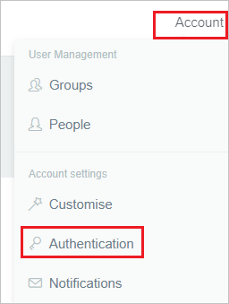
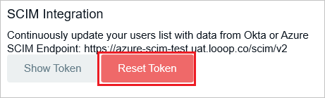
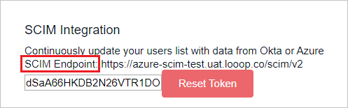
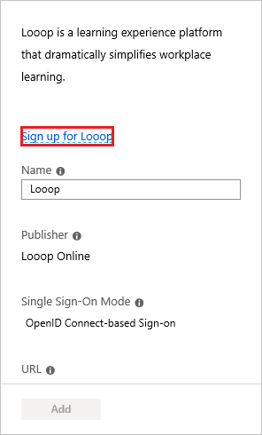
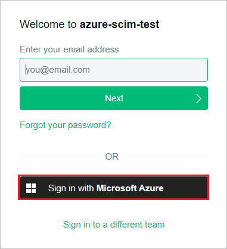
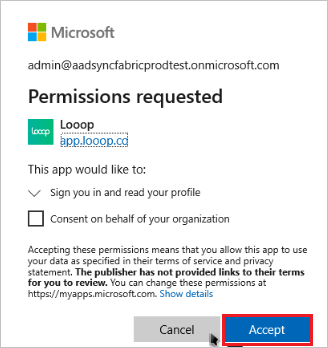
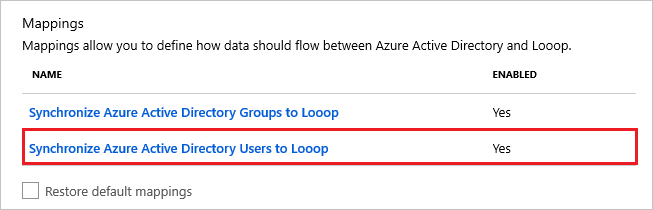
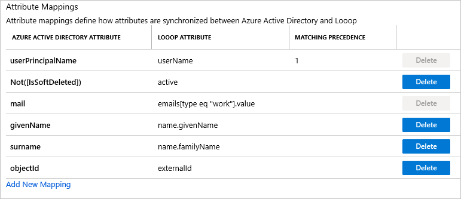
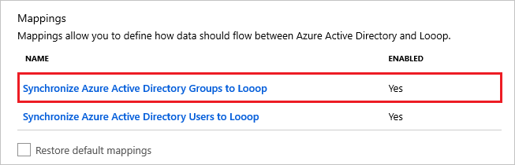
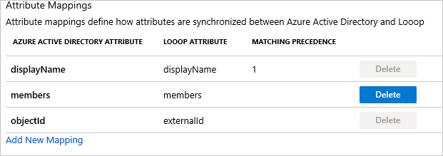

# Tutorial: Configure Looop for automatic user provisioning

The objective of this tutorial is to demonstrate the steps to be performed in Looop and Azure Active Directory (Azure AD) to configure Azure AD to automatically provision and de-provision users and/or groups to Looop.

> [!NOTE]
> This tutorial describes a connector built on top of the Azure AD User Provisioning Service. For important details on what this service does, how it works, and frequently asked questions, see [Automate user provisioning and deprovisioning to SaaS applications with Azure Active Directory](../app-provisioning/user-provisioning.md).
>
> This connector is currently in Public Preview. For more information on the general Microsoft Azure terms of use for Preview features, see [Supplemental Terms of Use for Microsoft Azure Previews](https://azure.microsoft.com/support/legal/preview-supplemental-terms/).

## Prerequisites

The scenario outlined in this tutorial assumes that you already have the following prerequisites:

* An Azure AD tenant
* [A Looop tenant](https://www.looop.co/pricing/)
* A user account on a Looop with Administrator permissions.

## Assign users to Looop

Azure Active Directory uses a concept called assignments to determine which users should receive access to selected apps. In the context of automatic user provisioning, only the users and/or groups that have been assigned to an application in Azure AD are synchronized.

Before configuring and enabling automatic user provisioning, you should decide which users and/or groups in Azure AD need access to Looop. Once decided, you can assign these users and/or groups to Looop by following the instructions here:

* [Assign a user or group to an enterprise app](../manage-apps/assign-user-or-group-access-portal.md)

### Important tips for assigning users to Looop

* It is recommended that a single Azure AD user is assigned to Looop to test the automatic user provisioning configuration. Additional users and/or groups may be assigned later.

* When assigning a user to Looop, you must select any valid application-specific role (if available) in the assignment dialog. Users with the **Default Access** role are excluded from provisioning.

## Set up Looop for provisioning

Before configuring Looop for automatic user provisioning with Azure AD, you will need to retrieve some provisioning information from Looop.

1. Sign in to your [Looop Admin Console](https://app.looop.co/#/login) and select **Account**. Under **Account Settings** select **Authentication**.

	

2. Generate a new token by clicking **Reset Token** under **SCIM Integration**.

	

3. Copy the **SCIM Endpoint** and the **Token**. These values will be entered in the **Tenant URL** and **Secret Token** fields in the Provisioning tab of your Looop application in the Azure portal. 

	

## Add Looop from the gallery

To configure Looop for automatic user provisioning with Azure AD, you need to add Looop from the Azure AD application gallery to your list of managed SaaS applications.

1. In the **[Azure portal](https://portal.azure.com)**, in the left navigation panel, select **Azure Active Directory**.

	

2. Go to **Enterprise applications**, and then select **All applications**.

	

3. To add a new application, select the **New application** button at the top of the pane.

	

4. In the search box, enter **Looop**, select **Looop** in the results panel. 

	

5. Select the **Sign-up for Looop** button which will redirect you to Looop's login page. 

	

6. As Looop is an OpenIDConnect app, choose to login to Looop using your Microsoft work account.

	

7. After a successful authentication, accept the consent prompt for the consent page. The application will then be automatically added to your tenant and you will be redirected to your Looop account.

	

## Configure automatic user provisioning to Looop 

This section guides you through the steps to configure the Azure AD provisioning service to create, update, and disable users and/or groups in Looop based on user and/or group assignments in Azure AD.

### To configure automatic user provisioning for Looop in Azure AD:

1. Sign in to the [Azure portal](https://portal.azure.com). Select **Enterprise Applications**, then select **All applications**.

	

2. In the applications list, select **Looop**.

	

3. Select the **Provisioning** tab.

	

4. Set the **Provisioning Mode** to **Automatic**.

	

5. Under the **Admin Credentials** section, input `https://<organisation_domain>.looop.co/scim/v2` in **Tenant URL**. For example `https://demo.looop.co/scim/v2`. Input the value that you retrieved and saved earlier from Looop in **Secret Token**. Click **Test Connection** to ensure Azure AD can connect to Looop. If the connection fails, ensure your Looop account has Admin permissions and try again.

	

6. In the **Notification Email** field, enter the email address of a person or group who should receive the provisioning error notifications and check the checkbox - **Send an email notification when a failure occurs**.

	

7. Click **Save**.

8. Under the **Mappings** section, select **Synchronize Azure Active Directory Users to Looop**.

	

9. Review the user attributes that are synchronized from Azure AD to Looop in the **Attribute Mapping** section. The attributes selected as **Matching** properties are used to match the user accounts in Looop for update operations. Select the **Save** button to commit any changes.

	

10. Under the **Mappings** section, select **Synchronize Azure Active Directory Groups to Meta Networks Connector**.

	

11. Review the group attributes that are synchronized from Azure AD to Meta Networks Connector in the **Attribute Mapping** section. The attributes selected as **Matching** properties are used to match the groups in Meta Networks Connector for update operations. Select the **Save** button to commit any changes.

	

10. To configure scoping filters, refer to the following instructions provided in the [Scoping filter tutorial](../app-provisioning/define-conditional-rules-for-provisioning-user-accounts.md).

11. To enable the Azure AD provisioning service for Looop, change the **Provisioning Status** to **On** in the **Settings** section.

	

12. Define the users and/or groups that you would like to provision to Looop by choosing the desired values in **Scope** in the **Settings** section.

	

13. When you are ready to provision, click **Save**.

	

This operation starts the initial synchronization of all users and/or groups defined in **Scope** in the **Settings** section. The initial sync takes longer to perform than subsequent syncs, which occur approximately every 40 minutes as long as the Azure AD provisioning service is running. You can use the **Synchronization Details** section to monitor progress and follow links to provisioning activity report, which describes all actions performed by the Azure AD provisioning service on Looop.

For more information on how to read the Azure AD provisioning logs, see [Reporting on automatic user account provisioning](../app-provisioning/check-status-user-account-provisioning.md).

## Additional resources

* [Managing user account provisioning for Enterprise Apps](../app-provisioning/configure-automatic-user-provisioning-portal.md)
* [What is application access and single sign-on with Azure Active Directory?](../manage-apps/what-is-single-sign-on.md)

## Next steps

* [Learn how to review logs and get reports on provisioning activity](../app-provisioning/check-status-user-account-provisioning.md)

