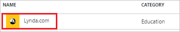
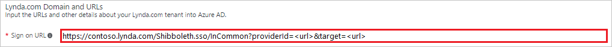

---
title: 'Tutorial: Azure Active Directory integration with Lynda.com | Microsoft Docs'
description: Learn how to configure single sign-on between Azure Active Directory and Lynda.com.
services: active-directory
documentationCenter: na
author: jeevansd
manager: mtillman

ms.assetid: f6c92789-8b64-4049-bac9-8cb928398433
ms.service: active-directory
ms.component: saas-app-tutorial
ms.workload: identity
ms.tgt_pltfrm: na
ms.devlang: na
ms.topic: article
ms.date: 06/01/2017
ms.author: jeedes

---
# Tutorial: Azure Active Directory integration with Lynda.com

In this tutorial, you learn how to integrate Lynda.com with Azure Active Directory (Azure AD).

Integrating Lynda.com with Azure AD provides you with the following benefits:

- You can control in Azure AD who has access to Lynda.com
- You can enable your users to automatically get signed-on to Lynda.com (Single Sign-On) with their Azure AD accounts
- You can manage your accounts in one central location - the Azure portal

If you want to know more details about SaaS app integration with Azure AD, see [what is application access and single sign-on with Azure Active Directory](../manage-apps/what-is-single-sign-on.md).

## Prerequisites

To configure Azure AD integration with Lynda.com, you need the following items:

- An Azure AD subscription
- A Lynda.com single-sign on enabled subscription

> [!NOTE]
> To test the steps in this tutorial, we do not recommend using a production environment.

To test the steps in this tutorial, you should follow these recommendations:

- Do not use your production environment, unless it is necessary.
- If you don't have an Azure AD trial environment, you can get a one-month trial [here](https://azure.microsoft.com/pricing/free-trial/).

## Scenario description
In this tutorial, you test Azure AD single sign-on in a test environment. 
The scenario outlined in this tutorial consists of two main building blocks:

1. Adding Lynda.com from the gallery
1. Configuring and testing Azure AD single sign-on

## Adding Lynda.com from the gallery
To configure the integration of Lynda.com into Azure AD, you need to add Lynda.com from the gallery to your list of managed SaaS apps.

**To add Lynda.com from the gallery, perform the following steps:**

1. In the **[Azure portal](https://portal.azure.com)**, on the left navigation panel, click **Azure Active Directory** icon. 

	![Active Directory][1]

1. Navigate to **Enterprise applications**. Then go to **All applications**.

	![Applications][2]
	
1. To add new application, click **New application** button on the top of dialog.

	![Applications][3]

1. In the search box, type **Lynda.com**.

	

1. In the results panel, select **Lynda.com**, and then click **Add** button to add the application.

	

##  Configuring and testing Azure AD single sign-on
In this section, you configure and test Azure AD single sign-on with Lynda.com based on a test user called "Britta Simon."

For single sign-on to work, Azure AD needs to know what the counterpart user in Lynda.com is to a user in Azure AD. In other words, a link relationship between an Azure AD user and the related user in Lynda.com needs to be established.

This link relationship is established by assigning the value of the **user name** in Azure AD as the value of the **Username** in Lynda.com.

To configure and test Azure AD single sign-on with Lynda.com, you need to complete the following building blocks:

1. **[Configuring Azure AD Single Sign-On](#configuring-azure-ad-single-sign-on)** - to enable your users to use this feature.
1. **[Creating an Azure AD test user](#creating-an-azure-ad-test-user)** - to test Azure AD single sign-on with Britta Simon.
1. **[Creating a Lynda.com test user](#creating-a-lyndacom-test-user)** - to have a counterpart of Britta Simon in Lynda.com that is linked to the Azure AD representation of user.
1. **[Assigning the Azure AD test user](#assigning-the-azure-ad-test-user)** - to enable Britta Simon to use Azure AD single sign-on.
1. **[Testing Single Sign-On](#testing-single-sign-on)** - to verify whether the configuration works.

### Configuring Azure AD single sign-on

In this section, you enable Azure AD single sign-on in the Azure portal and configure single sign-on in your Lynda.com application.

**To configure Azure AD single sign-on with Lynda.com, perform the following steps:**

1. In the Azure portal, on the **Lynda.com** application integration page, click **Single sign-on**.

	![Configure Single Sign-On][4]

1. On the **Single sign-on** dialog, select **Mode** as	**SAML-based Sign-on** to enable single sign-on.
 
	

1. On the **Lynda.com Domain and URLs** section, perform the following steps:

	

    In the **Sign-on URL** textbox, type a URL using the following pattern: `https://<subdomain>.lynda.com/Shibboleth.sso/InCommon?providerId=<url>&target=<url> `

	> [!NOTE] 
	> This value is not real. Update this value with the actual Sign-On URL. Contact [Lynda.com Client support team](https://www.linkedin.com/help/lynda/ask) to get these values. 
 
1. On the **SAML Signing Certificate** section, click **Metadata XML** and then save the XML file on your computer.

	 

1. Click **Save** button.

	

1. To configure single sign-on on **Lynda.com** side, you need to send the downloaded **Metadata XML** [Lynda.com support](https://www.linkedin.com/help/lynda/ask).

### Creating an Azure AD test user
The objective of this section is to create a test user in the Azure portal called Britta Simon.

![Create Azure AD User][100]

**To create a test user in Azure AD, perform the following steps:**

1. In the **Azure portal**, on the left navigation pane, click **Azure Active Directory** icon.

	 

1. To display the list of users, go to **Users and groups** and click **All users**.
	
	 

1. To open the **User** dialog, click **Add** on the top of the dialog.
 
	 

1. On the **User** dialog page, perform the following steps:
 
	 

    a. In the **Name** textbox, type **BrittaSimon**.

    b. In the **User name** textbox, type the **email address** of BrittaSimon.

	c. Select **Show Password** and write down the value of the **Password**.

    d. Click **Create**.
 
### Creating a Lynda.com test user

There is no action item for you to configure user provisioning to Lynda.com.  
When an assigned user tries to log in to Lynda.com using the access panel, Lynda.com checks whether the user exists.  

If there is no user account available yet, it is automatically created by Lynda.com.

>[!NOTE]
>You can use any other Lynda.com user account creation tools or APIs provided by Lynda.com to provision AAD user accounts. 

### Assigning the Azure AD test user

In this section, you enable Britta Simon to use Azure single sign-on by granting access to Lynda.com.

![Assign User][200] 

**To assign Britta Simon to Lynda.com, perform the following steps:**

1. In the Azure portal, open the applications view, and then navigate to the directory view and go to **Enterprise applications** then click **All applications**.

	![Assign User][201] 

1. In the applications list, select **Lynda.com**.

	 

1. In the menu on the left, click **Users and groups**.

	![Assign User][202] 

1. Click **Add** button. Then select **Users and groups** on **Add Assignment** dialog.

	![Assign User][203]

1. On **Users and groups** dialog, select **Britta Simon** in the Users list.

1. Click **Select** button on **Users and groups** dialog.

1. Click **Assign** button on **Add Assignment** dialog.
	
### Testing single sign-on

If you want to test your single sign-on settings, open the Access Panel. For more information about the Access Panel, see [Introduction to the Access Panel](../user-help/active-directory-saas-access-panel-introduction.md). 

## Additional resources

* [List of Tutorials on How to Integrate SaaS Apps with Azure Active Directory](tutorial-list.md)
* [What is application access and single sign-on with Azure Active Directory?](../manage-apps/what-is-single-sign-on.md)

<!--Image references-->

[1]: ./media/lynda-tutorial/tutorial_general_01.png
[2]: ./media/lynda-tutorial/tutorial_general_02.png
[3]: ./media/lynda-tutorial/tutorial_general_03.png
[4]: ./media/lynda-tutorial/tutorial_general_04.png

[100]: ./media/lynda-tutorial/tutorial_general_100.png

[200]: ./media/lynda-tutorial/tutorial_general_200.png
[201]: ./media/lynda-tutorial/tutorial_general_201.png
[202]: ./media/lynda-tutorial/tutorial_general_202.png
[203]: ./media/lynda-tutorial/tutorial_general_203.png

