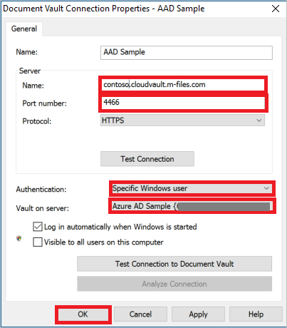

# Tutorial: Azure Active Directory integration with M-Files

In this tutorial, you learn how to integrate M-Files with Azure Active Directory (Azure AD).
Integrating M-Files with Azure AD provides you with the following benefits:

* You can control in Azure AD who has access to M-Files.
* You can enable your users to be automatically signed-in to M-Files (Single Sign-On) with their Azure AD accounts.
* You can manage your accounts in one central location - the Azure portal.

If you want to know more details about SaaS app integration with Azure AD, see [What is application access and single sign-on with Azure Active Directory](https://docs.microsoft.com/azure/active-directory/active-directory-appssoaccess-whatis).
If you don't have an Azure subscription, [create a free account](https://azure.microsoft.com/free/) before you begin.

## Prerequisites

To configure Azure AD integration with M-Files, you need the following items:

* An Azure AD subscription. If you don't have an Azure AD environment, you can get one-month trial [here](https://azure.microsoft.com/pricing/free-trial/)
* M-Files single sign-on enabled subscription

## Scenario description

In this tutorial, you configure and test Azure AD single sign-on in a test environment.

* M-Files supports **SP** initiated SSO

## Adding M-Files from the gallery

To configure the integration of M-Files into Azure AD, you need to add M-Files from the gallery to your list of managed SaaS apps.

**To add M-Files from the gallery, perform the following steps:**

1. In the **[Azure portal](https://portal.azure.com)**, on the left navigation panel, click **Azure Active Directory** icon.

	

2. Navigate to **Enterprise Applications** and then select the **All Applications** option.

	

3. To add new application, click **New application** button on the top of dialog.

	

4. In the search box, type **M-Files**, select **M-Files** from result panel then click **Add** button to add the application.

	 

## Configure and test Azure AD single sign-on

In this section, you configure and test Azure AD single sign-on with M-Files based on a test user called **Britta Simon**.
For single sign-on to work, a link relationship between an Azure AD user and the related user in M-Files needs to be established.

To configure and test Azure AD single sign-on with M-Files, you need to complete the following building blocks:

1. **[Configure Azure AD Single Sign-On](#configure-azure-ad-single-sign-on)** - to enable your users to use this feature.
2. **[Configure M-Files Single Sign-On](#configure-m-files-single-sign-on)** - to configure the Single Sign-On settings on application side.
3. **[Create an Azure AD test user](#create-an-azure-ad-test-user)** - to test Azure AD single sign-on with Britta Simon.
4. **[Assign the Azure AD test user](#assign-the-azure-ad-test-user)** - to enable Britta Simon to use Azure AD single sign-on.
5. **[Create M-Files test user](#create-m-files-test-user)** - to have a counterpart of Britta Simon in M-Files that is linked to the Azure AD representation of user.
6. **[Test single sign-on](#test-single-sign-on)** - to verify whether the configuration works.

### Configure Azure AD single sign-on

In this section, you enable Azure AD single sign-on in the Azure portal.

To configure Azure AD single sign-on with M-Files, perform the following steps:

1. In the [Azure portal](https://portal.azure.com/), on the **M-Files** application integration page, select **Single sign-on**.

    

2. On the **Select a Single sign-on method** dialog, select **SAML/WS-Fed** mode to enable single sign-on.

    

3. On the **Set up Single Sign-On with SAML** page, click **Edit** icon to open **Basic SAML Configuration** dialog.

	

4. On the **Basic SAML Configuration** section, perform the following steps:

    

	a. In the **Sign on URL** text box, type a URL using the following pattern:
    `https://<tenantname>.cloudvault.m-files.com/authentication/MFiles.AuthenticationProviders.Core/sso`

    b. In the **Identifier (Entity ID)** text box, type a URL using the following pattern:
    `https://<tenantname>.cloudvault.m-files.com`

	> [!NOTE]
	> These values are not real. Update these values with the actual Sign on URL and Identifier. Contact [M-Files Client support team](mailto:support@m-files.com) to get these values. You can also refer to the patterns shown in the **Basic SAML Configuration** section in the Azure portal.

5. On the **Set up Single Sign-On with SAML** page, in the **SAML Signing Certificate** section, click **Download** to download the **Federation Metadata XML** from the given options as per your requirement and save it on your computer.

	

6. On the **Set up M-Files** section, copy the appropriate URL(s) as per your requirement.

	

	a. Login URL

	b. Azure AD Identifier

	c. Logout URL

### Configure M-Files Single Sign-On

1. To get SSO configured for your application, contact [M-Files support team](mailto:support@m-files.com) and provide them the downloaded Metadata.
   
    >[!NOTE]
    >Follow the next steps if you want to configure SSO for you M-File desktop application. No extra steps are required if you only want to configure SSO for M-Files web version.  

1. Follow the next steps to configure the M-File desktop application to enable SSO with Azure AD. To download M-Files, go to [M-Files download](https://www.m-files.com/en/download-latest-version) page.

1. Open the **M-Files Desktop Settings** window. Then, click **Add**.
   
    

1. On the **Document Vault Connection Properties** window, perform the following steps:
   
      

    Under the Server section type, the values as follows:  

    a. For **Name**, type `<tenant-name>.cloudvault.m-files.com`. 
 
    b. For **Port Number**, type **4466**. 

    c. For **Protocol**, select **HTTPS**. 

    d. In the **Authentication** field, select **Specific Windows user**. Then, you are prompted with a signing page. Insert your Azure AD credentials. 

    e. For the **Vault on Server**,  select the corresponding vault on server.
 
    f. Click **OK**.

### Create an Azure AD test user 

The objective of this section is to create a test user in the Azure portal called Britta Simon.

1. In the Azure portal, in the left pane, select **Azure Active Directory**, select **Users**, and then select **All users**.

    

2. Select **New user** at the top of the screen.

    

3. In the User properties, perform the following steps.

    

    a. In the **Name** field enter **BrittaSimon**.
  
    b. In the **User name** field type **brittasimon\@yourcompanydomain.extension**  
    For example, BrittaSimon@contoso.com

    c. Select **Show password** check box, and then write down the value that's displayed in the Password box.

    d. Click **Create**.

### Assign the Azure AD test user

In this section, you enable Britta Simon to use Azure single sign-on by granting access to M-Files.

1. In the Azure portal, select **Enterprise Applications**, select **All applications**, then select **M-Files**.

	

2. In the applications list, select **M-Files**.

	

3. In the menu on the left, select **Users and groups**.

    

4. Click the **Add user** button, then select **Users and groups** in the **Add Assignment** dialog.

    

5. In the **Users and groups** dialog select **Britta Simon** in the Users list, then click the **Select** button at the bottom of the screen.

6. If you are expecting any role value in the SAML assertion then in the **Select Role** dialog select the appropriate role for the user from the list, then click the **Select** button at the bottom of the screen.

7. In the **Add Assignment** dialog click the **Assign** button.

### Create M-Files test user

The objective of this section is to create a user called Britta Simon in M-Files. Work with  [M-Files support team](mailto:support@m-files.com) to add the users in the M-Files.

### Test single sign-on 

In this section, you test your Azure AD single sign-on configuration using the Access Panel.

When you click the M-Files tile in the Access Panel, you should be automatically signed in to the M-Files for which you set up SSO. For more information about the Access Panel, see [Introduction to the Access Panel](https://docs.microsoft.com/azure/active-directory/active-directory-saas-access-panel-introduction).

## Additional Resources

- [List of Tutorials on How to Integrate SaaS Apps with Azure Active Directory](https://docs.microsoft.com/azure/active-directory/active-directory-saas-tutorial-list)

- [What is application access and single sign-on with Azure Active Directory?](https://docs.microsoft.com/azure/active-directory/active-directory-appssoaccess-whatis)

- [What is Conditional Access in Azure Active Directory?](https://docs.microsoft.com/azure/active-directory/conditional-access/overview)

