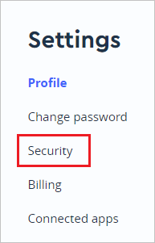
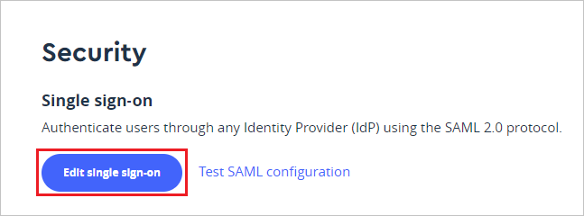
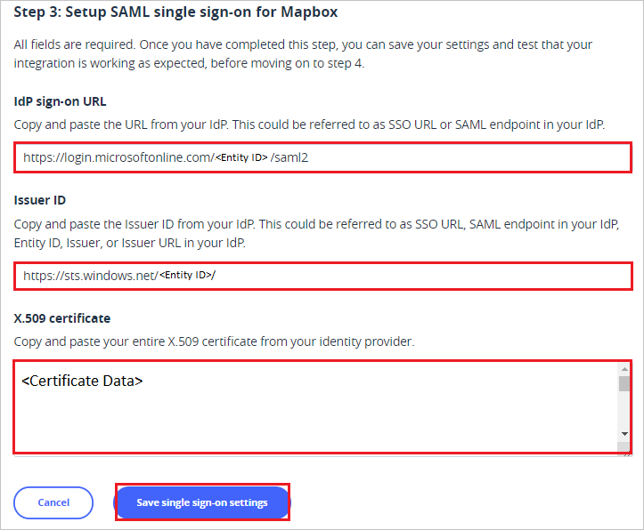

# Tutorial: Azure Active Directory single sign-on (SSO) integration with Mapbox

In this tutorial, you'll learn how to integrate Mapbox with Azure Active Directory (Azure AD). When you integrate Mapbox with Azure AD, you can:

* Control in Azure AD who has access to Mapbox.
* Enable your users to be automatically signed-in to Mapbox with their Azure AD accounts.
* Manage your accounts in one central location - the Azure portal.

To learn more about SaaS app integration with Azure AD, see [What is application access and single sign-on with Azure Active Directory](https://docs.microsoft.com/azure/active-directory/manage-apps/what-is-single-sign-on).

## Prerequisites

To get started, you need the following items:

* An Azure AD subscription. If you don't have a subscription, you can get a [free account](https://azure.microsoft.com/free/).
* Mapbox single sign-on (SSO) enabled subscription.

## Scenario description

In this tutorial, you configure and test Azure AD SSO in a test environment.

* Mapbox supports **IDP** initiated SSO
* Once you configure Mapbox you can enforce session control, which protects exfiltration and infiltration of your organization’s sensitive data in real time. Session control extends from Conditional Access. [Learn how to enforce session control with Microsoft Cloud App Security](https://docs.microsoft.com/cloud-app-security/proxy-deployment-any-app).

## Adding Mapbox from the gallery

To configure the integration of Mapbox into Azure AD, you need to add Mapbox from the gallery to your list of managed SaaS apps.

1. Sign in to the [Azure portal](https://portal.azure.com) using either a work or school account, or a personal Microsoft account.
1. On the left navigation pane, select the **Azure Active Directory** service.
1. Navigate to **Enterprise Applications** and then select **All Applications**.
1. To add new application, select **New application**.
1. In the **Add from the gallery** section, type **Mapbox** in the search box.
1. Select **Mapbox** from results panel and then add the app. Wait a few seconds while the app is added to your tenant.

## Configure and test Azure AD single sign-on for Mapbox

Configure and test Azure AD SSO with Mapbox using a test user called **B.Simon**. For SSO to work, you need to establish a link relationship between an Azure AD user and the related user in Mapbox.

To configure and test Azure AD SSO with Mapbox, complete the following building blocks:

1. **[Configure Azure AD SSO](#configure-azure-ad-sso)** - to enable your users to use this feature.
    1. **[Create an Azure AD test user](#create-an-azure-ad-test-user)** - to test Azure AD single sign-on with B.Simon.
    1. **[Assign the Azure AD test user](#assign-the-azure-ad-test-user)** - to enable B.Simon to use Azure AD single sign-on.
1. **[Configure Mapbox SSO](#configure-mapbox-sso)** - to configure the single sign-on settings on application side.
    1. **[Create Mapbox test user](#create-mapbox-test-user)** - to have a counterpart of B.Simon in Mapbox that is linked to the Azure AD representation of user.
1. **[Test SSO](#test-sso)** - to verify whether the configuration works.

## Configure Azure AD SSO

Follow these steps to enable Azure AD SSO in the Azure portal.

1. In the [Azure portal](https://portal.azure.com/), on the **Mapbox** application integration page, find the **Manage** section and select **single sign-on**.
1. On the **Select a single sign-on method** page, select **SAML**.
1. On the **Set up single sign-on with SAML** page, click the edit/pen icon for **Basic SAML Configuration** to edit the settings.

   

1. On the **Basic SAML Configuration** section, the application is pre-configured and the necessary URLs are already pre-populated with Azure. The user needs to save the configuration by clicking the **Save** button.

1. Mapbox application expects the SAML assertions in a specific format, which requires you to add custom attribute mappings to your SAML token attributes configuration. The following screenshot shows the list of default attributes.

	

1. In addition to above, Mapbox application expects few more attributes to be passed back in SAML response which are shown below. These attributes are also pre populated but you can review them as per your requirements.

	| Name   |  Source Attribute|
	| -----|--------- |
	| role | user.assignedroles |
	| | |

	> [!NOTE]
	> To understand how to configure roles in Azure AD, see [here](https://docs.microsoft.com/azure/active-directory/develop/active-directory-enterprise-app-role-management).

1. On the **Set up single sign-on with SAML** page, in the **SAML Signing Certificate** section,  find **Certificate (Raw)** and select **Download** to download the certificate and save it on your computer.

	

1. On the **Set up Mapbox** section, copy the appropriate URL(s) based on your requirement.

	

### Create an Azure AD test user

In this section, you'll create a test user in the Azure portal called B.Simon.

1. From the left pane in the Azure portal, select **Azure Active Directory**, select **Users**, and then select **All users**.
1. Select **New user** at the top of the screen.
1. In the **User** properties, follow these steps:
   1. In the **Name** field, enter `B.Simon`.  
   1. In the **User name** field, enter the username@companydomain.extension. For example, `B.Simon@contoso.com`.
   1. Select the **Show password** check box, and then write down the value that's displayed in the **Password** box.
   1. Click **Create**.

### Assign the Azure AD test user

In this section, you'll enable B.Simon to use Azure single sign-on by granting access to Mapbox.

1. In the Azure portal, select **Enterprise Applications**, and then select **All applications**.
1. In the applications list, select **Mapbox**.
1. In the app's overview page, find the **Manage** section and select **Users and groups**.

   

1. Select **Add user**, then select **Users and groups** in the **Add Assignment** dialog.

	

1. In the **Users and groups** dialog, select **B.Simon** from the Users list, then click the **Select** button at the bottom of the screen.
1. If you're expecting any role value in the SAML assertion, in the **Select Role** dialog, select the appropriate role for the user from the list and then click the **Select** button at the bottom of the screen.
1. In the **Add Assignment** dialog, click the **Assign** button.

## Configure Mapbox SSO

1. In a different web browser window, sign into Mapbox as an administrator.

1. Click on the **Settings** tab.

	

1. Click on the **Security** tab from the left navigation pane.

	

1. Click **Edit single sign-on**.

	

1. Scroll down to **Step 3: Setup SAML single sign-on for Mapbox** and perform the following steps:

	

	1. In the **Idp Sign-on URL** textbox, paste **Login URL** value, which you have copied from the Azure portal.

	1. In the **Issuer ID** textbox, paste **Azure AD Identifier** value, which you have copied from the Azure portal.

    1. Open the downloaded **Certificate (Raw)** file from the Azure portal into Notepad and copy content of certificate file and paste it into the **X.509 certificate** textbox.

	1. Click **Save single sign-on settings**.

### Create Mapbox test user

In this section, you create a user called Britta Simon in Mapbox. Work with [Mapbox support team](mailto:help@mapbox.com) to add the users in the Mapbox platform. Users must be created and activated before you use single sign-on.

## Test SSO 

In this section, you test your Azure AD single sign-on configuration using the Access Panel.

When you click the Mapbox tile in the Access Panel, you should be automatically signed in to the Mapbox for which you set up SSO. For more information about the Access Panel, see [Introduction to the Access Panel](https://docs.microsoft.com/azure/active-directory/active-directory-saas-access-panel-introduction).

## Additional resources

- [ List of Tutorials on How to Integrate SaaS Apps with Azure Active Directory ](https://docs.microsoft.com/azure/active-directory/active-directory-saas-tutorial-list)

- [What is application access and single sign-on with Azure Active Directory? ](https://docs.microsoft.com/azure/active-directory/active-directory-appssoaccess-whatis)

- [What is conditional access in Azure Active Directory?](https://docs.microsoft.com/azure/active-directory/conditional-access/overview)

- [Try Mapbox with Azure AD](https://aad.portal.azure.com/)

- [What is session control in Microsoft Cloud App Security?](https://docs.microsoft.com/cloud-app-security/proxy-intro-aad)

- [How to protect Mapbox with advanced visibility and controls](https://docs.microsoft.com/cloud-app-security/proxy-intro-aad)

