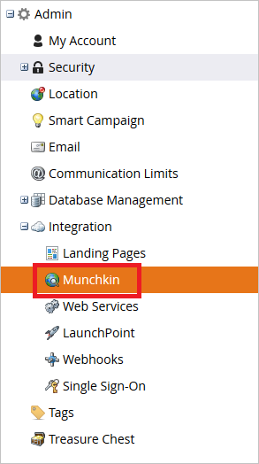
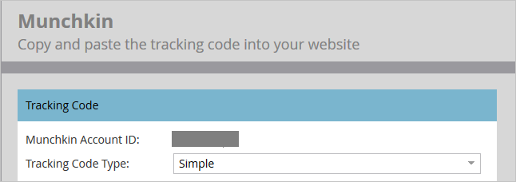
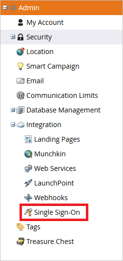
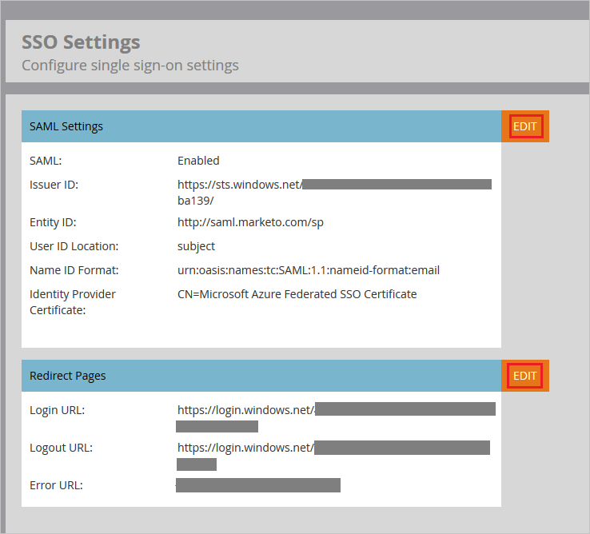
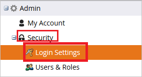
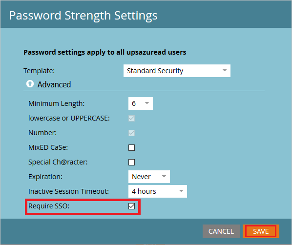
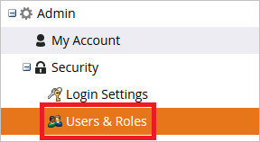
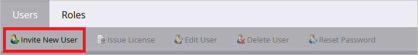
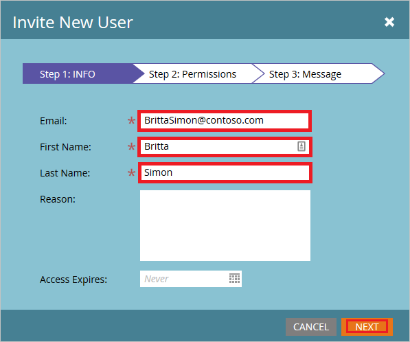

# Tutorial: Azure Active Directory integration with Marketo

In this tutorial, you learn how to integrate Marketo with Azure Active Directory (Azure AD).
Integrating Marketo with Azure AD provides you with the following benefits:

* You can control in Azure AD who has access to Marketo.
* You can enable your users to be automatically signed-in to Marketo (Single Sign-On) with their Azure AD accounts.
* You can manage your accounts in one central location - the Azure portal.

## Prerequisites

To configure Azure AD integration with Marketo, you need the following items:

* An Azure AD subscription. If you don't have an Azure AD environment, you can get one-month trial [here](https://azure.microsoft.com/pricing/free-trial/)
* Marketo single sign-on enabled subscription

## Scenario description

In this tutorial, you configure and test Azure AD single sign-on in a test environment.

* Marketo supports **IDP** initiated SSO

## Adding Marketo from the gallery

To configure the integration of Marketo into Azure AD, you need to add Marketo from the gallery to your list of managed SaaS apps.

1. Sign in to the Azure portal using either a work or school account, or a personal Microsoft account.
1. On the left navigation pane, select the **Azure Active Directory** service.
1. Navigate to **Enterprise Applications** and then select **All Applications**.
1. To add new application, select **New application**.
1. In the **Add from the gallery** section, type **Marketo** in the search box.
1. Select **Marketo** from results panel and then add the app. Wait a few seconds while the app is added to your tenant.

## Configure and test Azure AD SSO

In this section, you configure and test Azure AD single sign-on with Marketo based on a test user called **Britta Simon**.
For single sign-on to work, a link relationship between an Azure AD user and the related user in Marketo needs to be established.

To configure and test Azure AD single sign-on with Marketo, perform the following steps:

1. **[Configure Azure AD SSO](#configure-azure-ad-sso)** - to enable your users to use this feature.
    * **[Create an Azure AD test user](#create-an-azure-ad-test-user)** - to test Azure AD SSO with Britta Simon.
    * **[Assign the Azure AD test user](#assign-the-azure-ad-test-user)** - to enable Britta Simon to use Azure AD SSO.
2. **[Configure Marketo SSO](#configure-marketo-sso)** - to configure the SSO settings on application side.
    * **[Create Marketo test user](#create-marketo-test-user)** - to have a counterpart of Britta Simon in Marketo that is linked to the Azure AD representation of user.
3. **[Test SSO](#test-sso)** - to verify whether the configuration works.

### Configure Azure AD SSO

Follow these steps to enable Azure AD SSO in the Azure portal.

1. In the Azure portal, on the **Marketo** application integration page, find the **Manage** section and select **single sign-on**.
1. On the **Select a single sign-on method** page, select **SAML**.
1. On the **Set up single sign-on with SAML** page, click the edit/pen icon for **Basic SAML Configuration** to edit the settings.

   

1. On the **Basic SAML Configuration** section, enter the values for the following fields:

    a. In the **Identifier** text box, type a URL using the following pattern:
    `https://saml.marketo.com/sp`

    b. In the **Reply URL** text box, type a URL using the following pattern:
    `https://login.marketo.com/saml/assertion/\<munchkinid\>`

    c. In the **Relay State** text box, type a URL using the following pattern:
    `https://<munchkinid>.marketo.com/`

	> [!NOTE]
	> These values are not real. Update these values with the actual Identifier, Reply URL and Relay State. Contact [Marketo Client support team](https://investors.marketo.com/contactus.cfm) to get these values. You can also refer to the patterns shown in the **Basic SAML Configuration** section in the Azure portal.

5. On the **Set up Single Sign-On with SAML** page, in the **SAML Signing Certificate** section, click **Download** to download the **Certificate (Base64)** from the given options as per your requirement and save it on your computer.

	

6. On the **Set up Marketo** section, copy the appropriate URL(s) as per your requirement.

	

### Create an Azure AD test user 

In this section, you'll create a test user in the Azure portal called B.Simon.

1. From the left pane in the Azure portal, select **Azure Active Directory**, select **Users**, and then select **All users**.
1. Select **New user** at the top of the screen.
1. In the **User** properties, follow these steps:
   1. In the **Name** field, enter `B.Simon`.  
   1. In the **User name** field, enter the username@companydomain.extension. For example, `B.Simon@contoso.com`.
   1. Select the **Show password** check box, and then write down the value that's displayed in the **Password** box.
   1. Click **Create**.

### Assign the Azure AD test user

In this section, you'll enable B.Simon to use Azure single sign-on by granting access to Marketo.

1. In the Azure portal, select **Enterprise Applications**, and then select **All applications**.
1. In the applications list, select **Marketo**.
1. In the app's overview page, find the **Manage** section and select **Users and groups**.
1. Select **Add user**, then select **Users and groups** in the **Add Assignment** dialog.
1. In the **Users and groups** dialog, select **B.Simon** from the Users list, then click the **Select** button at the bottom of the screen.
1. If you are expecting a role to be assigned to the users, you can select it from the **Select a role** dropdown. If no role has been set up for this app, you see "Default Access" role selected.
1. In the **Add Assignment** dialog, click the **Assign** button.

## Configure Marketo SSO

1. To get Munchkin ID of your application, log in to Marketo using admin credentials and perform following actions:
   
    a. Log in to Marketo app using admin credentials.
   
    b. Click the **Admin** button on the top navigation pane.
   
     
   
    c. Navigate to the Integration menu and click the **Munchkin link**.
   
    
   
    d. Copy the Munchkin ID shown on the screen and complete your Reply URL in the Azure AD configuration wizard.
   
     

2. To configure the SSO in the application, follow the below steps:
   
    a. Log in to Marketo app using admin credentials.
   
    b. Click the **Admin** button on the top navigation pane.
   
     
   
    c. Navigate to the Integration menu and click **Single Sign On**.
   
     
   
    d. To enable the SAML Settings, click **Edit** button.
   
     
   
    e. **Enabled** Single Sign-On settings.
   
    f. Paste the **Azure AD Identifier**, in the **Issuer ID** textbox.
   
    g. In the **Entity ID** textbox, enter the URL as `http://saml.marketo.com/sp`.
   
    h. Select the User ID Location as **Name Identifier element**.
   
    
   
    > [!NOTE]
    > If your User Identifier is not UPN value then change the value in the Attribute tab.
   
    i. Upload the certificate, which you have downloaded from Azure AD configuration wizard. **Save** the settings.
   
    j. Edit the Redirect Pages settings.
   
    k. Paste the **Login URL** in the **Login URL** textbox.
   
    l. Paste the **Logout URL** in the **Logout URL** textbox.
   
    m. In the **Error URL**, copy your **Marketo instance URL** and click **Save** button to save settings.
   
    

3. To enable the SSO for users, complete the following actions:
   
    a. Log in to Marketo app using admin credentials.
   
    b. Click the **Admin** button on the top navigation pane.
   
     
   
    c. Navigate to the **Security** menu and click **Login Settings**.
   
    
   
    d. Check the **Require SSO** option and **Save** the settings.
   
    

### Create Marketo test user

In this section, you create a user called Britta Simon in Marketo. follow these steps to create a user in Marketo platform.

1. Log in to Marketo app using admin credentials.

2. Click the **Admin** button on the top navigation pane.
   
     

3. Navigate to the **Security** menu and click **Users & Roles**
   
      

4. Click the **Invite New User** link on the Users tab
   
     

5. In the Invite New User wizard fill the following information
   
    a. Enter the user **Email** address in the textbox
   
    
   
    b. Enter the **First Name** in the textbox
   
    c. Enter the **Last Name**  in the textbox
   
    d. Click **Next**

6. In the **Permissions** tab, select the **userRoles** and click **Next**
   
    
7. Click the **Send** button to send the user invitation
   
    

8. User receives the email notification and has to click the link and change the password to activate the account. 

### Test SSO 

In this section, you test your Azure AD single sign-on configuration with following options.

1. Click on Test this application in Azure portal and you should be automatically signed in to the Marketo for which you set up the SSO

1. You can use Microsoft Access Panel. When you click the Marketo tile in the Access Panel, you should be automatically signed in to the Marketo for which you set up the SSO. For more information about the Access Panel, see [Introduction to the Access Panel](https://docs.microsoft.com/azure/active-directory/active-directory-saas-access-panel-introduction).

## Next steps

Once you configure Marketo you can enforce session control, which protects exfiltration and infiltration of your organization’s sensitive data in real time. Session control extends from Conditional Access. [Learn how to enforce session control with Microsoft Cloud App Security](https://docs.microsoft.com/cloud-app-security/proxy-deployment-any-app).

