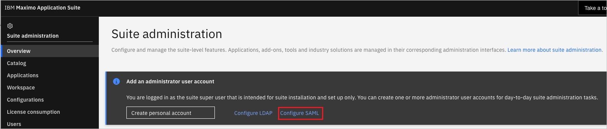
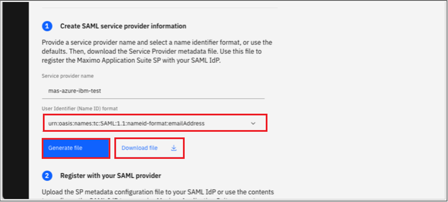
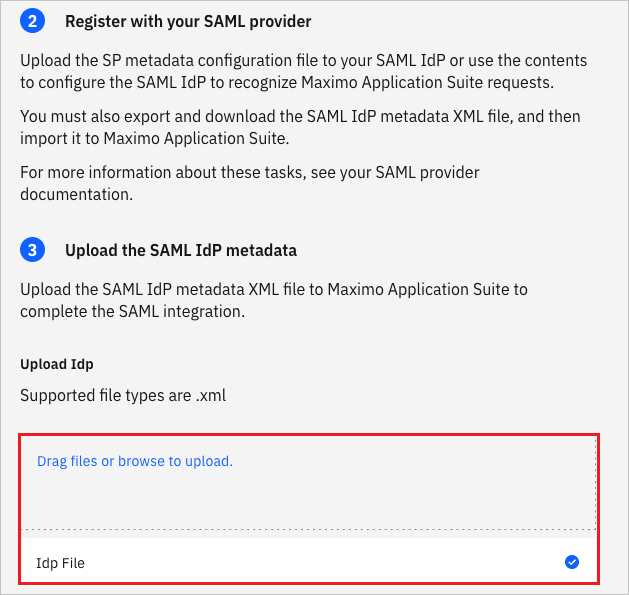
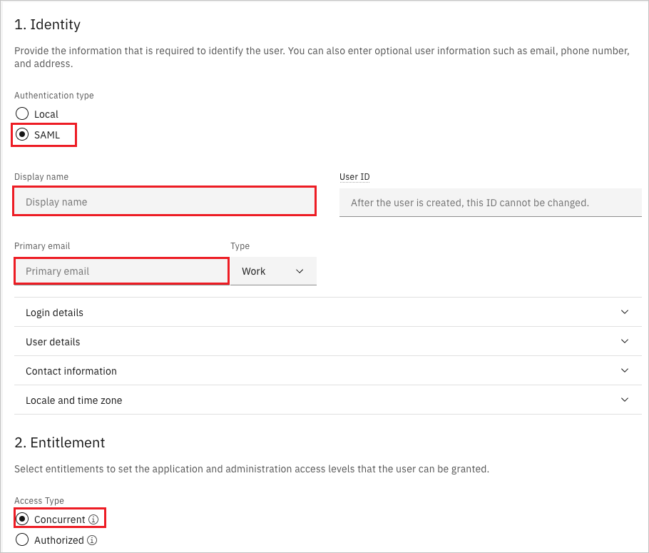

# Microsoft Entra SSO integration with Maximo Application Suite

In this article, you learn how to integrate Maximo Application Suite with Microsoft Entra ID. Customer-Managed - IBM Maximo Application Suite is a CMMS EAM platform, which delivers intelligent asset management, monitoring, predictive maintenance and reliability in a single platform. When you integrate Maximo Application Suite with Microsoft Entra ID, you can:

* Control in Microsoft Entra ID who has access to Maximo Application Suite.
* Enable your users to be automatically signed-in to Maximo Application Suite with their Microsoft Entra accounts.
* Manage your accounts in one central location.

You configure and test Microsoft Entra single sign-on for Maximo Application Suite in a test environment. Maximo Application Suite supports **SP** and **IDP** initiated single sign-on.

## Prerequisites

To integrate Microsoft Entra ID with Maximo Application Suite, you need:

* A Microsoft Entra user account. If you don't already have one, you can [Create an account for free](https://azure.microsoft.com/free/?WT.mc_id=A261C142F).
* One of the following roles: Global Administrator, Cloud Application Administrator, Application Administrator, or owner of the service principal.
* A Microsoft Entra subscription. If you don't have a subscription, you can get a [free account](https://azure.microsoft.com/free/).
* Maximo Application Suite single sign-on (SSO) enabled subscription.

## Add application and assign a test user

Before you begin the process of configuring single sign-on, you need to add the Maximo Application Suite application from the Microsoft Entra gallery. You need a test user account to assign to the application and test the single sign-on configuration.

### Add Maximo Application Suite from the Microsoft Entra gallery

Add Maximo Application Suite from the Microsoft Entra application gallery to configure single sign-on with Maximo Application Suite. For more information on how to add application from the gallery, see the [Quickstart: Add application from the gallery](../manage-apps/add-application-portal.md).

### Create and assign Microsoft Entra test user

Follow the guidelines in the [create and assign a user account](../manage-apps/add-application-portal-assign-users.md) article to create a test user account called B.Simon.

Alternatively, you can also use the [Enterprise App Configuration Wizard](https://portal.office.com/AdminPortal/home?Q=Docs#/azureadappintegration). In this wizard, you can add an application to your tenant, add users/groups to the app, and assign roles. The wizard also provides a link to the single sign-on configuration pane. [Learn more about Microsoft 365 wizards.](/microsoft-365/admin/misc/azure-ad-setup-guides). 

## Configure Microsoft Entra SSO

Complete the following steps to enable Microsoft Entra single sign-on.

1. Sign in to the [Microsoft Entra admin center](https://entra.microsoft.com) as at least a [Cloud Application Administrator](../roles/permissions-reference.md#cloud-application-administrator).
1. Browse to **Identity** > **Applications** > **Enterprise applications** > **Maximo Application Suite** > **Single sign-on**.
1. On the **Select a single sign-on method** page, select **SAML**.
1. On the **Set up single sign-on with SAML** page, select the pencil icon for **Basic SAML Configuration** to edit the settings.

   

1. On the **Basic SAML Configuration** section, if you have **Service Provider metadata file** then perform the following steps:

	a. Click **Upload metadata file**.

    

	b. Click on **folder logo** to select the metadata file and click **Upload**.

	

	c. After the metadata file is successfully uploaded, the **Identifier** and **Reply URL** values get auto populated in Basic SAML Configuration section.

	d. If you wish to configure **SP** initiated mode, then perform the following step:
    
    In the **Sign on URL** textbox, type a URL using the following pattern without `</path>`: 
    `https://<workspace_id>.<mas_application>.<mas_domain>`

	> [!Note]
	> You will get the **Service Provider metadata file** from the **Configure Maximo Application Suite SSO** section, which is explained later in the tutorial. If the **Identifier** and **Reply URL** values do not get auto populated, then fill the values manually according to your requirement. Contact [Maximo Application Suite Client support](https://www.ibm.com/mysupport/) to get these values.

1. On the **Set-up single sign-on with SAML** page, in the **SAML Signing Certificate** section,  find **Federation Metadata XML** and select **Download** to download the certificate and save it on your computer.

    

1. On the **Set up Maximo Application Suite** section, copy the appropriate URL(s) based on your requirement.

	

## Configure Maximo Application Suite SSO

1. Log in to your Maximo Application Suite company site as an administrator.

1. Go to the Suite administration and select **Configure SAML**.

    

1. In the SAML Authentication page, perform the following steps:

    
    
    1. Select emailAddress as the [name-id format](../develop/single-sign-on-saml-protocol.md).

    1. Click **Generate file**, wait and then **Download file**. Store this metadata file and upload it in Microsoft Entra ID side. 

1. Download the **Federation Metadata XML file** and upload the Microsoft Entra Federation Metadata XML document to Maximo's SAML configuration panel and save it.

    

### Create Maximo Application Suite test user

1. In a different web browser window, sign into your Maximo Application Suite company site as an administrator.

1. Create a new user in Suite Administration under **Users** and perform the following steps:

    

    1. Select Authentication type as **SAML**.

    1. In the **Display Name** textbox, enter the UPN used in Microsoft Entra ID as they must match.

    1. In the **Primary email** textbox, enter the UPN used in Microsoft Entra ID.
        > [!Note]
        > The rest of the fields can be populated as you like with whatever permissions necessary.

    1. Select any **Entitlements** required for that user.

## Test SSO 

In this section, you test your Microsoft Entra single sign-on configuration with following options. 

#### SP initiated:

* Click on **Test this application**, this will redirect to Maximo Application Suite Sign-on URL where you can initiate the login flow.  

* Go to Maximo Application Suite Sign-on URL directly and initiate the login flow from there.

#### IDP initiated:

* Click on **Test this application**, in Azure portal to be taken to the Maximo login page where you need to enter in your SAML identity as a fully qualified email address. If the user has already authenticated with the IDP the Maximo Application Suite won't have to login again, and the browser will be redirected to the home page.   

* You can also use Microsoft My Apps to test the application in any mode. When you click the Maximo Application Suite tile in the My Apps, if configured in SP mode you would be redirected to the application sign-on page for initiating the login flow and if configured in IDP mode, you should be automatically signed in to the Maximo Application Suite for which you set up the SSO. For more information, see [Microsoft Entra My Apps](/azure/active-directory/manage-apps/end-user-experiences#azure-ad-my-apps).

> [!Note]
> Screenshots are from MAS Continuous-delivery 8.9 and may differ in future versions.

## Additional resources

* [What is single sign-on with Microsoft Entra ID?](../manage-apps/what-is-single-sign-on.md)
* [Plan a single sign-on deployment](../manage-apps/plan-sso-deployment.md).

## Next steps

Once you configure Maximo Application Suite you can enforce session control, which protects exfiltration and infiltration of your organization’s sensitive data in real time. Session control extends from Conditional Access. [Learn how to enforce session control with Microsoft Cloud App Security](/cloud-app-security/proxy-deployment-aad).
