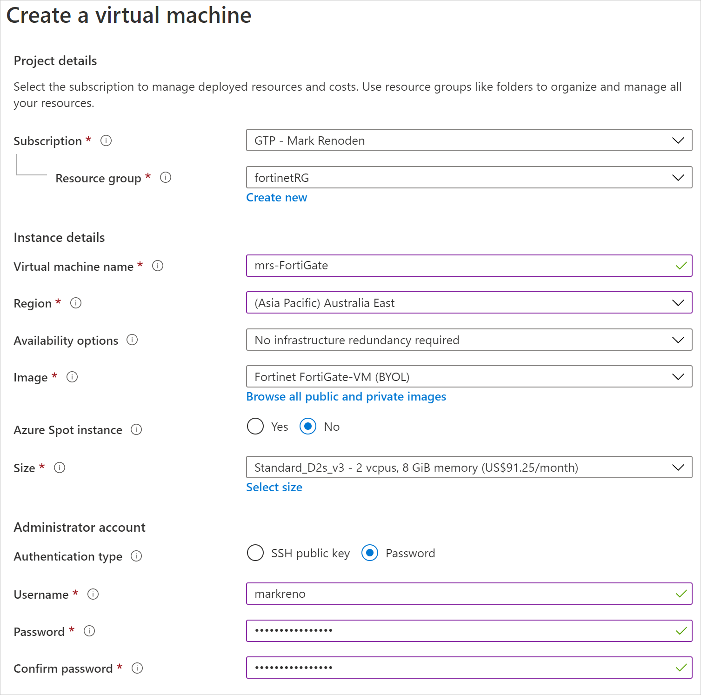
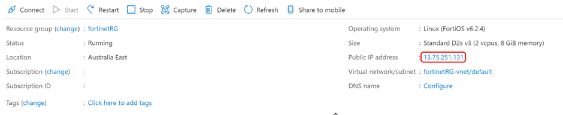
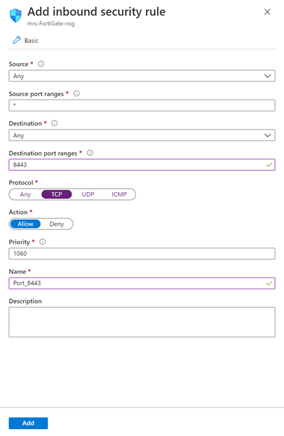
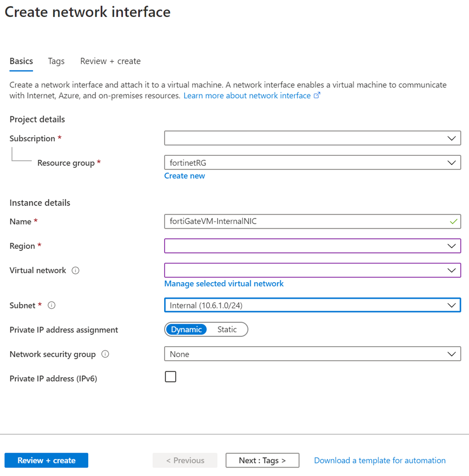
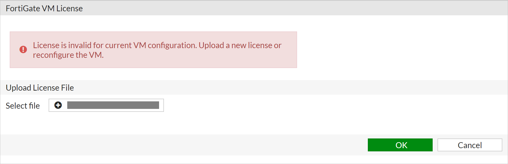
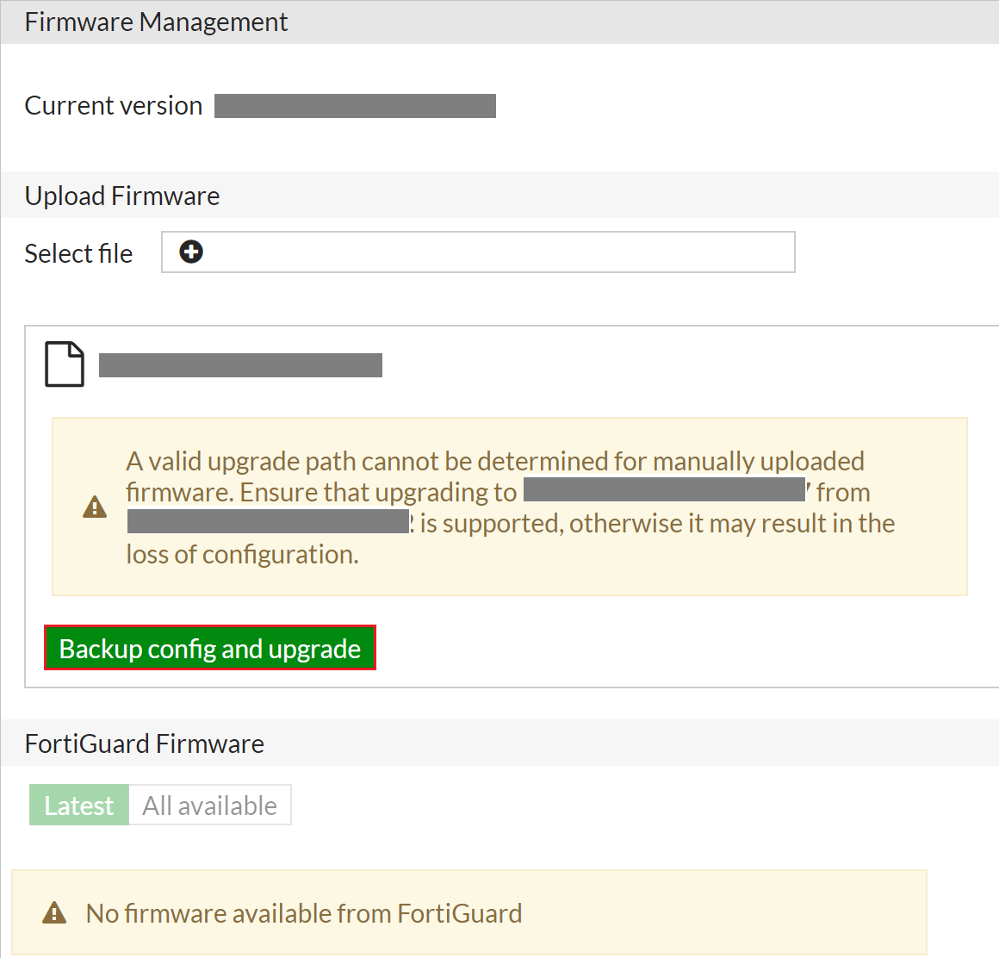
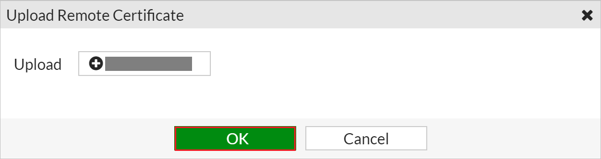
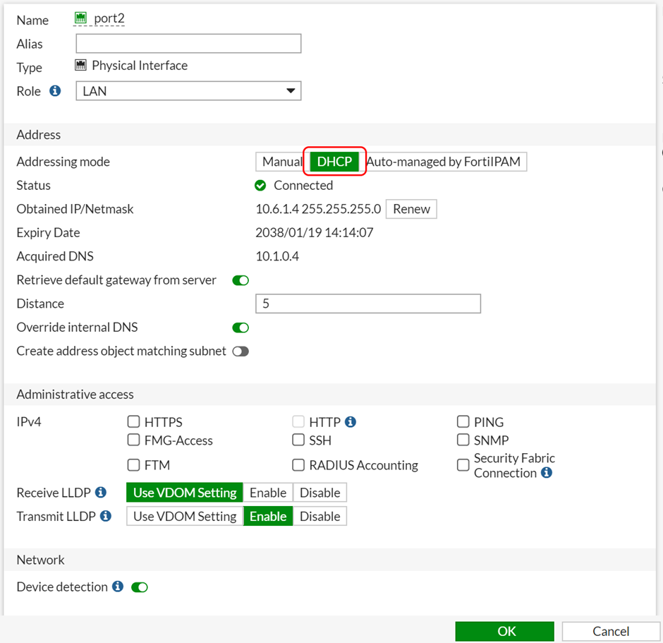

# FortiGate Azure Virtual Machine Deployment Guide

Using this deployment guide, you will learn how to set up and work with the Fortinet FortiGate next-generation firewall product deployed as an Azure Virtual Machine. Additionally, you will configure the FortiGate SSL VPN Microsoft Entra Gallery App to provide VPN authentication through Microsoft Entra ID.

## Redeem the FortiGate License

The Fortinet FortiGate next-generation firewall product is available as a virtual machine in Azure infrastructure as a service (IaaS). There are two licensing modes for this virtual machine: pay-as-you-go and bring-your-own-license (BYOL).

If you have purchased a FortiGate license from Fortinet to use with the BYOL virtual machine deployment option, redeem it from Fortinet's product activation page – https://support.fortinet.com. The resulting license file will have a .lic file extension.

## Download Firmware

At the time of writing, the Fortinet FortiGate Azure VM does not ship with the firmware version needed for SAML authentication. The latest version must be obtained from Fortinet.

1. Sign in at https://support.fortinet.com/.
2. Go to **Download** > **Firmware Images**.
3. To the right of **Release Notes**, select **Download**.
4. Select **v6.00** > **6.4** > **6.4.2**.
5. Download **FGT_VM64_AZURE-v6-build1723-FORTINET.out** by selecting the **HTTPS** link on the same row.
6. Save the file for later.

## Deploy the FortiGate VM

1. Go to the Azure portal, and sign in to the subscription into which you will deploy the FortiGate virtual machine.
2. Create a new resource group, or open the resource group into which you will deploy the FortiGate virtual machine.
3. Select **Add**.
4. In **Search the Marketplace**, enter *Forti*. Select **Fortinet FortiGate Next-Generation Firewall**.
5. Select the software plan (bring-your-own-license if you have a license, or pay-as-you-go if not). Select **Create**.
6. Populate the VM configuration.

    

7. Set **Authentication type** to **Password**, and provide administrative credentials for the VM.
8. Select **Review + Create** > **Create**.
9. Wait for the VM deployment to complete.


### Set a Static Public IP address and Assign a Fully Qualified Domain Name

For a consistent user experience, set the public IP address assigned to the FortiGate VM to be statically assigned. In addition, map it to a fully qualified domain name (FQDN).

1. Go to the Azure portal, and open the settings for the FortiGate VM.
2. On the **Overview** screen, select the public IP address.

    

3. Select **Static** > **Save**.

If you own a publicly routable domain name for the environment into which the FortiGate VM is being deployed, create a Host (A) record for the VM. This record maps to the preceding public IP address that is statically assigned.

### Create a New Inbound Network Security Group Rule for TCP Port 8443

1. Go to the Azure portal, and open the settings for the FortiGate VM.
2. In the menu on the left, select **Networking**. The network interface is listed, and the inbound port rules are shown.
3. Select **Add inbound port rule**.
4. Create a new inbound port rule for TCP 8443.

    

5. Select **Add**.

## Create a Second Virtual NIC for the VM

For internal resources to be made available to users, a second Virtual NIC must be added to the FortiGate VM. The Virtual Network in Azure on which the Virtual NIC resides must have a routable connection to those internal resources.

1. Go to the Azure portal, and open the settings for the FortiGate VM.
2. If the FortiGate VM is not already stopped, select **Stop** and wait for the VM to shut down.
3. In the menu on the left, select **Networking**.
4. Select **Attach network interface**.
5. Select **Create and attach network interface**.
6. Configure properties for the new network interface and then select **Create**.

    

7. Start the FortiGate VM.


## Configure the FortiGate VM

The following sections walk you through how to set up the FortiGate VM.

### Install the License

1. Go to `https://<address>`. Here, `<address>` is the FQDN or the public IP address assigned to the FortiGate VM.

2. Continue past any certificate errors.
3. Sign in by using the administrator credentials provided during the FortiGate VM deployment.
4. If the deployment uses the bring-your-own-license model, you'll see a prompt to upload a license. Select the license file created earlier, and upload it. Select **OK** and restart the FortiGate VM.

    

5. After the reboot, sign in again with the administrator credentials to validate the license.

### Update Firmware

1. Go to `https://<address>`. Here, `<address>` is the FQDN or the public IP address assigned to the FortiGate VM.

2. Continue past any certificate errors.
3. Sign in by using the administrator credentials provided during the FortiGate VM deployment.
4. In the left menu, select **System** > **Firmware**.
5. In **Firmware Management**, select **Browse**, and select the firmware file downloaded
    earlier.
6. Ignore the warning and select **Backup config and upgrade**.

    

7. Select **Continue**.
8. When you're prompted to save the FortiGate configuration (as a .conf file), select **Save**.
9. Wait for the firmware to upload and to be applied. Wait for the FortiGate VM to reboot.
10. After the FortiGate VM reboots, sign in again with the administrator credentials.
11. When you're prompted to set up the dashboard, select **Later**.
12. When the tutorial video begins, select **OK**.

### Change the Management Port to TCP 8443

1. Go to `https://<address>`. Here, `<address>` is the FQDN or the public IP address assigned to the FortiGate VM.

2. Continue past any certificate errors.
3. Sign in by using the administrator credentials provided during the FortiGate VM deployment.
4. In the left menu, select **System**.
5. Under **Administration Settings**, change the HTTPS port to **8443**, and select **Apply**.
6. After the change applies, the browser attempts to reload the administration page, but it
    fails. From now on, the administration page address is `https://<address>:8443`.

    

<a name='upload-the-azure-ad-saml-signing-certificate'></a>

### Upload the Microsoft Entra SAML Signing Certificate

1. Go to `https://<address>:8443`. Here, `<address>` is the FQDN or the public IP address assigned to the FortiGate VM.

2. Continue past any certificate errors.
3. Sign in by using the administrator credentials provided during the FortiGate VM deployment.
4. In the left menu, select **System** > **Certificates**.
5. Select **Import** > **Remote Certificate**.
6. Browse to the certificate downloaded from the FortiGate custom app deployment in the
    Azure tenant. Select it, and select **OK**.

### Upload and configure a custom SSL certificate

You might want to configure the FortiGate VM with your own SSL certificate that supports the FQDN you're using. If you have access to an SSL certificate packaged with the private key in PFX format, it
can be used for this purpose.

1. Go to `https://<address>:8443`. Here, `<address>` is the FQDN or the public IP address assigned to the FortiGate VM.

2. Continue past any certificate errors.
3. Sign in by using the administrator credentials provided during the FortiGate VM deployment.
4. In the left menu, select **System** > **Certificates**.
5. Select **Import** > **Local Certificate** > **PKCS #12 Certificate**.
6. Browse to the .PFX file that contains the SSL certificate and the private key.
7. Provide the .PFX password, and a meaningful name for the certificate. Then select **OK**.
8. In the left menu, select **System** > **Settings**.
9. Under **Administration Settings**, expand the list next to **HTTPS server certificate**, and select the SSL certificate imported earlier.
10. Select **Apply**.
11. Close the browser window and go to `https://<address>:8443`.
12. Sign in with the FortiGate administrator credentials. You should now see the correct SSL certificate in use.

### Configure authentication timeout

1. Go to the Azure portal, and open the settings for the FortiGate VM.
2. In the left menu, select **Serial Console**.
3. Sign in at the Serial Console with the FortiGate VM administrator credentials.
4. At the Serial Console, run the following commands:

    ```
    config system global
    set remoteauthtimeout 60
    end
    ```

### Ensure Network Interfaces are Obtaining IP Addresses

1. Go to `https://<address>:8443`. Here, `<address>` is the FQDN or the public IP address assigned to the FortiGate VM.

2. Sign in by using the administrator credentials provided during the FortiGate VM deployment.
3. In the menu on the left, select **Networking**.
4. Under Network, select **Interfaces**.
5. Examine port1 (external interface) and port2 (internal interface) to ensure they are obtaining an IP address from the correct Azure subnet.
    a. If either port is not obtaining an IP address from the subnet (via DHCP), right-click the port and select **Edit**.
    b. Next to Addressing Mode, ensure that **DHCP** is selected.
    c. Seelct **OK**.

    

### Ensure FortiGate VM has Correct Route to On-Premises Corporate Resources

Multi-homed Azure VMs have all network interfaces on the same virtual network (but perhaps separate subnets). This often means that both network interfaces have a connection to the on-premises corporate resources being published via FortiGate. For this reason, it is necessary to create custom route entries that ensure traffic exits from the correct interface when requests for on-premises corporate resources are made.

1. Go to `https://<address>:8443`. Here, `<address>` is the FQDN or the public IP address assigned to the FortiGate VM.

2. Sign-in using the administrator credentials provided during the FortiGate VM deployment.
3. In the menu on the left, select **Networking**.
4. Under Network, select **Static Routes**.
5. Select **Create New**.
6. Next to Destination select **Subnet**.
7. Under Subnet, specify the subnet information where the on-premises corporate resources reside (e.g. 10.1.0.0/255.255.255.0)
8. Next to Gateway Address specify the gateway on the Azure subnet where port2 is connected (e.g. this usually ends in 1 like 10.6.1.1)
9. Next to Interface select the internal network interface, port2
10. Select **OK**.

    

## Configure FortiGate SSL VPN

Follow the steps outlined in [Tutorial: Microsoft Entra single sign-on (SSO) integration with FortiGate SSL VPN](../../fortigate-ssl-vpn-tutorial.md)
