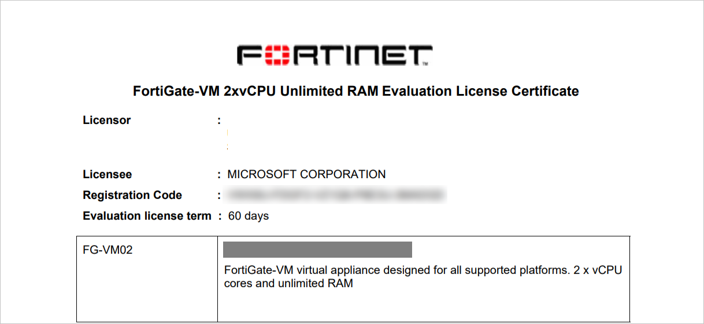
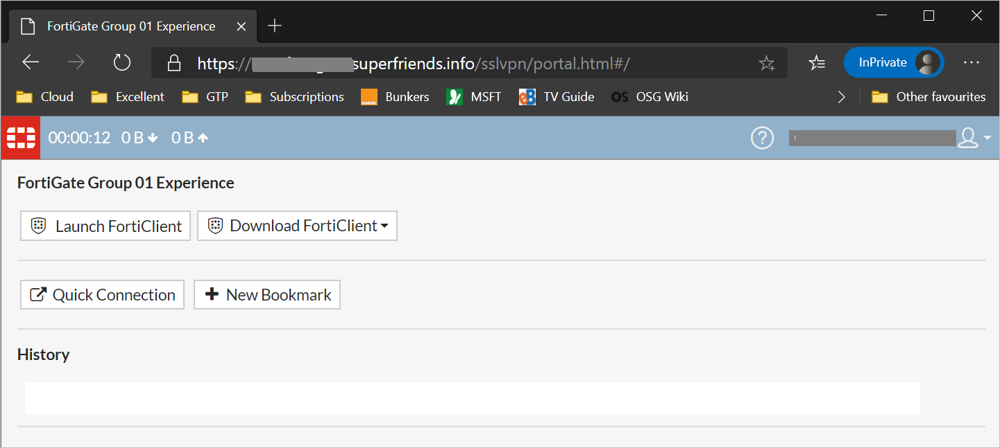

# FortiGate deployment guide

Using this deployment guide, you learn how to set up and work with the Fortinet FortiGate next-generation firewall product.

## Redeem the FortiGate license

The Fortinet FortiGate next-generation firewall product is available as a virtual machine in Azure infrastructure as a service (IaaS). There are two licensing modes for this virtual machine: pay-as-you-go and bring-your-own-license.

Fortinet might provide members of the Azure Active Directory (Azure AD) "Get to Production Secure Hybrid Access (SHA)" team with licenses. In cases where no license has been provided, the pay-as-you-go deployment will also work.

If a license has been issued, Fortinet provides a registration code that must be redeemed online.



1. Register at https://support.fortinet.com/.
2. After registration, sign in at https://support.fortinet.com/.
3. Go to **Asset** > **Register/Activate**.
4. Enter the registration code provided by Fortinet.
5. Specify the registration code, select **The product will be used by a non-government user**,
    and select **Next**.
6. Enter a product description (for example, FortiGate), set the Fortinet partner as **Other** > **Microsoft**, and select **Next**.
7. Accept the **Fortinet Product Registration Agreement**, and select **Next**.
8. Accept the **Terms** and select **Confirm**.
9. Select the **License File Download**, and save the license for later.


## Download firmware

The Fortinet FortiGate Azure VM doesn't currently ship with the firmware version
needed for SAML authentication. The latest version must be obtained from Fortinet.

1. Sign in at https://support.fortinet.com/.
2. Go to **Download** > **Firmware Images**.
3. To the right of **Release Notes**, select **Download**.
4. Select **v6.** > **6.** > **6.4.**.
5. Download **FGT_VM64_AZURE-v6-build1637-FORTINET.out** by selecting the **HTTPS** link on the same row.
6. Save the file for later.


## Deploy the FortiGate VM

1. Go to https://portal.azure.com, and sign in to the subscription into which you want to
    deploy the FortiGate virtual machine.
2. Create a new resource group, or open the resource group into which you want to deploy
    the FortiGate virtual machine.
3. Select **Add**.
4. In **Search the Marketplace**, enter *Forti*. Select **Fortinet FortiGate Next-Generation Firewall**.
5. Select the software plan (bring-your-own-license if you have a license, or pay-as-you-go if not). Select **Create**.
6. Populate the VM configuration.

    

7. Set **Authentication type** to **Password**, and provide administrative credentials for the VM.
8. Select **Review + Create** > **Create**.
9. Wait for the VM deployment to complete.


### Set a static public IP address and assign a fully qualified domain name

For a consistent user experience, set the public IP address assigned to the FortiGate VM to be statically assigned. In addition, map it to a fully qualified domain name (FQDN).

1. Go to https://portal.azure.com, and open the settings for the FortiGate VM.
2. On the **Overview** screen, select the public IP address.

    

3. Select **Static** > **Save**.

If you own a publicly routable domain name for the environment into which the FortiGate VM is
being deployed, create a Host (A) record for the VM. This record maps to the preceding public IP address that is statically assigned.

### Create a new inbound network security group rule for TCP port

1. Go to https://portal.azure.com, and open the settings for the FortiGate VM.
2. In the menu on the left, select **Networking**. The network interface is listed, and the inbound port rules are shown.
3. Select **Add inbound port rule**.
4. Create a new inbound port rule for TCP 8443.

    

5. Select **Add**.


## Create a custom Azure app for FortiGate

1. Go to https://portal.azure.com, and open the Azure AD pane for the
    tenant that will provide the identity for FortiGate sign-ins.
2. In the left menu, select **Enterprise Applications**.
3. Select **New Application** > **Non-gallery application**.
4. Enter a name (for example, FortiGate), and select **Add**.
5. In the left menu, select **Users and groups**.
6. Add users who will be able to sign in, and select **Assign**.
7. In the left menu, select **Single sign-on**.
8. Select **SAML**.
9. Under **Basic SAML Configuration**, select the pencil icon to edit the configuration.
10. Configure the following:
    - **Identifier (Entity ID)** to be `https://<address>/remote/saml/metadata`.
    - **Reply URL (Assertion Consumer Service URL)** to be
       `https://<address>/remote/saml/login`.
    - **Logout URL** to be `https://<address>/remote/saml/logout`.

    `<address>` is the FQDN or the public IP address assigned to the FortiGate VM.

11. Record each of these URLs for later use: Entity ID, Reply URL, and Logout URL.
12. Select **Save**, and close **Basic SAML Configuration**.
13. Under **3 – SAML Signing Certificate**, download **Certificate (Base64)** and save it for later.
14. Under **4 – Set up (App Name)**, copy the Azure Login URL, Azure AD Identifier, and Azure
Logout URL, and save them for later.
15. Under **2 – User Attributes and Claims**, select the pencil icon to edit the configuration.
16. Select **Add new claim**, and set the name to **username**.
17. Set the source attribute to **user.userprincipalname**.
18. Select **Save** > **Add a group claim** > **All groups**.
19. Select **Customize the name of the group claim**, and set the name to **group**.
20. Select **Save**.


## Prepare for group matching

FortiGate allows for different user portal experiences after sign-in, based on group membership. For example, there might be one experience for the marketing group and another for the finance group. Here's how you create groups for users:

1. Go to https://portal.azure.com, and open the Azure AD pane for the
    tenant that will provide the identity for FortiGate sign-ins.
2. Select **Groups** > **New Group**.
3. Create a group with the following details:
    - Group type = Security
    - Group name = `a meaningful name`
    - Group description = `a meaningful description for the group`
    - Membership type = Assigned
    - Members = `users for the user experience that will map to this group`
4. Repeat steps 3 and 4 for any additional user experiences.
5. After you create the groups, select each group and record the **Object ID** for each one.
6. Save these object IDs and group names for later.


## Configure the FortiGate VM

The following sections walk you through how to set up the FortiGate VM.

### Install the license

1. Go to `https://<address>`. Here, `<address>` is the FQDN or the public IP address assigned to the FortiGate VM.

2. Continue past any certificate errors.
3. Sign in by using the administrator credentials provided during the FortiGate VM deployment.
4. If the deployment uses the bring-your-own-license model, you'll see a prompt to upload a license. Select the license file created earlier, and upload it. Select **OK** and restart the FortiGate VM.

    

5. After the reboot, sign in again with the administrator credentials to validate the license.

### Update firmware

1. Go to `https://<address>`. Here, `<address>` is the FQDN or the public IP address assigned to the FortiGate VM.

2. Continue past any certificate errors.
3. Sign in by using the administrator credentials provided during the FortiGate VM deployment.
4. In the left menu, select **System** > **Firmware**.
5. In **Firmware Management**, select **Browse**, and select the firmware file downloaded
    earlier.
6. Ignore the warning and select **Backup config and upgrade**.

    

7. Select **Continue**.
8. When you're prompted to save the FortiGate configuration (as a .conf file), select **Save**.
9. Wait for the firmware to upload and to be applied. Wait for the FortiGate VM to reboot.
10. After the FortiGate VM reboots, sign in again with the administrator credentials.
11. When you're prompted to set up the dashboard, select **Later**.
12. When the tutorial video begins, select **OK**.

### Change the management port to TCP

1. Go to `https://<address>`. Here, `<address>` is the FQDN or the public IP address assigned to the FortiGate VM.

2. Continue past any certificate errors.
3. Sign in by using the administrator credentials provided during the FortiGate VM deployment.
4. In the left menu, select **System**.
5. Under **Administration Settings**, change the HTTPS port to **8443**, and select **Apply**.
6. After the change applies, the browser attempts to reload the administration page, but it
    fails. From now on, the administration page address is `https://<address>`.

    

### Upload the Azure AD SAML signing certificate

1. Go to `https://<address>`. Here, `<address>` is the FQDN or the public IP address assigned to the FortiGate VM.

2. Continue past any certificate errors.
3. Sign in by using the administrator credentials provided during the FortiGate VM deployment.
4. In the left menu, select **System** > **Certificates**.
5. Select **Import** > **Remote Certificate**.
6. Browse to the certificate downloaded from the FortiGate custom app deployment in the
    Azure tenant. Select it, and select **OK**.

### Upload and configure a custom SSL certificate

You might want to configure the FortiGate VM with your own SSL certificate that supports the FQDN you're using. If you have access to an SSL certificate packaged with the private key in PFX format, it
can be used for this purpose.

1. Go to `https://<address>`. Here, `<address>` is the FQDN or the public IP address assigned to the FortiGate VM.

2. Continue past any certificate errors.
3. Sign in by using the administrator credentials provided during the FortiGate VM deployment.
4. In the left menu, select **System** > **Certificates**.
5. Select **Import** > **Local Certificate** > **PKCS #12 Certificate**.
6. Browse to the .PFX file that contains the SSL certificate and the private key.
7. Provide the .PFX password, and a meaningful name for the certificate. Then select **OK**.
8. In the left menu, select **System** > **Settings**.
9. Under **Administration Settings**, expand the list next to **HTTPS server certificate**, and select the SSL certificate imported earlier.
10. Select **Apply**.
11. Close the browser window and go to `https://<address>`.
12. Sign in with the FortiGate administrator credentials. You should now see the correct SSL certificate in use.


### Perform command-line configuration

The following sections provide steps for various configurations by using the command line.

#### For SAML authentication

1. Go to https://portal.azure.com, and open the settings for the FortiGate VM.
2. In the left menu, select **Serial Console**.
3. Sign in at the Serial Console with the FortiGate VM administrator credentials. For the next step, the URLs you recorded earlier are required:
    - Entity ID
    - Reply URL
    - Logout URL
    - Azure Login URL
    - Azure AD Identifier
    - Azure Logout URL
4. At the Serial Console, run the following commands:

    ```
    config user saml
    edit azure
    set entity-id <Entity ID>
    set single-sign-on-url <Reply URL>
    set single-logout-url <Logout URL>
    set idp-single-sign-on-url <Azure Login URL>
    set idp-entity-id <Azure AD Identifier>
    set idp-single-logout-url <Azure Logout URL>
    set idp-cert REMOTE_Cert_
    set user-name username
    set group-name group
    end
    ```
    > [!NOTE]
    > The Azure Logout URL contains a `?` character. This requires a special key sequence in
    order for it to be correctly provided to the FortiGate Serial Console. The URL is typically
    `https://login.microsoftonline.com/common/wsfederation?wa=wsignout1`. To provide this in the Serial Console, type:
        ```
        set idp-single-logout-url https://login.microsoftonline.com/common/wsfederation
        ```.
    Then type CTRL+V, and paste the rest of the URL in to complete the line: 
        ```
        set idp-single-logout-url
        https://login.microsoftonline.com/common/wsfederation?wa=wsignout1.
        ```

5. To confirm the configuration, run the following:

    ```
    show user saml
    ```

#### For group matching

1. Go to https://portal.azure.com, and open the settings for the FortiGate VM.
2. In the left menu, select **Serial Console**.
3. Sign in at the Serial Console with the FortiGate VM administrator credentials.
4. At the Serial Console, run the following commands:

    ```
    config user group
    edit <group 1 name>
    set member azure
    config match
    edit 1
    set server-name azure
    set group-name <group 1 Object Id>
    next
    end
    next
    ```

    For each additional group that will have a different portal experience in FortiGate, repeat these commands (starting with the second line of the code).

#### For authentication timeout

1. Go to https://portal.azure.com, and open the settings for the FortiGate VM.
2. In the left menu, select **Serial Console**.
3. Sign in at the Serial Console with the FortiGate VM administrator credentials.
4. At the Serial Console, run the following commands:

    ```
    config system global
    set remoteauthtimeout 60
    end
    ```
### Create VPN portals and firewall policy

1. Go to `https://<address>`. Here, `<address>` is the FQDN or the public IP address assigned to the FortiGate VM.

2. Sign in by using the administrator credentials provided during the FortiGate VM deployment.
3. In the left menu, select **VPN** > **SSL-VPN Portals** > **Create New**.
6. Provide a name (usually matching it to the Azure group used to provide the custom portal
    experience).
7. Select the plus sign (**+**) next to **Source IP Pools**, select the default pool, and then select **Close**.
8. Customize the experience for this group. For testing, this can be customization of the portal message and the theme. This is also where you can create custom bookmarks that direct
    users to internal resources.
9. Select **OK**.
10. Repeat steps 5-9 for each Azure group that will have a custom portal experience.
11. Under VPN, select **SSL-VPN Settings**.
12. Select the plus sign (**+**) next to **Listen on Interfaces**, select **Port1**, and then select **Close**.
14. If you previously installed a custom SSL certificate, change **Server Certificate** to use the custom SSL certificate in the drop-down menu.
15. Under **Authentication/Portal Mapping**, select **Create New**. Choose the first Azure group and match it with the portal of the same name. Then select **OK**.
18. Repeat steps 15-17 for each pairing of an Azure group and a portal.
19. Under **Authentication/Portal Mapping**, edit **All Other Users/Groups**.
20. Set the portal to **full-access**, and select **OK** > **Apply**.
23. Scroll to the top of the **SSL-VPN Setting** page, and select **No SSL-VPN policies exist. Click here to create a new SSL-VPN policy using these settings.**
24. Provide a name, such as **VPN Grp**. Then set **Outgoing Interface** to **port**, and select **Source**.
27. Under **Address**, select **all**.
28. Under **User**, select the first Azure group.
29. Select **Close** > **Destination**. Under **Address**, this is usually the internal network. Select **login.microsoft.com** for testing.
32. Select **Close** > **Service** > **All**. Then select **Close** > **OK**.
37. In the left menu, select **Policy & Objects** > **Firewall Policy**.
39. Expand **SSL-VPN tunnel interface (ssl.root)** > **port**.
40. Right-click the VPN policy created earlier (**VPN Grp 1**), and select **Copy**.
41. Right-click under the VPN policy, and select **Paste** > **Below**.
42. Edit the new policy, providing it with a different name (for example, **VPN Grp2**). Also change the group it applies to (to another Azure group).
43. Right-click the new policy and set the status to **Enabled**.


## Test sign-in by using Azure

1. Using an in-private browser session, go to `https://<address>`.	
2. The sign-in should redirect to Azure AD for sign-in.
3. After providing credentials for a user who has been assigned to the FortiGate app in the
    Azure tenant, the appropriate user portal should appear.

    
