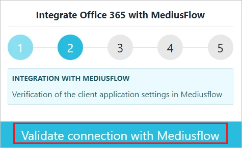
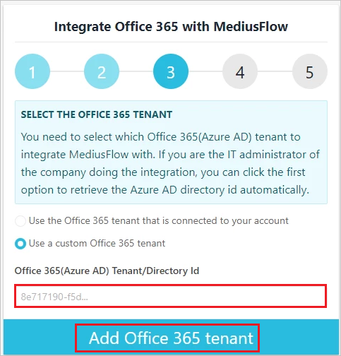

# Tutorial: Configure MediusFlow for automatic user provisioning

This tutorial describes the steps you need to perform in both MediusFlow and Microsoft Entra ID to configure automatic user provisioning. When configured, Microsoft Entra ID automatically provisions and de-provisions users and groups to [MediusFlow](https://www.mediusflow.com/) using the Microsoft Entra provisioning service. For important details on what this service does, how it works, and frequently asked questions, see [Automate user provisioning and deprovisioning to SaaS applications with Microsoft Entra ID](../app-provisioning/user-provisioning.md). 

## Capabilities supported
> [!div class="checklist"]
> * Create users in MediusFlow
> * Remove users in MediusFlow when they do not require access anymore
> * Keep user attributes synchronized between Microsoft Entra ID and MediusFlow
> * Provision groups and group memberships in MediusFlow
> * Single sign-on to MediusFlow (recommended)

## Prerequisites

The scenario outlined in this tutorial assumes that you already have the following prerequisites:

* [A Microsoft Entra tenant](../develop/quickstart-create-new-tenant.md) 
* A user account in Microsoft Entra ID with [permission](../roles/permissions-reference.md) to configure provisioning (for example, Application Administrator, Cloud Application administrator, Application Owner, or Global Administrator). 
* An active MediusFlow subscription with a Quality assurance or Production tenant.
* A user account in MediusFlow with admin access rights to be able to carry out the configuration within MediusFlow.
* The companies added in the MediusFlow tenant where the users should be provisioned to.

## Step 1: Plan your provisioning deployment
1. Learn about [how the provisioning service works](../app-provisioning/user-provisioning.md).
2. Determine who will be in [scope for provisioning](../app-provisioning/define-conditional-rules-for-provisioning-user-accounts.md).
3. Determine what data to [map between Microsoft Entra ID and MediusFlow](../app-provisioning/customize-application-attributes.md). 

## Step 2: Configure MediusFlow to support provisioning with Microsoft Entra ID

### Activate the Microsoft 365 app within MediusFlow
Start by enabling the access of the Microsoft Entra login and the Microsoft Entra configuration feature within MediusFlow by performing the following steps:

#### User login
To enable the login flow to Microsoft 365 / Microsoft Entra ID, refer to [this](https://success.mediusflow.com/documentation/administration_guide/user_login_and_transfer/office365userintegration/#user-login-setup) article.

#### User transfer configuration
To enable the configuration portal of the users for provisioning from Microsoft Entra ID refer to [this](
https://success.mediusflow.com/documentation/administration_guide/user_login_and_transfer/office365userintegration/#user-sync-setup) article.

#### Configure user provisioning

1.  Login to [MediusFlow admin console](https://office365.cloudapp.mediusflow.com/) by providing the tenant ID.

	:::image type="content" source="./media/mediusflow-provisioning-tutorial/1-auth.png" alt-text="Screenshot of the MediusFlow admin console. The MediusFlow tenant name box and the Authenticate button are highlighted in the first integration step." border="false":::

2. Verify the connection with MediusFlow.

	

3. Provide the Microsoft Entra tenant ID.

	

   You can read more in the [FAQ](https://success.mediusflow.com/documentation/administration_guide/user_login_and_transfer/office365userintegration/#how-do-i-get-the-azure-tenant-id) on how to find it.

4. Save the configuration.

	:::image type="content" source="./media/mediusflow-provisioning-tutorial/4-save-config.png" alt-text="Screenshot of the MediusFlow admin console that shows the fourth integration step. The Save configuration button is highlighted." border="false":::

5. Select user provisioning and click **OK**.

	:::image type="content" source="./media/mediusflow-provisioning-tutorial/5-select-user-provisioning.png" alt-text="Screenshot of the MediusFlow admin console that shows the fifth integration step. The Use user provisioning and Ok buttons are highlighted." border="false":::

6. Click on **Generate Secret Key**. Copy and save this value.This value will be entered in the **Secret Token** field in the **Provisioning** tab of your MediusFLow application.

	:::image type="content" source="./media/mediusflow-provisioning-tutorial/6-create-secret-1.png" alt-text="Screenshot of the User provisioning configuration tab in the MediusFlow admin console. The Generate secret key and Copy buttons are highlighted." border="false":::

7. Click on **OK**.

	:::image type="content" source="./media/mediusflow-provisioning-tutorial/7-confirm-secret.png" alt-text="Screenshot of the MediusFlow admin console with a notification telling users to click Ok to generate a new secret key. The Ok button is highlighted." border="false":::

8. To get the users imported with a pre-defined set of roles, companies and other general configurations in MediusFlow, you will need to configure it first. Start by adding the configuration by clicking on **Add new configuration**.

	:::image type="content" source="./media/mediusflow-provisioning-tutorial/8-configure-user-configuration-1.png" alt-text="Screenshot of the User provisioning configuration tab in the MediusFlow admin console. The Add new configuration button is highlighted." border="false":::

9. Provide the default settings for the users. In this view, it is possible to set the default attribute. If the standard settings are ok, it is enough to provide just a valid company name. Since these configuration settings are fetched from Mediusflow, they need to be configured first. For more information see the **Prerequisites** section of this article.

	:::image type="content" source="./media/mediusflow-provisioning-tutorial/9-configure-user-config-detail-1.png" alt-text="Screenshot of the MediusFlow Add new configuration window. Many settings are visible, including locale settings, a filter, and user roles." border="false":::

10. Click on **Save** to save the user configuration.

	:::image type="content" source="./media/mediusflow-provisioning-tutorial/10-done-1.png" alt-text="Screenshot of the User provisioning configuration tab in the MediusFlow admin console. The Save button is highlighted." border="false":::

11. To get the user provisioning link click on **Copy SCIM Link**. Copy and save this value. This value is entered in the **Tenant URL** field in the **Provisioning** tab of your MediusFLow application.
 
	:::image type="content" source="./media/mediusflow-provisioning-tutorial/11-get-scim-link.png" alt-text="Screenshot of the User provisioning configuration tab in the MediusFlow admin console. The Copy S C I M link button is highlighted." border="false":::

## Step 3: Add MediusFlow from the Microsoft Entra application gallery

Add MediusFlow from the Microsoft Entra application gallery to start managing provisioning to MediusFlow. If you have previously setup MediusFlow for SSO, you can use the same application. However it is recommended that you create a separate app when testing out the integration initially. Learn more about adding an application from the gallery [here](../manage-apps/add-application-portal.md). 

## Step 4: Define who will be in scope for provisioning 

The Microsoft Entra provisioning service allows you to scope who will be provisioned based on assignment to the application and or based on attributes of the user / group. If you choose to scope who will be provisioned to your app based on assignment, you can use the following [steps](../manage-apps/assign-user-or-group-access-portal.md) to assign users and groups to the application. If you choose to scope who will be provisioned based solely on attributes of the user or group, you can use a scoping filter as described [here](../app-provisioning/define-conditional-rules-for-provisioning-user-accounts.md). 

* Start small. Test with a small set of users and groups before rolling out to everyone. When scope for provisioning is set to assigned users and groups, you can control this by assigning one or two users or groups to the app. When scope is set to all users and groups, you can specify an [attribute based scoping filter](../app-provisioning/define-conditional-rules-for-provisioning-user-accounts.md).

* If you need additional roles, you can [update the application manifest](../develop/howto-add-app-roles-in-azure-ad-apps.md) to add new roles.

## Step 5: Configure automatic user provisioning to MediusFlow 

This section guides you through the steps to configure the Microsoft Entra provisioning service to create, update, and disable users and/or groups in TestApp based on user and/or group assignments in Microsoft Entra ID.

### To configure automatic user provisioning for MediusFlow in Microsoft Entra ID:

1. Sign in to the [Microsoft Entra admin center](https://entra.microsoft.com) as at least a [Cloud Application Administrator](../roles/permissions-reference.md#cloud-application-administrator).
1. Browse to **Identity** > **Applications** > **Enterprise applications**

	

1. In the applications list, select **MediusFlow**.

	

3. Select the **Provisioning** tab.

	

4. Set the **Provisioning Mode** to **Automatic**.

	

5. Under the **Admin Credentials** section, input the tenant URL value retrieved earlier in **Tenant URL**. Input the secret Token value retrieved earlier in **Secret Token**. Click **Test Connection** to ensure Microsoft Entra ID can connect to MediusFlow. If the connection fails, ensure your MediusFlow account has Admin permissions and try again.

      

6. In the **Notification Email** field, enter the email address of a person or group who should receive the provisioning error notifications and select the **Send an email notification when a failure occurs** check box.

	

7. Select **Save**.

8. Under the **Mappings** section, select **Synchronize Microsoft Entra users to MediusFlow**.

9. Review the user attributes that are synchronized from Microsoft Entra ID to MediusFlow in the **Attribute-Mapping** section. The attributes selected as **Matching** properties are used to match the user accounts in MediusFlow for update operations. If you choose to change the [matching target attribute](../app-provisioning/customize-application-attributes.md), you will need to ensure that the MediusFlow API supports filtering users based on that attribute. Select the **Save** button to commit any changes.

   |Attribute|Type|Supported for filtering|
   |---|---|---|
   |userName|String|&check;|
   |emails[type eq "work"].value|String|
   |name.displayName|String|
   |active|Boolean|
   |name.givenName|String|
   |name.familyName|String|
   |name.formatted|String|
   |externalId|String|
   |urn:ietf:params:scim:schemas:extension:enterprise:2.0:User:manager|Reference|
   |urn:ietf:params:scim:schemas:extension:medius:2.0:User:configurationFilter|String|
   |urn:ietf:params:scim:schemas:extension:medius:2.0:User:identityProvider|String|
   |urn:ietf:params:scim:schemas:extension:medius:2.0:User:nameIdentifier|String|
   |urn:ietf:params:scim:schemas:extension:medius:2.0:User:customFieldText1|String|
   |urn:ietf:params:scim:schemas:extension:medius:2.0:User:customFieldText2|String|
   |urn:ietf:params:scim:schemas:extension:medius:2.0:User:customFieldText3|String|
   |urn:ietf:params:scim:schemas:extension:medius:2.0:User:customFieldText4|String|
   |urn:ietf:params:scim:schemas:extension:medius:2.0:User:customFieldText5|String|

10. Under the **Mappings** section, select **Synchronize Microsoft Entra groups to MediusFlow**.

11. Review the group attributes that are synchronized from Microsoft Entra ID to MediusFlow in the **Attribute-Mapping** section. The attributes selected as **Matching** properties are used to match the groups in MediusFlow for update operations. Select the **Save** button to commit any changes.

    | Attribute | Type |
    |--|--|
    | displayName | String |
    | externalID | String |
    | members | Reference |

12. To configure scoping filters, refer to the following instructions provided in the [Scoping filter tutorial](../app-provisioning/define-conditional-rules-for-provisioning-user-accounts.md).

13. To enable the Microsoft Entra provisioning service for MediusFlow, change the **Provisioning Status** to **On** in the **Settings** section.

	

14. Define the users and/or groups that you would like to provision to MediusFlow by choosing the desired values in **Scope** in the **Settings** section.

	

15. When you are ready to provision, click **Save**.

	

This operation starts the initial synchronization cycle of all users and groups defined in **Scope** in the **Settings** section. The initial cycle takes longer to perform than subsequent cycles, which occur approximately every 40 minutes as long as the Microsoft Entra provisioning service is running. 

## Step 6: Monitor your deployment
Once you've configured provisioning, use the following resources to monitor your deployment:

1. Use the [provisioning logs](../reports-monitoring/concept-provisioning-logs.md) to determine which users have been provisioned successfully or unsuccessfully
2. Check the [progress bar](../app-provisioning/application-provisioning-when-will-provisioning-finish-specific-user.md) to see the status of the provisioning cycle and how close it is to completion
3. If the provisioning configuration seems to be in an unhealthy state, the application will go into quarantine. Learn more about quarantine states [here](../app-provisioning/application-provisioning-quarantine-status.md).

## Change log

* 01/21/2021 - Custom extension attributes **configurationFilter**, **identityProvider**, **nameIdentifier**, **customFieldText1**, **customFieldText2**, **customFieldText3**, **customFieldText3** and **customFieldText5** has been added.

## Additional resources

* [Managing user account provisioning for Enterprise Apps](../app-provisioning/configure-automatic-user-provisioning-portal.md)
* [What is application access and single sign-on with Microsoft Entra ID?](../manage-apps/what-is-single-sign-on.md)

## Next steps

* [Learn how to review logs and get reports on provisioning activity](../app-provisioning/check-status-user-account-provisioning.md)
