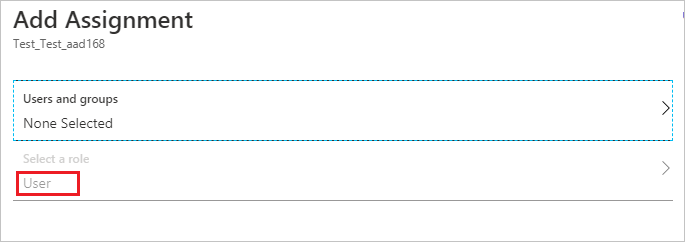
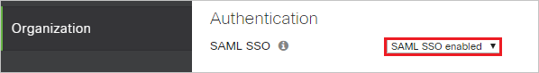
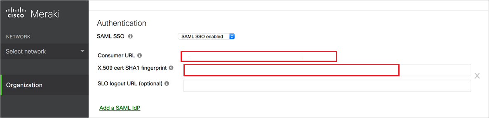
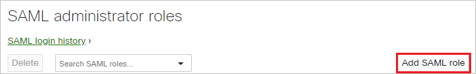
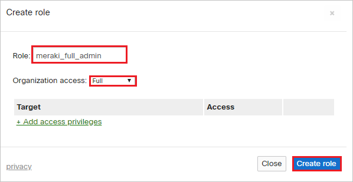
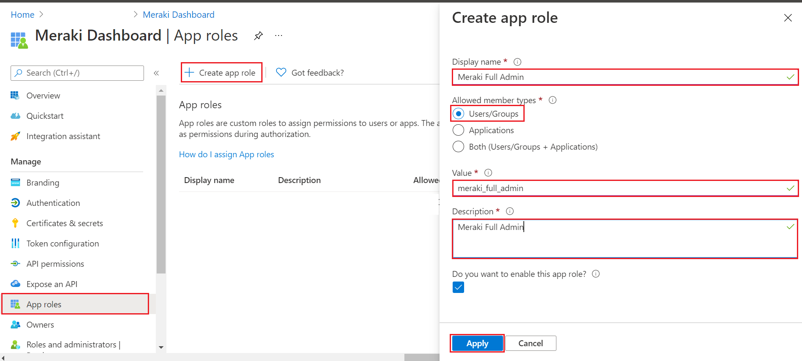

# Tutorial: Microsoft Entra single sign-on (SSO) integration with Meraki Dashboard

In this tutorial, you'll learn how to integrate Meraki Dashboard with Microsoft Entra ID. When you integrate Meraki Dashboard with Microsoft Entra ID, you can:

- Control in Microsoft Entra ID who has access to Meraki Dashboard.
- Enable your users to be automatically signed-in to Meraki Dashboard with their Microsoft Entra accounts.
- Manage your accounts in one central location.

## Prerequisites

To get started, you need the following items:

- A Microsoft Entra subscription. If you don't have a subscription, you can get a [free account](https://azure.microsoft.com/free/).
- Meraki Dashboard single sign-on (SSO) enabled subscription.

## Scenario description

In this tutorial, you configure and test Microsoft Entra SSO in a test environment.

- Meraki Dashboard supports **IDP** initiated SSO.

> [!NOTE]
> Identifier of this application is a fixed string value so only one instance can be configured in one tenant.

## Adding Meraki Dashboard from the gallery

To configure the integration of Meraki Dashboard into Microsoft Entra ID, you need to add Meraki Dashboard from the gallery to your list of managed SaaS apps.

1. Sign in to the [Microsoft Entra admin center](https://entra.microsoft.com) as at least a [Cloud Application Administrator](../roles/permissions-reference.md#cloud-application-administrator).
1. Browse to **Identity** > **Applications** > **Enterprise applications** > **New application**.
1. In the **Add from the gallery** section, type **Meraki Dashboard** in the search box.
1. Select **Meraki Dashboard** from results panel and then add the app. Wait a few seconds while the app is added to your tenant.

 Alternatively, you can also use the [Enterprise App Configuration Wizard](https://portal.office.com/AdminPortal/home?Q=Docs#/azureadappintegration). In this wizard, you can add an application to your tenant, add users/groups to the app, assign roles, as well as walk through the SSO configuration as well. [Learn more about Microsoft 365 wizards.](/microsoft-365/admin/misc/azure-ad-setup-guides)

## Configure and test Microsoft Entra SSO for Meraki Dashboard

Configure and test Microsoft Entra SSO with Meraki Dashboard using a test user called **B.Simon**. For SSO to work, you need to establish a link relationship between a Microsoft Entra user and the related user in Meraki Dashboard.

To configure and test Microsoft Entra SSO with Meraki Dashboard, perform the following steps:

1. **[Configure Microsoft Entra SSO](#configure-azure-ad-sso)** - to enable your users to use this feature.
   1. **[Create a Microsoft Entra test user](#create-an-azure-ad-test-user)** - to test Microsoft Entra single sign-on with B.Simon.
   1. **[Assign the Microsoft Entra test user](#assign-the-azure-ad-test-user)** - to enable B.Simon to use Microsoft Entra single sign-on.
1. **[Configure Meraki Dashboard SSO](#configure-meraki-dashboard-sso)** - to configure the single sign-on settings on application side.
   1. **[Create Meraki Dashboard Admin Roles](#create-meraki-dashboard-admin-roles)** - to have a counterpart of B.Simon in Meraki Dashboard that is linked to the Microsoft Entra representation of user.
1. **[Test SSO](#test-sso)** - to verify whether the configuration works.

## Configure Microsoft Entra SSO

Follow these steps to enable Microsoft Entra SSO.

1. Sign in to the [Microsoft Entra admin center](https://entra.microsoft.com) as at least a [Cloud Application Administrator](../roles/permissions-reference.md#cloud-application-administrator).
1. Browse to **Identity** > **Applications** > **Enterprise applications** > **Meraki Dashboard** > **Single sign-on**.
1. On the **Select a single sign-on method** page, select **SAML**.
1. On the **Set up single sign-on with SAML** page, click the edit/pen icon for **Basic SAML Configuration** to edit the settings.

   

1. On the **Basic SAML Configuration** section, perform the following steps:

   In the **Reply URL** textbox, type a URL using the following pattern:
   `https://n27.meraki.com/saml/login/m9ZEgb/< UNIQUE ID >`

   > [!NOTE]
   > The Reply URL value is not real. Update this value with the actual Reply URL value, which is explained later in the tutorial.

1. Click the **Save** button.

1. Meraki Dashboard application expects the SAML assertions in a specific format, which requires you to add custom attribute mappings to your SAML token attributes configuration. The following screenshot shows the list of default attributes.

   

1. In addition to above, Meraki Dashboard application expects few more attributes to be passed back in SAML response which are shown below. These attributes are also pre populated but you can review them as per your requirements.

   | Name                                                    | Source Attribute       |
   | ------------------------------------------------------- | ---------------------- |
   | `https://dashboard.meraki.com/saml/attributes/username` | user.userprincipalname |
   | `https://dashboard.meraki.com/saml/attributes/role`     | user.assignedroles     |

   > [!NOTE]
   > To understand how to configure roles in Microsoft Entra ID, see [here](../develop/howto-add-app-roles-in-azure-ad-apps.md#app-roles-ui).

1. In the **SAML Signing Certificate** section, click **Edit** button to open **SAML Signing Certificate** dialog.

   

1. In the **SAML Signing Certificate** section, copy the **Thumbprint Value** and save it on your computer. This value needs to be converted to include colons in order for the Meraki dashboard to understand it . For example, if the thumbprint from Azure is `C2569F50A4AAEDBB8E` it will need to be changed to `C2:56:9F:50:A4:AA:ED:BB:8E` to use it later in Meraki Dashboard.

   

1. On the **Set up Meraki Dashboard** section, copy the Logout URL value and save it on your computer.

   

### Create a Microsoft Entra test user

In this section, you'll create a test user called B.Simon.

1. Sign in to the [Microsoft Entra admin center](https://entra.microsoft.com) as at least a [User Administrator](../roles/permissions-reference.md#user-administrator).
1. Browse to **Identity** > **Users** > **All users**.
1. Select **New user** > **Create new user**, at the top of the screen.
1. In the **User** properties, follow these steps:
   1. In the **Display name** field, enter `B.Simon`.  
   1. In the **User principal name** field, enter the username@companydomain.extension. For example, `B.Simon@contoso.com`.
   1. Select the **Show password** check box, and then write down the value that's displayed in the **Password** box.
   1. Select **Review + create**.
1. Select **Create**.

### Assign the Microsoft Entra test user

In this section, you'll enable B.Simon to use single sign-on by granting access to Meraki Dashboard.

1. Sign in to the [Microsoft Entra admin center](https://entra.microsoft.com) as at least a [Cloud Application Administrator](../roles/permissions-reference.md#cloud-application-administrator).
1. Browse to **Identity** > **Applications** > **Enterprise applications** > **Meraki Dashboard**.
1. In the app's overview page, find the **Manage** section and select **Users and groups**.
1. Select **Add user**, then select **Users and groups** in the **Add Assignment** dialog.
1. In the **Users and groups** dialog, select **B.Simon** from the Users list, then click the **Select** button at the bottom of the screen.
1. If you are expecting a role to be assigned to the users, you can select it from the **Select a role** dropdown. If no role has been set up for this app, you see "Default Access" role selected.

   

   > [!NOTE]
   > **Select a role** option will be disabled and default role is USER for selected user.

1. In the **Add Assignment** dialog, click the **Assign** button.

## Configure Meraki Dashboard SSO
1. In a different web browser window, sign in to your Meraki Dashboard company site as an administrator

4. Navigate to **Organization** -> **Settings**.

   

5. Under Authentication, change **SAML SSO** to **SAML SSO enabled**.

   

6. Click **Add a SAML IdP**.

   

7. Paste the converted **Thumbprint** Value, which you have copied and converted in specified format as mentioned in step 9 of previous section into **X.590 cert SHA1 fingerprint** textbox. Then click **Save**. After saving, the Consumer URL will show up. Copy Consumer URL value and paste this into **Reply URL** textbox in the **Basic SAML Configuration Section**.

   

### Create Meraki Dashboard Admin Roles

1. In a different web browser window, sign into meraki dashboard as an administrator.

1. Navigate to **Organization** -> **Administrators**.

   

1. In the SAML administrator roles section, click the **Add SAML role** button.

   

1. Enter the Role **meraki_full_admin**, mark **Organization access** as **Full** and click **Create role**. Repeat the process for **meraki_readonly_admin**, this time mark **Organization access** as **Read-only** box.

   

1. Follow the below steps to map the Meraki Dashboard roles to Microsoft Entra SAML roles:

   

   a. In the Azure portal, click on **App Registrations**.

   b. Select All Applications and click **Meraki Dashboard**.

   c. Click **App Roles** and click **Create App role**.

   d. Enter the Display name as `Meraki Full Admin`.
   
   e. Select Allowed Members as `Users/Groups`.

   f. Enter the Value as `meraki_full_admin`.

   g. Enter the Description as `Meraki Full Admin`.

   h. Click **Save**. 

## Test SSO

In this section, you test your Microsoft Entra single sign-on configuration with following options.

- Click on **Test this application**, and you should be automatically signed in to the Meraki Dashboard for which you set up the SSO

- You can use Microsoft My Apps. When you click the Meraki Dashboard tile in the My Apps, you should be automatically signed in to the Meraki Dashboard for which you set up the SSO. For more information about the My Apps, see [Introduction to the My Apps](https://support.microsoft.com/account-billing/sign-in-and-start-apps-from-the-my-apps-portal-2f3b1bae-0e5a-4a86-a33e-876fbd2a4510).

## Next steps

Once you configure Meraki Dashboard you can enforce session control, which protects exfiltration and infiltration of your organization’s sensitive data in real time. Session control extends from Conditional Access. [Learn how to enforce session control with Microsoft Defender for Cloud Apps](/cloud-app-security/proxy-deployment-any-app).
