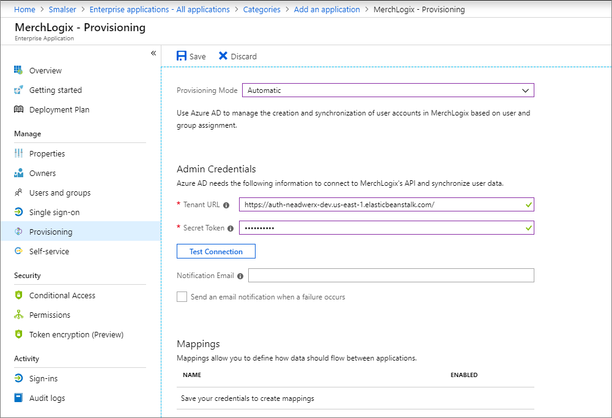

# Tutorial: Configure MerchLogix for automatic user provisioning

The objective of this tutorial is to demonstrate the steps to be performed in MerchLogix and Microsoft Entra ID to configure Microsoft Entra ID to automatically provision and de-provision users and/or groups to MerchLogix.

> [!NOTE]
> This tutorial describes a connector built on top of the Microsoft Entra user Provisioning Service. For important details on what this service does, how it works, and frequently asked questions, see [Automate user provisioning and deprovisioning to SaaS applications with Microsoft Entra ID](../app-provisioning/user-provisioning.md).

## Prerequisites

The scenario outlined in this tutorial assumes that you already have the following prerequisites:

* A Microsoft Entra tenant
* A MerchLogix tenant
* A technical contact at MerchLogix who can provide the SCIM endpoint URL and secret token required for user provisioning

## Adding MerchLogix from the gallery

Before configuring MerchLogix for automatic user provisioning with Microsoft Entra ID, you need to add MerchLogix from the Microsoft Entra application gallery to your list of managed SaaS applications.

**To add MerchLogix from the Microsoft Entra application gallery, perform the following steps:**

1. Sign in to the [Microsoft Entra admin center](https://entra.microsoft.com) as at least a [Cloud Application Administrator](../roles/permissions-reference.md#cloud-application-administrator).
1. Browse to **Identity** > **Applications** > **Enterprise applications** > **New application**.
1. In the **Add from the gallery** section, type **MerchLogix** in the search box.
1. Select **MerchLogix** from results panel and then add the app. Wait a few seconds while the app is added to your tenant.

## Assigning users to MerchLogix

Microsoft Entra ID uses a concept called "assignments" to determine which users should receive access to selected apps. In the context of automatic user provisioning, only the users and/or groups that have been "assigned" to an application in Microsoft Entra ID are synchronized. 

Before configuring and enabling automatic user provisioning, you should decide which users and/or groups in Microsoft Entra ID need access to MerchLogix. Once decided, you can assign these users and/or groups to MerchLogix by following the instructions here:

* [Assign a user or group to an enterprise app](../manage-apps/assign-user-or-group-access-portal.md)

### Important tips for assigning users to MerchLogix

* It is recommended that a single Microsoft Entra user is assigned to MerchLogix to test your initial automatic user provisioning configuration. Additional users and/or groups may be assigned later once the tests are successful.

* When assigning a user to MerchLogix, you must select any valid application-specific role (if available) in the assignment dialog. Users with the **Default Access** role are excluded from provisioning.

## Configuring automatic user provisioning to MerchLogix 

This section guides you through the steps to configure the Microsoft Entra provisioning service to create, update, and disable users and/or groups in MerchLogix based on user and/or group assignments in Microsoft Entra ID.

> [!TIP]
> You may also choose to enable SAML-based single sign-on for MerchLogix, following the instructions provided in the [MerchLogix single sign-on tutorial](merchlogix-tutorial.md). Single sign-on can be configured independently of automatic user provisioning, though these two features compliment each other.

### To configure automatic user provisioning for MerchLogix in Microsoft Entra ID:

1. Sign in to the [Microsoft Entra admin center](https://entra.microsoft.com) as at least a [Cloud Application Administrator](../roles/permissions-reference.md#cloud-application-administrator).
1. Browse to **Identity** > **Applications** > **Enterprise applications**

2. Select MerchLogix from your list of SaaS applications.

3. Select the **Provisioning** tab.

4. Set the **Provisioning Mode** to **Automatic**.

	

5. Under the **Admin Credentials** section:

	* In the **Tenant URL** field, enter the SCIM endpoint URL provided by your MerchLogix technical contact.

	* In the **Secret Token** field, enter secret token provided by your MerchLogix technical contact.

6. Upon populating the fields shown in Step 5, click **Test Connection** to ensure Microsoft Entra ID can connect to MerchLogix. If the connection fails, ensure your MerchLogix account has Admin permissions and try again.

7. In the **Notification Email** field, enter the email address of a person or group who should receive the provisioning error notifications and check the checkbox - **Send an email notification when a failure occurs**.

8. Click **Save**.

9. Under the **Mappings** section, select **Synchronize Microsoft Entra users to MerchLogix**.

10. Review the user attributes that are synchronized from Microsoft Entra ID to MerchLogix in the **Attribute Mapping** section. The attributes selected as **Matching** properties are used to match the user accounts in MerchLogix for update operations. Select the **Save** button to commit any changes.

11. Under the **Mappings** section, select **Synchronize Microsoft Entra groups to MerchLogix**.

12. Review the group attributes that are synchronized from Microsoft Entra ID to MerchLogix in the **Attribute Mapping** section. The attributes selected as **Matching** properties are used to match the groups in MerchLogix for update operations. Select the **Save** button to commit any changes.

13. To enable the Microsoft Entra provisioning service for MerchLogix, change the **Provisioning Status** to **On** in the **Settings** section.

14. When you are ready to provision, click **Save**.

This operation starts the initial synchronization of all users and/or groups defined in **Scope** in the **Settings** section. The initial sync takes longer to perform than subsequent syncs, which occur approximately every 40 minutes as long as the Microsoft Entra provisioning service is running. You can use the **Synchronization Details** section to monitor progress and follow links to provisioning activity report, which describes all actions performed by the Microsoft Entra provisioning service on MerchLogix.

For more information on how to read the Microsoft Entra provisioning logs, see [Reporting on automatic user account provisioning](../app-provisioning/check-status-user-account-provisioning.md).

## Additional resources

* [Managing user account provisioning for Enterprise Apps](../app-provisioning/configure-automatic-user-provisioning-portal.md)
* [What is application access and single sign-on with Microsoft Entra ID?](../manage-apps/what-is-single-sign-on.md)

## Next steps

* [Learn how to review logs and get reports on provisioning activity](../app-provisioning/check-status-user-account-provisioning.md)
