# Tutorial: Configure Meta Networks Connector for automatic user provisioning

The objective of this tutorial is to demonstrate the steps to be performed in Meta Networks Connector and Azure Active Directory (Azure AD) to configure Azure AD to automatically provision and de-provision users and/or groups to Meta Networks Connector.

> [!NOTE]
> This tutorial describes a connector built on top of the Azure AD User Provisioning Service. For important details on what this service does, how it works, and frequently asked questions, see [Automate user provisioning and deprovisioning to SaaS applications with Azure Active Directory](../app-provisioning/user-provisioning.md).
>
> This connector is currently in Public Preview. For more information on the general Microsoft Azure terms of use for Preview features, see [Supplemental Terms of Use for Microsoft Azure Previews](https://azure.microsoft.com/support/legal/preview-supplemental-terms/).

## Prerequisites

The scenario outlined in this tutorial assumes that you already have the following prerequisites:

* An Azure AD tenant
* [A Meta Networks Connector tenant](https://www.metanetworks.com/)
* A user account in Meta Networks Connector with Admin permissions.

## Assigning users to Meta Networks Connector

Azure Active Directory uses a concept called *assignments* to determine which users should receive access to selected apps. In the context of automatic user provisioning, only the users and/or groups that have been assigned to an application in Azure AD are synchronized.

Before configuring and enabling automatic user provisioning, you should decide which users and/or groups in Azure AD need access to Meta Networks Connector. Once decided, you can assign these users and/or groups to Meta Networks Connector by following the instructions here:
* [Assign a user or group to an enterprise app](../manage-apps/assign-user-or-group-access-portal.md)

## Important tips for assigning users to Meta Networks Connector

* It is recommended that a single Azure AD user is assigned to Meta Networks Connector to test the automatic user provisioning configuration. Additional users and/or groups may be assigned later.

* When assigning a user to Meta Networks Connector, you must select any valid application-specific role (if available) in the assignment dialog. Users with the **Default Access** role are excluded from provisioning.

## Setup Meta Networks Connector for provisioning

1. Sign in to your [Meta Networks Connector Admin Console](https://login.metanetworks.com/login/) using your organization name. Navigate to **Administration > API Keys**.

	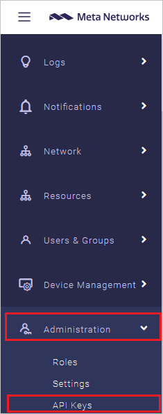

2.	Click on the plus sign on the upper right side of the screen to create a new **API Key**.

	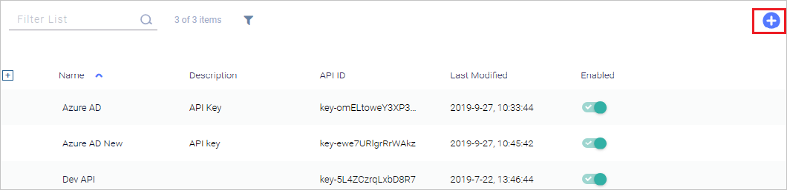

3.	Set the **API Key Name** and **API Key Description**.

	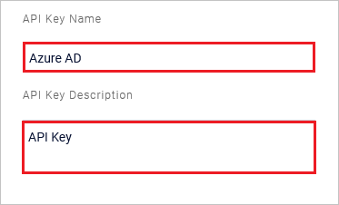

4.	Turn on **Write** privileges for **Groups** and **Users**.

	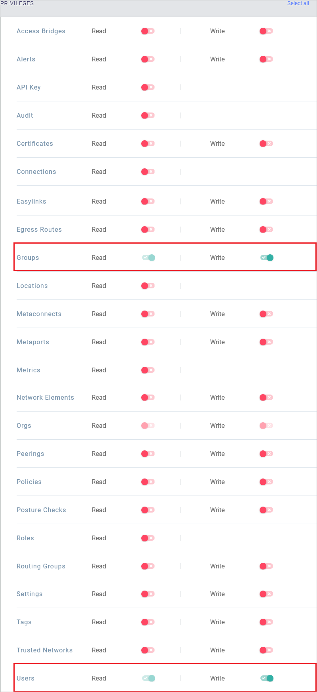

5.	Click on **Add**. Copy the **SECRET** and save it as this will be the only time you can view it. This value will be entered in the Secret Token field in the Provisioning tab of your Meta Networks Connector application in the Azure portal.

	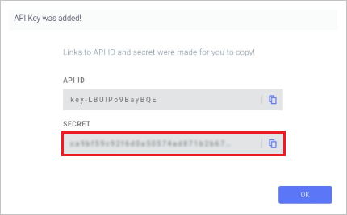

6.  Add an IdP by navigating to **Administration > Settings > IdP > Create New**.

	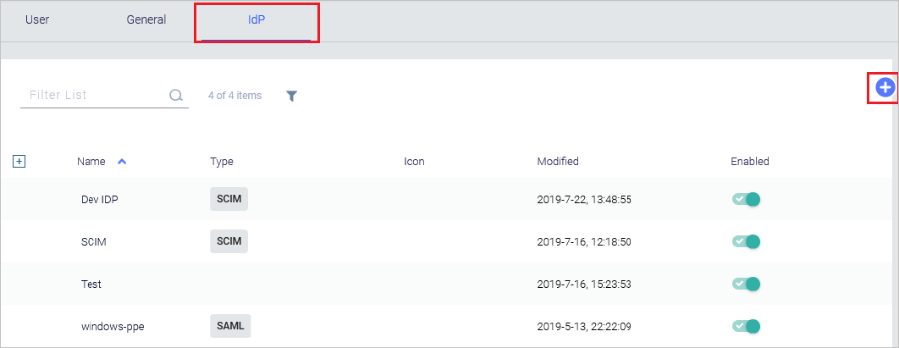

7.	In the **IdP Configuration** page you can **Name** your IdP configuration and choose an **Icon**.

	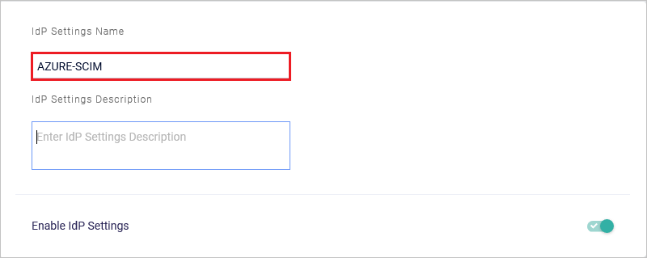

	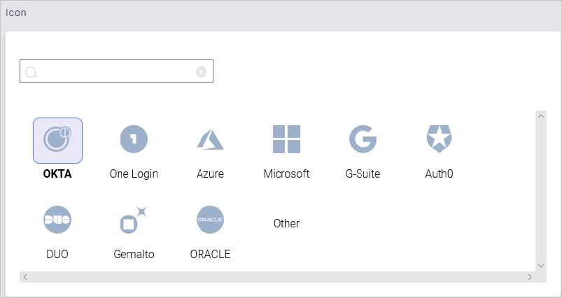

8.	Under **Configure SCIM** select the API key name created in the previous steps. Click on **Save**.

	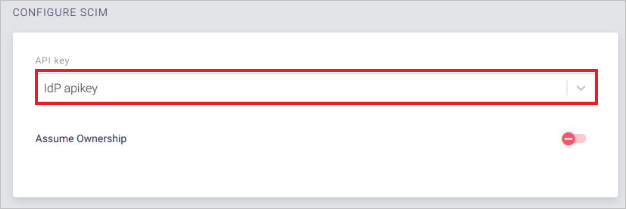

9.	Navigate to **Administration > Settings > IdP tab**. Click on the name of the IdP configuration created in the previous steps to view the **IdP ID**. This **ID** is added to the end of **Tenant URL** while entering the value in **Tenant URL** field in the Provisioning tab of your Meta Networks Connector application in the Azure portal.

	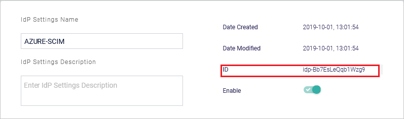

## Add Meta Networks Connector from the gallery

Before configuring Meta Networks Connector for automatic user provisioning with Azure AD, you need to add Meta Networks Connector from the Azure AD application gallery to your list of managed SaaS applications.

**To add Meta Networks Connector from the Azure AD application gallery, perform the following steps:**

1. In the **[Azure portal](https://portal.azure.com)**, in the left navigation panel, select **Azure Active Directory**.

	

2. Go to **Enterprise applications**, and then select **All applications**.

	

3. To add a new application, select the **New application** button at the top of the pane.

	

4. In the search box, enter **Meta Networks Connector**, select **Meta Networks Connector** in the results panel, and then click the **Add** button to add the application.

	

## Configuring automatic user provisioning to Meta Networks Connector 

This section guides you through the steps to configure the Azure AD provisioning service to create, update, and disable users and/or groups in Meta Networks Connector based on user and/or group assignments in Azure AD.

> [!TIP]
> You may also choose to enable SAML-based single sign-on for Meta Networks Connector , following the instructions provided in the [Meta Networks Connector Single sign-on tutorial](https://docs.microsoft.com/azure/active-directory/saas-apps/metanetworksconnector-tutorial). Single sign-on can be configured independently of automatic user provisioning, though these two features compliment each other

### To configure automatic user provisioning for Meta Networks Connector in Azure AD:

1. Sign in to the [Azure portal](https://portal.azure.com). Select **Enterprise Applications**, then select **All applications**.

	

2. In the applications list, select **Meta Networks Connector**.

	

3. Select the **Provisioning** tab.

	

4. Set the **Provisioning Mode** to **Automatic**.

	

5. Under the **Admin Credentials** section, input `https://api.metanetworks.com/v1/scim/<IdP ID>` in **Tenant URL**. Input the **SCIM Authentication Token** value retrieved earlier in **Secret Token**. Click **Test Connection** to ensure Azure AD can connect to Meta Networks Connector. If the connection fails, ensure your Meta Networks Connector account has Admin permissions and try again.

	

6. In the **Notification Email** field, enter the email address of a person or group who should receive the provisioning error notifications and check the checkbox - **Send an email notification when a failure occurs**.

	

7. Click **Save**.

8. Under the **Mappings** section, select **Synchronize Azure Active Directory Users to Meta Networks Connector**.

	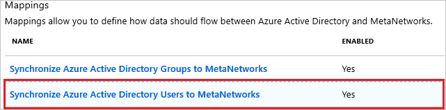

9. Review the user attributes that are synchronized from Azure AD to Meta Networks Connector in the **Attribute Mapping** section. The attributes selected as **Matching** properties are used to match the user accounts in Meta Networks Connector for update operations. Select the **Save** button to commit any changes.

	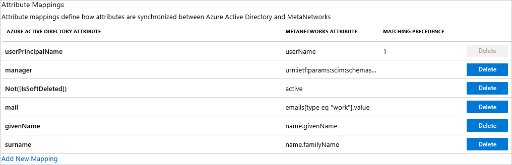

10. Under the **Mappings** section, select **Synchronize Azure Active Directory Groups to Meta Networks Connector**.

	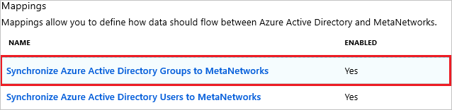

11. Review the group attributes that are synchronized from Azure AD to Meta Networks Connector in the **Attribute Mapping** section. The attributes selected as **Matching** properties are used to match the groups in Meta Networks Connector for update operations. Select the **Save** button to commit any changes.

	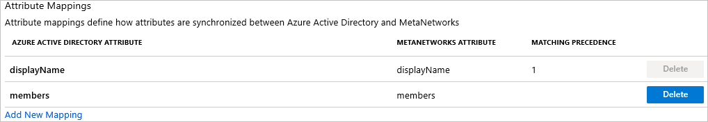

12. To configure scoping filters, refer to the following instructions provided in the [Scoping filter tutorial](../app-provisioning/define-conditional-rules-for-provisioning-user-accounts.md).

13. To enable the Azure AD provisioning service for Meta Networks Connector, change the **Provisioning Status** to **On** in the **Settings** section.

	

14. Define the users and/or groups that you would like to provision to Meta Networks Connector by choosing the desired values in **Scope** in the **Settings** section.

	

15. When you are ready to provision, click **Save**.

	

This operation starts the initial synchronization of all users and/or groups defined in **Scope** in the **Settings** section. The initial sync takes longer to perform than subsequent syncs, which occur approximately every 40 minutes as long as the Azure AD provisioning service is running. You can use the **Synchronization Details** section to monitor progress and follow links to provisioning activity report, which describes all actions performed by the Azure AD provisioning service on Meta Networks Connector.

For more information on how to read the Azure AD provisioning logs, see [Reporting on automatic user account provisioning](../app-provisioning/check-status-user-account-provisioning.md).

## Additional resources

* [Managing user account provisioning for Enterprise Apps](../app-provisioning/configure-automatic-user-provisioning-portal.md)
* [What is application access and single sign-on with Azure Active Directory?](../manage-apps/what-is-single-sign-on.md)

## Next steps

* [Learn how to review logs and get reports on provisioning activity](../app-provisioning/check-status-user-account-provisioning.md)

