# Tutorial: Azure Active Directory integration with Meta Networks Connector

In this tutorial, you learn how to integrate Meta Networks Connector with Azure Active Directory (Azure AD).

Integrating Meta Networks Connector with Azure AD provides you with the following benefits:

- You can control in Azure AD who has access to Meta Networks Connector.
- You can enable your users to automatically get signed-on to Meta Networks Connector (Single Sign-On) with their Azure AD accounts.
- You can manage your accounts in one central location - the Azure portal.

If you want to know more details about SaaS app integration with Azure AD, see [what is application access and single sign-on with Azure Active Directory](../manage-apps/what-is-single-sign-on.md)

## Prerequisites

To configure Azure AD integration with Meta Networks Connector, you need the following items:

- An Azure AD subscription
- A Meta Networks Connector single sign-on enabled subscription

> [!NOTE]
> To test the steps in this tutorial, we do not recommend using a production environment.

To test the steps in this tutorial, you should follow these recommendations:

- Do not use your production environment, unless it is necessary.
- If you don't have an Azure AD trial environment, you can [get a one-month trial](https://azure.microsoft.com/pricing/free-trial/).

## Scenario description
In this tutorial, you test Azure AD single sign-on in a test environment. 
The scenario outlined in this tutorial consists of two main building blocks:

1. Adding Meta Networks Connector from the gallery
1. Configuring and testing Azure AD single sign-on

## Adding Meta Networks Connector from the gallery
To configure the integration of Meta Networks Connector into Azure AD, you need to add Meta Networks Connector from the gallery to your list of managed SaaS apps.

**To add Meta Networks Connector from the gallery, perform the following steps:**

1. In the **[Azure portal](https://portal.azure.com)**, on the left navigation panel, click **Azure Active Directory** icon. 
	
	![The Azure Active Directory button][1]
	
1. Navigate to **Enterprise applications**. Then go to **All applications**.
	
	![The Enterprise applications blade][2]
	
1. To add new application, click **New application** button on the top of dialog.
	
	![The New application button][3]
	
1. In the search box, type **Meta Networks Connector**, select **Meta Networks Connector** from result panel then click **Add** button to add the application.
	
	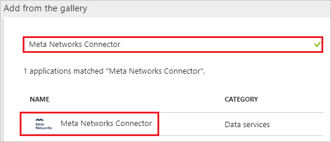

## Configure and test Azure AD single sign-on

In this section, you configure and test Azure AD single sign-on with Meta Networks Connector based on a test user called "Britta Simon".

For single sign-on to work, Azure AD needs to know what the counterpart user in Meta Networks Connector is to a user in Azure AD. In other words, a link relationship between an Azure AD user and the related user in Meta Networks Connector needs to be established.

To configure and test Azure AD single sign-on with Meta Networks Connector, you need to complete the following building blocks:

1. **[Configure Azure AD Single Sign-On](#configure-azure-ad-single-sign-on)** - to enable your users to use this feature.
1. **[Create an Azure AD test user](#create-an-azure-ad-test-user)** - to test Azure AD single sign-on with Britta Simon.
1. **[Create a Meta Networks Connector test user](#create-a-meta-networks-connector-test-user)** - to have a counterpart of Britta Simon in Meta Networks Connector that is linked to the Azure AD representation of user.
1. **[Assign the Azure AD test user](#assign-the-azure-ad-test-user)** - to enable Britta Simon to use Azure AD single sign-on.
1. **[Test single sign-on](#test-single-sign-on)** - to verify whether the configuration works.

### Configure Azure AD single sign-on

In this section, you enable Azure AD single sign-on in the Azure portal and configure single sign-on in your Meta Networks Connector application.

**To configure Azure AD single sign-on with Meta Networks Connector, perform the following steps:**

1. In the Azure portal, on the **Meta Networks Connector** application integration page, click **Single sign-on**.

	![Configure single sign-on link][4]

1. On the **Single sign-on** dialog, select **Mode** as	**SAML-based Sign-on** to enable single sign-on.
 
	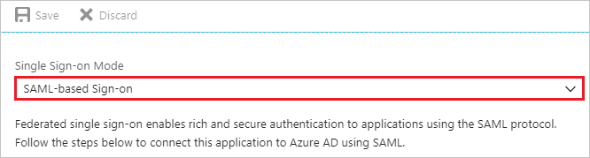

1. On the **Meta Networks Connector Domain and URLs** section, perform the following steps if you wish to configure the application in **IDP** initiated mode:

	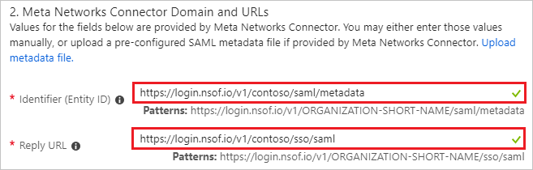

	1. In the **Identifier** textbox, type a URL using the following pattern: `https://login.nsof.io/v1/<ORGANIZATION-SHORT-NAME>/saml/metadata`
	
	1. In the **Reply URL** textbox, type a URL using the following pattern: `https://login.nsof.io/v1/<ORGANIZATION-SHORT-NAME>/sso/saml`
	
1. Check **Show advanced URL settings** and perform the following step if you wish to configure the application in **SP** initiated mode:

	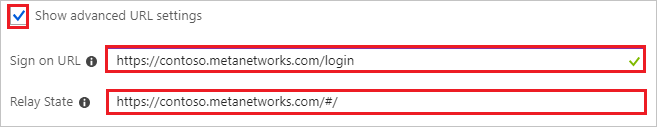

	1. In the **Sign-on URL** textbox, type a URL using the following pattern: `https://<ORGANIZATION-SHORT-NAME>.metanetworks.com/login`
	
	1. In the **Relay State** textbox, type a URL using the following pattern: `https://<ORGANIZATION-SHORT-NAME>.metanetworks.com/#/`
	
	> [!NOTE]
	> These values are not real. Update these values with the actual Identifier, Reply URL, and Sign-On URL are explained later in the tutorial.
	
1. Meta Networks Connector application expects the SAML assertions in a specific format. Configure the following claims for this application. You can manage the values of these attributes from the **User Attributes** section on application integration page. The following screenshot shows an example for this.
	
	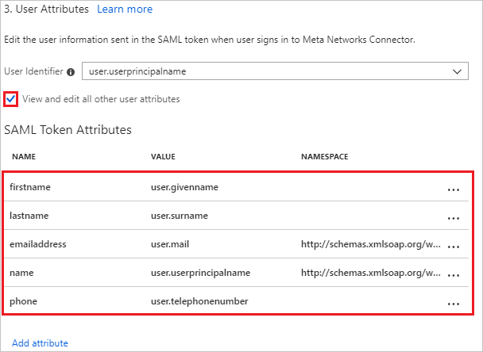
	
1. In the **User Attributes** section on the **Single sign-on** dialog, configure SAML token attribute as shown in the image above and perform the following steps:
	
	| Attribute Name | Attribute Value | NAMESPACE|
	| ---------------| --------------- | -------- |
	| firstname | user.givenname | |
	| lastname | user.surname | |
	| emailaddress| user.mail| `http://schemas.xmlsoap.org/ws/2005/05/identity/claims` |
	| name | user.userprincipalname| `http://schemas.xmlsoap.org/ws/2005/05/identity/claims` |
	| phone | user.telephonenumber | |

	1. Click **Add attribute** to open the **Add Attribute** dialog.

		
	
			
	
	1. In the **Name** textbox, type the attribute name shown for that row.
	
	1. From the **Value** list, type the attribute value shown for that row.
	
	1. In the **Namespace** textbox, type the namespace value shown for that row.
	
	1. Click **Ok**
	
1. On the **SAML Signing Certificate** section, click **Certificate(Base64)** and then save the certificate file on your computer.
	
	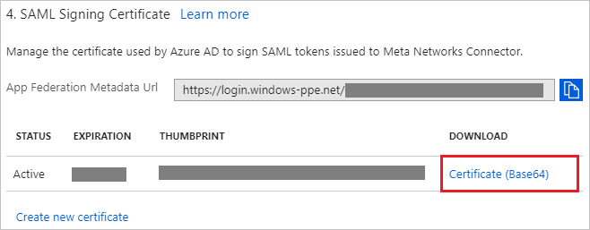
	
1. On the **Meta Networks Connector Configuration** section, click **Configure Meta Networks Connector** to open **Configure sign-on** window. Copy the **SAML Entity ID and SAML Single Sign-On Service URL** from the **Quick Reference section.**
	
	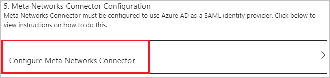
	
1. Click **Save** button.
	
	
	
1. Open a new tab in your browser and log in to your Meta Networks Connector administrator account.
	
	> [!NOTE]
	> Meta Networks Connector is a secure system. So before accessing their portal you need to get your public IP address whitelisted on their side. To get your public IP address,follow the below link specified [here](https://whatismyipaddress.com/). Send your IP address to the [Meta Networks Connector Client support team](mailto:support@metanetworks.com) to get your IP address whitelisted.
	
1. Go to **Administrator** and select **Settings**.
	
	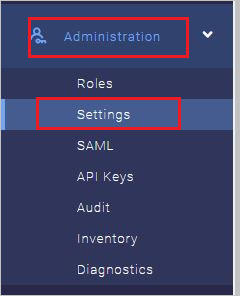
	
1. Make sure **Log Internet Traffic** and **Force VPN MFA** are set to off.
	
	
	
1. Go to **Administrator** and select **SAML**.
	
	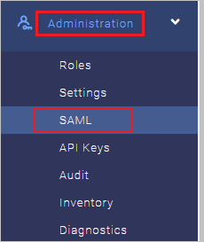
	
1. Perform the following steps on the **DETAILS** page:
	
	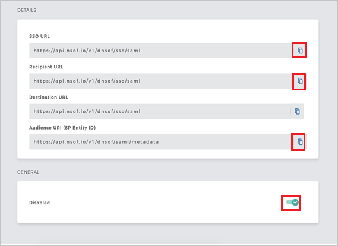
	
	1. Copy **SSO URL** value and paste it into the **Sign-In URL** textbox in the **Meta Networks Connector Domain and URLs** section.
	
	1. Copy **Recipient URL** value and paste it into the **Reply URL** textbox in the **Meta Networks Connector Domain and URLs** section.
	
	1. Copy **Audience URI (SP Entity ID)** value and paste it into the **Identifier (Entity ID)** textbox in the **Meta Networks Connector Domain and URLs** section.
	
	1. Enable the SAML
	
1. On the **GENERAL** tab. perform the following steps:

	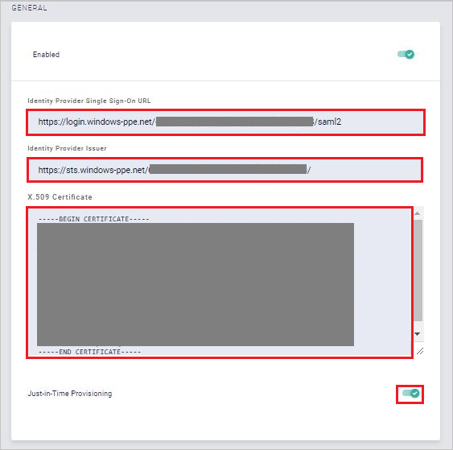

	1. In the **Identity Provider Single Sign-On URL**, paste the **SAML Single Sign-On Service URL** value which you have copied from the Azure portal.

	1. In the **Identity Provider Issuer**, paste the **SAML Entity ID** value which you have copied from the Azure portal.

	1. Open the downloaded certificate from Azure portal in notepad, paste it into the **X.509 Certificate** textbox.

	1. Enable the **Just-in-Time Provisioning**.

### Create an Azure AD test user

The objective of this section is to create a test user in the Azure portal called Britta Simon.
	
![Create an Azure AD test user][100]
	
**To create a test user in Azure AD, perform the following steps:**

1. In the Azure portal, in the left pane, click the **Azure Active Directory** button.
	
	
	
1. To display the list of users, go to **Users and groups**, and then click **All users**.
	
	
	
1. To open the **User** dialog box, click **Add** at the top of the **All Users** dialog box.
	
	
	
1. In the **User** dialog box, perform the following steps:

	
	
    1. In the **Name** box, type **BrittaSimon**.

    1. In the **User name** box, type the email address of user Britta Simon.
	
    1. Select the **Show Password** check box, and then write down the value that's displayed in the **Password** box.
	
    1. Click **Create**.
	
### Create a Meta Networks Connector test user

The objective of this section is to create a user called Britta Simon in Meta Networks Connector. Meta Networks Connector supports just-in-time provisioning, which is by default enabled. There is no action item for you in this section. A new user is created during an attempt to access Meta Networks Connector if it doesn't exist yet.

>[!Note]
>If you need to create a user manually, contact [Meta Networks Connector Client support team](mailto:support@metanetworks.com).

### Assign the Azure AD test user

In this section, you enable Britta Simon to use Azure single sign-on by granting access to Meta Networks Connector.

![Assign the user role][200]

**To assign Britta Simon to Meta Networks Connector, perform the following steps:**

1. In the Azure portal, open the applications view, and then navigate to the directory view and go to **Enterprise applications** then click **All applications**.
	
	![Assign User][201]
	
1. In the applications list, select **Meta Networks Connector**.
	
	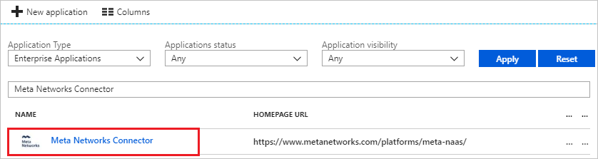  
	
1. In the menu on the left, click **Users and groups**.
	
	![The "Users and groups" link][202]
	
1. Click **Add** button. Then select **Users and groups** on **Add Assignment** dialog.
	
	![The Add Assignment pane][203]
	
1. On **Users and groups** dialog, select **Britta Simon** in the Users list.
	
1. Click **Select** button on **Users and groups** dialog.
	
1. Click **Assign** button on **Add Assignment** dialog.
	
### Test single sign-on

In this section, you test your Azure AD single sign-on configuration using the Access Panel.

When you click the Meta Networks Connector tile in the Access Panel, you should get automatically signed-on to your Meta Networks Connector application.
For more information about the Access Panel, see [Introduction to the Access Panel](../active-directory-saas-access-panel-introduction.md).

## Additional resources

- [List of Tutorials on How to Integrate SaaS Apps with Azure Active Directory](tutorial-list.md)
- [What is application access and single sign-on with Azure Active Directory?](../manage-apps/what-is-single-sign-on.md)

<!--Image references-->

[1]: ./media/metanetworksconnector-tutorial/tutorial_general_01.png
[2]: ./media/metanetworksconnector-tutorial/tutorial_general_02.png
[3]: ./media/metanetworksconnector-tutorial/tutorial_general_03.png
[4]: ./media/metanetworksconnector-tutorial/tutorial_general_04.png

[100]: ./media/metanetworksconnector-tutorial/tutorial_general_100.png

[200]: ./media/metanetworksconnector-tutorial/tutorial_general_200.png
[201]: ./media/metanetworksconnector-tutorial/tutorial_general_201.png
[202]: ./media/metanetworksconnector-tutorial/tutorial_general_202.png
[203]: ./media/metanetworksconnector-tutorial/tutorial_general_203.png

